# Descrição geral de consulta no Power BI Desktop
Com o Power BI Desktop, pode ligar-se ao mundo dos dados, criar relatórios apelativos e fundamentais e partilhar os seus trabalhos com outras pessoas, que poderão basear-se no seu trabalho e expandir os seus esforços de business intelligence.

O Power BI Desktop tem três vistas:

* Vista de **Relatório**, onde pode utilizar consultas criadas por si para criar visualizações atraentes, dispostas como pretender, e com múltiplas páginas, que pode partilhar com outras pessoas
* Vista de **Dados**: veja os dados no seu relatório em formato de modelo de dados, onde pode adicionar medidas, criar novas colunas e gerir relações
* Vista de **Relações**: obtenha uma representação gráfica das relações que foram estabelecidas no seu modelo de dados e gira ou modifique as mesmas conforme necessário.

Aceda a estas vistas através da seleção de um dos três ícones no lado esquerdo do Power BI Desktop. Na imagem seguinte, a vista **Relatório** está selecionada, indicada pela faixa amarela ao lado do ícone.  

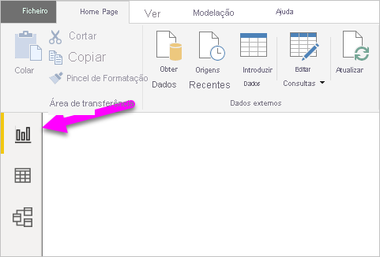

O Power BI Desktop também inclui o Editor do Power Query. Utilize o Editor do Power Query para ligar a uma ou várias origens de dados, formatar e transformar os dados em função das suas necessidades e, em seguida, carregar esse modelo para o Power BI Desktop.

Este documento fornece uma descrição geral de como trabalhar com os dados no Editor do Power Query, mas há mais para aprender. No final deste documento, encontrará ligações para orientações detalhadas sobre os tipos de dados suportados. Também encontrará orientação sobre como ligar a dados, formatar dados, criar relações e como começar.

Mas primeiro, vamos conhecer melhor o Editor do Power Query.

## Editor do Power Query
Para ir para o Editor do Power Query, selecione **Editar Consultas** no separador **Base** do Power BI Desktop.  

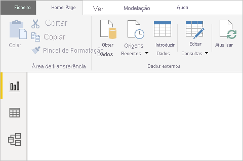

Sem ligações de dados, o Editor do Power Query é apresentado como um painel em branco, pronto para receber dados.  

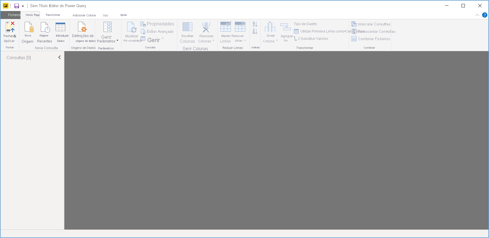

Após uma consulta ser carregada, a vista do Editor do Power Query torna-se mais interessante. Se nos ligarmos à seguinte origem de dados, o Editor do Power Query carrega informações sobre os dados, que pode depois começar a formatar:

[*https://www.bankrate.com/retirement/best-and-worst-states-for-retirement/*](https://www.bankrate.com/retirement/best-and-worst-states-for-retirement/)

Eis o aspeto do Editor do Power Query após uma ligação de dados ser estabelecida:

1. No friso, muitos botões estão agora ativos para interagir com os dados na consulta.
2. No painel esquerdo, as consultas são listadas e ficam disponíveis para seleção, visualização e formatação.
3. No painel central, os dados da consulta selecionada são apresentados e estão disponíveis para formatação.
4. O painel **Definições da Consulta** é apresentada, listando as propriedades e os passos aplicados da consulta.  
   
   

Examinemos cada uma destas quatro áreas: o friso, o painel Consultas, a vista de dados e o painel Definições da Consulta.

## Friso de consulta
O friso no Editor do Power Query consiste em quatro separadores: **Base**, **Transformar**, **Adicionar Coluna** e **Ver**.

O separador **Base** contém tarefas de consulta comuns.

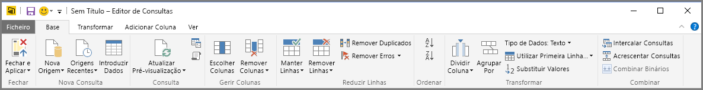

Para se ligar aos dados e dar início ao processo de criação da consulta, selecione **Nova Origem**. É apresentado um menu, fornecendo as origens de dados mais comuns.  

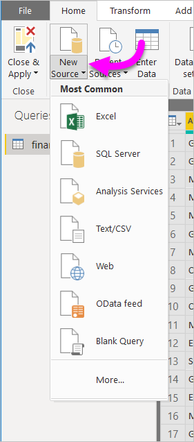

Para obter mais informações sobre as origens de dados disponíveis, consulte **Origens de Dados**. Para obter informações sobre como se ligar a dados, incluindo exemplos e passos, consulte **Ligar-se a Dados**.

O separador **Transformar** fornece acesso às tarefas de transformação de dados comuns, como:

* Adicionar ou remover colunas
* Alterar tipos de dados 
* Dividir colunas 
* Outras tarefas condicionadas por dados

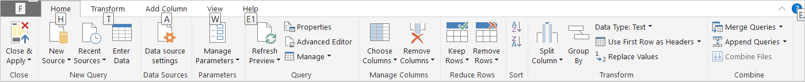

Para obter mais informações sobre como transformar dados, incluindo exemplos, veja [Tutorial: Formatar e combinar dados no Power BI Desktop](https://docs.microsoft.com/power-bi/desktop-shape-and-combine-data).

O separador **Adicionar Coluna** fornece tarefas adicionais associadas à adição de uma coluna, formatação de dados da coluna e adição de colunas personalizadas. A seguinte imagem mostra o separador **Adicionar Coluna**.  

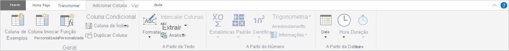

O separador **Ver** no friso é utilizado para mostrar ou ocultar determinados painéis ou janelas. Também é utilizado para apresentar o Editor Avançado. A seguinte imagem mostra o separador **Ver**.  

É útil saber que muitas das tarefas disponíveis na faixa de opções também estão disponíveis clicando com o botão direito do rato numa coluna ou noutros dados, no painel central.

## O painel esquerdo (Consultas)
O painel esquerdo ou o painel **Consultas** apresenta o número de consultas ativas e o nome da consulta. Quando seleciona uma consulta no painel à esquerda, os dados são apresentados no painel central, no qual pode formatar e transformar os dados para atender às suas necessidades. A imagem seguinte mostra o painel esquerdo com uma consulta.  

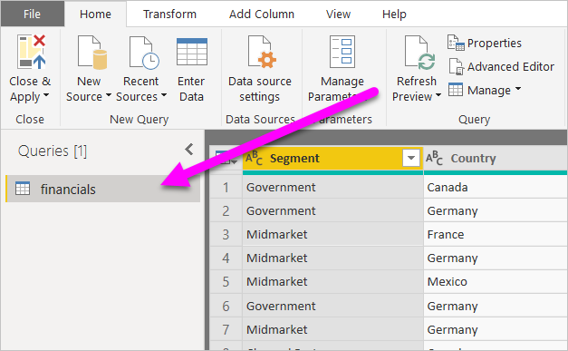

## O painel central (Dados)
No painel central ou painel **Dados**, são apresentados os dados da consulta selecionada. É neste painel que muito do trabalho da vista **Consulta** é realizado.

A imagem seguinte mostra a ligação de dados da Web estabelecida anteriormente. A coluna **Produto** é selecionada e o seu cabeçalho foi clicado com o botão direito do rato para mostrar os itens de menu disponíveis. Tenha em atenção que muitos destes itens de menu de clique com o botão direito do rato são os mesmos botões nos separadores da faixa de opções.  

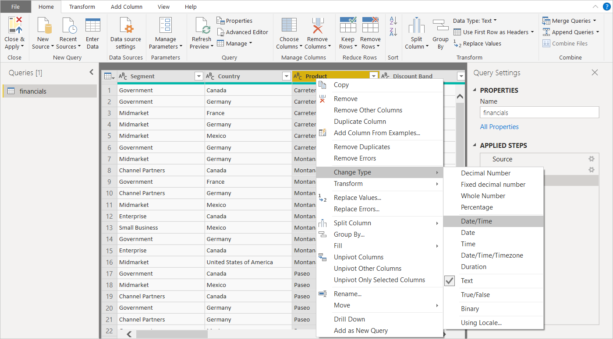

Quando seleciona um item do menu de contexto (ou um botão do friso), a consulta aplica o passo aos dados. Também guarda como parte da própria consulta. Os passos são registados no painel **Definições de Consulta** por ordem sequencial, conforme descrito na próxima secção.  

## O painel direito (Definições da Consulta)
O painel direito ou o painel **Definições da Consulta** é onde são apresentados todos os passos associados a uma consulta. Por exemplo, na imagem a seguir, a secção **Passos Aplicados** do painel **Definições de Consulta** reflete o facto de que acabámos de alterar o tipo da coluna **Pontuação geral**.

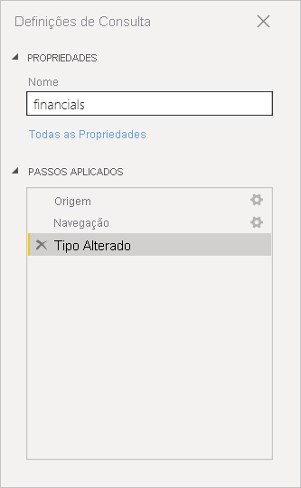

Conforme os passos de formatação adicionais são aplicados à consulta, são capturados na secção **Passos Aplicados**.

É importante saber que os dados subjacentes *não* são alterados. O Editor do Power Query ajusta e formata a sua vista dos dados. Também formata e ajusta a vista de qualquer interação com os dados subjacentes que ocorrem com base na vista modificada e formatada do Editor do Power Query desses dados.

No painel **Definições de Consulta**, pode mudar o nome de passos, eliminar passos ou reordenar os passos conforme julgue mais adequado. Para o fazer, clique com o botão direito do rato no passo na secção **Passos Aplicados** e selecione uma opção no menu apresentado. Todos os passos de consultas são efetuados pela ordem apresentada no painel **Passos Aplicados**.

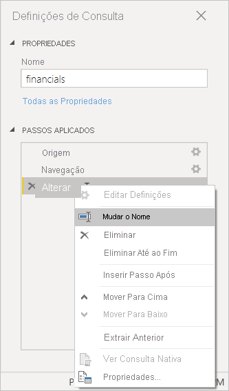

## Editor Avançado
O **Editor Avançado** permite-lhe ver o código que o Editor do Power Query está a criar a cada passo. Também lhe permite criar o seu próprio código de formatação. Para abrir o editor avançado, selecione **Ver** no friso e, em seguida, selecione **Editor Avançado**. É apresentada uma janela a mostrar o código da consulta.  
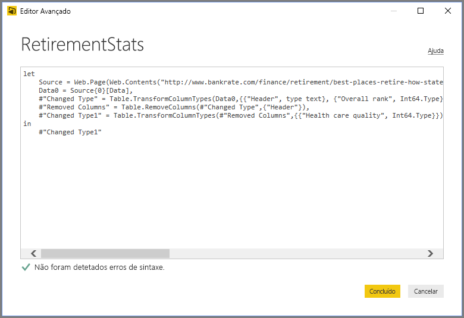

Pode editar diretamente o código na janela **Editor Avançado**. Para fechar a janela, selecione o botão **Concluído** ou **Cancelar**.  

## Guardar o seu trabalho
Quando a sua consulta estiver onde quer, selecione **Fechar e Aplicar** no menu **Ficheiro** do Editor do Power Query. Esta ação aplica as alterações e fecha o editor.  
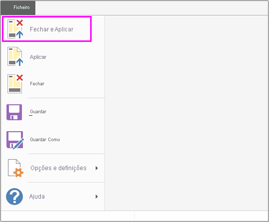

Conforme registado progresso, o Power BI Desktop fornece um diálogo para apresentar o estado.  
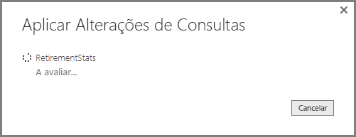

Quando estiver pronto, o Power BI Desktop pode guardar o seu trabalho sob a forma de um ficheiro *.pbix*.

Para guardar o seu trabalho, selecione **Ficheiro** \> **Guardar** (ou **Ficheiro** \> **Guardar Como**), conforme mostrado na imagem seguinte.  
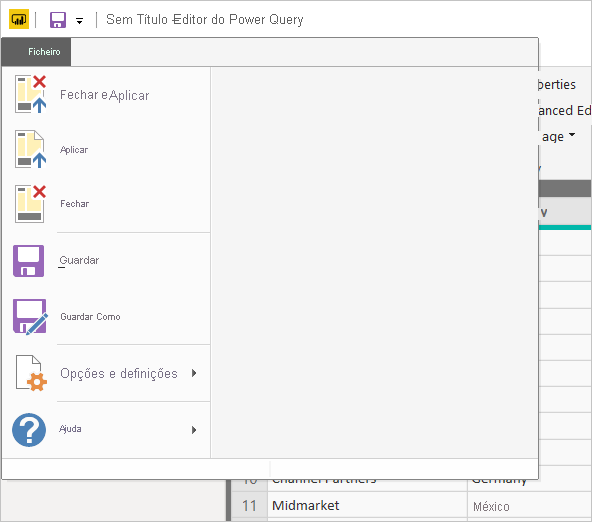

## Próximos passos
Existem inúmeras coisas que pode fazer com o Power BI Desktop. Para obter mais informações sobre as suas capacidades, veja os seguintes recursos:

* [O que é o Power BI Desktop?](../fundamentals/desktop-what-is-desktop.md)
* [Origens de dados no Power BI Desktop](../connect-data/desktop-data-sources.md)
* [Ligar a dados no Power BI Desktop](../connect-data/desktop-connect-to-data.md)
* [Tutorial: Formatar e combinar dados com o Power BI Desktop](../connect-data/desktop-shape-and-combine-data.md)
* [Executar tarefas comuns de consulta no Power BI Desktop](desktop-common-query-tasks.md)   
