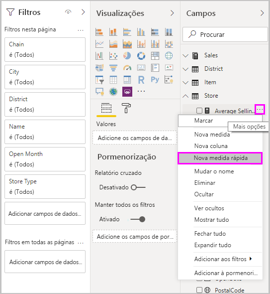
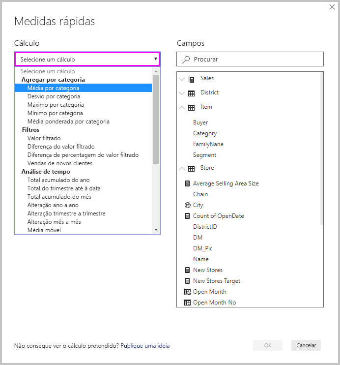
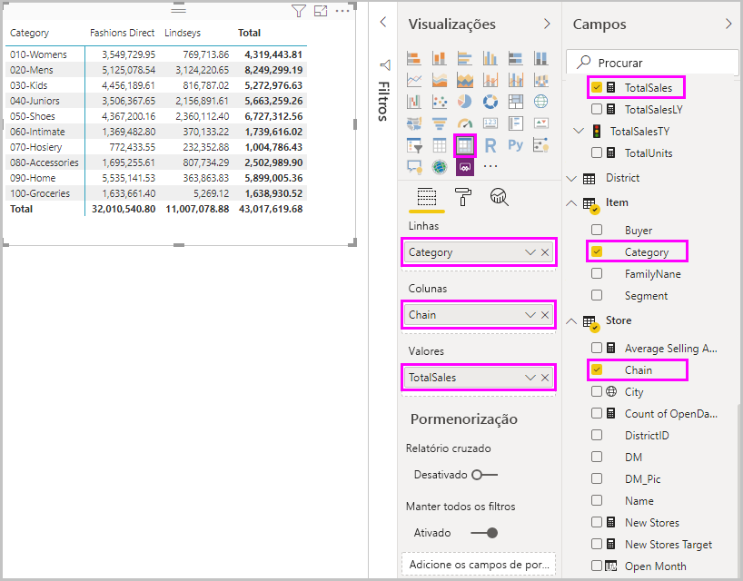
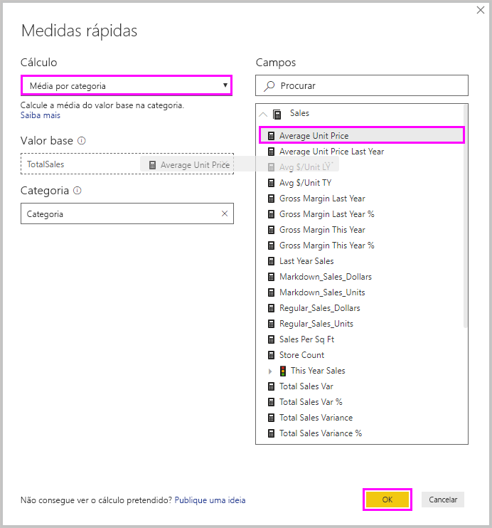
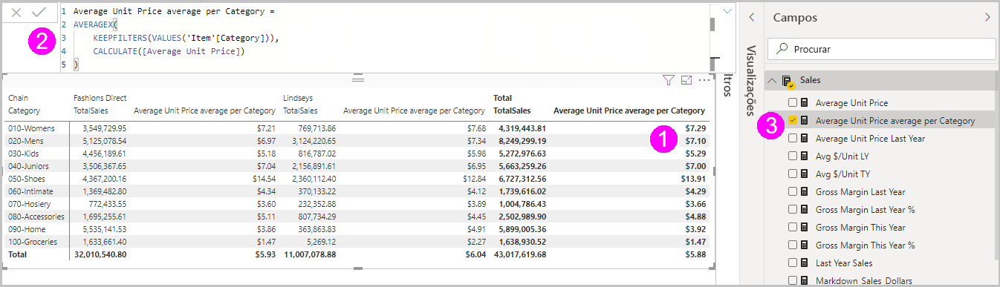
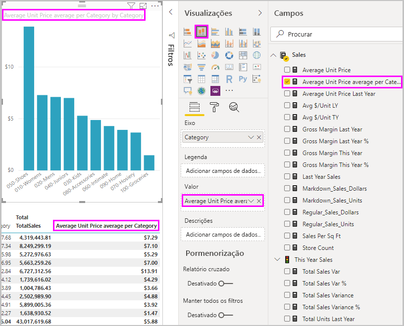
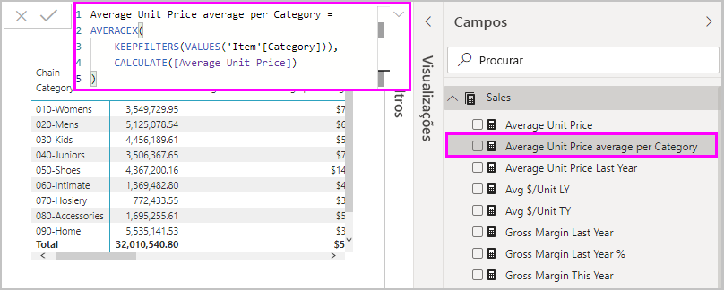
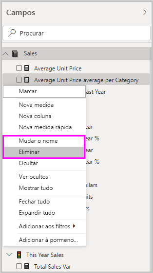

# Utilizar medidas rápidas para realizar cálculos comuns
Pode utilizar *medidas rápidas* para realizar rápida e facilmente cálculos comuns e avançados. Uma medida rápida executa um conjunto de comandos de Expressões de Análise de Dados (DAX) em segundo plano e, em seguida, apresenta os resultados para os utilizar no seu relatório. Não precisa de escrever a expressão DAX, porque isto é feito automaticamente com base na entrada que forneceu numa caixa de diálogo. Existem muitas categorias de cálculos disponíveis e formas de modificar cada cálculo para se ajustarem às suas necessidades. Talvez o melhor de tudo é que pode ver o DAX que é executado pela medida rápida e impulsionar ou expandir os seus próprios conhecimentos de DAX.

## Criar uma medida rápida

Para criar uma medida rápida no Power BI Desktop, clique com o botão direito do rato ou selecione as reticências **...** junto a qualquer item no painel **Campos** e selecione **Nova medida rápida** no menu apresentado. 

Também pode clicar com o botão direito do rato ou selecionar a seta para baixo junto a qualquer valor no conjunto **Valores** de um elemento visual existente e selecionar **Nova medida rápida** no menu. 

Quando seleciona **Nova medida rápida**, é apresentada a janela **Medidas rápidas**, o que lhe permite selecionar o cálculo que pretende e os campos nos quais executar o cálculo. 

Selecione o campo **Selecione um cálculo** para ver uma extensa lista de medidas rápidas disponíveis. 

Os cinco tipos de cálculos de medidas rápidas, com os seus cálculos, são:

* **Agregar por categoria**
  * Média por categoria
  * Desvio por categoria
  * Máximo por categoria
  * Mínimo por categoria
  * Média ponderada por categoria
* **Filtros**
  * Valor filtrado
  * Diferença do valor filtrado
  * Diferença de percentagem do valor filtrado
  * Vendas de novos clientes
* **Análise de tempo**
  * Total do ano até à data
  * Total do trimestre até à data
  * Total acumulado do mês
  * Alteração ano a ano
  * Alteração trimestre a trimestre
  * Alteração mês a mês
  * Média móvel
* **Totais**
  * Total corrente
  * Total da categoria (filtros aplicados)
  * Total da categoria (filtros não aplicados)
* **Operações matemáticas**
  * Adição
  * Subtração
  * Multiplicação
  * Divisão
  * Diferença de percentagem
  * Coeficiente de correlação
* **Texto**
  * Classificação em estrelas
  * Lista de valores concatenada

Para submeter as suas ideias sobre as novas medidas rápidas que gostaria de ver, fórmulas DAX subjacentes ou outras ideias de medidas rápidas para consideração, veja o final deste artigo.

> [!NOTE]
> Quando utilizar ligações em direto do SQL Server Analysis Services (SSAS), estão disponíveis algumas medidas rápidas. O Power BI Desktop mostra apenas as medidas rápidas suportadas para a versão do SSAS para o qual está a estabelecer a ligação. Se estiver ligado a uma origem de dados dinâmicos do SSAS e não vir determinadas medidas rápidas na lista, é porque a versão do SSAS à qual está ligado não suporta os comandos DAX utilizados para implementar essas medidas rápidas.

Após selecionar os cálculos e campos que pretende para a sua medida rápida, selecione **OK**. A nova medida rápida é apresentada no painel **Campos** e a fórmula DAX subjacente é apresentada na barra de fórmulas. 

## Exemplo de medida rápida
Vejamos uma medida rápida em ação.

O seguinte elemento visual matriz mostra uma tabela de vendas para vários produtos. É uma tabela básica que inclui os totais de vendas para cada categoria.

Com o elemento visual matriz selecionado, selecione a seta para baixo junto a **TotalSales** no conjunto **Valores** e selecione **Nova medida rápida**. 

Na janela **Medidas rápidas**, em **Cálculo**, selecione **Média por categoria**. 

Arraste **Preço Unitário Médio** do painel **Campos** para o campo **Valor base**. Saia de **Categoria** no campo **Categoria** e selecione **OK**. 

Quando seleciona **OK**, acontecem várias coisas interessantes.

1. O elemento visual matriz tem uma nova coluna que apresenta a **média do Preço Unitário Médio por Categoria** calculada.
   
2. A fórmula DAX para a nova medida rápida é apresentada na barra de fórmulas. Veja a [secção seguinte](#learn-dax-by-using-quick-measures) para obter mais informações sobre a fórmula DAX.
   
3. A nova medida rápida é apresentada como selecionada e realçada no painel **Campos**. 

A nova medida rápida está disponível para qualquer elemento visual no relatório e não apenas o elemento visual para o qual a criou. A seguinte imagem apresenta um elemento visual de gráfico de coluna rápida criado através da utilização do novo campo de medida rápida.

## Saber mais sobre o DAX ao utilizar medidas rápidas
Uma grande vantagem das medidas rápidas é o facto de as mesmas lhe apresentarem a fórmula DAX que implementa a medida. Quando seleciona uma medida rápida no painel **Campos**, é apresentada a **Barra de fórmulas** com a fórmula DAX criada pelo Power BI para implementar a medida.

A barra de fórmulas não só apresenta a fórmula por trás da medida, como lhe permite ver como criar as fórmulas DAX subjacentes às medidas rápidas, o que é talvez ainda mais importante.

Imagine que precisa de fazer um cálculo ao longo dos anos, mas não tem a certeza de como estruturar a fórmula DAX ou não tem ideia nenhuma por onde começar. Em vez de desesperar, pode criar uma medida rápida através do cálculo **Alteração ao longo dos anos** e ver como a mesma é apresentada no seu elemento visual e como funciona a fórmula DAX. Em seguida, pode fazer alterações diretamente na fórmula DAX ou criar uma medida semelhante que satisfaça as suas necessidades e expetativas. É como ter um professor que responde de imediato às suas perguntas em alguns cliques. 

Pode sempre eliminar as medidas rápidas do seu modelo se não gostar das mesmas. É tão fácil como clicar com o botão direito do rato ou selecionar **...** junto à medida e selecionar **Eliminar**. Também pode mudar o nome de uma medida rápida, como preferir, ao selecionar **Mudar o nome** no menu. 

## Limitações e considerações
Existem algumas limitações e considerações a ter em conta.

- Pode utilizar medidas rápidas adicionadas ao painel **Campos** com qualquer elemento visual no relatório.
- Pode sempre ver o DAX associado a uma medida rápida ao selecionar a medida na lista **Campos** e ao observar a fórmula na barra de fórmulas.
- As medidas rápidas só estão disponíveis se conseguir modificar o modelo. Tal não é o caso quando está a trabalhar com algumas Ligações em direto. As ligações dinâmicas SSAS tabulares são suportadas, como previamente descrito.
- Não pode criar medidas rápidas de análise de tempo quando trabalha no modo DirectQuery. As funções DAX utilizadas nestas medidas rápidas afetam o desempenho quando convertidas em declarações do T-SQL que são enviadas para a sua origem de dados.

> [!IMPORTANT]
> As instruções DAX para medidas rápidas utilizam apenas vírgulas para separadores de argumentos. Se a sua versão do Power BI Desktop estiver num idioma que utilize a vírgula como separador decimal, as medidas rápidas não funcionarão corretamente.

### Análise de tempo e medidas rápidas
Pode utilizar as suas próprias tabelas de dados personalizadas com medidas rápidas da análise de tempo. Se estiver a utilizar um modelo em tabela externo, certifique-se de que, quando o modelo foi criado, a coluna da data principal na tabela foi marcada como uma tabela de datas, conforme descrito em [Especificar Marcar como Tabela de Datas para utilizar com análise de tempo](/sql/analysis-services/tabular-models/specify-mark-as-date-table-for-use-with-time-intelligence-ssas-tabular). Se estiver a importar a sua própria tabela de datas, certifique-se de que marca a mesma como uma tabela de datas, conforme descrito em [Configurar e utilizar tabelas de datas no Power BI Desktop](desktop-date-tables.md).

### Informações adicionais e exemplos
Tem uma ideia para uma medida rápida que ainda não tenha sido dada? Excelente! Consulte a página [Ideias do Power BI](https://go.microsoft.com/fwlink/?linkid=842906) e envie a suas ideias e fórmulas DAX para medidas rápidas que gostaria de ver no Power BI Desktop. Iremos considerar adicioná-las à lista de medidas rápidas numa versão futura.