# Tutorial: Criar as suas próprias medidas no Power BI Desktop
Ao utilizar as medidas, poderá criar algumas das mais avançadas soluções de análise de dados no Power BI Desktop. As medidas ajudam-no a executar cálculos sobre os dados à medida que interage com os relatórios. Este tutorial serve de guia para que compreenda as medidas e crie algumas das suas medidas básicas no Power BI Desktop.

## Pré-requisitos

- Este tutorial destina-se aos utilizadores do Power BI já familiarizados com o Power BI Desktop para criar modelos mais avançados. Já deve conhecer as funcionalidades Obter Dados e Editor de Consultas para importar dados, trabalhar com múltiplas tabelas relacionadas e adicionar campos à tela de relatórios. Se ainda não estiver familiarizado com o Power BI Desktop, não deixe de conferir a [Introdução ao Power BI Desktop](../fundamentals/desktop-getting-started.md).
  
- Neste tutorial, é utilizado o ficheiro [Contoso Sales Sample for Power BI Desktop](https://download.microsoft.com/download/4/6/A/46AB5E74-50F6-4761-8EDB-5AE077FD603C/Contoso%20Sales%20Sample%20for%20Power%20BI%20Desktop.zip) (Exemplo de Vendas da Contoso para o Power BI Desktop), que inclui os dados de vendas online da empresa fictícia, Contoso. Uma vez que estes dados foram importados de uma base de dados, não conseguirá ligar-se à origem de dados nem vê-la no Editor de Consultas. Transfira e extraia o ficheiro no seu computador.

## Medidas automáticas

Quando o Power BI Desktop cria uma medida, na maioria das vezes esta é criada automaticamente. Para ver como o Power BI Desktop cria uma medida, siga estes passos:

1. No Power BI Desktop, selecione **Ficheiro** > **Abrir**, navegue até ao ficheiro *Contoso Sales Sample for Power BI Desktop.pbix* e selecione **Abrir**.

2. No painel **Campos**, expanda a tabela **Sales**. Em seguida, selecione a caixa de verificação junto ao campo **SalesAmount** ou arraste **SalesAmount** para a tela de relatórios.

    É apresentada uma visualização do novo gráfico de colunas, que mostra a soma total de todos os valores na coluna **SalesAmount** da tabela **Sales**.

    

Qualquer campo (coluna) no painel **Campos** com um ícone de sigma  é numérico e os respetivos valores podem ser agregados. Em vez de mostrar uma tabela com muitos valores (dois milhões de linhas em **SalesAmount**), o Power BI Desktop cria e calcula automaticamente uma medida para agregar os dados se detetar um tipo de dados numérico. Soma é a agregação predefinida para um tipo de dados numérico, mas pode facilmente aplicar diferentes agregações, como média ou contagem. Compreender o funcionamento das agregações é fundamental para compreender as medidas, pois cada medida executa algum tipo de agregação. 

Para alterar a agregação do gráfico, siga estes passos:

1. Selecione a visualização de **SalesAmount** na tela de relatórios.  

1. Na área **Valor** do painel **Visualizações**, selecione a seta para baixo à direita de **SalesAmount**. 

1. No menu que lhe é apresentado, selecione **Média**. 

    A visualização muda para uma média de todos os valores de vendas no campo **SalesAmount**.

    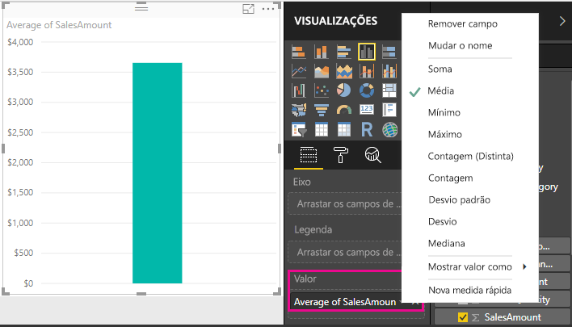

Consoante o resultado pretendido, pode alterar o tipo de agregação. No entanto, nem todos os tipos de agregação se aplicam a todos os tipos de dados numéricos. Por exemplo, a Soma e a Média são úteis para o campo **SalesAmount**. O Mínimo e o Máximo também são importantes. No entanto, a Contagem não faz muito sentido para o campo **SalesAmount**, porque embora os valores sejam numéricos, na verdade referem-se à moeda.

Os valores calculados com medidas mudam de acordo com as suas interações com o relatório. Por exemplo, se arrastar o campo **RegionCountryName** da tabela **Geography** para o gráfico existente **SalesAmount**, este será alterado para mostrar os valores médios de vendas de cada país.

Quando o resultado de uma medida é alterado devido a uma interação com o relatório, afeta o *contexto* da medida. Sempre que interage com as visualizações de relatórios, altera o contexto no qual uma medida calcula e apresenta os resultados.

## Criar e utilizar as suas próprias medidas

Na maioria dos casos, o Power BI Desktop calcula e devolve automaticamente valores de acordo com os tipos de campos e agregações escolhidos por si. No entanto, em alguns casos, talvez queira criar as suas próprias medidas para executar cálculos mais complexos e exclusivos. Com o Power BI Desktop, pode criar as suas próprias medidas com a linguagem das fórmulas DAX (Data Analysis Expressions). 

As fórmulas DAX utilizam muitos operadores, funções e sintaxe também utilizados pelas fórmulas do Excel. No entanto, as funções DAX foram concebidas para trabalhar com dados relacionais e realizar cálculos mais dinâmicos à medida que interage com os relatórios. Existem mais de 200 funções DAX que fazem tudo, desde agregações simples, como soma e média, até funções de estatística e de filtragem mais complexas. Existem muitos recursos para ajudá-lo a saber mais sobre o DAX. Depois de concluir este tutorial, veja [Noções básicas do DAX no Power BI Desktop](desktop-quickstart-learn-dax-basics.md).

Quando cria a sua própria medida, esta é designada de medida **modelo** e é adicionada à lista *Campos* da tabela que selecionar. Algumas das vantagens das medidas modelo incluem a possibilidade de atribuir o nome que quiser, tornando-as mais identificáveis; pode utilizá-las como argumentos noutras expressões DAX e pode colocá-las a realizar cálculos complexos rapidamente.

### Medidas rápidas

A partir da versão de fevereiro de 2018 do Power BI Desktop, muitos cálculos comuns estão disponíveis como *medidas rápidas*, que escrevem as fórmulas DAX automaticamente com base nas suas entradas numa janela. Estes cálculos rápidos e poderosos também são ideias para aprender o DAX ou propagar as suas próprias medidas personalizadas. 

Crie uma medida rápida através de um destes métodos: 
 - Numa tabela do painel **Campos**, clique com o botão direito do rato ou selecione **Mais opções** ( **...** ) e, em seguida, selecione **Nova medida rápida** na lista.

 - Em **Cálculos** no separador **Home Page** do friso do Power BI Desktop, selecione **Nova Medida Rápida**.

Veja [Utilizar medidas rápidas](desktop-quick-measures.md) para obter mais informações sobre como criar e utilizar medidas rápidas.

### Criar uma medida

Imagine que pretende analisar as vendas líquidas ao subtrair descontos e devoluções a partir dos valores de vendas totais. No contexto existente na sua visualização, precisa de uma medida para subtrair a soma de DiscountAmount e ReturnAmount da soma de SalesAmount. Não existe nenhum campo para Vendas Líquidas na lista **Campos**, mas tem os elementos necessários para criar as suas próprias medidas de forma a calcular as vendas líquidas. 

Siga estes passos para criar uma medida:

1. No painel **Campos**, clique com botão direito do rato na tabela **Sales** ou paire o cursor sobre a tabela e selecione **Mais opções** ( **...** ). 

1. No menu que lhe é apresentado, selecione **Nova medida**. 

    Esta ação guarda a sua nova medida na tabela **Sales**, onde é fácil de encontrar.
    
    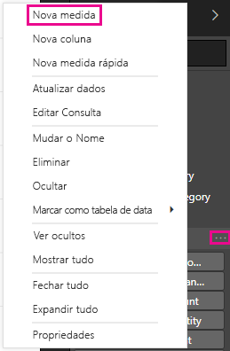
    
    Também pode criar uma nova medida ao selecionar **Nova Medida** no grupo **Cálculos** do separador **Home Page** do friso Power BI Desktop.
    
    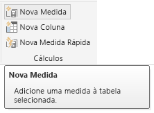
    
    >[!TIP]
    >Quando cria uma medida a partir do friso, pode criá-la em qualquer uma das suas tabelas, mas será mais fácil encontrá-la se a criar no local em que a pretende utilizar. Neste caso, selecione a tabela **Sales** para a ativar e, em seguida, selecione **Nova medida**. 
    
    A barra de fórmulas é apresentada na parte superior da tela de relatórios, onde pode mudar o nome da medida e introduzir uma fórmula DAX.
    
    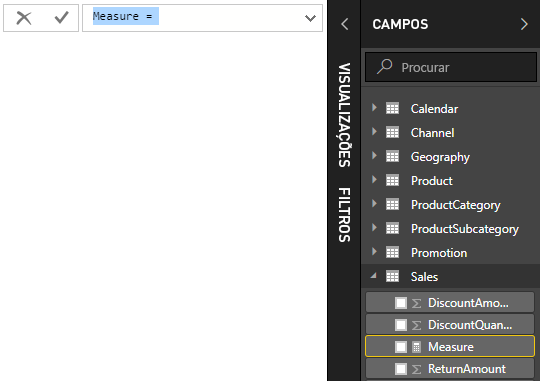
    
1. Por predefinição, cada nova medida é denominada *Medida*. Se não alterar o seu nome, as novas medidas adicionais vão ser denominadas *Medida 2*, *Medida 3* e assim sucessivamente. Visto que pretendemos que esta medida seja mais identificável, realce *Medida* na barra de fórmulas e, em seguida, altere-a para *Net Sales*.
    
1. Comece a inserir a sua fórmula. Depois do sinal igual, começa a escrever *Sum*. À medida que escreve, é apresentada uma lista de sugestão de lista pendente, que mostra todas as funções DAX que começam com as letras que escreveu. Desloque-se para baixo, se for necessário, para selecionar **SUM** na lista e prima **Enter**.
    
    
    
    É apresentado um parêntese esquerdo, juntamente com uma lista de sugestões pendente das colunas disponíveis que pode transmitir à função SUM.
    
    
    
1. As expressões aparecem sempre entre parênteses. Neste exemplo, a expressão contém um argumento único para passar à função SUM: a coluna **SalesAmount**. Comece a escrever *SalesAmount* até restar apenas um valor na lista: **Sales(SalesAmount)** . 

    O nome da coluna precedido pelo nome da tabela é designado de nome completamente qualificado da coluna. Os nomes de coluna completamente qualificados tornam as suas fórmulas mais fáceis de ler.
    
    
    
1. Selecione **Sales[SalesAmount]** da lista e, em seguida, introduza um parêntese de fecho.
    
    > [!TIP]
    > Os erros de sintaxe são causados frequentemente por um parêntesis de fecho deslocado ou em falta.
    
    
    
1. Subtraia as outras duas colunas dentro da fórmula:

    a. Após o parêntese de fecho da primeira expressão, insira um espaço, um operador de subtração (-) e, em seguida, outro espaço. 

    b. Introduza outra função SUM e comece a escrever *DiscountAmount* até que possa escolher a coluna **Sales[DiscountAmount]** como o argumento. Adicione um parêntese direito. 

    c. Insira um espaço, um operador de subtração, uma função SUM com **Sales[ReturnAmount]** como o argumento e, por último, um parêntese de fecho.
    
    
    
1. Prima **Enter** ou selecione **Consolidar** (ícone de marca de verificação) na barra de fórmulas para concluir e validar a fórmula. 

    A medida validada **Net Sales** está agora pronta a ser utilizada na tabela **Sales** no painel **Campos**.
    
    
    
1. Se ficar sem espaço para introduzir uma fórmula ou pretender que fique em linhas separadas, selecione a seta para baixo no lado direito da barra de fórmulas para ter mais espaço. 

    A seta para baixo transforma-se numa seta para cima e é apresentada uma caixa grande.

    

1. Separe partes da sua fórmula ao premir **Alt** + **Enter** para linhas separadas ou prima a **Tecla de Tabulação** para adicionar espaçamento entre separadores.

   

### Utilizar a medida no relatório
Adicione a nova medida **Net Sales** à tela de relatório e calcule as vendas líquidas de todos os outros campos adicionados ao relatório. 

Para analisar as vendas líquidas por país:

1. Selecione a medida **Vendas Líquidas** na tabela **Vendas** ou arraste-a para a tela de relatórios.
    
1. Selecione o campo **RegionCountryName** na tabela **Geography** ou arraste-o para o gráfico **Net Sales**.
    
    
    
1. Para ver a diferença entre as vendas líquidas e as vendas totais por país, selecione o campo **SalesAmount** ou arraste-o para o gráfico. 

    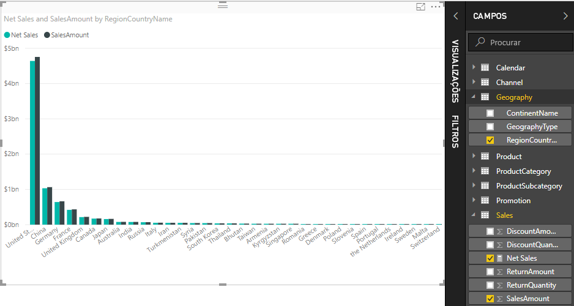

    O gráfico utiliza agora duas medidas: **SalesAmount**, que foi somada automaticamente pelo Power BI e a medida **Net Sales** que criou manualmente. Cada medida foi calculada no contexto de outro campo, **RegionCountryName**.
    
### Utilizar a medida com uma segmentação de dados

Adicione uma segmentação de dados para filtrar ainda mais as vendas líquidas e os montantes de vendas por ano civil:
    
1. Selecione uma área em branco junto ao gráfico. No painel **Visualizações**, selecione a Visualização de **tabela**. 

    Esta ação cria uma nova visualização de tabela em branco na tela de relatórios.
    
    
    
1. Arraste o campo **Year** da tabela **Calendar** para a nova visualização de tabela em branco. 
    
    Como **Year** é um campo numérico, o Power BI Desktop soma os respetivos valores. Este somatório não funciona bem como uma agregação. Isso será abordado no próximo passo.

    
    
3. Na caixa **Valores** no painel **Visualizações**, selecione a seta para baixo junto a **Year** e, em seguida, selecione **Não resumir** na lista. A tabela apresenta agora anos individuais.
    
    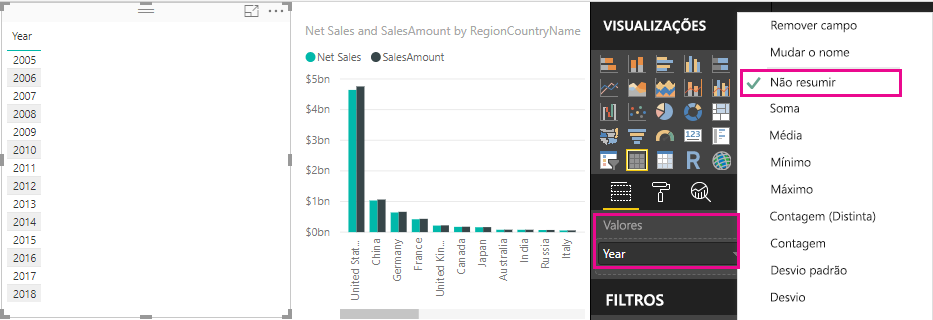
    
4.  Selecione o ícone **Segmentação de Dados** no painel **Visualizações** para converter a tabela numa segmentação de dados. Se a visualização mostrar um controlo deslizante em vez de uma lista, selecione **Lista** na seta para baixo do controlo deslizante.

    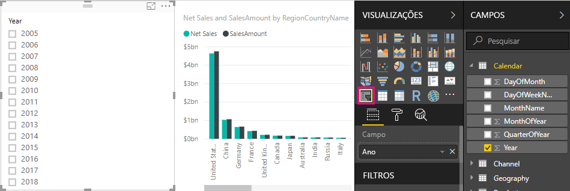
    
5.  Selecione qualquer valor na segmentação de dados **Year** para filtrar o gráfico **Net Sales and Sales Amount by RegionCountryName** em conformidade. As medidas **Net Sales** e **SalesAmount** recalculam e apresentam os resultados no contexto do campo **Year** selecionado. 
    
    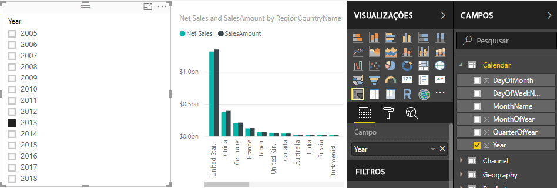

### Utilizar a medida noutra medida

Imagine que pretende saber que produtos têm o maior montante de vendas líquidas por unidade vendida. Será necessária uma medida que divida as vendas líquidas pela quantidade de unidades vendidas. Crie uma nova medida que divida o resultado da medida **Net Sales** pela soma de **Sales[SalesQuantity]** .

1.  No painel **Campos**, crie uma nova medida chamada **Net Sales by Unit** na tabela **Sales**.
    
1. Na barra de fórmulas, começa a escrever *Vendas Líquidas*. A lista de sugestões mostra o que pode adicionar. Selecione **[Net Sales]** .
    
    
    
1. Também pode fazer referência a medidas ao introduzir apenas um parêntese reto esquerdo ( **[** ). A lista de sugestões mostra apenas medidas para adicionar à sua fórmula.
    
    
    
1. Introduza um espaço, um operador de divisão (/), outro espaço e uma função SUM, e escreva *Quantity*. A lista de sugestões mostra todas as colunas cujo nome contém *Quantity*. Selecione **Sales[SalesQuantity]** , insira o parêntese de fecho e prima **Enter** ou selecione **Consolidar** (ícone de marca de verificação) para validar a fórmula. 

    A fórmula resultante deve ser apresentado como:
    
    `Net Sales per Unit = [Net Sales] / SUM(Sales[SalesQuantity])`
    
1. Selecione a medida **Net Sales by Unit** na tabela **Sales** ou arraste-a para uma área em branco na tela de relatório. 

    O gráfico mostra o montante de vendas líquidas por unidade em relação a todos os produtos vendidos. Este gráfico não é muito informativo. Vamos abordá-lo no próximo passo.
    
    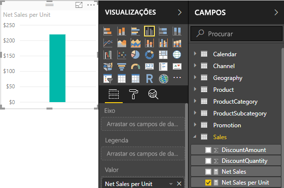
    
1. Para alterar o aspeto, altere o tipo de visualização de gráfico para **Mapa de árvore**.
    
    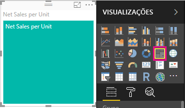
    
1. Selecione o campo **Product Category** ou arraste-o para o mapa de árvore ou para o campo **Group** do painel **Visualizações**. Agora, tem algumas boas informações!
    
    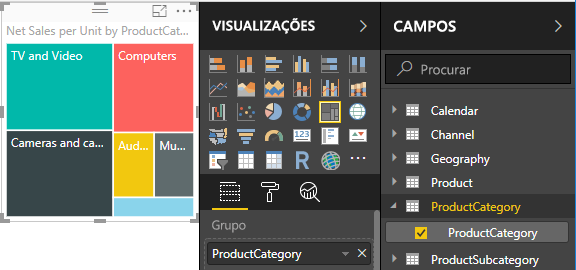
    
7. Experimente remover o campo **ProductCategory** e arrastar o campo **ProductName** para o gráfico em alternativa. 
    
    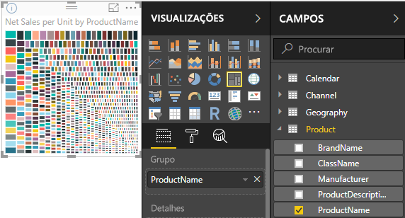
    
   OK, agora estamos apenas a experimentar, mas temos de admitir que é interessante! Experimente outras formas de filtrar e formatar a visualização.

## O que aprendeu
As medidas permitem-lhe obter as informações que pretende retirar dos seus dados. Aprendeu com criar medidas com a barra de fórmulas, atribuir-lhes nomes que façam mais sentido e localizar e selecionar os elementos da fórmula corretos através das listas de sugestões DAX. Também aprendeu o contexto, no qual os resultados dos cálculos em medidas mudam de acordo com outros campos ou através de outras expressões na sua fórmula.

## Próximos passos
- Para saber mais sobre as medidas rápidas do Power BI Desktop, que fornecem muitos cálculos de medidas comuns, veja [Utilizar medidas rápidas para realizar facilmente cálculos comuns e poderosos](desktop-quick-measures.md).
  
- Se quiser aprofundar as fórmulas DAX e criar algumas medidas mais avançadas, veja [Noções básicas do DAX no Power BI Desktop](desktop-quickstart-learn-dax-basics.md). Este artigo foca os conceitos fundamentais no DAX, como sintaxe, funções e uma compreensão mais abrangente do contexto.
  
- Certifique-se de que adiciona a [Referência ao DAX Data Analysis Expressions)](https://docs.microsoft.com/dax/index) aos favoritos. É nesta referência que encontrará informações detalhadas sobre a sintaxe do DAX, operadores e mais de 200 funções DAX.
