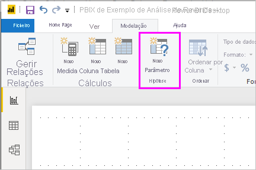
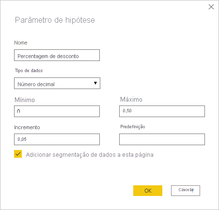
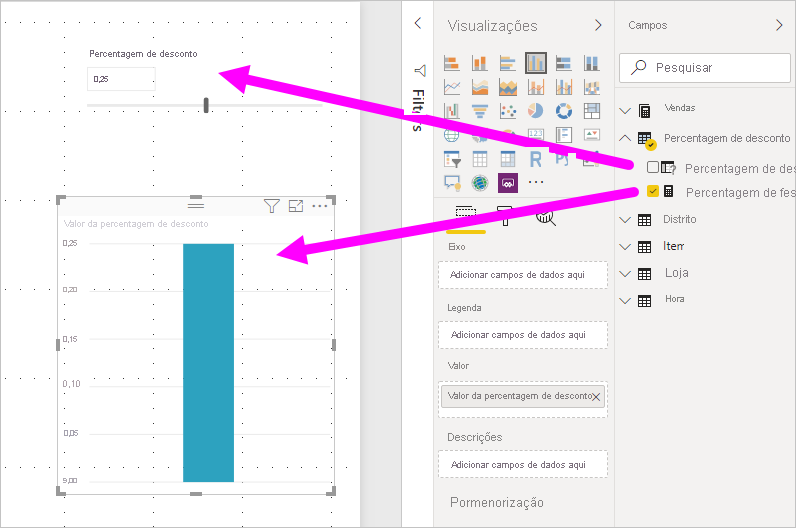
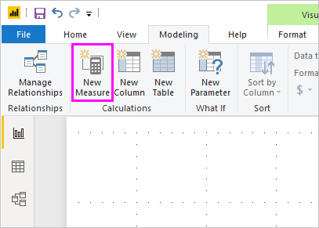
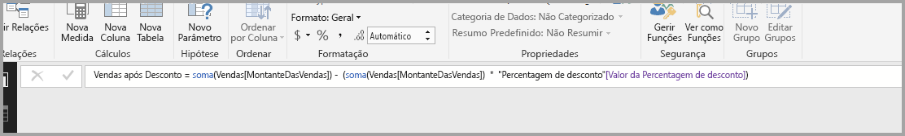
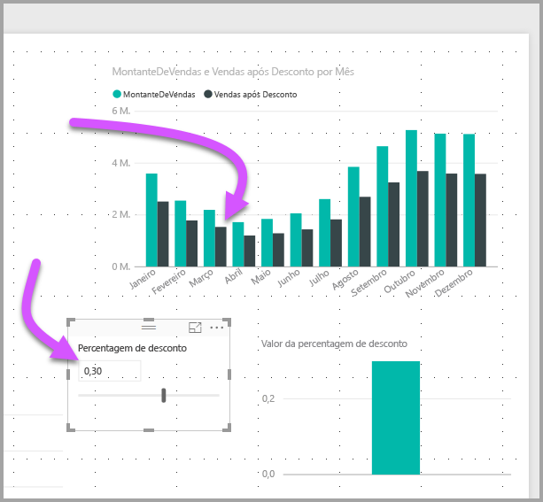

# Criar e utilizar parâmetros de hipótese para visualizar variáveis no Power BI Desktop

A partir da versão de agosto de 2018 do *Power BI Desktop*, pode criar variáveis de *hipótese* para os seus relatórios, interagir com a variável como uma segmentação de dados, visualizar e quantificar diferentes valores-chave nos seus relatórios.

Crie um parâmetro de *hipótese* no separador **Modelação** do Power BI Desktop. Ao selecioná-lo, é apresentada uma caixa de diálogo onde pode configurar o parâmetro.

## Criar um parâmetro de hipótese

Para criar um parâmetro de hipótese, selecione **Novo Parâmetro** no separador **Modelação** no Power BI Desktop. Na imagem seguinte, criámos um parâmetro denominado *Percentagem de desconto* e definimos o respetivo tipo de dados como **Número decimal**. O valor **Mínimo** é zero. O valor **Máximo** é 0,50 (50 por cento). Também definimos o **Incremento** como 0,05, ou cinco por cento. Trata-se do valor a que o parâmetro se irá ajustar quando for utilizado num relatório.

> [!NOTE]
> Confirme que os números decimais são precedidos por um zero, ou seja, 0,50 em vez de apenas ,50. Caso contrário, o número não será validado e o botão **OK** não ficará selecionável.
> 
> 

Para sua comodidade, a caixa de verificação **Adicionar segmentação de dados a esta página** coloca automaticamente uma segmentação de dados com o parâmetro de hipótese na página do relatório atual.

Além de criar o parâmetro, a criação de um parâmetro de hipótese também cria uma medida, que pode utilizar para visualizar o valor atual do parâmetro "e se".

É importante e útil ter em conta que depois de criar um parâmetro de hipótese, o parâmetro e a medida tornam-se parte do modelo. Assim, estão disponíveis em todo o relatório e podem ser utilizados noutras páginas do relatório. Além disso, como fazem parte do modelo, pode eliminar a segmentação de dados a partir da página de relatório. Se a quiser reaver, basta pegar no parâmetro de hipótese da lista **Campos**, arrastá-lo para a tela e, sem seguida, alterar o elemento visual para uma segmentação de dados.

## Utilizar um parâmetro de hipótese

Vamos criar um exemplo simples de utilização de um parâmetro de hipótese. Criámos o parâmetro de hipótese na secção anterior. Agora, vamos aplicá-lo criando uma nova medida cujo valor se ajusta com o controlo de deslize.

A nova medida vai ser simplesmente o valor total de vendas, com a taxa de desconto aplicada. Pode criar medidas complexas e interessantes, que permitem aos consumidores dos relatórios visualizar a variável do parâmetro de hipótese. Por exemplo, pode criar um relatório que permita aos vendedores ver a respetiva compensação se cumprirem determinados objetivos ou percentagens de vendas, bem como ver o impacto do aumento de vendas em descontos maiores.

Introduza a fórmula da medida na barra de fórmulas e dê-lhe o nome *Vendas após Desconto*.

Em seguida, criamos um elemento visual de coluna com **OrderDate** no eixo e **SalesAmount** e a medida recém-criada **Vendas após Desconto** como valores.

À medida que movemos o controlo de deslize, vemos que a coluna **Vendas após Desconto** reflete o valor de vendas com desconto.

E é tudo. Pode utilizar parâmetros de hipótese em todos os tipos de situações. Estes parâmetros permitem aos consumidores de relatórios interagir com diferentes cenários criados nos relatórios.
