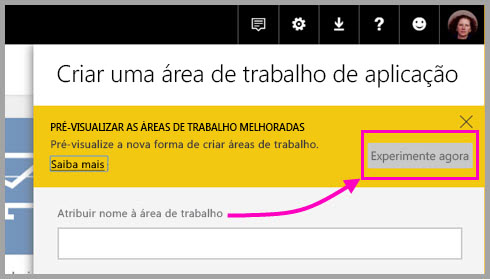
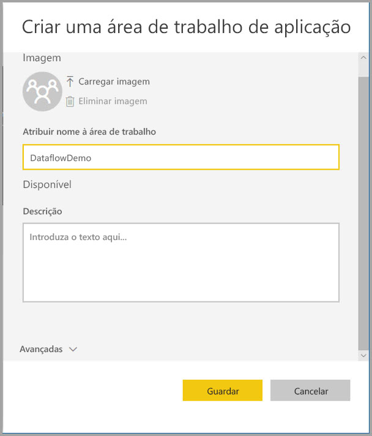
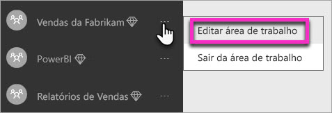
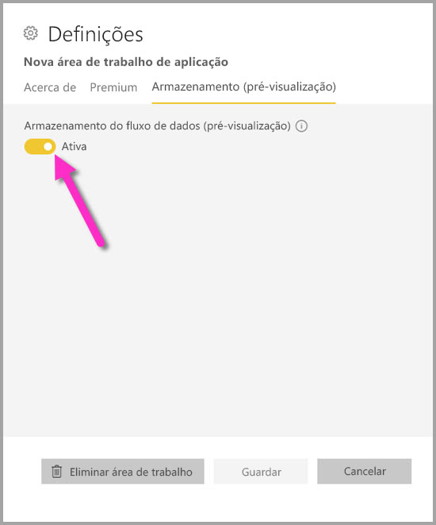
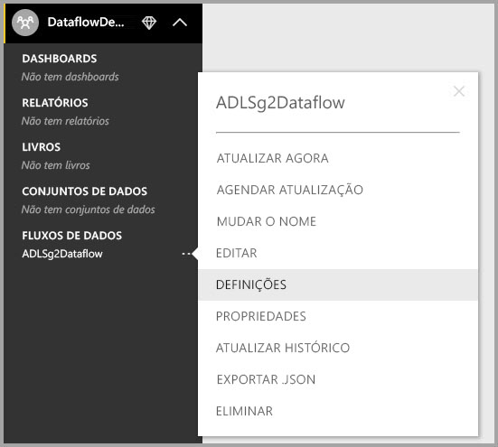
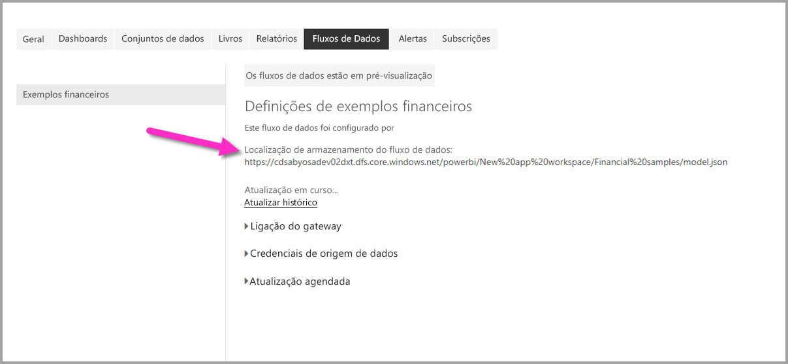

# Configure workspace dataflow settings (Preview) (Configurar as definições de fluxos de dados da área de trabalho [Pré-visualização])

Com o Power BI e os fluxos de dados, pode armazenar o ficheiro de definição de fluxos de dados e os ficheiros de dados de uma área de trabalho na sua conta do Azure Data Lake Storage Gen2. Os administradores de áreas de trabalho podem configurar o Power BI para o fazer e este artigo explica os passos necessários para atingir esse objetivo. 

Para poder configurar a localização de armazenamento de fluxos de dados de uma área de trabalho, o administrador global da sua empresa tem de ligar a conta de armazenamento da organização ao Power BI e ativar as permissões de atribuição de armazenamento para essa conta de armazenamento. *[Ligar o Azure Data Lake Storage Gen2 para armazenar fluxos de dados (Pré-visualização)](service-dataflows-connect-azure-data-lake-storage-gen2.md)* 

Existem duas maneiras de configurar as definições de armazenamento de fluxos de dados da área de trabalho: 

* Durante a criação da área de trabalho
* Ao editar uma área de trabalho existente

Iremos analisar cada uma delas nas secções a seguir. 

> [!IMPORTANT]
> Só é possível alterar a definição de armazenamento de fluxos de dados da área de trabalho se a área de trabalho não contiver fluxos de dados. Além disso, esta funcionalidade só está disponível na nova experiência de área de trabalho. Saiba mais sobre a nova área de trabalho no artigo [Criar novas áreas de trabalho (pré-visualização) no Power BI](../collaborate-share/service-create-the-new-workspaces.md).

## Criar uma nova área de trabalho e configurar o respetivo armazenamento de fluxos de dados

Para criar uma nova área de trabalho no serviço Power BI, selecione **Áreas de trabalho > Criar área de trabalho**.

Na caixa de diálogo Criar uma área de trabalho, pode ser apresentada uma caixa amarela intitulada **Pré-visualizar as áreas de trabalho melhoradas**. Nessa área, selecione **Experimentar**.

Na caixa de diálogo apresentada, pode atribuir um nome exclusivo à nova área de trabalho. Não selecione **Guardar** ainda, uma vez que tem de especificar definições avançadas.

Em seguida, expanda a área **Avançadas** da caixa de diálogo **Criar uma área de trabalho**, onde pode ativar a definição **Armazenamento de fluxos de dados (pré-visualização)** .

Selecione **Guardar** para criar a nova área de trabalho. Qualquer fluxo de dados novo criado nesta área de trabalho passa a armazenar o ficheiro de definições (o ficheiro Model.json) e os dados na conta do Azure Data Lake Storage Gen2 da sua organização. 

## Atualizar o armazenamento de fluxos de dados de uma área de trabalho existente

Como alternativa à criação de uma nova área de trabalho, pode atualizar uma área de trabalho existente para armazenar o ficheiro de definições e os dados na conta do Azure Data Lake Storage Gen2 da sua organização. Não se esqueça que só é possível alterar a definição de armazenamento de fluxos de dados se a área de trabalho não contiver já um fluxo de dados.

Para editar uma área de trabalho, selecione as reticências **(...)** e, em seguida, selecione **Editar área de trabalho**. 

Na janela **Editar área de trabalho** apresentada, expanda **Avançadas** e, em seguida, defina a opção **Armazenamento de fluxos de dados (pré-visualização)** como **Ativado**. 

Em seguida, selecione **Guardar**. Qualquer fluxo de dados novo criado nessa área de trabalho passa a armazenar o ficheiro de definições e os dados na conta do Azure Data Lake Storage Gen2 da sua organização.

## Obter o URI de ficheiros de fluxos de dados armazenados

Depois de criar um fluxo de dados numa área de trabalho atribuída à conta do Azure Data Lake da sua organização, pode aceder diretamente aos respetivos ficheiros de definições e dados. A localização dos mesmos está disponível na página **Definições de fluxos de dados**. Para aceder a ela, siga estes passos:

Selecione as reticências **(...)** junto a um fluxo de dados listado em **Fluxos de dados** na área de trabalho. No menu apresentado, selecione **Definições**.

Nas informações apresentadas, a localização da pasta CDM do fluxo de dados é apresentada em **Localização do Armazenamento do Fluxos de Dados**, conforme mostrado na imagem seguinte.

> [!NOTE]
> O Power BI configura o proprietário do fluxo de dados com permissões de leitor à pasta de CDM onde estão armazenados os ficheiros de fluxos de dados. Para conceder acesso à localização de armazenamento de fluxos de dados a outras pessoas ou serviços, o proprietário da conta de armazenamento tem de conceder acesso no Azure.

## Considerações e limitações

Certas funcionalidades de fluxo de dados não são suportadas quando o armazenamento de fluxos de dados está localizado no Azure Data Lake Storage Gen2: 

Áreas de trabalho do Power BI Pro, Premium e Embedded:
* A funcionalidade **entidades ligadas** só é suportada entre áreas de trabalho na mesma conta de armazenamento
* As permissões de área de trabalho não são aplicáveis aos fluxos de dados armazenados no Azure Data Lake Storage Gen2; apenas o proprietário do fluxo de dados pode aceder aos mesmos.
* De outro modo, todas as funcionalidades de preparação de dados são iguais às dos fluxos de dados armazenados no armazenamento do Power BI

Existem algumas considerações adicionais, descritas na lista seguinte:

* Depois de configurar uma localização de armazenamento de fluxos de dados, esta não pode ser alterada.
* Apenas o proprietário de um fluxo de dados armazenado no Azure Data Lake Storage Gen2 pode aceder aos dados do mesmo.
* As origens de dados no local, em capacidades partilhadas do Power BI, não são suportadas em fluxos de dados armazenados no Azure Data Lake Storage Gen2 da sua organização.

Os clientes do **Power BI Desktop** não podem aceder a fluxos de dados armazenados numa conta do Azure Data Lake Storage Gen2, salvo se forem os proprietários do fluxo de dados. Considere a situação seguinte:

1.  A Ana cria uma nova área de trabalho e configura-a para armazenar os fluxos de dados no data lake da organização.
2.  O Nuno, que também é membro da área de trabalho criada pela Ana, quer utilizar o Power BI Desktop e o conector de fluxo de dados para obter dados do fluxo de dados criado pela Ana.
3.  O Miguel recebe um erro porque não foi adicionado como utilizador autorizado à pasta de CDM do fluxo de dados no data lake.

    

## Próximas etapas

Este artigo disponibilizou orientação sobre como configurar o armazenamento de área de trabalho para fluxos de dados. Para obter informações adicionais, veja os seguintes artigos:

Para obter mais informações sobre fluxos de dados, CDM e o Azure Data Lake Storage Gen2, veja os seguintes artigos:

* [Fluxos de dados e integração do Azure Data Lake (Pré-visualização)](service-dataflows-azure-data-lake-integration.md)
* [Add a CDM folder to Power BI as a dataflow (Preview) (Adicionar uma pasta de CDM ao Power BI como um fluxo de dados [Pré-visualização])](service-dataflows-add-cdm-folder.md)
* [Connect Azure Data Lake Storage Gen2 for dataflow storage (Preview) (Ligar o Azure Data Lake Storage Gen2 para armazenar fluxos de dados [Pré-visualização])](service-dataflows-connect-azure-data-lake-storage-gen2.md)

Para obter informações sobre fluxos de dados em geral, veja estes artigos:

* [Criar e utilizar fluxos de dados no Power BI](service-dataflows-create-use.md)
* [Utilizar entidades calculadas no Power BI Premium (pré-visualização)](service-dataflows-computed-entities-premium.md)
* [Utilizar fluxos de dados com origens de dados no local (Pré-visualização)](service-dataflows-on-premises-gateways.md)
* [Recursos para programadores de fluxos de dados do Power BI (Pré-visualização)](service-dataflows-developer-resources.md)

Para obter mais informações sobre o armazenamento do Azure, leia estes artigos:

* [Guia de segurança de Armazenamento do Azure](https://docs.microsoft.com/azure/storage/common/storage-security-guide)
* [Introdução aos exemplos do github dos Serviços de Dados do Azure](https://aka.ms/cdmadstutorial)

Para obter mais informações sobre o Common Data Service, pode ler o seguinte artigo de descrição geral:

* [Common Data Service – descrição geral](https://docs.microsoft.com/powerapps/common-data-model/overview)
* [Pastas de CDM](https://go.microsoft.com/fwlink/?linkid=2045304)
* [Definição do ficheiro de modelo do CDM](https://go.microsoft.com/fwlink/?linkid=2045521)

Pode sempre experimentar [colocar perguntas à Comunidade do Power BI](https://community.powerbi.com/).
