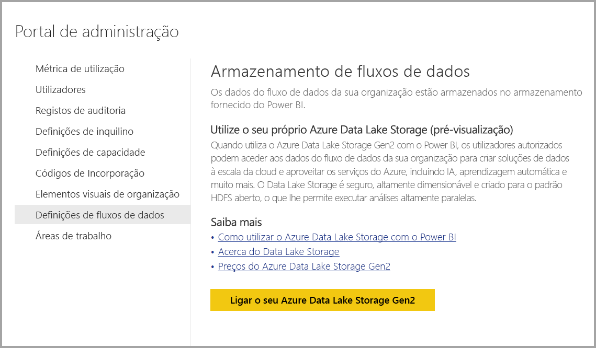
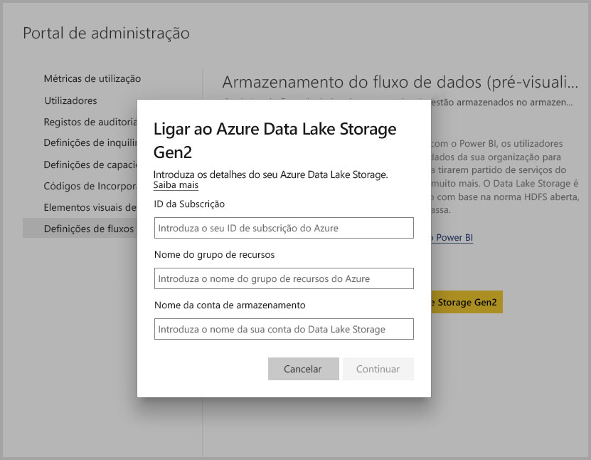
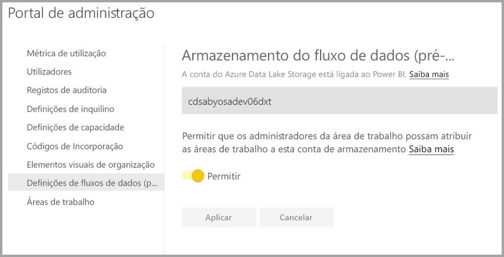

# Ligar o Azure Data Lake Storage Gen2 para armazenar fluxos de dados

Pode configurar áreas de trabalho do Power BI para armazenar fluxos de dados na conta do Azure Data Lake Storage Gen2 da sua organização. Este artigo descreve os passos gerais necessários para o fazer, além de fornecer orientações e melhores práticas ao longo do processo. Há algumas vantagens em configurar áreas de trabalho para armazenar definições de fluxos de dados e ficheiros de dados no data lake, incluindo as que se seguem:

* O Azure Data Lake Storage Gen2 disponibiliza um local de armazenamento de dados extremamente dimensionável
* Os programadores do departamento de TI podem utilizar os dados de fluxos de dados e os ficheiros de definição para tirar partido dos serviços de inteligência artificial (IA) e de Dados do Azure, conforme demonstrado nos [exemplos de GitHub dos Serviços de Dados do Azure](https://aka.ms/cdmadstutorial)
* Permite aos programadores da sua organização integrar dados de fluxos de dados nas aplicações internas e soluções de linha de negócio, com a utilização de recursos de programadores para fluxos de dados e o Azure

Para utilizar o Azure Data Lake Storage Gen2 para fluxos de dados, precisa do seguinte:

* **Inquilino do Power BI**: pelo menos uma conta no inquilino do Azure Active Directory (AAD) tem de estar inscrita no Power BI
* **Uma conta de Administrador Global**: esta conta é necessária para ligar e configurar o Power BI de modo a armazenar a definição de fluxos de dados, assim como os dados, na sua conta do Azure Data Lake Storage Gen2
* **Uma subscrição do Azure**: precisa de uma subscrição do Azure para utilizar o Azure Data Lake Storage Gen2
* **Grupo de recursos**: utilize um grupo de recursos que já tenha ou crie um novo
* **Uma Conta de Armazenamento do Azure com a funcionalidade Data Lake Storage Gen2 ativada** 

> [!TIP]
> Se não tiver uma subscrição do Azure, crie uma [conta gratuita](https://azure.microsoft.com/free/) antes de começar.

> [!WARNING]
> Depois de configurar uma localização de armazenamento de fluxos de dados, esta não pode ser alterada. Veja a secção [considerações e limitações](#considerations-and-limitations) perto do final deste artigo para obter outros elementos importantes a considerar.

## Preparar o Azure Data Lake Storage Gen2 para o Power BI

Antes de configurar o Power BI com uma conta do Data Lake Storage Gen2, tem de criar e configurar uma conta de armazenamento. Vejamos quais são os requisitos do Power BI:

1. Tem de ser o proprietário da conta de armazenamento do ADLS. Esta tem de ser atribuída ao nível dos recursos e não herdada do nível de subscrição.
2. A conta de armazenamento tem de ser criada no mesmo inquilino do AAD que o seu inquilino do Power BI.
3. A conta de armazenamento tem de ser criada na mesma região que o seu inquilino do Power BI. Para determinar a localização do seu inquilino do Power BI, veja [onde está localizado o meu inquilino do Power BI](../admin/service-admin-where-is-my-tenant-located.md).
4. A conta de armazenamento tem de ter a funcionalidade *Espaço de Nomes Hierárquico*  ativada.
5. Se a conta de armazenamento não foi criada pelo utilizador atual, certifique-se de que foram atribuídas ao utilizador atual permissões de [Proprietário de Dados de Blob de Armazenamento](/azure/role-based-access-control/built-in-roles#storage-blob-data-owner) e de [proprietário](/azure/role-based-access-control/built-in-roles#owner). (Uma vez que o proprietário não detém permissões de nível de dados, o proprietário de Dados de Blob é necessário.)

As secções que se seguem explicam os passos necessários para configurar a sua conta do Azure Data Lake Storage Gen2 ao pormenor.

### Criar a conta de armazenamento

Siga os passos descritos no artigo [Criar a conta de armazenamento do Azure Data Lake Storage Gen2](/azure/storage/blobs/data-lake-storage-quickstart-create-account).

1. Certifique-se de que seleciona a mesma localização do seu inquilino do Power BI e defina o armazenamento como **StorageV2 (fins gerais v2)**
2. Certifique-se de que ativa a funcionalidade Espaço de nomes hierárquico
3. Recomendamos que especifique a definição de replicação como **Armazenamento georredundante com acesso de leitura (RA-GRS)**

### Conceder permissões aos serviços Power BI

Em seguida, tem de conceder as funções de leitor e acesso a dados ao serviço Power BI na sua conta de armazenamento criada. Ambas são funções incorporadas, pelo que os passos não colocam dificuldades. 

Siga os passos em [Atribuir uma função RBAC incorporada](/azure/storage/common/storage-auth-aad-rbac#assign-a-built-in-rbac-role).

Na janela **Adicionar atribuição de função**, selecione a função **Leitor e Acesso a Dados**. Em seguida, utilize a pesquisa para localizar a aplicação **Serviço Power BI**.
Repita os mesmos passos para a função **Proprietário de Dados de Blob de Armazenamento** e atribua a função às aplicações **Serviço Power BI** e **Power BI Premium**.

> [!NOTE]
> Aguarde pelo menos 30 minutos para que a permissão seja propagada para o Power BI a partir do portal. Sempre que alterar as permissões no portal, aguarde 30 minutos para que essas permissões sejam refletidas no Power BI. 

## Ligar o Azure Data Lake Storage Gen2 ao Power BI

Depois de configurar a sua conta do Azure Data Lake Storage Gen2 no portal do Azure, pode ligá-la ao Power BI no **portal de administração do Power BI**. Também pode gerir o armazenamento de fluxos de dados do Power BI na secção de definições de **Armazenamento de fluxos de dados** do portal de administração do Power BI. Para receber orientações sobre abertura e utilização básica, consulte a secção [Como aceder ao portal de administração](../admin/service-admin-portal.md) para obter informações detalhadas.

Para ligar a sua conta do **Azure Data Lake Storage Gen2**, siga estes passos:

1. Navegue para o separador **Definições de fluxos de dados** do **portal de administração do Power BI**

     

2. Selecione o botão **Ligar o Azure Data Lake Storage Gen2**. A janela a seguir é apresentada.

     

3. Indique o **ID de Subscrição** da Conta de Armazenamento.
4. Indique o **Nome do Grupo de Recursos** no qual foi criada a conta de armazenamento.
5. Indique o **Nome da Conta de Armazenamento**.
6. Selecione **Ligar**.

Após a conclusão bem-sucedida desses passos, a sua conta do Azure Data Lake Storage Gen2 está ligada ao Power BI. 

> [!NOTE]
> Para configurar uma ligação ao Azure Data Lake Storage Gen2 no portal de administração do Power BI, tem de ter permissões de Administrador Global. No entanto, os Administradores Globais não podem ligar o armazenamento externo no portal de administração.  

Em seguida, precisa de ativar as pessoas da sua organização para configurar as respetivas áreas de trabalho, o que lhes permite utilizar esta conta de armazenamento para definir fluxos de dados e armazenar dados. Esse será o próximo passo a efetuar na secção seguinte. 

## Permitir a atribuição de áreas de trabalho por parte dos administradores

Por predefinição, a definição de fluxos de dados e os ficheiros de dados são armazenados no armazenamento fornecido pelo Power BI. Para aceder aos ficheiros de fluxos de dados na sua própria conta de armazenamento, os administradores de áreas de trabalho têm de configurar primeiro a área de trabalho para permitir a atribuição e o armazenamento de fluxos de dados na conta de armazenamento nova. Para um administrador de áreas de trabalho poder configurar definições de armazenamento de fluxos de dados, é necessário conceder permissões de atribuição de armazenamento ao administrador no **Portal de administração do Power BI**.

Para conceder permissões de atribuição de armazenamento, aceda ao separador **Definições de fluxos de dados** no **Portal de administração do Power BI**. Há um botão de opção para *Permitir que os administradores de áreas de trabalho atribuam áreas de trabalho a esta conta de armazenamento* que deve ser definido como **permitir**. Depois de ativar esse controlo de deslize, selecione o botão **Aplicar** para que a alteração produza efeito. 

 

Já está! Agora, os administradores de áreas de trabalho do Power BI já podem atribuir fluxos de trabalho ao sistema de ficheiros que criou.

## Considerações e limitações

Esta é uma funcionalidade de pré-visualização e seu comportamento pode sofrer alterações à medida que se aproxima a data de lançamento. Há algumas considerações e limitações a ter em conta quando trabalhar com o seu armazenamento de fluxos de dados:

* Depois de configurar uma localização de armazenamento de fluxos de dados, esta não pode ser alterada.
* Por predefinição, apenas os proprietários de um fluxo de dados armazenado no Azure Data Lake Storage Gen2 podem aceder aos dados do mesmo. Para autorizar o acesso de outras pessoas aos fluxos de dados armazenados no Azure, tem de os adicionar à pasta de CDM dos fluxos de dados 
* A criação de fluxos de dados com entidades ligadas só é possível quando são armazenados na mesma conta de armazenamento
* As origens de dados no local, em capacidades partilhadas do Power BI, não são suportadas em fluxos de dados armazenados no data lake da sua organização
* Os instantâneos não são eliminados automaticamente no ADLS Gen2. Se quiser libertar espaço, pode criar uma função do Azure para limpar os instantâneos antigos periodicamente.

Também existem alguns problemas conhecidos, conforme descrito nesta secção.

Os clientes do Power BI Desktop não podem aceder a fluxos de dados armazenados numa **Conta do Azure Data Lake Storage**, salvo se forem os proprietários do fluxo de dados ou se lhes tiver sido dada autorização à pasta de CDM no data lake. O cenário é o seguinte:

1. A Ana criou uma nova área de trabalho e configurou-a para armazenar fluxos de dados no data lake da organização. 
2. O Nuno, que também é membro da área de trabalho criada pela Ana, quer tirar partido do Power BI Desktop e do conector de fluxos de dados para obter dados do Fluxo de Dados criado pela Ana.
3. O Miguel recebe um erro semelhante porque não lhe foi dada autorização para a pasta de CDM do fluxo de dados no data lake.

Seguem-se algumas perguntas e respostas comuns:

**Pergunta:** O que acontece se tivesse criado anteriormente fluxos de dados numa área de trabalho e quisesse alterar a localização de armazenamento dos mesmos?

**Resposta:** Não pode alterar a localização de armazenamento de um fluxo de dados depois de o criar. 

**Pergunta:** Em que circunstâncias posso alterar a localização de armazenamento do fluxo de dados de uma área de trabalho?

**Resposta:** A alteração da localização de armazenamento do fluxo de dados de uma área de trabalho só é permitida se a área de trabalho não contiver fluxos de dados.

## Próximos passos

Este artigo disponibilizou orientação sobre como ligar um Azure Data Lake Gen2 para armazenamento de fluxos de dados. Para obter informações adicionais, veja os seguintes artigos:

Para obter mais informações sobre fluxos de dados, CDM e o Azure Data Lake Storage Gen2, veja os seguintes artigos:

* [Fluxos de dados e integração do Azure Data Lake (Pré-visualização)](service-dataflows-azure-data-lake-integration.md)
* [Configure workspace dataflow settings (Preview) (Configurar as definições de fluxos de dados da área de trabalho [Pré-visualização])](service-dataflows-configure-workspace-storage-settings.md)
* [Add a CDM folder to Power BI as a dataflow (Preview) (Adicionar uma pasta de CDM ao Power BI como um fluxo de dados [Pré-visualização])](service-dataflows-add-cdm-folder.md)

Para obter informações sobre fluxos de dados em geral, veja estes artigos:

* [Criar e utilizar fluxos de dados no Power BI](service-dataflows-create-use.md)
* [Utilizar entidades calculadas no Power BI Premium](service-dataflows-computed-entities-premium.md)
* [Utilizar fluxos de dados com origens de dados no local](service-dataflows-on-premises-gateways.md)
* [Recursos para programadores para fluxos de dados do Power BI](service-dataflows-developer-resources.md)

Para obter mais informações sobre o armazenamento do Azure, leia estes artigos:
* [Guia de segurança de Armazenamento do Azure](/azure/storage/common/storage-security-guide)

Para obter mais informações sobre o Common Data Service, pode ler o seguinte artigo de descrição geral:
* [Common Data Service – descrição geral](/powerapps/common-data-model/overview)
* [Pastas de CDM](/common-data-model/data-lake)
* [Definição do ficheiro de modelo do CDM](/common-data-model/model-json)

Pode sempre experimentar [colocar perguntas à Comunidade do Power BI](https://community.powerbi.com/).