# Ligar a origens de dados de fluxos de dados do Power BI

Com fluxos de dados do Power BI, pode ligar a um grande número de origens de dados diferentes para criar novos fluxos de dados ou adicionar novas entidades a um fluxo de dados existente.

Este artigo lista as várias origens de dados disponíveis para criar ou adicionar a fluxos de dados e descreve como criá-los com as mesmas.

Para obter uma descrição geral de como criar e utilizar fluxos de dados, veja [Criar e utilizar fluxos de dados no Power BI](service-dataflows-create-use.md).

## Criar um fluxo de dados a partir de uma origem de dados

Para ligar aos dados, no **serviço Power BI** selecione o item de menu **+ Criar** e, em seguida, selecione **fluxo de dados** no menu que é apresentado. Quando a opção "fluxo de dados" for selecionada, irá aparecer a seguinte imagem na tela do serviço Power BI. 

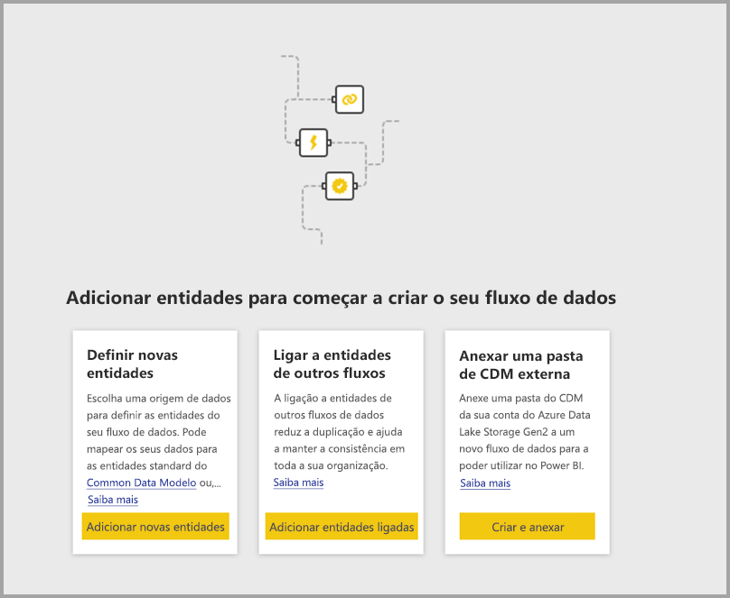

Se o seu fluxo de dados já existir, pode adicionar novas entidades ao seu fluxo de dados ao selecionar a opção **Adicionar entidades** apresentada abaixo ou selecionar a opção **Obter dados** nas ferramentas de criação de fluxos de dados.

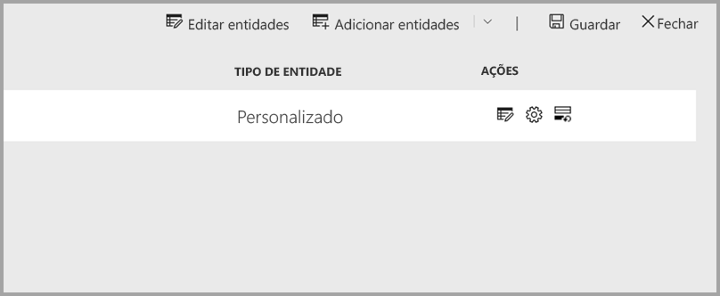

A seguinte imagem mostra o botão **Obter dados** nas ferramentas de criação de fluxos de dados. 

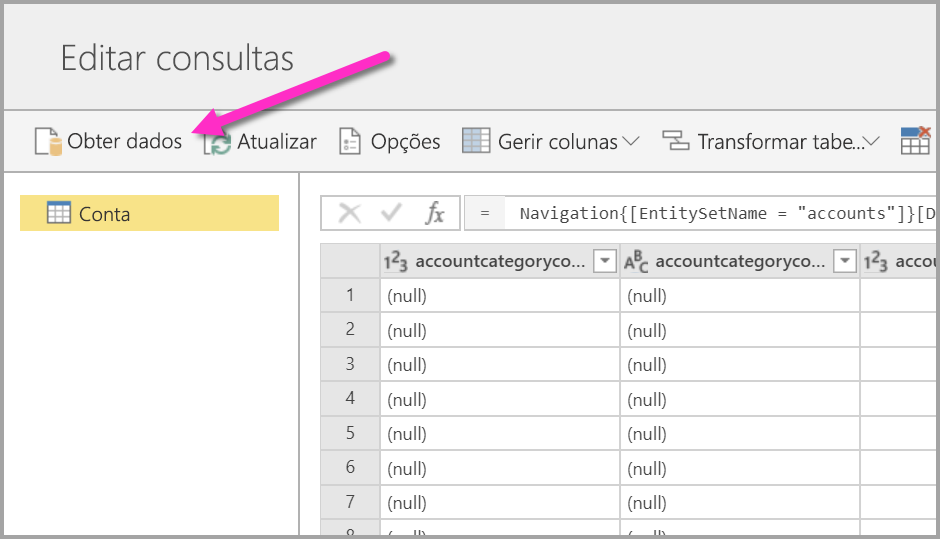

## Origens de dados de fluxos de dados

Pode ver as origens de dados disponíveis ao selecionar **Obter Dados** nas ferramentas de criação de fluxos de dados, que depois apresentam uma caixa de diálogo para a seleção das categorias e de cada origem de dados, conforme apresentado na seguinte imagem.

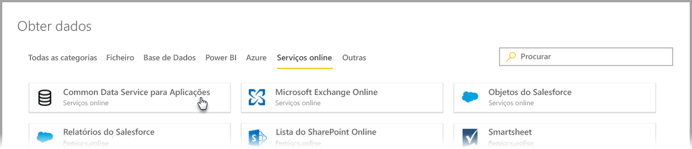

As origens de dados de fluxos de dados estão organizadas de acordo com as seguintes categorias, que aparecem na parte superior da caixa de diálogo **Obter dados**:

* Todas as categorias
* File
* Base de dados
* Power BI
* Azure
* Serviços Online
* Other

A categoria **Todas as categorias** contém todas as origens de dados, de todas as categorias. 

A categoria **Ficheiro** inclui as seguintes ligações de dados disponíveis para fluxos de dados:

* Access
* Excel
* JSON
* Texto/CSV
* XML

A categoria **Base de dados** inclui as seguintes ligações de dados disponíveis para fluxos de dados:

* Base de Dados IBM DB2
* Base de Dados MySQL
* Base de Dados Oracle
* Base de Dados PostgreSQL
* Base de Dados do SQL Server
* Base de Dados Sybase
* Teradata
* Vertica

A categoria **Power BI** inclui as seguintes ligações de dados disponíveis para fluxos de dados:

* Fluxos de dados do Power BI

A categoria **Azure** inclui as seguintes ligações de dados disponíveis para fluxos de dados:

* Blobs do Azure
* Azure Data Explorer
* Azure SQL Data Warehouse
* Base de dados SQL do Azure
* Tabelas do Azure

A categoria **Serviços Online** inclui as seguintes ligações de dados disponíveis para fluxos de dados:

* Amazon Redshift
* Common Data Service para Aplicações
* Microsoft Exchange Online
* Objetos do Salesforce
* Relatórios do Salesforce
* Lista do SharePoint Online
* Smartsheet

A categoria **Outros** inclui as seguintes ligações de dados disponíveis para fluxos de dados:

* Active Directory
* OData
* Lista do SharePoint
* API Web
* Página Web
* Tabela em branco
* Consulta em Branco

## Ligar a uma origem de dados

Para ligar a uma origem de dados, selecione uma. Vamos utilizar um exemplo para mostrar o funcionamento do processo, mas este é semelhante para cada ligação de dados de um fluxo de dados. Os diferentes conectores podem precisar de credenciais específicas ou outras informações, mas o fluxo é semelhante. No nosso exemplo, pode ver nesta imagem que o **Common Data Service for Apps** está selecionado na categoria de ligação de dados **Serviços online**.

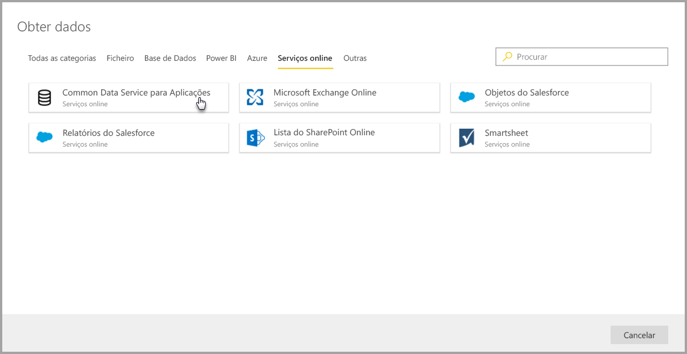

É apresentada uma janela de ligação para a ligação de dados selecionada. Se as credenciais forem necessárias, serão pedidas. A seguinte imagem mostra um URL de Servidor a ser introduzido para ligar a um servidor do Common Data Service for Apps.

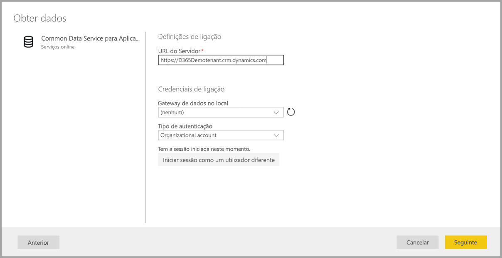

Assim que as informações de URL de Servidor ou ligação a recurso forem indicadas, selecione **Iniciar sessão** para introduzir as credenciais a utilizar para o acesso de dados e, em seguida, selecione **Seguinte**.

O **Power Query Online** é iniciado, estabelece a ligação à origem de dados e, em seguida, apresenta as tabelas disponíveis nessa origem de dados na janela **Navegador**, apresentada na seguinte imagem.

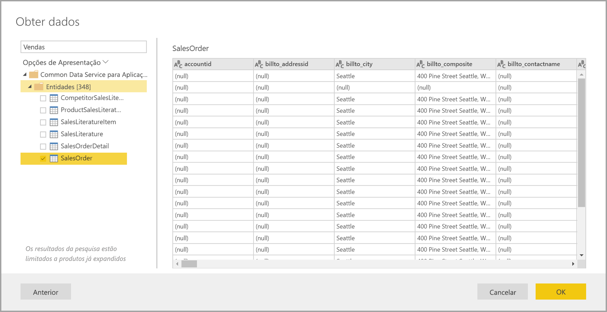

Pode selecionar tabelas e dados para carregar ao selecionar a caixa de verificação junto a cada um no painel esquerdo. Para carregar os dados, selecione **OK** na parte inferior do painel **Navegador**. Será apresentada uma caixa de diálogo do Power Query Online, na qual poderá editar consultas e realizar qualquer outra transformação pretendida nos dados selecionados.

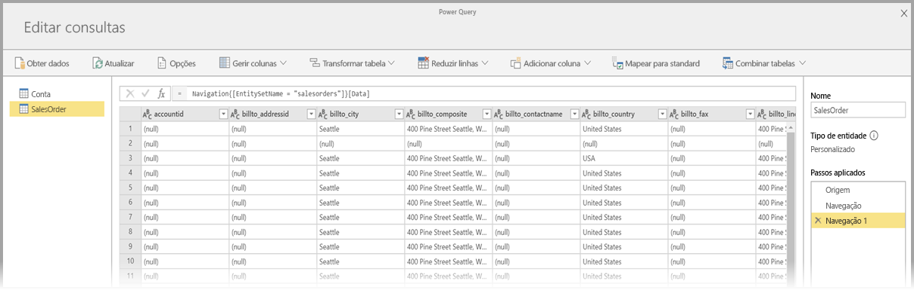

É tudo. Outras origens de dados têm fluxos semelhantes e utilizam o Power Query Online para editar e transformar os dados que traz para o seu fluxo de dados.

## Ligar a origens de dados adicionais

Há conectores de dados adicionais que não são apresentados na interface de utilizador de fluxos de dados do Power BI, mas são suportados com alguns passos adicionais. 

Pode seguir os seguintes passos para criar uma ligação a um conector que não é apresentado na interface de utilizador:

1. Abra o **Power BI Desktop** e selecione **Obter Dados**.
2. Abra o **Editor do Power Query** no Power BI Desktop e, em seguida, clique com o botão direito do rato na consulta relevante e abra o **Editor Avançado**, conforme apresentado na seguinte imagem. A partir deste momento, pode copiar o script M que aparece no Editor Avançado.

    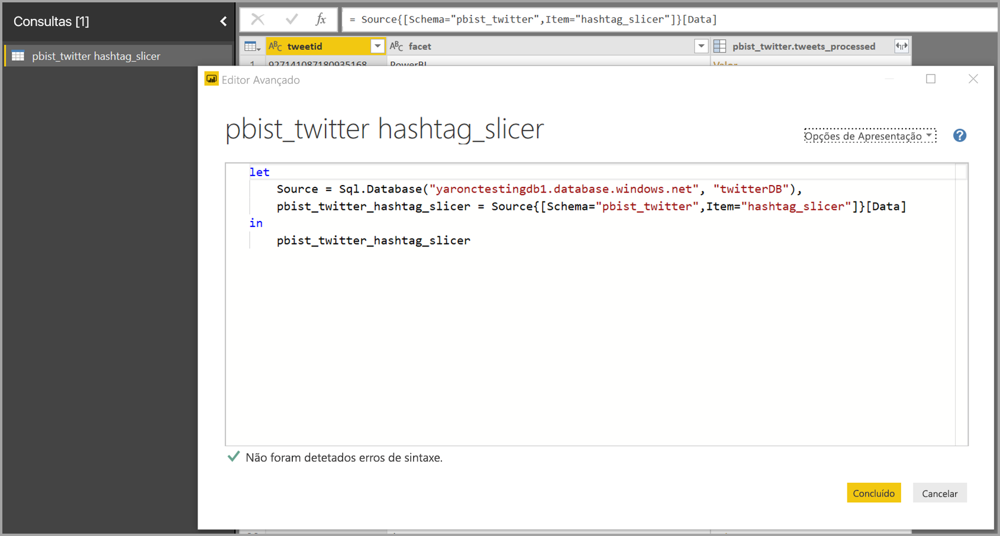 

3. Abra o fluxo de dados do Power BI e selecione **Obter dados** para uma consulta em branco, conforme apresentado na seguinte imagem.

    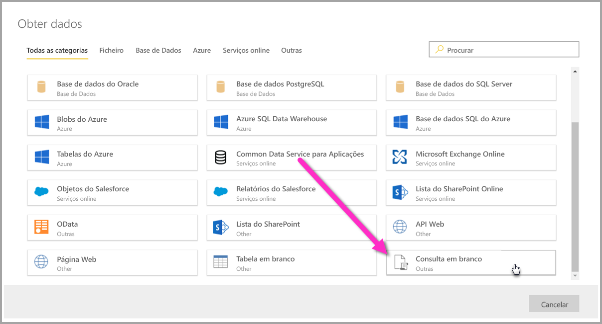 

4. Cole a consulta copiada na consulta em branco para o fluxo de dados.

    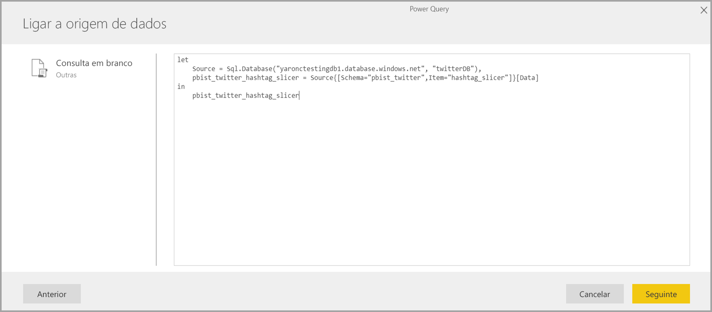 

Em seguida, o seu script será ligado à origem de dados que especificou. 

A seguinte lista mostra os conectores que pode utilizar atualmente ao copiar e colar a consulta M numa consulta em branco:

* Azure Analysis Services
* Adobe Analytics
* ODBC
* OLE DB
* Pasta
* Pasta do SharePoint Online
* Pasta do SharePoint
* Hadoop (HDFS)
* Azure HDInsight (HDFS)
* Ficheiro Hadoop (HDFS)
* Informix (versão beta)

E isto é tudo o que precisa de saber sobre a ligação a origens de dados em fluxos de dados do Power BI.

## Passos Seguintes

Este artigo mostrou as origens de dados a que pode ligar em fluxos de dados. Os artigos seguintes entram em mais detalhes sobre os cenários de utilização comuns dos fluxos de dados. 

* [Preparação personalizada de dados no Power BI](service-dataflows-overview.md)
* [Criar e utilizar fluxos de dados no Power BI](service-dataflows-create-use.md)
* [Utilizar entidades calculadas no Power BI Premium](service-dataflows-computed-entities-premium.md)
* [Utilizar fluxos de dados com origens de dados no local](service-dataflows-on-premises-gateways.md)
* [Recursos para programadores para fluxos de dados do Power BI](service-dataflows-developer-resources.md)
* [Fluxos de dados e integração do Azure Data Lake (Pré-visualização)](service-dataflows-azure-data-lake-integration.md)

Para obter mais informações sobre o Power Query e a atualização agendada, pode ler estes artigos:
* [Descrição geral de consulta no Power BI Desktop](desktop-query-overview.md)
* [Configurar a atualização agendada](../connect-data/refresh-scheduled-refresh.md)

Para obter mais informações sobre o Common Data Service, pode ler o seguinte artigo de descrição geral:
* [Common Data Service – descrição geral](/powerapps/common-data-model/overview)