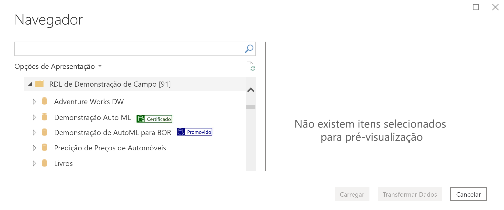
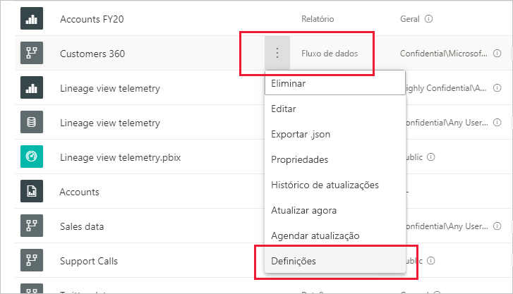
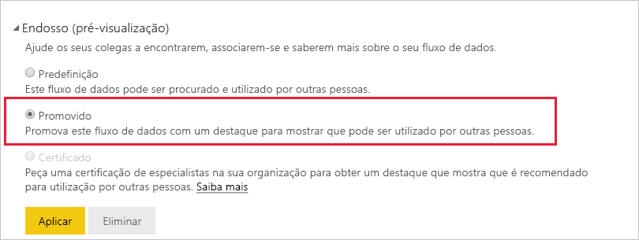
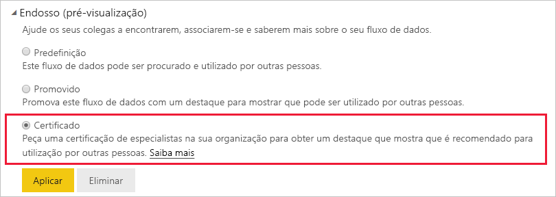

# Promote or certify dataflows (Promover ou certificar fluxos de dados - Pré-visualização)

O Power BI fornece duas formas de aumentar a visibilidade dos seus valiosos fluxos de dados de alta qualidade: **promoção** e **certificação**.

* **Promoção**: A promoção permite que os utilizadores destaquem os fluxos de dados que consideram valiosos e que valem a pena serem utilizados por outros utilizadores. Desta forma, incentiva a difusão colaborativa de fluxos de dados numa organização. Um proprietário de fluxo de dados ou um membro com permissões de escrita na área de trabalho na qual está localizado um fluxo de dados, pode simplesmente promover o fluxo de dados quando considerar ser suficientemente bom para partilhar.

* **Certificação**: A certificação significa que um fluxo de dados foi verificado por um revisor autorizado e que é uma origem de dados verdadeiramente confiável e autoritária que está pronta para ser utilizada em toda a organização. Um grupo selecionado de revisores definido pelo administrador de inquilinos do Power BI determina os fluxos de dados a certificar. Um utilizador que considere que um determinado fluxo de dados deve ser certificado, mas não está autorizado a certificar o mesmo, deve contactar o administrador do inquilino.

  A certificação do fluxo de dados apenas é possível se tiver sido [ativada pelo administrador de inquilinos do Power BI ](../admin/service-admin-setup-certification.md).

A promoção ou certificação de um fluxo de dados denomina-se *endossamento*. Os criadores de relatórios do Power BI costumam ter muitos fluxos de dados diferentes para escolher e o endosso ajuda a orientá-los para os fluxos de dados que são fiáveis, fidedignos e autoritários.

Os fluxos de dados endossados estão claramente identificados em vários locais no Power BI, sendo fácil para os criadores de relatórios localizá-los quando procuram dados fiáveis e para os administradores e criadores de relatórios controlar como estão a ser utilizados em toda a organização.

A imagem abaixo mostra como os fluxos de dados promovidos e certificados são facilmente identificados no Power Query.

Este artigo descreve
* A promoção de um fluxo de dados (proprietário de fluxo de dados ou qualquer utilizador com permissões de membro na área de trabalho na qual está localizado o fluxo de dados)
* A certificação de um fluxo de dados (certificador de fluxo de dados autorizado, determinado pelo administrador de inquilinos)

Para obter mais informações sobre a configuração da certificação de fluxos de dados (administrador de inquilinos), veja o artigo [Set up dataset and dataflow certification](../admin/service-admin-setup-certification.md) (Configurar a certificação de conjunto de dados e de fluxos de dados)

## Promover um fluxo de dados

Para promover um fluxo de dados, tem de ter permissões de escrita na área de trabalho na qual o fluxo de dados que quer promover está localizado.

1. Vá para a lista de fluxos de dados na área de trabalho.
 
1. Selecione **Mais opções** (...) no fluxo de dados que quer promover e, em seguida, selecione **Definições**.

    

1. Expanda a secção Endossamento e selecione **Promovido**.

    

1. Selecione **Aplicar**.

## Certificar um fluxo de dados

Esta secção destina-se aos utilizadores que foram autorizados pelo seu administrador de inquilinos a certificar fluxos de dados. A certificação de fluxos de dados é uma grande responsabilidade. Esta secção explica o processo de certificação que segue.

1. Obtenha permissões de escrita na área de trabalho na qual reside o fluxo de dados que quer certificar. Isto pode ser do proprietário do fluxo de dados ou de qualquer pessoa com permissões de administrador na área de trabalho. 

1. Reveja atentamente o fluxo de dados e determine se merece a certificação.

1. Se decidir certificar o fluxo de dados, vá para a área de trabalho na qual reside.
 
1. Localize o fluxo de dados que procura, clique em **Mais opções** (...) e, em seguida, selecione **Definições**.

    

1. Expanda a secção Endossamento e clique em **Certificado**. 

    

2. Clique em **Aplicar**.

## Próximos passos

* [Set up dataset and dataflow certification](../admin/service-admin-setup-certification.md) (Configurar a certificação de conjuntos de dados e de fluxos de dados)
* Perguntas? [Experimente perguntar à Comunidade do Power BI](https://community.powerbi.com/)