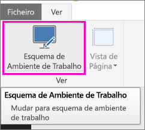
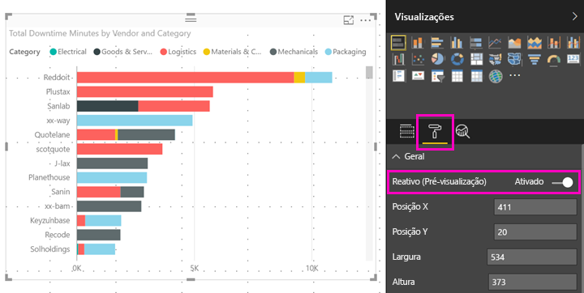

# Otimizar um elemento visual do Power BI para qualquer tamanho
Por predefinição, quando cria um novo relatório, os elementos visuais são *reativos*: são dinamicamente alterados para apresentarem a quantidade máxima de dados e informações, independentemente do tamanho do ecrã. Nos relatórios mais antigos, pode definir os elementos visuais para também serem redimensionados dinamicamente.

À medida que o elemento visual muda de tamanho, o Power BI dá prioridade à vista de dados, por exemplo, ao remover o preenchimento e ao mover a legenda para a parte superior do elemento visual automaticamente, para que o elemento visual permaneça informativo mesmo enquanto fica mais pequeno. A capacidade de resposta é especialmente útil em elementos visuais na aplicação móvel do Power BI em telemóveis.

Qualquer elemento visual com os eixos X e Y e segmentações pode ser redimensionado de forma reativa.

## Ativar a capacidade de resposta no Power BI Desktop
1. Num relatório mais antigo do Power BI Desktop, no separador **Ver**, verifique se está no **Esquema de Ambiente de Trabalho**.
   
    
2. Selecione um elemento visual e, no painel **Visualizações**, selecione a secção **Formato**.
3. Expanda **Geral** > deslize **Reativo** para **Ligado**.
   
    
   
     Agora, quando [criar um relatório otimizado para telemóvel](../desktop-create-phone-report.md) e adicionar este elemento visual, o mesmo será redimensionado corretamente.

## Ativar a capacidade de resposta no serviço Power BI
Pode ativar a capacidade de resposta para um elemento visual num relatório mais antigo do serviço Power BI. Terá de conseguir editar o relatório.

1. Num relatório do serviço Power BI ([https://powerbi.com](https://powerbi.com)), selecione **Editar Relatório**.
2. Selecione um elemento visual e, no painel **Visualizações**, selecione a secção **Formato**.
3. Expanda **Geral** > deslize **Reativo** para **Ligado**.
   
    
   
     Agora, quando [criar uma vista deste relatório no telemóvel](../desktop-create-phone-report.md) e adicionar este elemento visual, este será redimensionado corretamente.

## Próximos passos
* [Criar relatórios otimizados para aplicações de telemóvel do Power BI](../desktop-create-phone-report.md)
* [Ver relatórios do Power BI otimizados para o seu telemóvel](../consumer/mobile/mobile-apps-view-phone-report.md)
* Mais perguntas? [Experimente perguntar à Comunidade do Power BI](http://community.powerbi.com/)

