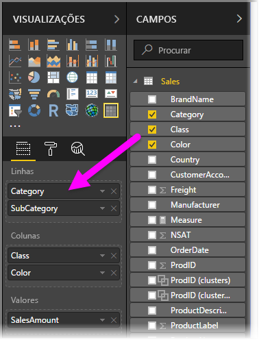
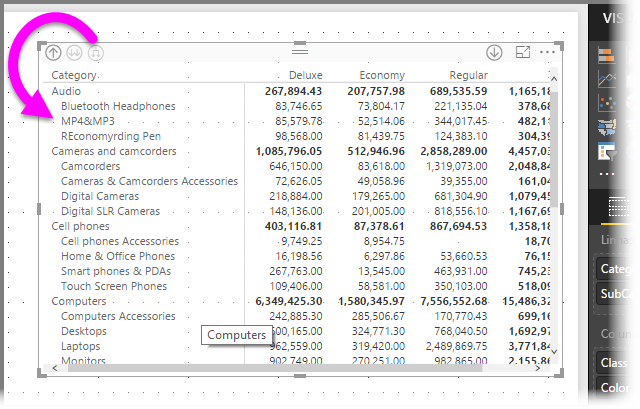
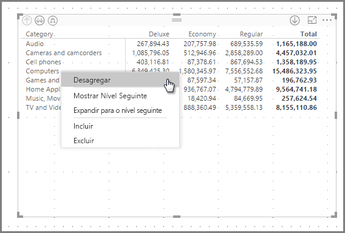
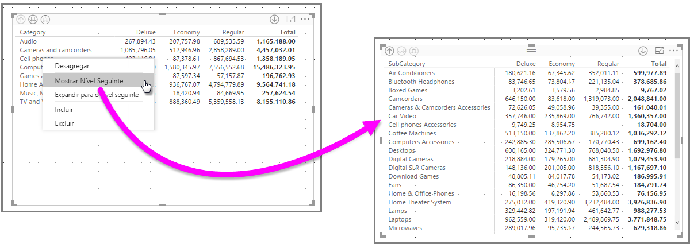
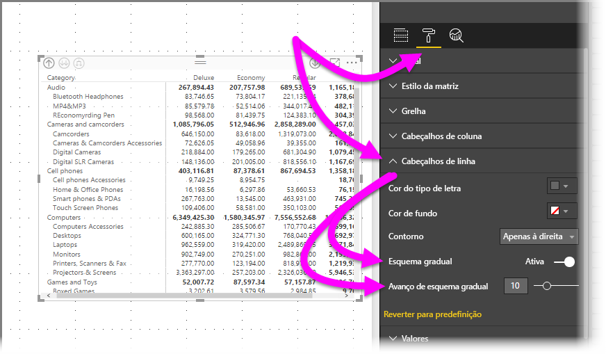
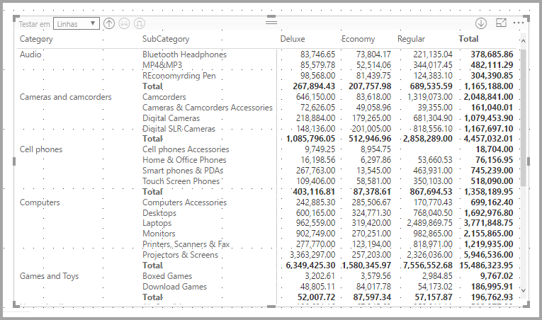
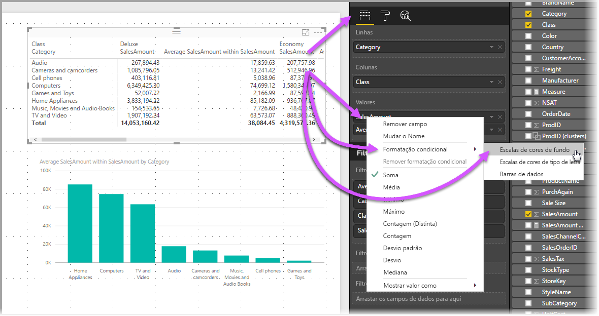
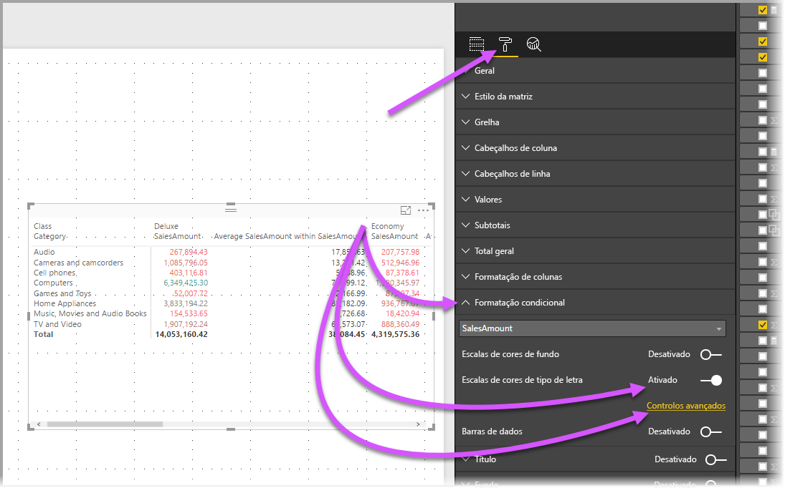
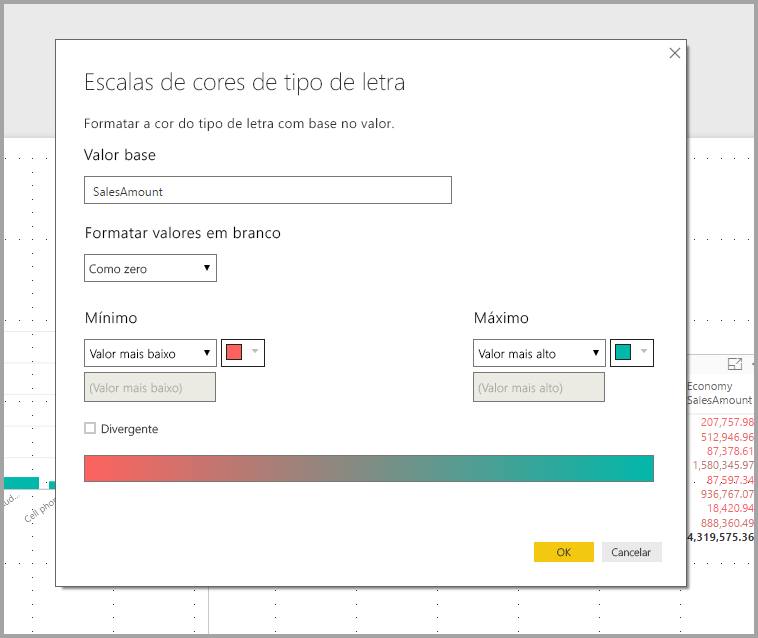

# Utilizar o elemento visual Matriz no Power BI
Com a funcionalidade do elemento visual **Matriz**, pode criar elementos visuais de matriz (por vezes, também designados *tabelas*) em relatórios do **Power BI Desktop** e do **serviço Power BI** e realçar de forma cruzada os elementos com outros elementos visuais. Além disso, pode selecionar linhas, colunas, células individuais e realces cruzados. Pode copiar e colar células individuais e múltiplas seleções de célula noutras aplicações. Por último, para garantir uma melhor utilização do espaço de esquema, o elemento visual de matriz suporta um esquema gradual.

Existem muitas funcionalidades associadas à matriz e vamos analisá-las nas secções seguintes deste artigo.

## Temas de relatório
Os elementos visuais de matriz e de tabela refletem o estilo (incluindo as cores) do **Tema de Relatório** aplicado. Podem não ser as cores esperadas para o elemento visual de matriz, que pode alterar na configuração do **Tema de Relatório**. Para obter mais informações sobre temas, veja [**Utilizar Temas de Relatório no Power BI Desktop**](../desktop-report-themes.md).

## Compreender como o Power BI calcula os totais

Antes de avançar para a utilização do elemento visual **Matriz**, é importante compreender como o Power BI calcula os valores total e subtotal em tabelas e matrizes. Para as linhas total e subtotal, a medida é avaliada através de todas as linhas de dados subjacentes – *não* é apenas uma adição simples dos valores nas linhas visíveis ou apresentadas. Tal significa que pode ter valores diferentes do esperado na linha total. 

Observe os elementos visuais **Matriz** seguintes. 

Neste exemplo, cada linha no elemento visual **Matriz** mais à direita mostra a *Quantidade* para cada combinação de representante de vendas/data. No entanto, uma vez que um representante de vendas é apresentado em várias datas, os números podem aparecer mais do que uma vez. Deste modo, o total exato dos dados subjacentes e uma simples adição de valores visíveis não são equivalentes. Trata-se de um padrão comum quando o valor que está a somar está de “um” lado de uma relação de um para muitos.

Quando observar totais e subtotais, lembre-se de que esses valores são baseados nos dados subjacentes e não apenas nos valores visíveis. 

<!-- use Nov blog post video

## Expanding and collapsing row headers
There are two ways you can expand row headers. The first is through the right-click menu. You’ll see options to expand the specific row header you clicked on, the entire level or everything down to the very last level of the hierarchy. You have similar options for collapsing row headers as well.

You can also add +/- buttons to the row headers through the formatting pane under the row headers card. By default, the icons will match the formatting of the row header, but you can customize the icons’ color and size separately if you want. 
Once the icons are turned on, they work similarly to the icons from PivotTables in Excel.

The expansion state of the matrix will save with your report. It can be pinned to dashboards as well, but consumers will need to open up the report to change the state. Conditional formatting will only apply to the inner most visible level of the hierarchy. Note that this expand/collapse experience is not currently supported when connecting to AS servers older than 2016 or MD servers.

Watch the following video to learn more about expand/collapse in the matrix:

-->
## Utilizar a desagregação no elemento visual Matriz
Com o elemento visual **Matriz**, pode fazer todos os tipos de atividades de desagregação interessantes que não estavam disponíveis anteriormente. Isto inclui a capacidade de desagregar com linhas, colunas e até em células e secções individuais. Vamos ver como funciona cada uma.

### Desagregação em cabeçalhos de linha
No painel **Visualizações**, quando adicionar vários campos à secção **Linhas** de **Campos**, ativa a desagregação nas linhas do elemento visual de matriz. Isto é semelhante à criação de uma hierarquia que lhe permite desagregar (e, em seguida, efetuar cópias de segurança) através dessa hierarquia e analisar os dados em cada nível.

Na imagem seguinte, a secção **Linhas** contém *Categoria* e *Subcategoria*, o que cria um agrupamento (ou hierarquia) nas linhas que podemos explorar.

Quando o elemento visual tem um agrupamento criado na secção **Linhas**, o elemento visual apresenta os ícones *agregar* e *expandir* no canto superior esquerdo do elemento visual.

Semelhante ao comportamento de desagregação e expansão noutros elementos visuais, a seleção desses botões permite-nos desagregar (ou efetuar cópias de segurança) através da hierarquia. Neste caso, podemos desagregar de *Categoria* para *Subcategoria*, conforme mostrado na imagem seguinte, em que o ícone de desagregação de um nível (a forquilha) foi selecionado.

Além de utilizar estes ícones, pode clicar com o botão direito do rato em qualquer um dos cabeçalhos de linha e desagregar ao selecionar no menu apresentado.

Tenha em atenção que existem algumas opções no menu apresentado, mas que geram resultados diferentes:

Selecionar **Desagregar** expande a matriz para *esse* nível de linha e *exclui* todos os outros cabeçalhos de linha, exceto o cabeçalho de linha clicado com o botão direito do rato. Na imagem seguinte, *Computadores* foi clicado com o botão direito do rato e foi selecionado **Desagregar**. Tenha em atenção que outras linhas de nível superior já não aparecem na matriz. Esta forma de explorar é uma funcionalidade útil e torna-se especialmente útil quando chegamos à secção **realce cruzado**.

Pode clicar no ícone **Agregar** para voltar à vista de nível superior anterior. Se selecionar **Mostrar Nível Seguinte** no menu de contexto, obtém uma lista alfabética de todos os itens do nível seguinte (neste caso, o campo *Subcategoria*), sem a categorização da hierarquia de nível mais elevado.

Quando clica no ícone **Agregar** no canto superior esquerdo para que a matriz mostre todas as categorias de nível superior e, em seguida, clica novamente com o botão direito do rato e seleciona **Expandir para o nível seguinte**, verá o seguinte elemento visual.

Também pode utilizar os itens de menu **Incluir** e **Excluir** para manter (ou remover, respetivamente) a linha clicada com o botão direito do rato (e quaisquer subcategorias) na matriz.

### Desagregação em cabeçalhos de coluna
Semelhante à capacidade de desagregação em linhas, também pode desagregar em **Colunas**. Na imagem seguinte, pode ver que existem dois campos no campo **Colunas**, o que cria uma hierarquia semelhante à utilizada para as linhas anteriores neste artigo. No campo **Colunas**, temos *Classe* e *Cor*.

No elemento visual **Matriz**, quando clicamos com o botão direito do rato numa coluna, vemos a opção de desagregação. Na imagem seguinte, clicamos com o botão direito do rato em *Deluxe* e selecionamos **Desagregar**.

Quando seleciona **Desagregar**, é apresentado o nível seguinte da hierarquia de colunas para *Deluxe*, neste caso *Cor*.

Os restantes itens do menu de contexto funcionam em colunas da mesma forma que para as linhas (veja a secção anterior, **Desagregação em cabeçalhos de linha**). Pode **Mostrar Nível Seguinte**, **Expandir para o nível seguinte**, **Incluir** ou **Excluir** as colunas, tal como faria com as linhas.

> [!NOTE]
> Os ícones de desagregação e agregação na parte superior esquerda do elemento visual de matriz aplicam-se apenas a linhas. Para desagregação em colunas, tem de utilizar o menu de contexto.
> 
> 

## Esquema gradual com elementos visuais de matriz
O elemento visual **Matriz** avança automaticamente as subcategorias numa hierarquia por baixo de cada categoria principal, o que é designado por **Esquema gradual**.

Na versão *original* do elemento visual de matriz, as subcategorias foram mostradas numa coluna completamente diferente, o que ocupa muito mais espaço no elemento visual. A imagem seguinte mostra a tabela no elemento visual **Matriz** original. Repare nas subcategorias numa coluna separada.

Na imagem seguinte, verá um elemento visual **Matriz** com o **Esquema gradual** em ação. Tenha em atenção que a categoria *Computadores* tem as respetivas subcategorias (Acessórios de Computadores, Computadores de Secretária, Computadores Portáteis, Monitores, etc.) ligeiramente avançadas, o que fornece um elemento visual mais limpo e muito mais condensado.

Pode ajustar facilmente as definições do esquema gradual. Com o elemento visual **Matriz** selecionado, na secção **Formatar** (o ícone de rolo) do painel **Visualizações**, expanda a secção **Cabeçalhos de linha**. Tem duas opções: o seletor **Esquema gradual** (que ativa ou desativa) e o botão **Avanço de esquema gradual** (especifica a quantidade de avanço em pixéis).

Se desativar **Esquema gradual**, as subcategorias são apresentadas noutra coluna em vez de avanços por baixo da categoria principal.

## Subtotais com elementos visuais de matriz
Pode ativar ou desativar os subtotais nos elementos visuais de matriz para linhas e colunas. Na imagem seguinte, pode ver que os subtotais da linha estão **ativados**.

Na secção **Formatar** do painel **Visualizações**, expanda o cartão **Subtotais** e coloque o controlo de deslize **Subtotais da linha** como **Desativado**. Quando o fizer, os subtotais não são apresentados.

É aplicado o mesmo processo aos subtotais da coluna.

## Realce cruzado com elementos visuais de matriz
Com o elemento visual **Matriz**, pode selecionar quaisquer elementos na matriz como base para o realce cruzado. Selecione uma coluna numa **Matriz** e essa coluna fica realçada, como quaisquer outros elementos visuais na página de relatório. Este tipo de realce cruzado foi uma funcionalidade comum de outros elementos visuais e de seleções de ponto de dados, pelo que, agora o elemento visual **Matriz** oferece a mesma função.

Além disso, a combinação Ctrl+Clique também funciona no realce cruzado. Por exemplo, na imagem seguinte, foi selecionada uma coleção de subcategorias a partir do elemento visual **Matriz**. Repare como os itens que não foram selecionados a partir do elemento visual estão desativados e como os outros elementos visuais na página refletem as seleções efetuadas no elemento visual **Matriz**.

## Copiar valores do Power BI para utilizar noutras aplicações

A matriz ou a tabela pode ter conteúdos que quer utilizar noutras aplicações, como o Dynamics CRM, o Excel e até mesmo noutros relatórios do Power BI. Ao clicar com o botão direito do rato no Power BI, pode copiar uma única célula ou uma seleção de células para a área de transferência e colar noutra aplicação.

* Para copiar o valor de uma única célula, selecione a célula, clique com o botão direito do rato e escolha **Copiar valor**. Com o valor da célula não formatado na área de transferência, pode agora colá-lo noutra aplicação.

    

* Para copiar mais do que uma célula, selecione um intervalo de células ou utilize CTRL para selecionar uma ou mais células. A cópia incluirá os cabeçalhos de coluna e de linha.

    

## Sombreado e cores de tipo de letra com elementos visuais de matriz
Com o elemento visual **Matriz**, pode aplicar **Formatação condicional** (cores e sombreado) ao fundo das células na matriz, bem como ao texto e aos valores.

Para aplicar formatação condicional, pode efetuar qualquer um dos procedimentos seguintes quando está selecionado um elemento visual de matriz:

* No painel **Campos**, clique com o botão direito do rato e selecione **Formatação condicional** no menu.
  
  
* Em alternativa, no painel **Formatar**, expanda o cartão **Formatação condicional** e, para **Escalas de cores de fundo** ou **Escalas de cores de tipo de letra**, coloque o controlo de deslize como **Ativado**. Ativar qualquer uma das opções apresenta uma ligação para *Controlos avançados*, que lhe permitem personalizar as cores e os valores da formatação de cores.
  
  

Qualquer uma das abordagens alcança o mesmo resultado. Selecionar *Controlos avançados* apresenta a caixa de diálogo seguinte, o que lhe permite efetuar ajustes:

## Próximos passos

[Gráficos de dispersão e de bolhas no Power BI](power-bi-visualization-scatter.md)

[Tipos de visualização no Power BI](power-bi-visualization-types-for-reports-and-q-and-a.md)