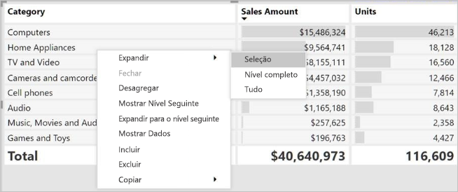

# Criar visualizações de matriz no Power BI

[!INCLUDE [power-bi-visuals-desktop-banner](../includes/power-bi-visuals-desktop-banner.md)]

O elemento visual de matriz é semelhante a uma tabela.  Uma tabela suporta duas dimensões e os dados são simples, o que significa que os valores duplicados são apresentados e não agregados. Uma matriz facilita a apresentação dos dados de forma significativa em várias dimensões – suporta um esquema gradual. A matriz agrega automaticamente os dados e permite a desagregação. 

Pode criar elementos visuais de matriz em relatórios do **Power BI Desktop** e realçar de forma cruzada os elementos que se encontram na matriz com outros elementos visuais nessa página de relatório. Por exemplo, pode selecionar linhas, colunas e até células individuais e realces cruzados. Além disso, pode copiar e colar células individuais e múltiplas seleções de célula noutras aplicações. 

Existem muitas funcionalidades associadas à matriz e vamos analisá-las nas secções seguintes deste artigo.

## Compreender como o Power BI calcula os totais

Antes de avançar para a utilização do elemento visual de matriz, é importante compreender como o Power BI calcula os valores do total e do subtotal em tabelas e matrizes. Para as linhas total e subtotal, o Power BI avalia a medida através de todas as linhas de dados subjacentes – não é apenas uma adição simples dos valores nas linhas visíveis ou apresentadas. Tal significa que pode ter valores diferentes do esperado na linha total.

Observe os seguintes elementos visuais de matriz. 

Neste exemplo, cada linha no elemento visual de matriz mais à direita mostra a *Quantidade* para cada combinação de representante de vendas/data. No entanto, uma vez que um representante de vendas é apresentado em várias datas, os números podem aparecer mais do que uma vez. Deste modo, o total exato dos dados subjacentes e uma simples adição de valores visíveis não são equivalentes. Trata-se de um padrão comum quando o valor que está a somar está de “um” lado de uma relação de um para muitos.

Quando observar os totais e os subtotais, lembre-se de que esses valores são baseados nos dados subjacentes. Não são baseados exclusivamente nos valores visíveis.

## Expandir e fechar os cabeçalhos de linha
Existem duas formas de expandir os cabeçalhos de linha. A primeira é através do menu de clique com o botão direito do rato. Verá opções para expandir o cabeçalho de linha específico selecionado, todo o nível ou tudo até ao último nível da hierarquia. Também tem opções semelhantes para fechar os cabeçalhos de linha.

Pode também adicionar botões +/- aos cabeçalhos de linha através do painel de formatação no cartão **Cabeçalhos de linha**. Por predefinição, os ícones corresponderão à formatação do cabeçalho de linha, mas pode personalizar as cores e os tamanhos dos ícones em separado, se assim o pretender.

Uma vez ativados, os ícones funcionam de forma semelhante aos ícones da Tabela Dinâmica no Excel.

O estado de expansão da matriz será guardado com o relatório. Pode afixar uma matriz a um dashboard expandido ou fechado. Quando o mosaico desse dashboard é selecionado e o relatório é apresentado, pode ainda alterar o estado de expansão no relatório. 

## Utilizar a desagregação no elemento visual de matriz
Com o elemento visual de matriz, pode fazer todos os tipos de atividades de desagregação interessantes que não estavam disponíveis anteriormente. Isto inclui a capacidade de desagregar com linhas, colunas e até em células e secções individuais. Vamos ver como funciona cada uma.

### Desagregação em cabeçalhos de linha

No painel Visualizações, quando adicionar vários campos à secção **Linhas** de **Campos**, ativa a desagregação nas linhas do elemento visual de matriz. Isto é semelhante à criação de uma hierarquia que lhe permite desagregar (e, em seguida, efetuar cópias de segurança) através dessa hierarquia e analisar os dados em cada nível.

Na imagem seguinte, a secção **Linhas** contém *Fase de vendas* e *Tamanho da oportunidade*, o que cria um agrupamento (ou hierarquia) nas linhas que podemos explorar.

Quando o elemento visual tem um agrupamento criado na secção **Linhas**, o elemento visual apresenta os ícones *agregar* e *expandir* no canto superior esquerdo do elemento visual.

Semelhante ao comportamento de desagregação e expansão noutros elementos visuais, a seleção desses botões permite-nos desagregar (ou efetuar cópias de segurança) através da hierarquia. Neste caso, podemos desagregar de *Fase de vendas* para *Tamanho da oportunidade*, conforme mostrado na imagem seguinte, em que o ícone de desagregação de um nível (a forquilha) foi selecionado.

Além de utilizar estes ícones, pode selecionar qualquer um dos cabeçalhos de linha e desagregar ao selecionar no menu apresentado.

Tenha em atenção que existem algumas opções no menu apresentado, mas que geram resultados diferentes:

Selecionar **Desagregar** expande a matriz para *esse* nível de linha e *exclui* todos os outros cabeçalhos de linha, exceto o cabeçalho de linha selecionado. Na imagem seguinte, foi selecionado **Proposta** > **Desagregar**. Tenha em atenção que outras linhas de nível superior já não aparecem na matriz. Esta forma de explorar é uma funcionalidade útil e torna-se especialmente interessante quando chegamos à secção de realce cruzado.

Selecione o ícone **Agregar** para voltar à vista de nível superior anterior. Se, em seguida, selecionar **Proposta** > **Mostrar Nível Seguinte**, obtém uma lista ascendente de todos os itens do nível seguinte (neste caso, o campo *Tamanho da oportunidade*), sem a categorização da hierarquia de nível superior.

Selecione o ícone **Agregar** no canto superior esquerdo para que a matriz mostre todas as categorias de nível superior e, em seguida, selecione **Proposta** > **Expandir para o próximo nível** para ver todos os valores para ambos os níveis da hierarquia – *Fase de vendas* e *Tamanho da oportunidade*.

Também pode utilizar o item de menu **Expandir** para controlar ainda mais a visualização.  Por exemplo, selecione **Proposta** > **Expandir** > **Seleção**. O Power BI apresenta uma linha total para cada *Fase de vendas* e todas as opções *Tamanho da oportunidade* para *Proposta*.

### Desagregação em cabeçalhos de coluna
Semelhante à capacidade de desagregação em linhas, também pode desagregar em colunas. Na imagem seguinte, existem dois campos no painel do campo **Colunas**, o que cria uma hierarquia semelhante à utilizada para as linhas anteriores neste artigo. No campo **Colunas**, temos *Região* e *Segmento*. Assim que o segundo campo foi adicionado a **Colunas**, um novo menu pendente apresentado no elemento visual, atualmente, mostra **Linhas**.

Para desagregar nas colunas, selecione **Colunas** no menu *Desagregar em* que pode ser encontrado no canto superior esquerdo da matriz. Selecione a região *Leste* e escolha **Desagregar**.

Quando seleciona **Desagregar**, é apresentado o nível seguinte da hierarquia de colunas para *Região > Leste*, neste caso *Contagem de oportunidades*. A outra região é ocultada.

Os restantes itens do menu funcionam em colunas da mesma forma que para as linhas (veja a secção anterior, **Desagregação em cabeçalhos de linha**). Pode **Mostrar Nível Seguinte** e **Expandir para o nível seguinte** com colunas, tal como faria com linhas.

> [!NOTE]
> Os ícones de desagregação e agregação na parte superior esquerda do elemento visual de matriz aplicam-se apenas a linhas. Para desagregação em colunas, tem de utilizar o menu de contexto.

## Esquema gradual com elementos visuais de matriz

O elemento visual de matriz avança automaticamente as subcategorias numa hierarquia por baixo de cada categoria principal, que se designa por esquema gradual.

Na versão original do elemento visual de matriz, as subcategorias foram mostradas numa coluna completamente diferente, o que ocupa muito mais espaço no elemento visual. A imagem seguinte mostra a tabela no elemento visual de matriz original. Repare nas subcategorias numa coluna separada.

Na imagem seguinte, verá um elemento visual de matriz com o esquema gradual em ação. Tenha em atenção que a categoria *Computadores* tem as respetivas subcategorias (Acessórios de Computadores, Computadores de Secretária, Computadores Portáteis, Monitores, etc.) ligeiramente avançadas, o que fornece um elemento visual mais limpo e muito mais condensado.

Pode ajustar facilmente as definições do esquema gradual. Com o elemento visual de matriz selecionado, na secção **Formatar** (o ícone de rolo de pintura) do painel **Visualizações**, expanda a secção de cabeçalhos de linha. Tem duas opções: o seletor de esquema gradual (que ativa ou desativa) e o avanço de esquema gradual (especifica a quantidade de avanço em pixéis).

Se desativar o esquema gradual, o Power BI apresentará as subcategorias noutra coluna em vez de apresentar avanços por baixo da categoria principal.

## Totais gerais e subtotais com elementos visuais de matriz

Pode ativar ou desativar os subtotais nos elementos visuais de matriz para linhas e colunas. Na seguinte imagem, pode ver que os subtotais da linha estão definidos como **Ativado** e configurados de modo a serem apresentados na parte inferior.

Se ativar os **Subtotais** e adicionar uma etiqueta, o Power BI também adiciona uma linha e a mesma etiqueta ao valor total geral. Para formatar o seu total geral, selecione a opção de formato **Total geral**. 

Se quiser desativar os totais gerais e os subtotais, na secção de formatos do painel de visualizações, expanda o cartão **Subtotais**. **Desative** o controlo de deslize de subtotais da linha. Quando o fizer, os subtotais não são apresentados.

É aplicado o mesmo processo aos subtotais da coluna.

## Adicionar ícones condicionais
Adicione ajudas visuais à sua tabela ou matriz com os *ícones condicionais*. 

Na secção de formatos do painel Visualizações, expanda o cartão **Formatação condicional**. Defina o controlo de deslize **Ícones** para **Ativado** e selecione **Controlos avançados**.

Ajuste as condições, os ícones e as cores da sua matriz e selecione **OK**. Neste exemplo, utilizámos uma bandeira vermelha para os valores baixos, um círculo roxo para os valores elevados e um triângulo amarelo para os intermédios. 

## Realce cruzado com elementos visuais de matriz

Com o elemento visual de matriz, pode selecionar todos os elementos na matriz como base para o realce cruzado. Selecione uma coluna numa matriz, o Power BI realça a coluna, assim como todos os outros elementos visuais na página de relatório. Este tipo de realce cruzado foi uma funcionalidade comum de outros elementos visuais e de seleções de ponto de dados, pelo que agora o elemento visual de matriz oferece a mesma função.

Além disso, a combinação Ctrl+Clique também funciona no realce cruzado. Por exemplo, na imagem seguinte foi selecionada uma coleção de subcategorias no elemento visual de matriz. Repare como os itens que não foram selecionados no elemento visual estão desativados e como os outros elementos visuais na página refletem as seleções efetuadas no elemento visual de matriz.

## Copiar valores do Power BI para utilizar noutras aplicações

A matriz ou a tabela pode ter conteúdo gostaria de utilizar noutras aplicações: Dynamics CRM, Excel e outros relatórios do Power BI. Ao clicar com o botão direito do rato no Power BI, pode copiar uma única célula ou uma seleção de células para a área de transferência. Em seguida, cole-as noutra aplicação.

* Para copiar o valor de uma única célula, selecione a célula, clique com o botão direito do rato e escolha **Copiar valor**. Com o valor da célula não formatado na área de transferência, pode agora colá-lo noutra aplicação.

    

* Para copiar mais do que uma célula, selecione um intervalo de células ou utilize CTRL para selecionar uma ou mais células. 

    

* A cópia incluirá os cabeçalhos de coluna e de linha.

    

* Para fazer uma cópia do próprio elemento visual apenas com as células selecionadas, selecione uma ou mais células com CTRL, clique no botão direito do rato e escolha **Copiar elemento visual**

    

* A cópia será outra visualização da matriz, mas conterá apenas os dados copiados.

    

## Definir um valor de matriz como um URL personalizado

Se tiver uma coluna ou uma medida que contenha URLs de sites, poderá utilizar a formatação condicional para aplicar esses URLs a campos como ligações ativas. Poderá encontrar esta opção no cartão **Formatação condicional** do painel de formatação.

Ative o **URL da Web** e selecione um campo para utilizar como URL da coluna. Uma vez aplicados, os valores nesse campo (coluna) tornam-se ligações ativas. Passe o rato para ver a ligação e selecione para ir para essa página. 

Para obter mais informações, veja [Formatação condicional em tabelas](../desktop-conditional-table-formatting.md)

## Sombreado e cores de tipo de letra com elementos visuais de matriz
Com o elemento visual de matriz, pode aplicar a formatação condicional (cores, sombreado e barras de dados) ao fundo das células na matriz, bem como ao texto e aos valores.

Para aplicar a formatação condicional, selecione a matriz visual e abra o painel **Formato**. Expanda o cartão **Formatação condicional** e, para, **Cor de fundo**, **Cor do tipo de letra** ou **Barras de dados**, mude o controlo de deslize para **Ativado**. Ativar uma destas opções apresenta uma ligação para *Controlos avançados*, que lhe permitem personalizar as cores e os valores da formatação de cores.
  
  

Selecione *Controlos avançados* para apresentar uma caixa de diálogo, que lhe permite realizar ajustes. Este exemplo mostra a caixa de diálogo para **Barras de dados**.

## Considerações e resolução de problemas

* Se os dados de texto nas células ou cabeçalhos da matriz tiverem caracteres de linha novos, esses caracteres serão ignorados, a menos que ative a opção “Moldagem do Texto” no cartão do painel de formatação associado do elemento. 

## Próximos passos

[Elemento visual do Power Apps para Power BI](power-bi-visualization-powerapp.md)

[Tipos de visualização no Power BI](power-bi-visualization-types-for-reports-and-q-and-a.md)
