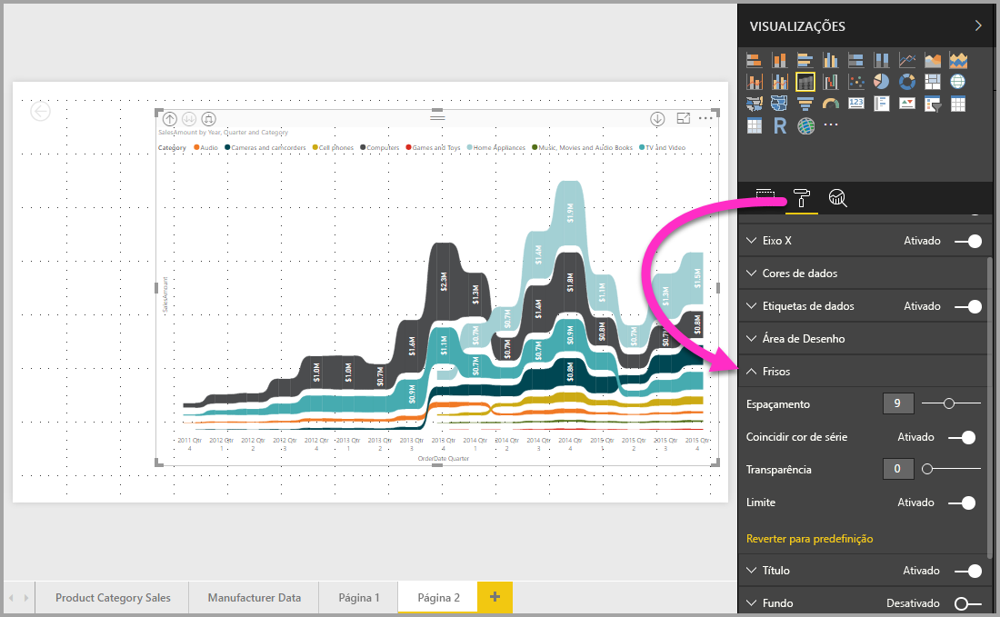

# Utilizar gráficos de friso no Power BI
Pode utilizar gráficos de friso para visualizar dados e, rapidamente, descobrir que categoria de dados tem a classificação mais elevada (maior valor). Os gráficos de friso são uma forma eficaz de mostrar as alterações de classificação, com a classificação (valor) mais elevada sempre mostrada na parte superior de cada período temporal. 

## Criar um gráfico de friso
Para criar um gráfico de friso, selecione **Gráfico de friso** no painel **Visualizações**.

Os gráficos de friso ligam uma categoria de dados ao longo do período de tempo visualizado através de frisos, permitindo-lhe ver qual a classificação de uma determinada categoria ao longo do eixo X do gráfico (que é normalmente a linha cronológica).

## Formatar um gráfico de friso
Ao criar um gráfico de friso, tem opções de formatação disponíveis na secção **Formatar** do painel **Visualizações**. As opções de formatação para gráficos de friso são semelhantes às opções para um gráfico de colunas empilhadas, com opções de formatação adicionais específicas dos frisos.

Estas opções de formatação para gráficos de friso permitem-lhe fazer ajustes.

* **Espaçamento** permite-lhe ajustar a quantidade de espaço entre frisos. O número corresponde à percentagem da altura máxima da coluna.
* **Coincidir cor de série** permite-lhe fazer corresponder a cor dos frisos à cor da série. Quando está definido como **desativado**, os frisos estão cinzentos.
* **Transparência** especifica o grau de transparência dos frisos, com uma predefinição de 30.
* **Limite** permite-lhe colocar um limite escuro nas partes superior e inferior dos frisos. Por predefinição, os frisos estão desativados.

## Próximos passos

[Gráficos de dispersão e de bolhas no Power BI](power-bi-visualization-scatter.md)

[Tipos de visualização no Power BI](power-bi-visualization-types-for-reports-and-q-and-a.md)