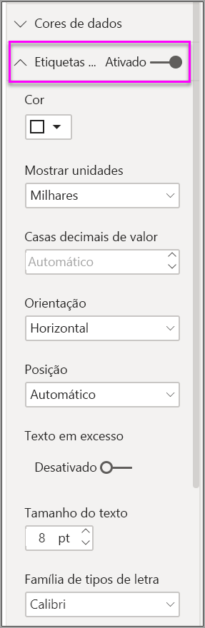

# Utilizar gráficos de friso no Power BI

[!INCLUDE [power-bi-visuals-desktop-banner](../includes/power-bi-visuals-desktop-banner.md)]

Pode utilizar gráficos de friso para visualizar dados e, rapidamente, descobrir que categoria de dados tem a classificação mais elevada (maior valor). Os gráficos de friso são uma forma eficaz de mostrar as alterações de classificação, com a classificação (valor) mais elevada sempre mostrada na parte superior de cada período temporal. 

## Pré-requisitos

Este tutorial utiliza o [ficheiro PBIX do Exemplo de Análise de Revenda](http://download.microsoft.com/download/9/6/D/96DDC2FF-2568-491D-AAFA-AFDD6F763AE3/Retail%20Analysis%20Sample%20PBIX.pbix).

1. Na secção superior esquerda da barra de menus, selecione **Ficheiro** > **Abrir**.
   
2. Procure a sua cópia do **ficheiro PBIX do Exemplo de Análise de Revenda**

1. Abra o **Ficheiro PBIX do Exemplo de Análise de Revenda** na vista de relatório .

1. Selecionar  para adicionar uma nova página.

## Criar um gráfico de friso

1. Para criar um gráfico de friso, selecione **Gráfico de friso** no painel **Visualizações**.

    

    Os gráficos de friso ligam uma categoria de dados ao longo do período de tempo visualizado através de frisos, permitindo-lhe ver qual a classificação de uma determinada categoria ao longo do eixo X do gráfico (que é normalmente a linha cronológica).

2. Selecione os campos para **Eixo**, **Legenda** e **Valor**.  Neste exemplo, selecionámos o seguinte: **Store** (Loja)  > **OpenDate** (Data de Abertura), **Item** > **Category** (Categoria) e **Sales** (Vendas) > **This year sales** (Vendas deste ano)  > **Value** (Valor).  

    

    Como o conjunto de dados contém apenas os dados relativos a um ano, também removemos os campos **Year** (Ano) e **Quarter** (Trimestre) do **Eixo**.

3. O gráfico do friso mostra a classificação de todos os meses. Observe como a classificação muda ao longo do tempo. Por exemplo, a categoria Home (Casa) passa da segunda para a quinta posição de fevereiro a março.

    

## Formatar um gráfico de friso
Ao criar um gráfico de friso, tem opções de formatação disponíveis na secção **Formatar** do painel **Visualizações**. As opções de formatação para gráficos de friso são semelhantes às opções para um gráfico de colunas empilhadas, com opções de formatação adicionais específicas dos frisos.

Estas opções de formatação para gráficos de friso permitem-lhe fazer ajustes.

* **Espaçamento** permite-lhe ajustar a quantidade de espaço entre frisos. O número corresponde à percentagem da altura máxima da coluna.
* **Coincidir cor de série** permite-lhe fazer corresponder a cor dos frisos à cor da série. Quando está definido como **desativado**, os frisos estão cinzentos.
* **Transparência** especifica o grau de transparência dos frisos, com uma predefinição de 30.
* **Limite** permite-lhe colocar um limite escuro nas partes superior e inferior dos frisos. Por predefinição, os frisos estão desativados.

Visto que o gráfico do friso não possui etiquetas do eixo Y, poderá adicionar etiquetas de dados. No painel Formatação, selecione **Etiquetas de dados**. 

Defina as opções de formatação das suas etiquetas de dados. Neste exemplo, definimos a cor do texto para branco e as unidades de apresentação para milhares.

## Próximos passos

[Gráficos de dispersão e de bolhas no Power BI](power-bi-visualization-scatter.md)

[Tipos de visualização no Power BI](power-bi-visualization-types-for-reports-and-q-and-a.md)
