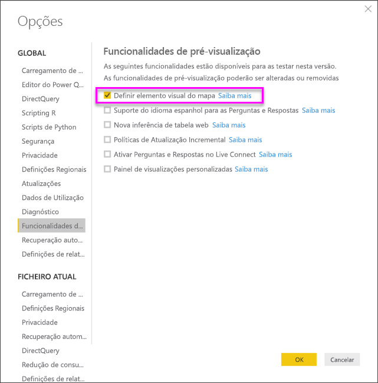
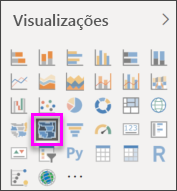
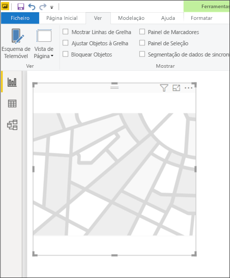
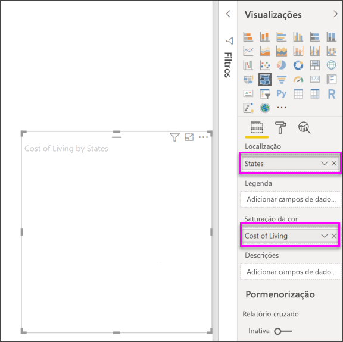
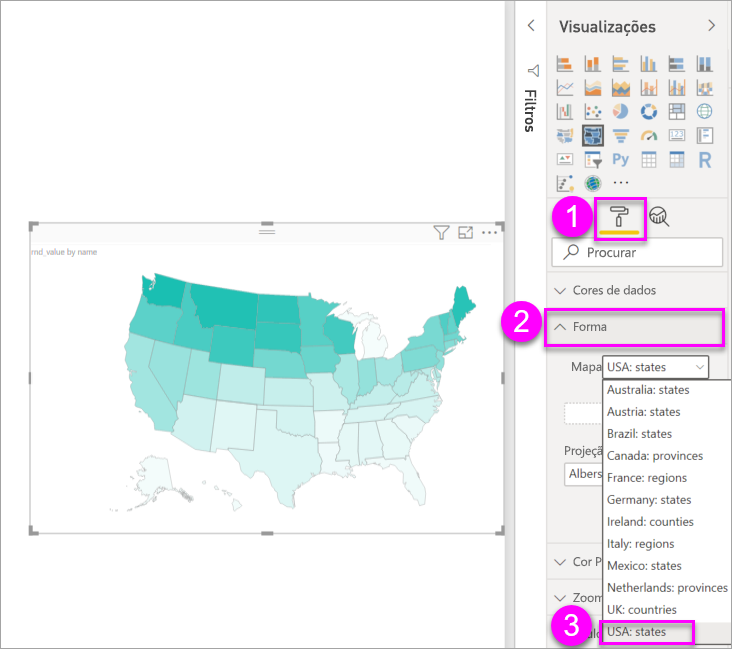
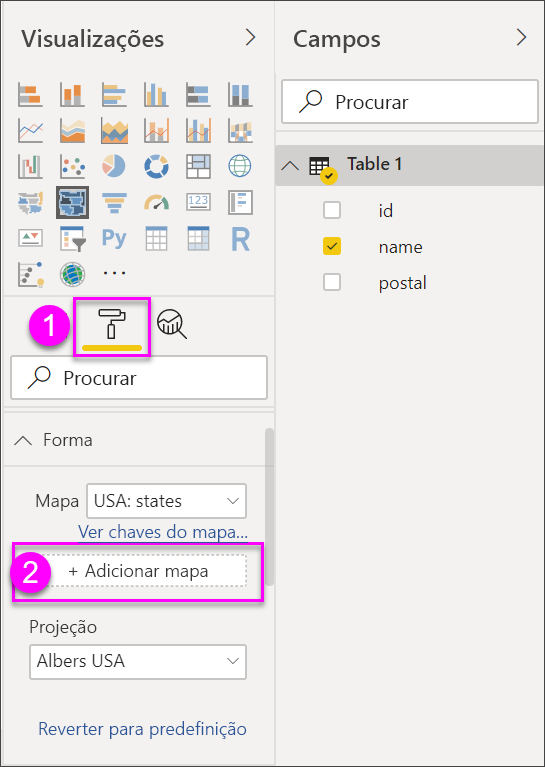
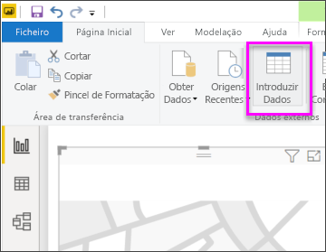
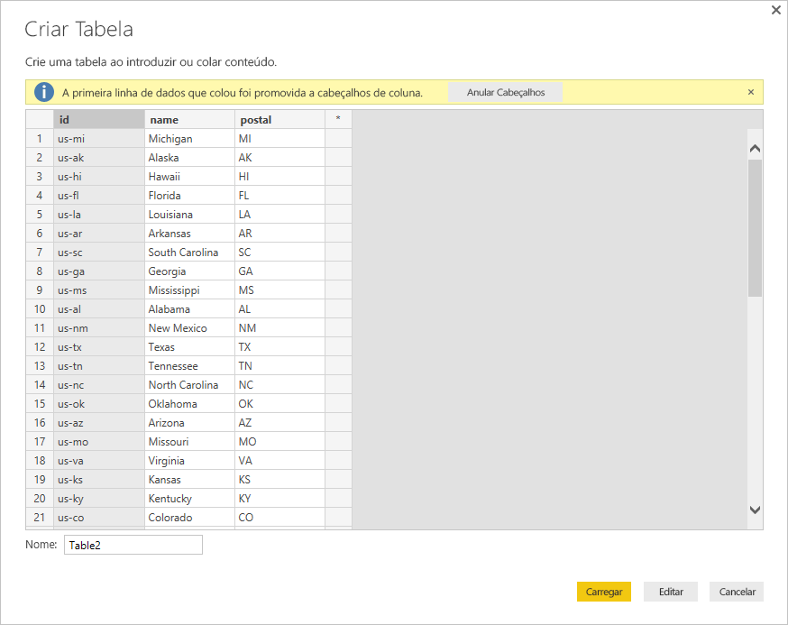

# Mapas de Forma no Power BI Desktop (Pré-visualização)
Criar um elemento visual **Mapa de Forma** para comparar regiões num mapa com cores. Ao contrário do elemento visual **Mapa**, o **Mapa de Forma** não pode mostrar localizações geográficas precisas de pontos de dados num mapa. Em vez disso, o seu objetivo principal é mostrar comparações relativas de regiões num mapa ao colori-los de forma diferente.

Os elementos visuais do **Mapa de Forma** são baseados em mapas ESRI/TopoJSON que têm a capacidade convincente de utilizar mapas personalizados que pode criar. Eis alguns exemplos de mapas personalizados: geográficos, disposições de lugares, plantas de pisos e outros. A capacidade de utilizar mapas personalizados não está disponível neste lançamento de Pré-visualização do **Mapa de Forma**.

## Criar Mapas de Forma
Pode testar o controlo **Mapa de Forma** com os mapas que são enviados com esta versão de Pré-visualização, ou pode utilizar o seu próprio mapa personalizado, desde que este cumpra os requisitos descritos na secção seguinte, designada **Use Custom Maps (Utilizar Mapas Personalizados)** .

O visual **Mapa de Forma** está em Pré-visualização e tem ser ativado no Power BI Desktop. Para ativar o **Mapa de Forma**, selecione **Ficheiro > Opções e Definições > Opções > Funcionalidades de Pré-visualização** e, em seguida, selecione a caixa de verificação **Elementos Visuais do Mapa de Forma**. Terá de reiniciar o Power BI Desktop depois de efetuar a seleção.

Assim que o **Mapa de Forma** é ativado, selecione o ícone **Mapa de Forma** a partir do painel **Visualizações**.

O Power BI Desktop cria uma tela de design de visual **Mapa de Forma** vazia.

Execute os seguintes passos para criar um **Mapa de Forma**:

1. No painel **Campos**, arraste um campo de dados com os nomes de região (ou abreviaturas) para o registo **Localização** e um campo de medida de dados para o registo **Saturação da cor** (ainda não verá um mapa).

   > [!NOTE]
   > Veja a secção intitulada **Getting Map Data (Obter Dados de Mapa)** , abaixo, para obter informações sobre como obter rapidamente os dados do mapa para testar o **Mapa de Forma**.
   > 
   > 

   
2. No painel de definições **Formato**, expanda **Forma** e selecione a partir dos **Mapas Padrão** pendentes para mostrar os seus dados. Neste momento, a composição é apresentada, conforme mostrado na imagem seguinte.

   

   > [!NOTE]
   > Na secção **Chaves de Região** no final deste artigo está uma coleção de tabelas que têm chaves de regiões de mapa que pode utilizar para testar o visual **Mapa de Forma**.
   > 
   > 
3. Em seguida, pode modificar o mapa com as opções de Formatação, tais como **Cor Predefinida**, **Zoom** e muito mais. Além disso, também pode adicionar uma coluna de dados de categoria ao registo **Legenda** e classificar regiões do mapa com base em categorias.

## Utilizar mapas personalizados
Pode utilizar mapas personalizados com o **Mapa de Forma**, desde que estejam no formato **TopoJSON**. Se o seu mapa estiver noutro formato, pode utilizar ferramentas online, como o [**Modelador de Mapas**](http://mapshaper.org/), para converter os seus *ficheiros de formas* ou os mapas *GeoJSON* para o formato **TopoJSON**.

Para utilizar o ficheiro de mapa **TopoJSON**, adicione um elemento visual do ShapeMap ao relatório e adicione alguns dados aos registos *Localização* e *Saturação da cor*. Em seguida, no painel **Visualizações** com a secção **Formato** selecionada (mostrado como (1) na imagem seguinte), expanda a secção **Forma** e selecione **+ Adicionar Mapa**.

## Exemplo de Mapa Personalizado
Os *Offices of the United States Attorneys (Gabinetes dos Procuradores dos Estados Unidos)* lançam um relatório fiscal anual sobre os seus dados de contencioso e o número de casos recebidos.  Todos os relatórios podem ser encontrados na ligação abaixo:

https://www.justice.gov/usao/resources/annual-statistical-reports

Uma vez que os estados americanos podem ser divididos em múltiplos distritos, temos de utilizar um mapa de forma personalizado.  Ao importar o mapa **TopoJSON** dos distritos judiciais dos Estados Unidos para o **Power BI Desktop**, podemos então ver os dados fiscais anuais dos procuradores por distrito.  A imagem abaixo apresenta um exemplo deste mapa.

Também pode fazer coisas interessantes com os mapas de cada estado e mostrar detalhes adicionais consoante os distritos que contiver. 

Se quiser experimentar este conjunto de dados e esta visualização, pode transferir o ficheiro original PBIX que foi utilizado para gerar este relatório através da seguinte ligação.

* [Demonstração de mapa de forma personalizado (ficheiro .PBIX)](http://download.microsoft.com/download/1/2/8/128943FB-9231-42BD-8A5D-5E2362C9D589/DistrictAttorneyFiscalReport.pbix)

## Obter dados de mapa
Para obter rapidamente os dados num modelo, para que possa testar o **Mapa de Forma**, pode copiar uma das tabelas no final deste artigo e, em seguida, selecionar **Introduzir Dados** do friso **Home Page**.

Se os dados tiverem várias colunas, terá de utilizar um editor, como o Excel, para colar os dados e, em seguida, copiar cada coluna de dados separadamente. Em seguida, pode colar os dados no Power BI Desktop. A linha superior é automaticamente identificada como um cabeçalho.

Pode introduzir uma nova coluna ao escrever simplesmente um novo nome de coluna (na coluna em branco à direita) e, depois, adicione valores em cada célula, tal como faz no Excel. Quando terminar, selecione **Carga** e a tabela é adicionada ao modelo de dados para o Power BI Desktop.

> [!NOTE]
> Ao trabalhar com países ou regiões, utilize a abreviatura com três letras para garantir que a geocodificação funciona corretamente em visualizações de mapa. *Não* utilize abreviaturas com duas letras, uma vez que alguns países ou regiões podem não ser corretamente reconhecidos.
> 
> Se tiver apenas abreviaturas com duas letras, veja [esta mensagem de blogue externo](https://blog.ailon.org/how-to-display-2-letter-country-data-on-a-power-bi-map-85fc738497d6#.yudauacxp) para saber como associar as abreviaturas de país/região com duas letras a abreviaturas de país/região com três letras.
> 
> 

## Comportamento e requisitos da pré-visualização
Existem algumas considerações e requisitos para esta versão de Pré-visualização do **Mapa de Forma**:

* O visual **Mapa de Forma** está em Pré-visualização e tem ser ativado no Power BI Desktop. Para ativar o **Mapa de Forma**, selecione **Ficheiro > Opções e Definições > Opções > Funcionalidades de Pré-visualização** e, em seguida, selecione a caixa de verificação **Elementos Visuais do Mapa de Forma**.
* Atualmente, também tem de ter o registo **Saturação da cor** definido, para que a classificação de **Legenda** funcione corretamente.
* A versão final do **Mapa de Forma** terá uma interface de utilizador que mostra as chaves do mapa atualmente selecionado (não existe uma data definida para a versão final e o **Mapa de Forma** ainda está na fase de Pré-visualização). Nesta versão de Pré-visualização, pode fazer referência às chaves de região do mapa nas tabelas presentes na seguinte secção **Chaves de Região** deste artigo.
* O visual **Mapa de Forma** resultará num máximo de 1000 pontos de dados.

## Chaves de região

Utilize as seguintes **Chaves de região** nesta versão de Pré-visualização para testar o **Mapa de forma**.

### Austrália: Estados

| ID | abbr | iso | nome | postal |
| --- | --- | --- | --- | --- |
| au-wa |WA |AU-WA |Austrália Ocidental |WA |
| au-vic |Vic |AU-VIC |Vitória |VIC |
| au-tas |Tas |AU-TAS |Tasmânia |TAS |
| au-sa |SA |AU-SA |Sul da Austrália |SA |
| au-qld |Qld |AU-QLD |Queensland |QLD |
| au-nt |NT |AU-NT |Território do Norte |NT |
| au-nsw |NSW |AU-NSW |Nova Gales do Sul |NSW |
| au-act |ACT |AU-ACT |Território da Capital Australiana |ACT |

### Áustria: Estados

| ID | iso | nome | name-en | postal |
| --- | --- | --- | --- | --- |
| at-wi |AT-9 |Viena |Viena |WI |
| at-vo |AT-8 |Vorarlberg |Vorarlberg |VO |
| at-tr |AT-7 |Tirol |Tirol |TR |
| at-st |AT-6 |Estíria |Estíria |ST |
| at-sz |AT-5 |Salzburgo |Salzburgo |SZ |
| at-oo |AT-4 |Alta Áustria |Alta Áustria |OO |
| at-no |AT-3 |Baixa Áustria |Baixa Áustria |NO |
| at-ka |AT-2 |Caríntia |Caríntia |KA |
| at-bu |AT-1 |Burgenland |Burgenland |BU |

### Brasil: Estados

| ID |
| --- |
| Tocantins |
| Pernambuco |
| Goiás |
| Sergipe |
| São Paulo |
| Santa Catarina |
| Roraima |
| Rondónia |
| Rio Grande do Sul |
| Rio Grande do Norte |
| Rio de Janeiro |
| Piauí |
| Paraná |
| Paraíba |
| Pará |
| Minas Gerais |
| Mato Grosso |
| Maranhão |
| Mato Grosso do Sul |
| Distrito Federal |
| Ceará |
| Espírito Santo |
| Baía |
| Amazonas |
| Amapá |
| Alagoas |
| Acre |
| Zona Litigada 1 |
| Zona Litigada 2 |
| Zona Litigada 3 |
| Zona Litigada 4 |

### Canadá: Províncias

| ID | iso | nome | postal |
| --- | --- | --- | --- |
| ca-nu |CA-NU |Nunavut |NU |
| ca-nt |CA-NT |Territórios do Noroeste |NT |
| ca-yt |CA-YT |Yukon |YT |
| ca-sk |CA-SK |Saskatchewan |SK |
| ca-qc |CA-QC |Quebec |QC |
| ca-pe |CA-PE |Ilha Príncipe Eduardo |PE |
| ca-on |CA-ON |Ontário |ON |
| ca-ns |CA-NS |Nova Escócia |NS |
| ca-nl |CA-NL |Terra Nova e Labrador |NL |
| ca-nb |CA-NB |Novo Brunswick |NB |
| ca-mb |CA-MB |Manitoba |MB |
| ca-bc |CA-BC |Colúmbia Britânica |BC |
| ca-ab |CA-AB |Alberta |AB |

### França: Regiões

| ID | nome | name-en |
| --- | --- | --- |
| Alsácia |Alsácia |Alsácia |
| Ródano-Alpes |Ródano-Alpes |Ródano-Alpes |
| Provença-Alpes-Costa Azul |Provença-Alpes-Costa Azul |Provença-Alpes-Costa Azul |
| Poitou-Charentes |Poitou-Charentes |Poitou-Charentes |
| Picardia |Picardia |Picardia |
| País do Loire |País do Loire |País do Loire |
| Nord-Pas-de-Calais |Nord-Pas-de-Calais |Nord-Pas-de-Calais |
| Sul-Pirenéus |Sul-Pirenéus |Sul-Pirenéus |
| Lorena |Lorena |Lorena |
| Limusino |Limusino |Limusino |
| Languedoque-Rossilhão |Languedoque-Rossilhão |Languedoque-Rossilhão |
| Ilha de França |Ilha de França |Ilha de França |
| Ilha de França |Ilha de França |Alta Normandia |
| Franco-Condado |Franco-Condado |Franco-Condado |
| Córsega |Córsega |Córsega |
| Champanha-Ardenas |Champanha-Ardenas |Champanha-Ardenas |
| Centro-Vale do Loire |Centro-Vale do Loire |Centro-Vale do Loire |
| Bretanha |Bretanha |Bretanha |
| Borgonha |Borgonha |Borgonha |
| Baixa Normandia |Baixa Normandia |Baixa Normandia |
| Auvérnia |Auvérnia |Auvérnia |
| Aquitânia |Aquitânia |Aquitânia |

### Alemanha: Estados

| ID | iso | nome | name-en | postal |
| --- | --- | --- | --- | --- |
| de-be |DE-BE |Berlim |Berlim |BE |
| de-th |DE-TH |Turíngia |Turíngia |TH |
| de-st |DE-ST |Alta Saxónia |Alta Saxónia |ST |
| de-sn |DE-SN |Saxónia |Saxónia |SN |
| de-mv |DE-MV |Meclemburgo-Pomerânia Ocidental |Meclemburgo-Pomerânia Ocidental |MV |
| de-bb |DE-BB |Brandemburgo |Brandemburgo |BB |
| de-sh |DE-SH |Eslésvico-Holsácia |Eslésvico-Holsácia |SH |
| de-sl |DE-SL |Sarre |Sarre |SL |
| de-rp |DE-RP |Renânia-Palatinado |Renânia-Palatinado |RP |
| de-nw |DE-NW |Renânia do Norte-Vestfália |Renânia do Norte-Vestfália |NW |
| de-ni |DE-NI |Baixa Saxónia |Baixa Saxónia |NI |
| de-he |DE-HE |Hesse |Hesse |HE |
| de-hh |DE-HH |Hamburgo |Hamburgo |HH |
| de-hb |DE-HB |Bremen |Bremen |HB |
| de-by |DE-BY |Bayern |Baviera |BY |
| de-bw |DE-BW |Bade-Vurtemberga |Bade-Vurtemberga |BW |

### Irlanda: Condados

| ID |
| --- |
| Wicklow |
| Wexford |
| Westmeath |
| Waterford |
| Sligo |
| Tipperary |
| Roscommon |
| Offaly |
| Monaghan |
| Meath |
| Mayo |
| Louth |
| Longford |
| Limerick |
| Leitrim |
| Laoighis |
| Kilkenny |
| Kildare |
| Kerry |
| Galway |
| Dublin |
| Donegal |
| Cork |
| Clare |
| Cavan |
| Carlow |

### Itália: Regiões

| ID | iso | nome | name-en | postal |
| --- | --- | --- | --- | --- |
| it-vn |IT-34 |Véneto |Véneto |VN |
| it-vd |IT-23 |Vale de Aosta |Vale de Aosta |VD |
| it-um |IT-55 |Úmbria |Úmbria |UM |
| it-tt |IT-32 |Trentino-Alto Ádige |Trentino-Alto Ádige |TT |
| it-tc |IT-52 |Toscana |Toscana |TC |
| it-sc |IT-82 |Sicília |Sicília |SC |
| it-sd |IT-88 |Sardenha |Sardenha |SD |
| it-pm |IT-21 |Piemonte |Piemonte |PM |
| it-ml |IT-67 |Molise |Molise |ML |
| it-mh |IT-57 |Marcas |Marcas |MH |
| it-lm |IT-25 |Lombardia |Lombardia |LM |
| it-lg |IT-42 |Ligúria |Ligúria |LG |
| it-lz |IT-62 |Lazio |Lazio |LZ |
| it-fv |IT-36 |Friul-Veneza Júlia |Friul-Veneza Júlia |FV |
| it-er |IT-45 |Emília-Romanha |Emília-Romanha |ER |
| it-cm |IT-72 |Campânia |Campânia |CM |
| it-lb |IT-78 |Calábria |Calábria |LB |
| it-bc |IT-77 |Basilicata |Basilicata |BC |
| it-pu |IT-75 |Apúlia |Apúlia |PU |
| it-ab |IT-65 |Abruzos |Abruzos |AB |

### México: Estados

| ID | abreviatura | iso | nome | name-en | postal |
| --- | --- | --- | --- | --- | --- |
| mx-zac |Zac. |MX-ZAC |Zacatecas |Zacatecas |ZA |
| mx-yuc |Yuc. |MX-YUC |Iucatã |Iucatã |YU |
| mx-ver |Ver. |MX-VER |Veracruz |Veracruz |VE |
| mx-tla |Tlax. |MX-TLA |Tlaxcala |Tlaxcala |TL |
| mx-tam |Tamps. |MX-TAM |Tamaulipas |Tamaulipas |TM |
| mx-tab |Tab. |MX-TAB |Tabasco |Tabasco |TB |
| mx-son |Son. |MX-SON |Sonora |Sonora |SO |
| mx-sin |Sin. |MX-SIN |Sinaloa |Sinaloa |SI |
| mx-slp |S.L.P. |MX-SLP |San Luis Potosí |San Luis Potosí |SL |
| mx-roo |Q.R. |MX-ROO |Quintana Roo |Quintana Roo |QR |
| mx-que |Qro. |MX-QUE |Querétaro |Querétaro |QE |
| mx-pue |Pue. |MX-PUE |Puebla |Puebla |PU |
| mx-oax |Oax. |MX-OAX |Oaxaca |Oaxaca |OA |
| mx-nle |N.L. |MX-NLE |Nuevo León |Nuevo León |NL |
| mx-nay |Nay. |MX-NAY |Nayarit |Nayarit |ND |
| mx-mor |Mor. |MX-MOR |Morelos |Morelos |MR |
| mx-mic |Mich. |MX-MIC |Michoacán |Michoacán |MC |
| mx-mex |Méx. |MX-MEX |Estado do México |Estado do México |MX |
| mx-jal |Jal. |MX-JAL |Jalisco |Jalisco |JA |
| mx-hid |Hgo. |MX-HID |Hidalgo |Hidalgo |HI |
| mx-gro |Gro. |MX-GRO |Guerrero |Guerrero |GR |
| mx-gua |Gto. |MX-GUA |Guanajuato |Guanajuato |GT |
| mx-dur |Dgo. |MX-DUR |Durango |Durango |DU |
| mx-dif |Col. |MX-DIF |Cidade do México |Cidade do México |DF |
| mx-col |Coah. |MX-COL |Colima |Colima |CL |
| mx-coa |Chis. |MX-COA |Coahuila |Coahuila |CA |
| mx-chh |Chih. |MX-CHH |Chihuahua |Chihuahua |CH |
| mx-chp |CDMX. |MX-CHP |Chiapas |Chiapas |CP |
| mx-cam |Camp. |MX-CAM |Campeche |Campeche |CM |
| mx-bcs |B.C.S. |MX-BCS |Baixa Califórnia do Sul |Baixa Califórnia do Sul |BS |
| mx-bcn |B.C. |MX-BCN |Baixa Califórnia |Baixa Califórnia |BN |
| mx-agu |Ags. |MX-AGU |Aguascalientes |Aguascalientes |AG |

### Países Baixos: Províncias

| ID | iso | nome | name-en |
| --- | --- | --- | --- |
| nl-zh |NL-ZH |Holanda do Sul |Holanda do Sul |
| nl-ze |NL-ZE |Zelândia |Zelândia |
| nl-ut |NL-UT |Utrecht |Utrecht |
| nl-ov |NL-OV |Overissel |Overissel |
| nl-nh |NL-NH |Holanda do Norte |Holanda do Norte |
| nl-nb |NL-NB |Brabante do Norte |Brabante do Norte |
| nl-li |NL-LI |Limburgo |Limburgo |
| nl-gr |NL-GR |Groninga |Groninga |
| nl-ge |NL-GE |Guéldria |Guéldria |
| nl-fr |NL-FR |Frísia |Frísia |
| nl-fl |NL-FL |Flevolândia |Flevolândia |
| nl-dr |NL-DR |Drenthe |Drenthe |

### Reino Unido: Países

| ID | iso | nome |
| --- | --- | --- |
| gb-wls |GB-WLS |Gales |
| gb-sct |GB-SCT |Escócia |
| gb-nir |GB-NIR |Irlanda do Norte |
| gb-eng |GB-ENG |Inglaterra |

### EUA: Estados

| ID | nome | postal |
| --- | --- | --- |
| us-mi |Michigan |MI |
| us-ak |Alasca |AK |
| us-hi |Havai |HI |
| us-fl |Flórida |FL |
| us-la |Louisiana |LA |
| us-ar |Arkansas |AR |
| us-sc |Carolina do Sul |SC |
| us-ga |Geórgia |GA |
| us-ms |Mississippi |MS |
| us-al |Alabama |AL |
| us-nm |Novo México |NM |
| us-tx |Texas |TX |
| us-tn |Tennessee |TN |
| us-nc |Carolina do Norte |NC |
| us-ok |Oklahoma |OK |
| us-az |Arizona |AZ |
| us-mo |Missouri |MO |
| us-va |Virgínia |VA |
| us-ks |Kansas |KS |
| us-ky |Kentucky |KY |
| us-co |Colorado |CO |
| us-md |Maryland |MD |
| us-wv |Virgínia Ocidental |WV |
| us-de |Delaware |DE |
| us-dc |District of Columbia |DC |
| us-il |Illinois |IL |
| us-oh |Ohio |OH |
| us-ca |Califórnia |CA |
| us-ut |Utah |UT |
| us-nv |Nevada |NV |
| us-in |Indiana |IN |
| us-nj |Nova Jérsia |NJ |
| us-ri |Rhode Island |RI |
| us-ct |Connecticut |CT |
| us-pa |Pensilvânia |PA |
| us-ny |Nova Iorque |NY |
| us-ne |Nebraska |NE |
| us-ma |Massachusetts |MA |
| us-ia |Iowa |IA |
| us-nh |New Hampshire |NH |
| us-or |Oregon |OR |
| us-mn |Minnesota |MN |
| us-vt |Vermont |VT |
| us-id |Idaho |ID |
| us-wi |Wisconsin |WI |
| us-wy |Wyoming |WY |
| us-sd |Dakota do Sul |SD |
| us-nd |Dakota do Norte |ND |
| us-me |Maine |ME |
| us-mt |Montana |MT |
| us-wa |Washington |WA |

## Próximos passos

* [Elemento visual Matriz no Power BI](desktop-matrix-visual.md)

* [Tipos de visualização no Power BI](power-bi-visualization-types-for-reports-and-q-and-a.md)
