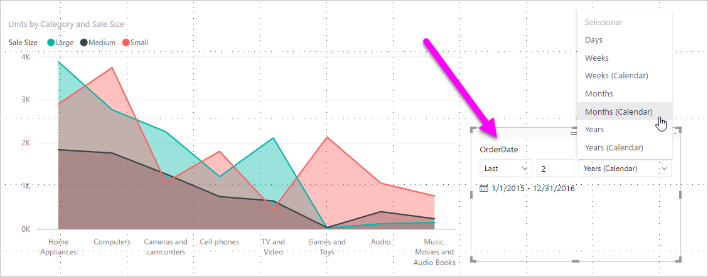
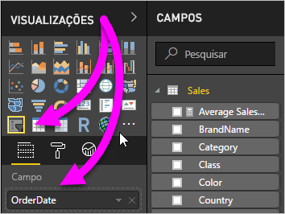
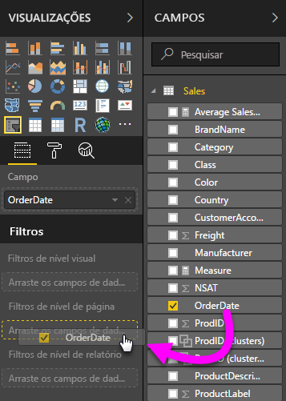
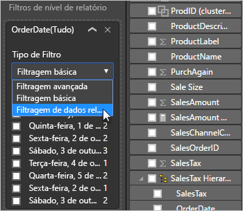
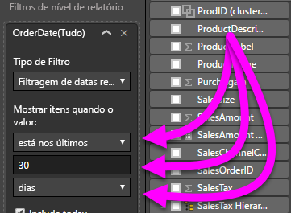

# Utilizar uma segmentação e filtro de data relativa no Power BI Desktop

Com a **segmentação de data relativa** ou o **filtro de data relativa**, pode aplicar filtros baseados no tempo a qualquer coluna de datas no seu modelo de dados. Por exemplo, pode utilizar a **segmentação de data relativa** para mostrar apenas dados de vendas ocorridas nos últimos 30 dias (ou mês, meses de calendário, etc.). Quando atualizar os dados, o período de tempo relativo aplica automaticamente a restrição de data relativa adequada.

## Utilizar a segmentação de intervalo de datas relativas

Pode utilizar a segmentação de data relativa tal como qualquer outra segmentação de dados. Crie um elemento visual de **segmentação de dados** para o seu relatório e, em seguida, selecione um valor de data para o valor **Campo**. Na imagem seguinte, selecionámos o campo *DataDaEncomenda*.

Selecione a segmentação de dados na sua tela e, em seguida, o menu pendente no canto superior direito do elemento visual da segmentação de dados. Se o elemento visual tiver os dados relativos à data, o menu irá apresentar a opção **Relativo**.

Para a segmentação de data relativa, selecione *Relativo*.

Em seguida, pode selecionar as definições.

Na primeira definição, na *segmentação de data relativa*, tem as seguintes opções:

* Último

* Seguinte

* Este

A segunda definição (intermédia) na *segmentação de data relativa* permite introduzir um número para definir o intervalo de datas relativas.

A terceira definição permite escolher a medida de data. Tem as seguinte opções:

* Dias

* Semanas

* Semanas (Calendário)

* Meses

* Meses (Calendário)

* Anos

* Anos (Calendário)

Nessa lista, se selecionar **Meses** e introduzir *2* na definição intermédia, eis o que irá ocorrer:

* se hoje for dia 20 de julho

* os dados incluídos nos elementos visuais restringidos pela segmentação irão incluir os dados dos dois meses anteriores

* a partir do dia 20 de maio até dia 20 de julho (hoje)

Em comparação, se selecionar *Meses (Calendário)* , os elementos visuais restringidos mostram os dados de 1 de maio até 30 de junho (os últimos dois meses de calendário completos).

## Utilizar o filtro de intervalo de datas relativas

Também pode criar um filtro de intervalo de datas relativas para a página de relatório ou todo o relatório. Para fazê-lo, arraste o campo da data para o grupo **Filtros de nível de página** ou para o grupo **Filtros de nível de relatório** no painel **Campo**:

Lá pode alterar o intervalo de datas relativas. É semelhante à forma de personalizar a **segmentação de data relativa**. Selecione **Filtragem de data relativa** no menu pendente **Tipo de Filtro**.

Após selecionar **Filtragem de data relativa**, verá três secções para alterar, incluindo uma caixa numérica intermédia, tal qual a segmentação de dados.

## Limitações e considerações

As seguintes limitações e considerações aplicam-se atualmente ao filtro e **segmentação de intervalo de datas relativas**.

* Os modelos de dados do **Power BI** não incluem informações sobre o fuso horário. Os modelos podem armazenar horas, mas não existe nenhuma indicação do fuso horário em que estão.

* A segmentação de dados e o filtro estão sempre baseados na hora UTC. Se configurar um filtro num relatório e enviá-lo para um colega num fuso horário diferente, ambos irão ver os mesmos dados. A menos que estejam no fuso horário UTC, ambos devem ter em conta a diferença horária que poderão experienciar.

* Pode converter dados capturados de um fuso horário local em UTC com o **Editor do Power Query**.

## Próximos passos

Saiba como [utilizar o agrupamento e discretização no Power BI Desktop](../desktop-grouping-and-binning.md).
