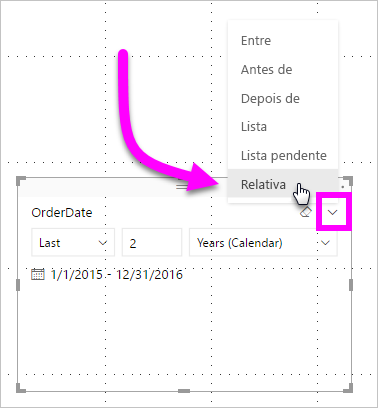

# Utilizar uma segmentação de datas relativas e o filtro no Power BI
Com a **segmentação de data relativa** ou o **filtro de data relativa**, pode aplicar filtros baseados no tempo a qualquer coluna de datas no seu modelo de dados. Por exemplo, pode utilizar a **segmentação de data relativa** para mostrar apenas dados de vendas ocorridos nos últimos trinta dias (ou mês, meses de calendário, etc.). Quando atualizar os dados, o período de tempo relativo aplica automaticamente a restrição de data relativa adequada.

## Utilizar a segmentação de intervalo de datas relativas
Pode utilizar a segmentação de data relativa tal como qualquer outra segmentação de dados. Basta criar um elemento visual de **segmentação de dados** para o relatório e selecionar um valor de data para o valor **Campo**. Na imagem seguinte, o campo *OrderDate* está selecionado.

Selecione a segmentação de dados na sua tela e, em seguida, o acento circunflexo no canto superior direito da segmentação de dados visual. Se o elemento visual contém dados de data, o menu irá apresentar a opção para **relativo**. 

Para a segmentação de data relativa, selecione *Relativo*.

Em seguida, pode selecionar as definições. No primeiro menu pendente na *segmentação de data relativa*, tem as seguintes opções:

* Último
* Seguinte
* Este

Estas seleções são apresentadas na imagem seguinte.

A definição seguinte (intermédia) na *segmentação de data relativa* permite introduzir um número para definir o intervalo de datas relativas.

A terceira definição permite escolher a medida de data. Tem as seguinte opções:

* Dias
* Semanas
* Semanas (Calendário)
* Meses
* Meses (Calendário)
* Anos
* Anos (Calendário)

Estas seleções são apresentadas na imagem seguinte.

Se selecionar *Meses* nessa lista e inserir 2 na definição intermédia, acontecerá o seguinte: se hoje for o dia 20 de julho, os dados incluídos nos elementos visuais restringidos pela segmentação de dados mostrarão os dados dos últimos dois meses, de 20 de maio a 20 de julho (data atual).

Em comparação, se tiver selecionado *Meses (Calendário)* , os elementos visuais restringidos mostrariam os dados de 1 de maio até 30 de junho (os últimos dois meses de calendário completos).

## Utilizar o filtro de intervalo de datas relativas
Também pode criar um filtro de intervalo de datas relativas para a página de relatório ou todo o relatório. Para tal, basta arrastar um campo de data para as áreas **Filtros de nível de página** ou **Filtros de nível de relatório** no painel **Campo**, conforme mostrado na imagem seguinte.

Depois, pode modificar o intervalo de datas relativas de forma semelhante à personalização da **segmentação de data relativa**. Selecione **Filtragem de data relativa** no menu pendente **Tipo de Filtro**.

Após a seleção de **Filtragem de data relativa**, verá três secções a modificar, incluindo uma caixa numérica intermédia, tal como a segmentação de dados.

E é tudo o que precisa de saber sobre a utilização destas restrições de datas relativas nos seus relatórios.

## Limitações e considerações
As seguintes limitações e considerações aplicam-se atualmente ao filtro e **segmentação de intervalo de datas relativas**.

* Os modelos de dados no **Power BI** não incluem informações de fuso horário. Os modelos podem armazenar horas, mas não existe nenhuma indicação do fuso horário em que estão.
* O filtro e a segmentação de dados baseiam-se sempre na hora em UTC, por isso, se configurar um filtro num relatório e o enviar para um colega num fuso horário diferente, ambos verão os mesmos dados. No entanto, se não estiver no fuso horário UTC poderá ver dados de um desvio de tempo diferente do esperado.
* Os dados capturados num fuso horário local podem ser convertidos para UTC através do **Editor de Consultas**.

