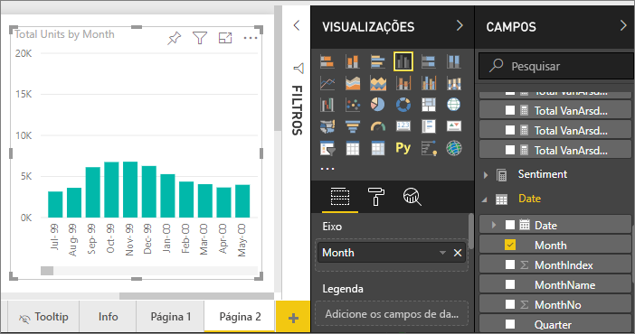
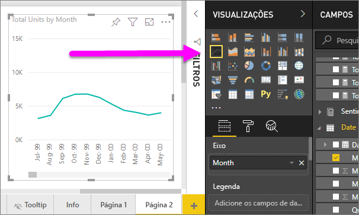
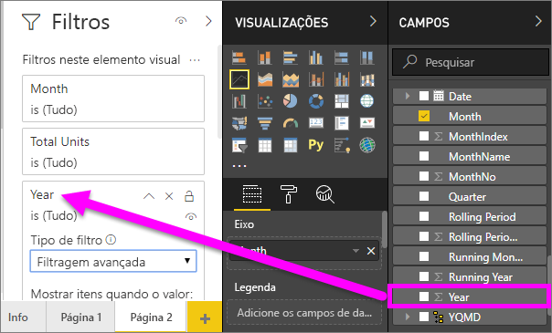
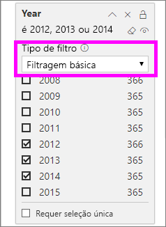
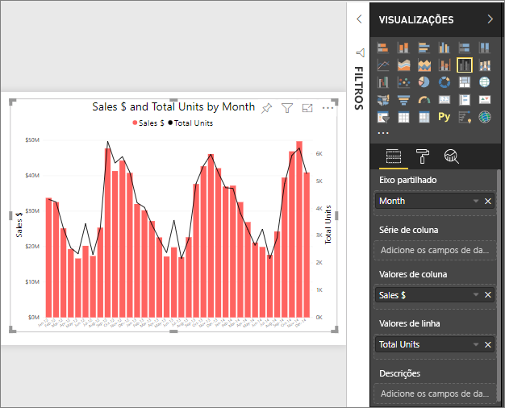
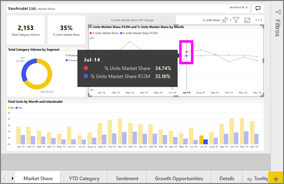

# Gráficos de linhas no Power BI
Um gráfico de linhas é uma série de pontos de dados representados por pontos e ligados por linhas retas. Um gráfico de linhas pode ter uma ou várias linhas. Os gráficos de linhas têm um eixo X e um eixo Y. 

## Criar um gráfico de linhas
Estas instruções utilizam a aplicação Exemplo de Vendas e Marketing para criar um gráfico de linhas que apresenta as vendas deste ano por categoria. Para acompanhar, obtenha a aplicação de exemplo em appsource.com.

1. Comece numa página de relatório em branco. Se estiver a utilizar o serviço Power BI, garanta que abre o relatório na [Vista de Edição](../service-interact-with-a-report-in-editing-view.md).

2. No painel Campos, selecione **FactosDeVendas** \> **Total de unidades** e, em seguida, **Data** > **Mês**.  O Power BI cria um gráfico de colunas na tela do relatório.

    

4. Converta-o num gráfico de linhas ao selecionar o modelo de gráfico de linhas no painel Visualizações. 

    
   

4. Filtre o gráfico de linhas para mostrar os dados de 2012 a 2014. Se o painel Filtros estiver fechado, expanda-o agora. No painel Campos, selecione **Data** \> **Ano** e arraste para o painel Filtros. Largue sob o título **Filtros neste elemento visual**. 
     
    

    Altere **Filtros avançados** para **Filtros básicos** e selecione **2012**, **2013** e **2014**.

    

6. Opcionalmente, [ajuste o tamanho e a cor do texto do gráfico](power-bi-visualization-customize-title-background-and-legend.md). 

    

## Adicionar outras linhas ao gráfico
Os gráficos de linhas podem ter várias linhas diferentes. Em alguns casos, os valores das linhas podem ser tão divergentes que não são adequadamente apresentados em conjunto. Vamos ver como adicionar outras linhas ao gráfico atual e, em seguida, saber como o formatar quando os valores representados pelas linhas são muito diferentes. 

### Adicionar outras linhas
Em vez de apresentarmos o total de unidades para todas as regiões como uma única linha no gráfico, vamos dividi-lo por região. Adicione outras linhas ao arrastar **Área geográfica** > **Região** para o espaço de Legenda.

   

### Utilizar dois eixos Y
E se pretender examinar o total de vendas e o total de unidades no mesmo gráfico? Os números de vendas são muito superiores aos números de unidades, o que torna o gráfico de linhas inutilizável. Na verdade, a linha vermelha que representa o total de unidades parece estar no zero.

   

Para apresentar valores altamente divergentes num gráfico, utilize um gráfico de combinação. Pode saber tudo sobre os gráficos de combinação ao ler [Gráficos de combinação no Power BI](power-bi-visualization-combo-chart.md). No exemplo a seguir, podemos apresentar as vendas e o total de unidades em conjunto num gráfico ao adicionar um segundo eixo Y. 

   

## Realce e filtragem cruzada
Para obter informações sobre como utilizar o painel Filtros, veja [Adicionar um filtro a um relatório](../power-bi-report-add-filter.md).

Selecionar um ponto de dados num gráfico de linhas realça e filtra de forma cruzada as outras visualizações na página de relatório e vice-versa. Para acompanhar, abra o separador **Quota de Mercado**.  

Num gráfico de linhas, um único ponto de dados é a intersecção de um ponto no eixo X e no eixo Y. Quando seleciona um ponto de dados, o Power BI adiciona marcadores que indicam que ponto (se existir uma única linha) ou pontos (se existirem duas ou mais linhas) são a origem para o realce e a filtragem cruzados dos outros elementos visuais na página de relatório. Se o seu elemento visual for muito denso, o Power BI irá selecionar o ponto mais próximo do local onde clica no elemento visual.

Neste exemplo, selecionámos um ponto de dados que abrange: julho de 2014, % da Participação no Mercado de Unidades R12 de 33,16 e % da Participação no Mercado de Unidades de 34,74.

Repare como o gráfico de colunas apresenta um realce cruzado e o medidor apresenta uma filtragem cruzada.

Para gerir a forma como os gráficos se destacam e filtram entre si de forma cruzada, veja [Interações de visualização num relatório do Power BI](../service-reports-visual-interactions.md)

## Considerações e resolução de problemas
* Um gráfico de uma linha não pode ter eixos Y duplos.  Em alternativa, terá de utilizar um gráfico de combinação.
* Nos exemplos acima, os gráficos foram formatados para aumentar o tamanho do tipo de letra, alterar a cor do tipo de letra, adicionar títulos dos eixos, centrar o título e a legenda do gráfico, começar ambos os eixos em zero e muito mais. O painel Formatação (ícone de rolo de pintura) tem um conjunto aparentemente interminável de opções para dar o aspeto que pretende aos seus gráficos. A melhor forma de aprender consiste em abrir o painel Formatação e explorar.

## Próximos passos

[Tipos de visualização no Power BI](power-bi-visualization-types-for-reports-and-q-and-a.md)

