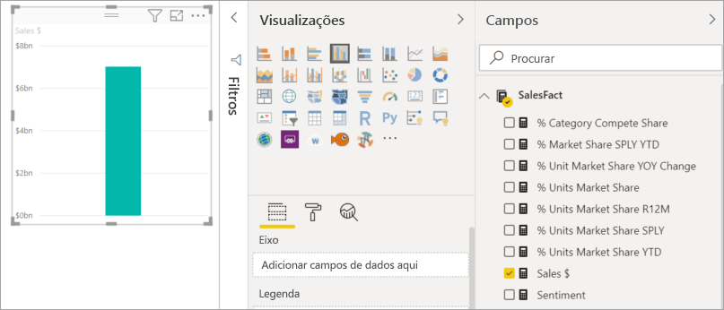
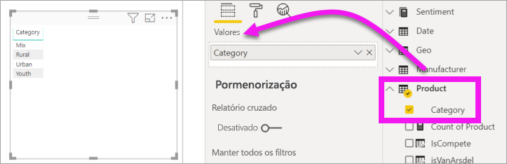
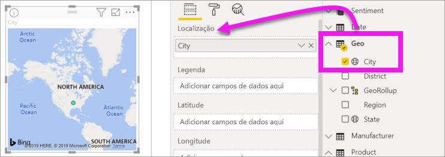
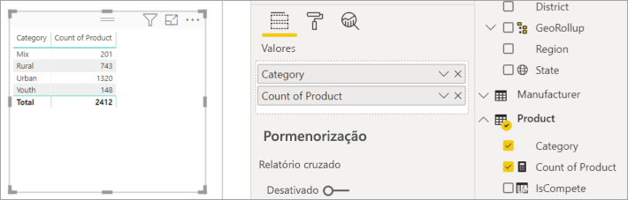
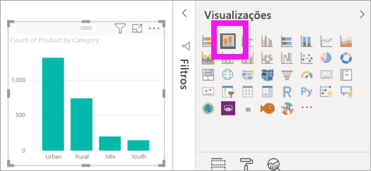
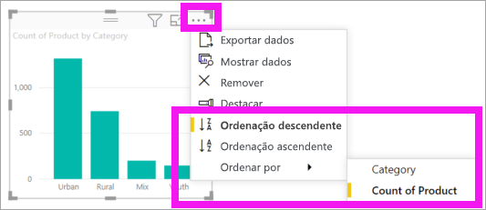

# Adicionar elementos visuais a um relatório do Power BI (parte 1)

[!INCLUDE[consumer-appliesto-nyyn](../includes/consumer-appliesto-nyyn.md)]    

[!INCLUDE [power-bi-visuals-desktop-banner](../includes/power-bi-visuals-desktop-banner.md)]

Este artigo apresenta uma breve introdução à criação de uma visualização num relatório. Aplica-se ao serviço Power BI e ao Power BI Desktop. Para obter conteúdos mais avançados, [veja a Parte 2](power-bi-report-add-visualizations-ii.md) desta série.

## Pré-requisitos

Este tutorial utiliza o [ficheiro PBIX de Vendas e marketing](https://download.microsoft.com/download/9/7/6/9767913A-29DB-40CF-8944-9AC2BC940C53/Sales%20and%20Marketing%20Sample%20PBIX.pbix).

1. Na secção superior esquerda da barra de menus do Power BI Desktop, selecione **Ficheiro** > **Abrir**
   
2. Localize a sua cópia do **ficheiro PBIX de Vendas e marketing**.

1. Abra o **ficheiro PBIX de Vendas e marketing** na vista de relatório .

1. Selecionar  para adicionar uma nova página.

> [!NOTE]
> Para partilhar o seu relatório com outro utilizador do Power BI, é necessário que ambos tenham licenças individuais do Power BI Pro ou que o relatório seja guardado numa capacidade Premium. Veja [partilhar relatórios](../collaborate-share/service-share-reports.md)

## Adicione visualizações ao relatório

1. Crie uma visualização selecionando um campo no painel **Campos**.

    Comece com um campo numérico, como **Vendas** > **TotalDeVendas**. O Power BI cria um gráfico de colunas com uma única coluna.

    

    Em alternativa, comece com um campo de categoria, como **Nome** ou **Produto**. O Power BI cria uma tabela e adiciona esse campo ao conjunto **Valores**.

    

    Também pode começar com um campo geográfico, como **Área Geográfica** > **Cidade**. O Power BI e o Bing Maps criam uma visualização de mapa.

    

## Alterar o tipo de visualização

 Crie uma visualização e, em seguida, altere o respetivo tipo. 
 
 1. Selecione **Produto** > **Categoria** e, em seguida, **Produto** > **Contagem do Produto** para adicionar ambos ao conjunto **Valores**.

    

1. Altere a visualização para um gráfico de colunas ao selecionar o ícone **Gráfico de colunas empilhadas**.

   

1. Para alterar a forma como o elemento visual é ordenado, selecione **Mais ações** (...).  Utilize as opções de ordenação para alterar o sentido da ordenação (crescente ou decrescente) e alterar a coluna que está a ser utilizada para ordenar (**Ordenar por**).

   
  
## Próximos passos

 Continue para:

* [Parte 2: Adicionar visualizações a um relatório do Power BI](power-bi-report-add-visualizations-ii.md)

* [Interaja com as visualizações](../consumer/end-user-reading-view.md) no relatório.
