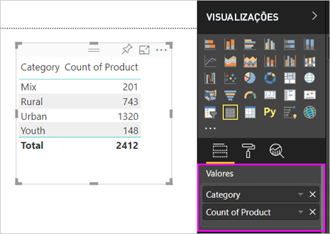
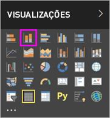

# Parte I, Adicionar visualizações a um relatório do Power BI
Este artigo apresenta uma breve introdução à criação de uma visualização num relatório com o serviço Power BI ou o Power BI Desktop.  Para conteúdo mais avançado,[veja a Parte II](power-bi-report-add-visualizations-ii.md). Veja a Amanda a demonstrar algumas formas diferentes de criar, editar e formatar visuais a tela de relatórios. Em seguida, experimente utilizando o [exemplo Vendas e Marketing](../sample-datasets.md) para criar os seus próprios relatórios.

<iframe width="560" height="315" src="https://www.youtube.com/embed/IkJda4O7oGs" frameborder="0" allowfullscreen></iframe>

## Abra um relatório e adicione uma nova página
1. Abra um [relatório na Vista de Edição](../consumer/end-user-reading-view.md). Este tutorial utiliza o [exemplo de Vendas e Marketing](../sample-datasets.md).
2. Se o painel Campos não estiver visível, selecione o ícone de seta para abri-lo. 
   
   
3. [Adicione uma página em branco ao relatório](../power-bi-report-add-page.md).

## Adicione visualizações ao relatório
1. Crie uma visualização selecionando um campo no painel **Campos**.  
   
   **Comece com um campo numérico**, como SalesFact > Sales $. O Power BI cria um gráfico de colunas com uma única coluna.
   
   
   
   **Em alternativa, comece com um campo de categoria**, como Name ou Product. O Power BI irá criar uma tabela e adicionar esse campo a **Valores**.
   
   
   
   **Também pode começar com um campo geográfico**, como Geo > City. O Power BI e o Bing Maps criam uma visualização de mapa.
   
   
2. Crie uma visualização e, em seguida, altere o respetivo tipo. Selecione **Product > Category** e, em seguida, **Product > Count of Product** para adicionar ambos a **Valores**.
   
   
3. Altere a visualização para um gráfico de colunas ao selecionar o ícone de gráfico de colunas.
   
   
4. Quando criar visualizações no relatório, pode [afixá-las ao dashboard](../service-dashboard-pin-tile-from-report.md). Para afixar a visualização, selecione o ícone de pino .
   
   
  

## Próximos passos
 Continue para a [Parte 2: adicionar visualizações a um relatório do Power BI](power-bi-report-add-visualizations-ii.md)
   
   [Interaja com as visualizações](../consumer/end-user-reading-view.md) no relatório.
   
   [Faça mais com visualizações](power-bi-report-visualizations.md).
   
   [Guarde o relatório](../service-report-save.md).
