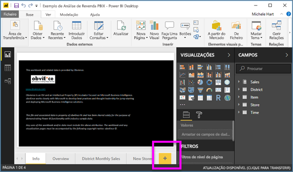
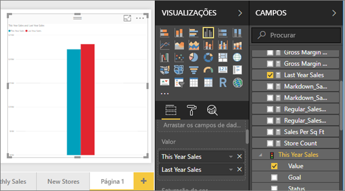
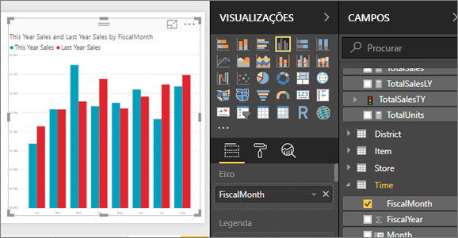
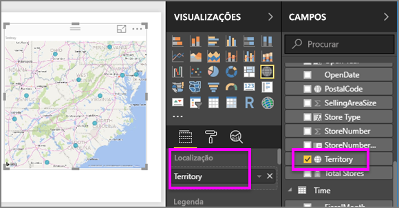
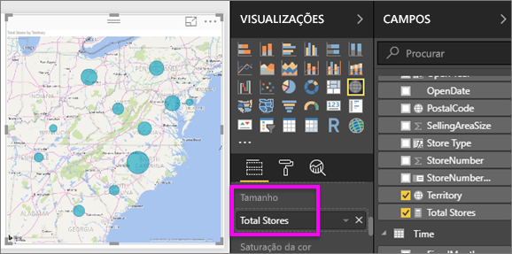
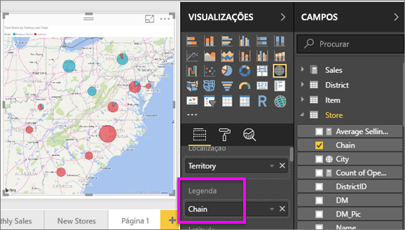

# Parte 2, Adicionar visualizações a um relatório do Power BI
Na [Parte 1](power-bi-report-add-visualizations-ii.md), criou uma visualização básica marcando as caixas de seleção ao lado dos nomes de campo.  Na parte 2, aprenderá a usar o arrastar e soltar e a utilizar de forma integral os painéis **Campos** e **Visualizações** para criar e modificar as visualizações.

### Pré-requisitos
- [Parte 1](power-bi-report-add-visualizations-ii.md)
- Power BI Desktop – pode adicionar visualizações aos relatórios com o serviço Power BI ou com o Power BI Desktop. Este tutorial utiliza o Power BI Desktop. 
- [Exemplo de Análise de Revenda](http://download.microsoft.com/download/9/6/D/96DDC2FF-2568-491D-AAFA-AFDD6F763AE3/Retail%20Analysis%20Sample%20PBIX.pbix)

## Criar uma nova visualização
Neste tutorial, vamos examinar nosso conjunto de dados de Análise de Revenda e criar algumas visualizações chave.

### Abra um relatório e adicione uma nova página em branco.
1. Abra o ficheiro .pbix Exemplo de Análise de Revenda no Power BI Desktop. 
      

2.  [Adicione uma nova página](../power-bi-report-add-page.md) ao selecionar o ícone de adição amarelo na parte inferior do ecrã.

### Adicione uma visualização que analise as vendas deste ano em comparação com o ano passado.
1. Na tabela **Sales** (Vendas), selecione **This Year Sales** (Vendas Deste Ano) > **Value** (Valor) e **Last Year Sales** (Vendas do Ano Passado). O Power BI cria um gráfico de colunas.  Isto é interessante e quer investigar. O que torna as vendas semelhantes por mês?  
   
   
2. Na tabela Time (Hora), arraste **FiscalMonth** (MêsFiscal) para a área **Axis** (Eixo).  
   
3. [Mude a visualização](power-bi-report-change-visualization-type.md) num gráfico de área.  Existem muitos tipos de visualização para escolher. Veja as [descrições de cada uma, dicas de práticas recomendadas e tutoriais](power-bi-visualization-types-for-reports-and-q-and-a.md) para decidir qual tipo utilizar. No painel Visualizações, selecione o ícone do gráfico Area (Área) .
4. Ordene a visualização ao selecionar as reticências e selecionar **Sort by FiscalMonth** (Ordenar por MêsFiscal).
5. [Redimensione a visualização](power-bi-visualization-move-and-resize.md)selecionando a visualização, pegando um dos círculos da estrutura de tópicos e arrastando. Torne-a grande o suficiente para eliminar a barra de deslocamento e pequena o suficiente para termos espaço para adicionar outra visualização.
   
   
6. [Guarde o relatório](../service-report-save.md).

### Adicionar uma visualização de mapa que analise as vendas por local
1. Na tabela **Arquivo** selecione **Território**. O Power BI reconhece que Território é um local e cria uma visualização de mapa.  
   
2. Arraste **Arquivos Totais** na área de Valores.  
   
3. Adicione uma legenda.  Para ver os dados pelo nome do arquivo, arraste **Rede** para a área Legenda.  
   

## Passos seguintes
* Mais sobre [Visualizações nos relatórios do Power BI](power-bi-report-visualizations.md).  
* Mais perguntas? [Pergunte à Comunidade do Power BI](http://community.powerbi.com/)

