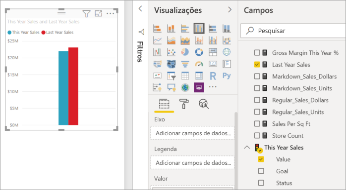
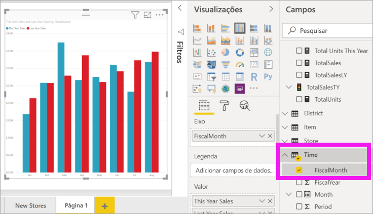
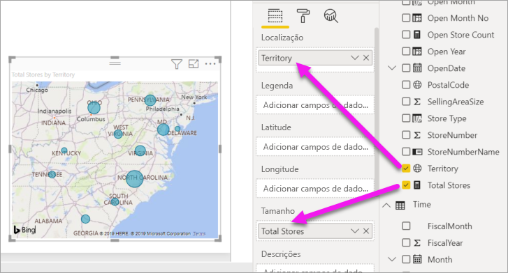
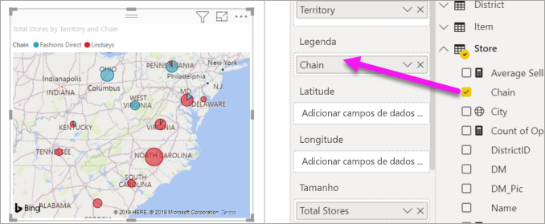

# Adicionar elementos visuais a um relatório do Power BI (parte 2)

[!INCLUDE[consumer-appliesto-nyyn](../includes/consumer-appliesto-nyyn.md)]    

[!INCLUDE [power-bi-visuals-desktop-banner](../includes/power-bi-visuals-desktop-banner.md)]

Na [Parte 1](power-bi-report-add-visualizations-i.md), criou uma visualização básica marcando as caixas de seleção ao lado dos nomes de campo.  Na Parte 2, aprenderá a utilizar a funcionalidade de arrastar e largar e a utilizar de forma integral os painéis **Campos** e **Visualizações** para criar e modificar as visualizações.

## Criar uma nova visualização
Neste tutorial, vamos examinar o nosso conjunto de dados de Análise de Revenda e criar algumas visualizações chave.

## Pré-requisitos

Este tutorial utiliza o [ficheiro PBIX de Exemplo de análise de revenda](https://download.microsoft.com/download/9/6/D/96DDC2FF-2568-491D-AAFA-AFDD6F763AE3/Retail%20Analysis%20Sample%20PBIX.pbix).

1. Na secção superior esquerda da barra de menus do Power BI Desktop, selecione **Ficheiro** > **Abrir**
   
2. Procure a sua cópia do **ficheiro PBIX do Exemplo de Análise de Revenda**

1. Abra o **Ficheiro PBIX do Exemplo de Análise de Revenda** na vista de relatório .

1. Selecionar  para adicionar uma nova página.

## Adicione visualizações ao relatório

Crie uma visualização selecionando um campo no painel **Campos**. O tipo de visualização criado dependerá do tipo de campo selecionado. O Power BI utiliza o tipo de dados para determinar qual a visualização a utilizar para mostrar os resultados. Pode alterar facilmente a visualização utilizada ao selecionar um ícone diferente no painel Visualizações. Tenha em conta que nem todas as visualizações podem mostrar os seus dados. Por exemplo, os dados geográficos não são devidamente mostrados num gráfico de funil ou gráfico de linhas. 

### Adicionar um gráfico de área que analise as vendas deste ano em comparação com o ano passado

1. Na tabela **Vendas**, selecione **Vendas Deste Ano** > **Valor** e **Vendas do Ano Passado**. O Power BI cria um gráfico de colunas.  Este gráfico é interessante e quer investigar melhor. O que torna as vendas semelhantes por mês?  
   
   

2. Na tabela Time (Hora), arraste **FiscalMonth** (MêsFiscal) para a área **Axis** (Eixo).  
   

3. [Mude a visualização](power-bi-report-change-visualization-type.md) para um gráfico de área.  Há muitos tipos de visualização à escolha. Veja [descrições de cada uma, dicas de práticas recomendadas e tutoriais](power-bi-visualization-types-for-reports-and-q-and-a.md) para decidir que tipo utilizar. No painel Visualizações, selecione o ícone do gráfico de área .

4. Ordene a visualização ao selecionar **Mais ações** (...) e selecionar **Ordenar por** >  **FiscalMonth** (Mês Fiscal).

5. [Redimensione a visualização](power-bi-visualization-move-and-resize.md)selecionando a visualização, pegando um dos círculos da estrutura de tópicos e arrastando. Torne-a grande o suficiente para eliminar a barra de deslocamento e pequena o suficiente para termos espaço para adicionar outra visualização.
   
   
6. [Guarde o relatório](../create-reports/service-report-save.md).

### Adicionar uma visualização de mapa que analise as vendas por local

1. Na tabela **Arquivo** selecione **Território**. Arraste **Arquivos Totais** na área de Valores. O Power BI reconhece que Território é um local e cria uma visualização de mapa.  
   

2. Adicione uma legenda.  Para ver os dados pelo nome da loja, arraste **Store** (Loja) > **Chain** (Cadeia) para a área Legenda.  
   

> [!NOTE]
> Para partilhar o seu relatório com outro utilizador do Power BI, é necessário que ambos tenham licenças individuais do Power BI Pro ou que o relatório seja guardado numa capacidade Premium. Veja [partilhar relatórios](../collaborate-share/service-share-reports.md).

## Próximos passos
* Mais sobre [Visualizações nos relatórios do Power BI](power-bi-report-visualizations.md).  
* Mais perguntas? [Pergunte à Comunidade do Power BI](https://community.powerbi.com/)

