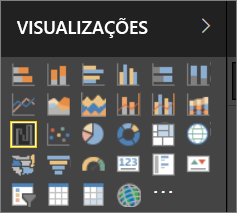

# Visualizações em relatórios do Power BI

As visualizações (também conhecidas como elementos visuais) apresentam informações que foram descobertas nos dados. Um relatório do Power BI poderá ter uma única página com um elemento visual ou poderá ter páginas repletas de elementos visuais. No serviço Power BI, os elementos visuais podem ser [afixados a partir de relatórios a dashboards](../service-dashboard-pin-tile-from-report.md). 

É importante fazer a distinção entre *criadores* de relatórios e *consumidores* de relatórios. Se é a pessoa que está a criar ou a modificar o relatório, então é um criador.  Os criadores têm permissões de edição para o relatório e o respetivo conjunto de dados subjacente. No Power BI Desktop, isto significa que pode abrir o conjunto de dados na Vista de dados e criar elementos visuais na Vista de relatório. No serviço Power BI, significa que pode abrir o relatório ou conjunto de dados no editor de relatórios na [Vista de edição](../consumer/end-user-reading-view.md). Se um relatório ou dashboard tiver sido [partilhado consigo](../consumer/end-user-shared-with-me.md), você será um **consumidor** do relatório. Poderá ver e interagir com o relatório e os seus elementos visuais, mas não conseguirá guardar as alterações.

Existem vários tipos de elementos visuais disponíveis diretamente a partir do painel de VISUALIZAÇÕES do Power BI. 

E para ter ainda mais opções, visite o [site da comunidade do Microsoft AppSource](https://appsource.microsoft.com) para procurar e transferir [elementos visuais personalizados](https://appsource.microsoft.com/marketplace/apps?product=power-bi-visuals&page=1) fornecidos pela Microsoft e pela comunidade.    

<iframe width="560" height="315" src="https://www.youtube.com/embed/SYk_gWrtKvM?list=PL1N57mwBHtN0JFoKSR0n-tBkUJHeMP2cP" frameborder="0" allowfullscreen></iframe>

  Se for novo no Power BI, ou se precisar de relembrar alguns aspetos, utilize as ligações abaixo para saber os aspetos básicos de visualizações do Power BI.  Em alternativa, utilize o nosso Índice (no lado esquerdo deste artigo) para procurar ainda mais informações úteis.

## Adicionar uma visualização no Power BI

[Crie visualizações](power-bi-report-add-visualizations-i.md) nas páginas dos relatórios. Navegue na [lista de visualizações e tutoriais de visualização disponíveis.](power-bi-visualization-types-for-reports-and-q-and-a.md) 

## Carregar uma visualização personalizada e utilizá-la no Power BI

Adicione uma visualização personalizada que criou ou que encontrou no [site da comunidade do Microsoft AppSource ](https://appsource.microsoft.com/marketplace/apps?product=power-bi-visuals). Sente-se criativo? Aprofunde o nosso código fonte e utilize as nossas [ferramentas de programador](../developer/custom-visual-develop-tutorial.md) para criar um novo tipo de visualização e [partilhá-la com a comunidade](../developer/office-store.md)

## Alterar o tipo de visualização

Tente [alterar o tipo de visualização](power-bi-report-change-visualization-type.md) para ver o que funciona melhor com os seus dados.

## Afixar a visualização

No serviço Power BI, quando a visualização estiver da forma que quer, pode [afixá-la a um dashboard](../service-dashboard-pin-tile-from-report.md) como um mosaico. Se alterar a visualização que está a ser utilizada no relatório depois de a afixar, o mosaico no dashboard não será alterado. Se era um gráfico de linhas, continuará a ser um gráfico de linhas, mesmo que o tenha alterado para um gráfico em anel no relatório.

## Próximos passos

[Tipos de visualização no Power BI](power-bi-visualization-types-for-reports-and-q-and-a.md)