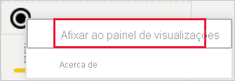

# Visualizações em relatórios do Power BI

[!INCLUDE[consumer-appliesto-yyyn](../includes/consumer-appliesto-yyyn.md)]    

As visualizações (também conhecidas como elementos visuais) apresentam informações que foram descobertas nos dados. Um relatório do Power BI poderá ter uma única página com um elemento visual ou poderá ter páginas repletas de elementos visuais. No serviço Power BI, os elementos visuais podem ser [afixados de relatórios a dashboards](../create-reports/service-dashboard-pin-tile-from-report.md).

É importante saber distinguir *estruturadores* e *consumidores* de relatórios.  Se for a pessoa que cria ou modifica o relatório, é um estruturador.  Os estruturadores têm permissões de edição para o relatório e o respetivo conjunto de dados subjacente. No Power BI Desktop, isto significa que pode abrir o conjunto de dados na Vista de dados e criar elementos visuais na Vista de relatório. No serviço Power BI, significa que pode abrir o relatório ou conjunto de dados no editor de relatórios na [Vista de edição](../consumer/end-user-reading-view.md). Se um relatório ou dashboard tiver sido [partilhado consigo](../consumer/end-user-shared-with-me.md), você será um *consumidor* do relatório. Poderá ver e interagir com o relatório e os seus elementos visuais, mas não conseguirá fazer tantas alterações como um *estruturador*.

Existem vários tipos de elementos visuais disponíveis diretamente no painel Visualizações do Power BI.

Estão disponíveis mais elementos visuais do Power BI no [site da comunidade do Microsoft AppSource](https://appsource.microsoft.com). No AppSource, pode procurar e [transferir](https://appsource.microsoft.com/marketplace/apps?page=1&product=power-bi-visuals) os elementos visuais do Power BI disponibilizados pela Microsoft e pela comunidade.

Se for novo no Power BI, ou se precisar de relembrar alguns aspetos, utilize as ligações abaixo para saber os aspetos básicos de visualizações do Power BI.  Em alternativa, utilize o nosso Índice (no lado esquerdo deste artigo) para procurar ainda mais informações úteis.

## Adicionar uma visualização no Power BI

[Crie visualizações](power-bi-report-add-visualizations-i.md) nas páginas dos relatórios. Navegue na [lista de visualizações e tutoriais de visualização disponíveis.](power-bi-visualization-types-for-reports-and-q-and-a.md) 

## Carregar uma visualização a partir de um ficheiro ou do AppSource

Adicione uma visualização que criou ou que encontrou no [site da comunidade do Microsoft AppSource](https://appsource.microsoft.com/marketplace/apps?product=power-bi-visuals). Sente-se criativo? Aprofunde o nosso código fonte e utilize as nossas [ferramentas de programação](../developer/visuals/environment-setup.md) para criar um novo tipo de visualização e [partilhá-la com a comunidade](../developer/visuals/office-store.md). Para saber mais sobre como desenvolver um elemento visual do Power BI, veja [Desenvolver um elemento visual do Power BI](../developer/visuals/develop-circle-card.md).

## Personalizar o painel de visualização

Pode personalizar o painel de visualização ao adicionar e remover elementos visuais do Power BI. Se remover elementos visuais predefinidos do painel de visualização, poderá restaurar o painel para a predefinição e trazer de volta todos os elementos visuais predefinidos.

### Adicionar um elemento visual ao painel de visualização

Se utilizar o mesmo elemento visual em muitos relatórios, poderá adicioná-lo ao painel de visualização. A adição de elementos visuais aplica-se aos elementos visuais do AppSource, organizacionais e de ficheiros. Para adicionar um, clique com o botão direito do rato no elemento visual.

Quando um elemento visual é afixado, é apresentado junto aos outros elementos visuais predefinidos. O elemento visual fica associado à conta com sessão iniciada, pelo que os novos relatórios que criar irão ter este elemento visual automaticamente incluído, partindo do pressuposto de que tem sessão iniciada. Já não precisa de adicionar um elemento visual específico que utilize regularmente a cada relatório.

### Remover um elemento visual do painel de visualização

Se deixar de utilizar um elemento visual regularmente, poderá clicar com o botão direito do rato no mesmo e removê-lo do painel de visualização. Qualquer tipo de elemento visual pode ser removido do painel de visualização, incluindo elementos visuais predefinidos, de ficheiros, organizacionais e do AppSource.

### Restaurar o painel de visualização

Restaurar o painel de visualização só se aplica aos elementos visuais predefinidos. Os elementos visuais adicionados ao painel de visualização não são afetados e permanecerão disponíveis no painel de visualização. Se quiser remover elementos visuais do AppSource ou de ficheiros do painel de visualização, terá de o fazer manualmente.

Para restaurar o painel de visualização para a predefinição, clique em mais opções e selecione **Restaurar elementos visuais predefinidos**.

## Alterar o tipo de visualização

Tente [alterar o tipo de visualização](power-bi-report-change-visualization-type.md) para ver o que funciona melhor com os seus dados.

## Afixar a visualização

No serviço Power BI, quando a visualização estiver da forma que quer, pode [afixá-la a um dashboard](../create-reports/service-dashboard-pin-tile-from-report.md) como um mosaico. Se alterar a visualização que está a ser utilizada no relatório depois de a afixar, o mosaico no dashboard não será alterado. Se for um gráfico de linhas, mantém-se um gráfico de linhas, mesmo que o tenha alterado para um gráfico em anel no relatório.

## Limitações e considerações
- Consoante a origem de dados e o número de campos (medidas ou colunas), o carregamento de um elemento visual pode ser mais demorado.  Recomendamos que limite os elementos visuais a um total de 10 a 20 campos, por motivos de legibilidade e desempenho. 

- O limite máximo de elementos visuais é 100 campos (medidas ou colunas). Se o carregamento do seu elemento visual falhar, reduza o número de campos.

## Próximos passos

* [Tipos de visualização no Power BI](power-bi-visualization-types-for-reports-and-q-and-a.md)
* [Elementos visuais do Power BI](../developer/visuals/power-bi-custom-visuals.md)
