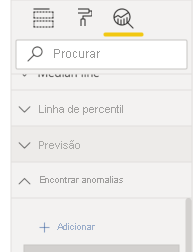
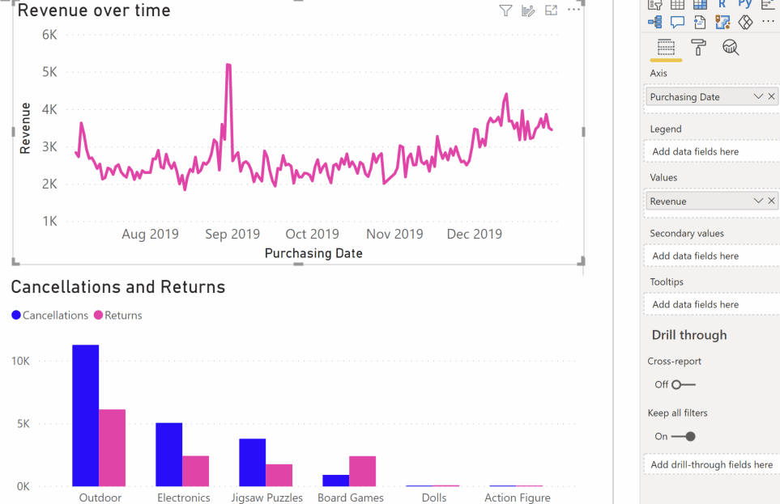
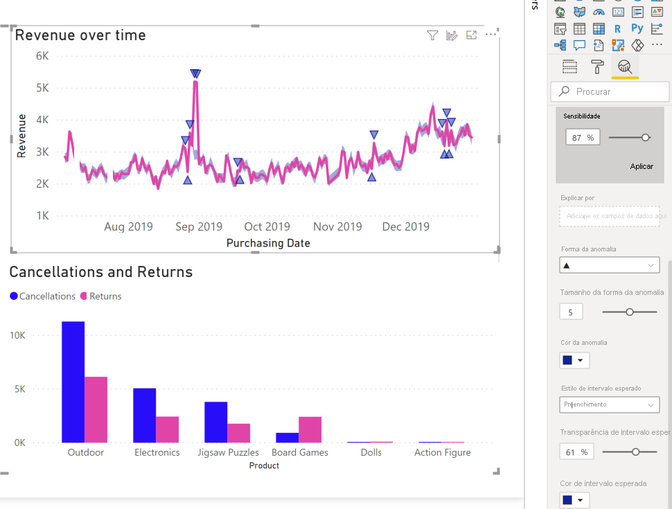

# Deteção de anomalias (pré-visualização)

[!INCLUDE[consumer-appliesto-nyyn](../includes/consumer-appliesto-nyyn.md)]    

A deteção de anomalias ajuda a melhorar os seus gráficos de linhas ao detetar automaticamente anomalias nos dados de série temporal. Também fornece explicações para as anomalias, de modo a ajudar na análise da causa raiz.  Com apenas alguns cliques, pode encontrar facilmente informações sem ter de dissecar os dados. Pode criar e ver anomalias no Power BI Desktop e no Serviço Power BI. Os passos e as ilustrações neste artigo referem-se ao Power BI Desktop.

Esta funcionalidade está em pré-visualização, portanto terá de ativar o botão da mesma primeiro. Aceda a **Ficheiro** > **Opções e definições** > **Opções** > **Funcionalidades de pré-visualização** e certifique-se de que a **Deteção de anomalias** está ativada:

:::image type="content" source="media/power-bi-visualization-anomaly-detection//preview-feature-switch.png" alt-text="Captura de ecrã a mostrar como ativar o botão da funcionalidade de pré-visualização Deteção de anomalias.":::
 
## Introdução
Este tutorial utiliza dados de vendas online referente a vários produtos. Para o acompanhar, transfira o [ficheiro de exemplo](https://github.com/microsoft/powerbi-desktop-samples/blob/master/Monthly%20Desktop%20Blog%20Samples/2020/2020SU09%20Blog%20Demo%20-%20September.pbix) de um cenário de vendas online.

Pode ativar a Deteção de anomalias ao selecionar o gráfico e adicionar a opção "Encontrar Anomalias" no painel de análise. 

 

 Por exemplo, este gráfico mostra a Revenue (Receita) ao longo do tempo. Adicionar a deteção de anomalias enriquece automaticamente o gráfico com anomalias e o intervalo de valores esperado. Quando um valor sai dos limites esperados, é marcado como anomalia. Consulte este [blogue técnico](https://techcommunity.microsoft.com/t5/ai-customer-engineering-team/overview-of-sr-cnn-algorithm-in-azure-anomaly-detector/ba-p/982798) para obter mais detalhes sobre o algoritmo do Detetor de Anomalias.

 
 
## Formatar anomalias

Esta experiência é altamente personalizável. Pode formatar a forma, o tamanho e a cor da anomalia e também pode formatar a cor, o estilo e a transparência do intervalo esperado. Além disso, pode configurar o parâmetro do algoritmo.  Se aumentar a sensibilidade, o algoritmo será mais sensível às alterações nos seus dados. Nesse caso, até um desvio ligeiro será marcado como uma anomalia. Se diminuir a sensibilidade, o algoritmo será mais seletivo no que considera ser uma anomalia.

 
 
## Explicações
Além de detetar anomalias, também pode explicar automaticamente as anomalias dos dados. Quando seleciona a anomalia, o Power BI executa uma análise entre campos no seu modelo de dados para descobrir as explicações possíveis. Fornece uma explicação de linguagem natural para a anomalia e os fatores associados à mesma, ordenados pela sua força explicativa. Aqui, podemos ver que, no dia August 30 (30 de agosto), a Revenue (Receita) foi de $5187, o que está acima do intervalo esperado, que era entre $2447 e $3423. Podemos abrir os cartões neste painel para ver mais detalhes da explicação.

 
### Configurar explicações
Também pode controlar os campos que são utilizados para a análise. Por exemplo, ao arrastar Seller (Vendedor) e City (Cidade) para o grupo de campos **Explicar por**, o Power BI restringe a análise apenas a esses campos. Neste caso, a anomalia a August 31 (31 de agosto) parece estar associada a um vendedor específico e a cidades específicas. Aqui, o vendedor "Fabrikam" tem uma força de 99%. O Power BI calcula a *força* como a proporção do desvio do valor esperado, quando filtrado pela dimensão do desvio em valor total. Por exemplo, é a proporção do valor real menos o valor esperado, entre a série temporal componente da *Fabrikam* e a *overall Revenue* (Receita geral) da série temporal agregada do ponto da anomalia. Abrir este cartão mostra o elemento visual com um pico na receita para este vendedor no dia August 31 (31 de agosto). Utilize a opção **Adicionar ao relatório** para adicionar este elemento visual à página.

## Limitações
- A deteção de anomalias apenas é suportada para elementos visuais de gráficos de linhas que contenham dados de série temporal no campo Eixo.
- A deteção de anomalias não é suportada com legendas, valores múltiplos ou valores secundários no elemento visual de gráfico de linhas.
- A deteção de anomalias requer, pelo menos, 12 pontos de dados.
- As linhas Previsão/Mín/Máx/Média/Mediana/Percentil não funcionam com a deteção de anomalias.
- A Consulta Direta sobre a origem de dados do SAP, o Power BI Report Server, a Ligação em Direto ao Azure Analysis Services e o SQL Server Analysis Services não são suportados.
- As Explicações de anomalias não funcionam com as opções "Mostrar Valor Como".
- A desagregação para aceder ao nível seguinte da hierarquia não é suportada.
