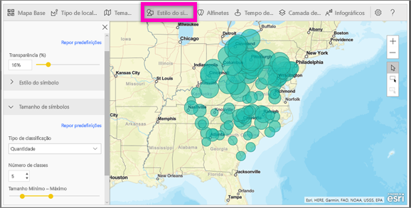
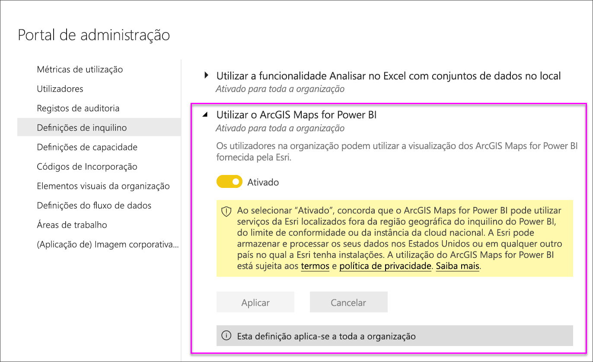

# Criar mapas do ArcGIS no Power BI Desktop

[!INCLUDE[consumer-appliesto-nyyn](../includes/consumer-appliesto-nyyn.md)]

[!INCLUDE [power-bi-visuals-desktop-banner](../includes/power-bi-visuals-desktop-banner.md)]

Este tutorial foi escrito do ponto de vista de uma pessoa que está a criar um mapa do ArcGIS Maps para Power BI. Quando um *designer* partilha um mapa do ArcGIS Maps for Power BI com um colega, este pode ver e interagir com o mapa, mas não pode guardar alterações. Para saber mais sobre a visualização de um mapa do ArcGIS, veja [Interagir com mapas ArcGIS no Power BI](power-bi-visualizations-arcgis.md).

> [!NOTE]
> Para partilhar o seu relatório com outro utilizador do Power BI, é necessário que ambos tenham licenças individuais do Power BI Pro ou que o relatório seja guardado numa capacidade Premium.

A combinação de mapas ArcGIS com o Power BI leva o mapeamento além da apresentação de pontos num mapa, a um nível totalmente novo. Escolha entre mapas de base, tipos de localização, temas, estilos de símbolos e camadas de referência para criar belíssimas visualizações de mapas informativos. A combinação de camadas de dados autoritativas num mapa com análise espacial proporciona uma compreensão mais aprofundada dos dados na visualização.

 Embora não seja possível criar um mapa do ArcGIS Maps for Power BI num dispositivo móvel, pode visualizá-lo e interagir com o mesmo. Consulte [Interagir com mapas ArcGIS](power-bi-visualizations-arcgis.md).

> [!NOTE]
> O ArcGIS Maps for Power BI não está atualmente disponível para o Power BI Report Server.

> [!TIP]
> GIS significa Geographic Information Systems (Sistemas de Informação Geográfica).

O exemplo abaixo utiliza uma tela em cinzento escuro para mostrar as vendas regionais como um mapa térmico, em relação a uma camada demográfica do rendimento disponível médio de 2016. Como poderá constatar nesta leitura, a utilização do ArcGIS Maps for Power BI oferece uma capacidade praticamente ilimitada de mapeamento avançado, dados demográficos e visualizações de mapas ainda mais apelativas para contar a sua melhor história.

> [!TIP]
> Visite a [página da Esri sobre o ArcGIS Maps for Power BI](https://www.esri.com/powerbi) para ver muitos exemplos e ler testemunhos. Em seguida, veja a [página de introdução ao ArcGIS Maps for Power BI](https://doc.arcgis.com/en/maps-for-powerbi/get-started/about-maps-for-power-bi.htm) da Esri.

## Consentimento do utilizador
O ArcGIS Maps for Power BI é fornecido pela Esri (https://www.esri.com). A utilização do ArcGIS Maps for Power BI está sujeita aos termos e política de privacidade da Esri. Os utilizadores do Power BI que pretendam utilizar os elementos visuais do ArcGIS Maps for Power BI têm de aceitar a caixa de diálogo de consentimento.

**Recursos**

[Termos](https://go.microsoft.com/fwlink/?LinkID=826322)

[Política de Privacidade](https://go.microsoft.com/fwlink/?LinkID=826323)

[Página do produto ArcGIS Maps for Power BI](https://www.esri.com/powerbi)

## Pré-requisitos

Este tutorial utiliza o Power BI Desktop e o PBIX [exemplo de Análise de Revenda](https://download.microsoft.com/download/9/6/D/96DDC2FF-2568-491D-AAFA-AFDD6F763AE3/Retail%20Analysis%20Sample%20PBIX.pbix). O ArcGIS Maps for Power BI pode também ser criado com o serviço Power BI. 

1. Na secção superior esquerda da barra de menus, selecione **Ficheiro** \> **Abrir**
   
2. Localize o **ficheiro PBIX de Exemplo de Análise de Revenda** guardado no seu computador local.

1. Abra o **Exemplo de Análise de Revenda** na vista de relatório .

1. Selecionar  para adicionar uma nova página.

   
## Criar uma visualização de mapa do ArcGIS Maps for Power BI

Veja o Will a criar algumas visualizações de mapa diferentes. Depois, siga os passos abaixo para experimentar fazê-lo com o [ficheiro PBIX de Exemplo de Análise de Revenda](../sample-datasets.md).
    

   > [!NOTE]
   > Este vídeo utiliza uma versão mais antiga do Power BI Desktop.
   > 

> [!VIDEO https://www.youtube.com/embed/EKVvOZmxg9s]

1. Selecione o ícone ArcGIS Maps for Power BI no painel Visualizações.
   
        

2. O Power BI adiciona um modelo vazio à tela de relatórios. Neste tutorial, iremos utilizar a versão gratuita.
   
   

3. No painel **Campos**, arraste um campo de dados para os grupos **Localização** ou **Latitude** e/ou **Longitude**. Neste exemplo, estamos a utilizar **Store > City** (Loja > Cidade).
   
   > [!NOTE]
   > O ArcGIS Maps for Power BI irá detetar automaticamente se os campos que selecionou são melhor vistos como uma forma ou um ponto de um mapa. Pode ajustar a predefinição nas definições (ver abaixo).
   > 
   > 
   
    

4. No painel **Campos**, arraste uma medida para o registo **Tamanho**, para ajustar a forma como os dados são apresentados. Neste exemplo, estamos a utilizar **Sales > Last Year Sales** (Vendas > Vendas do Último Ano).
   
    

Criou o seu primeiro mapa do ArcGIS Maps for Power BI. Agora, vamos refinar e formatar o nosso mapa com mapas de base, tipos de localização, temas e mais.

## Definições e formatação do ArcGIS Maps for Power BI
Para aceder às funcionalidades de formatação do **ArcGIS Maps for Power BI**:

1. Aceda a funcionalidades adicionais ao selecionar **Mais ações** (...) no canto superior direito da visualização e selecionar **Editar**.
   
   
   
   A visualização expande-se e as funcionalidades disponíveis são apresentadas na parte superior. Cada funcionalidade, quando selecionada, abre um painel de tarefas que fornece opções detalhadas. 
   
   
   

> [!TIP]
> A **Esri** fornece [documentação completa](https://go.microsoft.com/fwlink/?LinkID=828772) do conjunto de funcionalidades do **ArcGIS Maps for Power BI**.

### Mapas base
São fornecidos quatro mapas base: Tela Cinzento Escuro, Tela Cinzento Claro, OpenStreetMap e Streets.  *Streets* é o mapa base padrão do ArcGIS.

Para aplicar um mapa base, selecione-o no painel de tarefas.

### Tipo de localização
O ArcGIS Maps for Power BI deteta automaticamente a melhor forma de mostrar dados no mapa. Seleciona a partir de pontos ou limites. As opções de Location type (Tipo de localização) permitem-lhe ajustar as seleções.

Os **Limites** só irão funcionar se os seus dados contiverem valores geográficos padrão. O ArcGIS Maps for Power BI percebe automaticamente a forma a mostrar no mapa. Os valores geográficos padrão incluem países, províncias, códigos postais, etc. Porém, tal como acontece com a Geocodificação, o Power BI pode não detetar um campo que deveria ser um limite por predefinição ou pode não encontrar um limite para os seus dados.  

### Tema do mapa
São fornecidos quatro temas de mapas. O Power BI seleciona automaticamente temas de **Location only** (Apenas localização) ou **Size** (Tamanho), com base nos campos que adicionou aos registos **Location** (Localização) e **Size** (Tamanho). O nosso mapa assumiu a predefinição de **Size** (Tamanho), uma vez que adicionámos campos a ambos os registos. Experimente os outros temas e volte para **Size** (Tamanho) antes de avançar para o passo seguinte.  

<table>
<tr><th>Tema</th><th>Descrição</th>
<tr>
<td>Localizações Apenas</td>
<td>Desenha pontos de dados ou limites preenchidos no mapa, com base no campo que adicionou ao registo Location (Localização).</td>
</tr>
<tr>
<td>Mapa Térmico</td>
<td>Desenha a intensidade dos dados no mapa. As áreas de maior atividade ou valor são representadas por cores mais fortes e brilhantes. </td>
</tr>
<tr>
<td>Tamanho</td>
<td>Desenha pontos de dados no mapa, com base no campo que adicionou ao registo Size (Tamanho).</td>
</tr>
<tr>
<td>Clustering</td>
<td>Os pontos no raio do cluster especificado são agrupados num único símbolo que representa o número de pontos nessa área do mapa. </td>
</tr>
</table>

### Estilo do símbolo
Os estilos de símbolo permitem-lhe ajustar a forma como os dados são apresentados no mapa. Os estilos de símbolo são sensíveis ao contexto, com base no Location type (Tipo de localização) selecionado e no Map theme (Tema do mapa). O exemplo abaixo mostra o tema de Mapa definido como **Tamanho** e alguns ajustes de estilos de símbolos para transparência, estilo e tamanho. 

### Marcadores
Chame a atenção para pontos no seu mapa adicionando marcadores.  

1. Selecione o separador **Marcadores**.
2. Introduza palavras-chave (por exemplo, endereços, locais e ponto de interesse) na caixa de pesquisa e selecione-as na lista pendente. É apresentado um símbolo no mapa, e o mapa amplia automaticamente para a localização. Os resultados da pesquisa são guardados como cartões de localização no painel Marcadores. Pode guardar até 10 cartões de localização.
   
   
3. O Power BI adiciona um marcador a essa localização e pode alterar a cor do marcador.
   
   
4. Adicione e exclua marcadores.
   
   

### Tempo de condução
O painel Tempo da unidade permite-lhe selecionar uma localização e, em seguida, determinar que outras funcionalidades do mapa se encontram num raio especificado ou tempo de viagem. O exemplo que se segue mostra um raio de 50 milhas de Washington D.C.  Siga os passos abaixo para criar a sua camada de tempo de condução. 
    

1. Selecione a ferramenta de seleção única e escolha um marcador ou uma bolha. Neste exemplo, selecionámos um marcador para o aeroporto Charlotte Douglas

   
   
   > [!TIP]
   > É mais fácil selecionar uma localização se ampliar o mapa. Pode ampliar com o ícone + ou deslocar-se com o rato.
   > 
   > 
2. Imagine que vai viajar para o aeroporto Charlotte Douglas durante uns dias e quer saber quais as lojas da sua cadeia que se encontram numa distância de condução razoável. Altere a Search area (Área de pesquisa) para **Drive time** (Tempo de condução) e a Distance (Distância) para **25** minutes (minutos). Selecione OK.    
   
    

    

3. Há duas lojas a uma distância de condução de 25 minutos. O raio é mostrado em roxo. Selecione qualquer localização para apresentar os detalhes. Opcionalmente, formate o raio, alterando a cor e a descrição.
   
    

### Camada de Referência
#### Camada de referência - Demografia
O ArcGIS Maps for Power BI fornece uma seleção de camadas demográficas que ajudam a contextualizar os dados do Power BI.

1. Selecione o separador **Camada de referência** e escolha **Demografia**.
2. Cada camada listada tem uma caixa de verificação. Adicione uma marca de verificação para adicionar essa camada ao mapa.  Neste exemplo, adicionámos o rendimento médio familiar. 
   
    
3. Cada camada é também interativa. Paire o cursor sobre uma bolha para ver os detalhes. Clique numa área sombreada para ver os detalhes como gráficos. Aqui, selecionámos o código-postal 28227 e há dois gráficos para vermos.
   
    

#### Camada de referência - ArcGIS
O ArcGIS Online fornece a capacidade às organizações de publicarem mapas Web públicos. Além disso, a Esri fornece um conjunto organizado de mapas Web através do Living Atlas. No separador ArcGIS, pode pesquisar todos os mapas Web públicos ou mapas Living Atlas e adicioná-los ao mapa como camadas de referência.

1. Selecione o separador **Camada de referência** e escolha **ArcGIS**.
2. Introduza os termos de pesquisa e, em seguida, selecione uma camada do mapa. Neste exemplo, escolhemos distritos Congressistas dos EUA.
   
    
3. Para ver os detalhes, selecione uma área sombreada para abrir *Selecionar da camada de referência*: utilize a ferramenta de seleção da camada de referência para limites de seleção ou objetos na camada da referência.

 

## Selecionar Pontos de dados
O ArcGIS Maps for Power BI fornece cinco modos de seleção para ajudar a selecionar os seus dados de forma rápida e precisa.

Altere o modo de seleção ao pairar o seu cursor sobre o ícone da ferramenta de seleção única mostrado na imagem abaixo. Esta ação irá expandir a barra oculta para mostrar mais ferramentas:

Cada ferramenta tem uma função exclusiva para permitir que selecione os seus dados: 

 Selecione pontos de dados individuais.

 Desenha um retângulo no mapa e seleciona os pontos de dados contidos.

 Permite que os limites ou polígonos dentro de camadas de referência sejam utilizados para selecionar pontos de dados contidos.

 Permite-lhe selecionar dados com uma camada intermédia.

 Permite-lhe selecionar pontos de dados semelhantes.

> [!NOTE]
> É possível selecionar o máximo de 250 pontos de dados de cada vez.
> 
> 

 

## Obter ajuda
A **Esri** fornece [documentação completa](https://go.microsoft.com/fwlink/?LinkID=828772) do conjunto de funcionalidades do **ArcGIS Maps for Power BI**.

Pode colocar perguntas, encontrar as informações mais recentes, problemas de relatório e localizar as respostas no [thread da Comunidade do Power BI relacionadas com o **ArcGIS Maps for Power BI**](https://go.microsoft.com/fwlink/?LinkID=828771).

Se tiver uma sugestão para uma melhoria, submeta-a na [Lista de ideias do Power BI](https://ideas.powerbi.com).

 

## Gerir a utilização do ArcGIS Maps for Power BI na organização
O Power BI fornece aos designers, administradores inquilinos e administradores de TI a capacidade de determinarem a utilização do ArcGIS Maps for Power BI. Seguem-se os passos que cada função pode seguir. 

### Opções para designers
No Power BI Desktop, os designers podem desativar o ArcGIS Maps for Power BI no separador Segurança. Selecione **Ficheiro** > **Opções e definições** e, em seguida, selecione **Opções** > **Segurança**. Quando desativado, o ArcGIS Maps não será carregado, por predefinição.

### Opções para administradores de inquilinos
No PowerBI.com, os administradores de inquilinos podem desativar o ArcGIS Maps for Power BI para todos os utilizadores. Selecione **Definições** > **Portal de Administração** > **Definições de inquilino**. Quando for desativado, o Power BI deixará de apresentar o ícone do ArcGIS Maps for Power BI no painel de visualizações.

### Opções para administradores de TI
O Power BI Desktop suporta a utilização da **Política de Grupo** para desativar o ArcGIS Maps for Power BI nos computadores de uma organização onde estiver implementado.

<table>
<tr><th>Atributo</th><th>Valor</th>
</tr>
<tr>
<td>chave</td>
<td>Software\Policies\Microsoft\Power BI Desktop&lt;/td&gt;
</tr>
<tr>
<td>valueName</td>
<td>EnableArcGISMaps</td>
</tr>
</table>

Um valor de 1 (decimal) ativa o ArcGIS Maps for Power BI.

Um valor de 0 (decimal) desativa o ArcGIS Maps for Power BI.

## Considerações e Limitações
O ArcGIS Maps for Power BI está disponível nos seguintes serviços e aplicações:

<table>
<tr><th>Serviço/Aplicação</th><th>Disponibilidade</th></tr>
<tr>
<td>Power BI Desktop</td>
<td>Sim</td>
</tr>
<tr>
<td>Serviço Power BI (app.powerbi.com)</td>
<td>Sim</td>
</tr>
<tr>
<td>Aplicações móveis do Power BI</td>
<td>Sim</td>
</tr>
<tr>
<td>Publicar na Web do Power BI</td>
<td>Não</td>
</tr>
<tr>
<td>Power BI Embedded</td>
<td>Não</td>
</tr>
<tr>
<td>Incorporação do serviço Power BI (PowerBI.com)</td>
<td>Não</td>
</tr>
</table>

Em serviços ou aplicações em que o ArcGIS Maps for Power BI não estiver disponível, a visualização irá ser apresentada como um elemento visual em branco, com o logótipo do Power BI.

Ao geocodificar endereços de ruas, apenas os primeiros 1500 endereços serão geocodificados. A geocodificação de nomes de locais ou países não está sujeita ao limite de 1500 endereços.

 

**Como é que o ArcGIS Maps for Power BI funciona?**
O ArcGIS Maps for Power BI é fornecido pela Esri (https://www.esri.com). A utilização do ArcGIS Maps for Power BI está sujeita aos [termos](https://go.microsoft.com/fwlink/?LinkID=8263222) e à [política de privacidade](https://go.microsoft.com/fwlink/?LinkID=826323) da Esri. Os utilizadores do Power BI que pretendam utilizar os elementos visuais do ArcGIS Maps for Power BI, têm de aceitar a caixa de diálogo de consentimento (veja a secção Consentimento do Utilizador para obter detalhes).  A utilização do ArcGIS Maps for Power BI da Esri está sujeita aos Termos e à Política de Privacidade da Esri, que também estão ligados à caixa de diálogo de consentimento. Cada utilizador tem de dar consentimento antes de utilizar o ArcGIS Maps for Power BI pela primeira vez. Assim que o utilizador der consentimento, os dados vinculados aos elementos visuais são enviados para os serviços da Esri para obter geocodificação, ou seja, transformar as informações de localização em informações de latitude e longitude que podem ser representadas num mapa. Deve presumir que os dados vinculados à visualização de dados podem ser enviados aos serviços da Esri. A Esri fornece serviços como mapas de base, análise espacial, geocodificação, etc. Os elementos visuais do ArcGIS Maps for Power BI interagem com estes serviços através de uma ligação SSL protegida por um certificado fornecido e mantido pela Esri. Pode obter informações adicionais sobre o ArcGIS Maps for Power BI na [página do produto ArcGIS Maps for Power BI](https://www.esri.com/powerbi) da Esri.

Quando um utilizador se inscreve numa subscrição Plus oferecida pela Esri através do ArcGIS Maps for Power BI, está a estabelecer uma relação direta com a Esri. O Power BI não envia informações pessoais sobre o utilizador à Esri. O utilizador inicia sessão e confia numa aplicação do AAD fornecida pela Esri ao utilizar a sua própria identidade do AAD. Ao fazê-lo, o utilizador está a partilhar as suas informações pessoais diretamente com a Esri. Assim que o utilizador adicionar conteúdos da subscrição Plus a um elemento visual do ArcGIS Maps for Power BI, os outros utilizadores do Power BI também precisam de uma subscrição Plus da Esri para ver ou editar esses conteúdos. 

Se tiver perguntas técnicas sobre como o ArcGIS Maps for Power BI da Esri funciona, contacte a Esri através do site de suporte da empresa.

**Que dados são enviados para a Esri?**
Pode saber que dados são transferidos para a Esri no respetivo [site de documentação](https://doc.arcgis.com/en/maps-for-powerbi/get-started/data-transfer.htm).

**Existe algum custo de utilização do ArcGIS Maps for Power BI?**

O ArcGIS Maps for Power BI é fornecido pela **Esri** sem custos adicionais. Tem de aceitar o contrato de utilizador.  

**Estou a receber um mensagem de erro no Power BI Desktop sobre a minha cache estar cheia**

Este é um erro que está a ser resolvido.  Entretanto, para limpar a cache, tente eliminar os ficheiros nesta localização: C:\Users\\AppData\Local\Microsoft\Power BI Desktop\CEF e, em seguida, reinicie o Power BI.

**O ArcGIS Maps for Power BI suporta ficheiros de formas Esri?**

O ArcGIS Maps for Power BI deteta automaticamente os limites padrão, como países/regiões, estados/províncias e códigos postais. Se precisar de fornecer as suas próprias formas, pode fazê-lo ao utilizar o [Shape Maps for Power BI Desktop](desktop-shape-map.md).

**Posso ver os meus mapas ArcGIS offline?**

Não, o Power BI precisa de conectividade de rede para apresentar os mapas.

**Posso ligar à minha conta do ArcGIS Online a partir do Power BI?**

Ainda não. [Vote nesta ideia](https://ideas.powerbi.com/forums/265200-power-bi-ideas/suggestions/9154765-arcgis-geodatabases) e enviar-lhe-emos uma mensagem de e-mail quando começarmos a trabalhar nesta funcionalidade.  

## Próximos passos
[Interagir com um mapa ArcGIS que foi partilhado consigo](power-bi-visualizations-arcgis.md)

[Mensagem de blogue a anunciar a disponibilidade do ArcGIS Maps for Power BI](https://powerbi.microsoft.com/blog/announcing-arcgis-maps-for-power-bi-by-esri-preview/)

Mais perguntas? [Experimente perguntar à Comunidade do Power BI](https://community.powerbi.com/)

