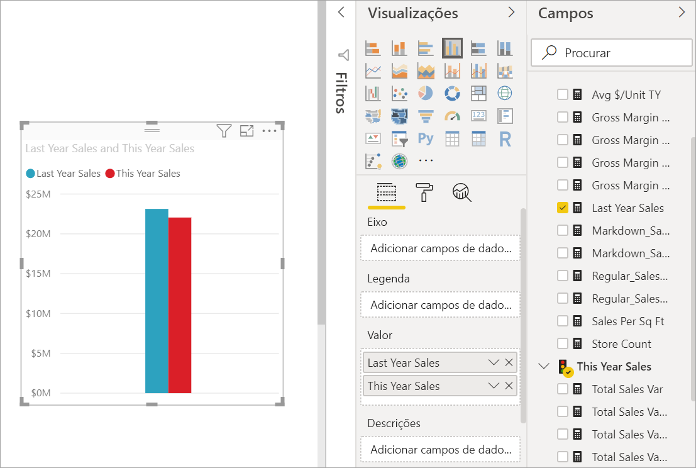
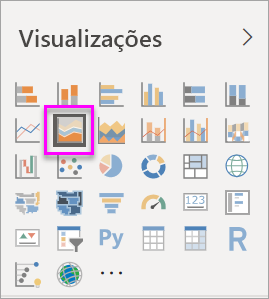

# Gráfico de Área básico

[!INCLUDE [power-bi-visuals-desktop-banner](../includes/power-bi-visuals-desktop-banner.md)]

O gráfico de área básico (também conhecido como gráfico de área em camadas) baseia-se no gráfico de linhas. A área entre o eixo e a linha é preenchida com cores para indicar o volume. 

Os gráficos de área realçam a magnitude da alteração ao longo do tempo e podem ser utilizados para chamar a atenção para o valor total numa tendência. Por exemplo, os dados que representam o lucro ao longo do tempo podem ser representados num gráfico de área para realçar o lucro total.

## Quando utilizar um gráfico de área básico
Os gráficos de área básicos são uma ótima opção:

* para ver e comparar as tendências de volume em série de tempo 
* para as séries individuais que representam um conjunto contável fisicamente

### Pré-requisitos
Este tutorial utiliza o [ficheiro PBIX do Exemplo de Análise de Revenda](https://download.microsoft.com/download/9/6/D/96DDC2FF-2568-491D-AAFA-AFDD6F763AE3/Retail%20Analysis%20Sample%20PBIX.pbix).

1. Na secção superior esquerda da barra de menus, selecione **Ficheiro** > **Abrir**.
   
2. Procure a sua cópia do **ficheiro PBIX do Exemplo de Análise de Revenda**

1. Abra o **Ficheiro PBIX do Exemplo de Análise de Revenda** na vista de relatório .

1. Selecionar  para adicionar uma nova página.

## Criar um gráfico de área básico
 

1. Estes passos vão ajudar a criar um gráfico de área para apresentar as vendas deste ano e do ano passado por mês.
   
   a. No painel Campos, selecione **Vendas \> Vendas do Ano Passado** e **Vendas Deste Ano > Valor**.

   

   b.  Converta o gráfico num gráfico de área básico ao selecionar o ícone de gráfico de Área no painel Visualizações.

   
   
   c.  Selecione **Hora\> MêsFiscal** para adicionar este campo à área **Eixo**.   
   
   
   d.  Para mostrar o gráfico por mês, selecione as reticências (canto superior direito do visual) e selecione **Ordenar por mês**. Para alterar a sequência de ordenação, selecione as reticências novamente e selecione **Ordenação ascendente** ou **Ordenação descendente**.

## Realce e filtragem cruzada
Para obter informações sobre como utilizar o painel Filtros, veja [Adicionar um filtro a um relatório](../power-bi-report-add-filter.md).

Para realçar uma área específica no gráfico, selecione essa área ou o respetivo limite superior.  Ao contrário de outros tipos de visualização, se existirem outras visualizações na mesma página, realçar um gráfico de área básico não realiza a filtragem cruzada de outras visualizações na página do relatório. No entanto, os gráficos de área são um alvo de filtragem cruzada acionado por outras visualizações na página do relatório. 

1. Experimente ao selecionar o gráfico de área e ao copiá-lo para a página de relatório **Análise de Loja Nova** (Ctrl-C e Ctrl-V).
2. Selecione uma das áreas sombreadas do gráfico de área e, em seguida, a outra área sombreada. Não irá notar qualquer impacto nas outras visualizações na página.
1. Agora, selecione um elemento. Repare no impacto no gráfico de área: fica com uma filtragem cruzada.

     

Para obter mais informações, veja [Interações visuais nos relatórios](../service-reports-visual-interactions.md)

## Considerações e resolução de problemas   
* [Tornar o relatório mais acessível para pessoas portadoras de deficiência](../desktop-accessibility.md)
* Os gráficos de área básicos não são eficazes para comparar os valores devido à oclusão nas áreas em camadas. O Power BI utiliza transparência para indicar a sobreposição das áreas. No entanto, só funciona corretamente com duas ou três áreas diferentes. Quando precisar comparar tendências para mais de três medidas, tente usar os gráficos de linhas. Quando precisar de comparar volume para mais de três medidas, tente usar os gráficos de linhas.

## Passo seguinte
[Relatórios no Power BI](power-bi-visualization-card.md)  

