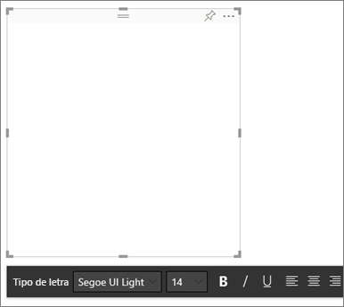

# <a name="best-design-practices-for-reports-and-visuals"></a>Melhores práticas de design para relatórios e elementos visuais

Este artigo disponibiliza as melhores práticas para criar relatórios no Power BI. Aborda os princípios de design que pode aplicar aos relatórios, assim como às páginas e aos elementos visuais individuais que constituem os relatórios. Muitas destas melhores práticas também se aplicam ao design de dashboards.

> [!NOTE]
> As recomendações feitas neste artigo são diretrizes que deve aplicar quando e onde faça sentido. Para cada princípio descrito abaixo, existem, geralmente, motivos válidos para “fugir à regra”.

Esperamos que este artigo seja um ponto de partida e que aplique o que vai aprender aos seus próprios relatórios e visualizações e que continue a troca de ideias na [Comunidade do Microsoft Power BI](http://community.powerbi.com/). A utilização de designs e visualizações de relatórios de BI é um dos principais tópicos da atualidade. Há muitos líderes criativos, bloggers e sites que encaram muito seriamente o design do relatório de BI. Vamos mostrar alguns no final do artigo.

> *Estamos assoberbados com informação, não porque haja muita, mas porque não sabemos como domá-la.*
-- Stephen Few

## <a name="a-look-at-the-landscape-and-terminology"></a>Descrição do cenário e da terminologia

No Power BI, um relatório pode ter uma ou mais páginas de relatório. Todas as páginas juntas são coletivamente referidas como o relatório. Os elementos básicos do relatório são os elementos visuais (também denominados visualizações), imagens autónomas e caixas de texto. Desde os pontos de dados, aos elementos do relatório à própria página do relatório, existem inúmeras opções de formatação.

Vamos começar na fase de planeamento do relatório, avançamos para os princípios de design básicos, abordamos os princípios do design visual e acabamos a descrever as melhores práticas para tipos de elementos visuais individuais.

Estão disponíveis em [Aprenda sobre o Power BI](https://powerbi.microsoft.com/learning/) orientações e instruções aprofundadas para criar e utilizar relatórios do Power BI.

## <a name="before-you-build-your-first-visualization-focus-on-requirements"></a>Antes de criar a primeira visualização, concentre-se nos requisitos

A criação de um relatório começa antes de criar o primeiro elemento visual. Um bom relatório exige planeamento. Analise os dados com que vai trabalhar e aponte os requisitos do relatório. Pergunte-se a si próprio:

* Quais as necessidades do negócio?

* Como é que os leitores vão utilizar estes dados?

* Quem vai utilizar estes dados?

* Que decisões é que o leitor quer tomar com base no relatório?

As respostas a estas perguntas vão orientar o design. Cada relatório conta uma história. Confirme que a história corresponde à necessidade do negócio. Pode ser tentador adicionar elementos visuais que mostrem informações relevantes, mas se estas não corresponderem às necessidades do negócio, o relatório não será útil. Na verdade, pode distrair os utilizadores com esses elementos visuais. Além disso, pode achar que não consegue obter as informações para tomar essa decisão a partir destes dados. Pode utilizar este relatório para avaliar o que é necessário avaliar?

Pode utilizar relatórios para monitorizar, descobrir, seguir, prever, medir, gerir, testar, entre outros. Por exemplo, a necessidade do negócio é um relatório de vendas que avalia o desempenho. Pode criar um relatório que analisa as vendas atuais, compara-as com as vendas anteriores, compara-as com a concorrência e inclui alguns KPIs que acionam alertas. Talvez os leitores possam explorar em detalhe os números das vendas para ver o fecho de lojas ou problemas na rede de distribuição que possam afetar as vendas. Outra análise detalhada pode permitir ver as vendas por loja, região, produto, época, entre outros critérios.

Conheça os clientes que vão utilizar o relatório. Crie um relatório com terminologia familiar e de modo a que forneça dados num nível de detalhe e complexidade comparável ao nível de conhecimentos dos clientes. Tem mais do que um tipo de clientes? O mesmo relatório pode não funcionar para diferentes clientes. Crie páginas de relatórios separadas com base nos conhecimentos. Confirme que as identifica de forma clara para que os clientes se possam identificar com as mesmas. Outra opção consiste em utilizar segmentações de dados, para que os clientes possam personalizar a página à medida deles. Envolva o cliente na fase de planeamento e evite o erro de criar segundo o que acha que ele precisa. Caso cometa esse erro, prepare-se para recomeçar e iterar.

Depois de identificar a necessidade do negócio, os clientes e as métricas que gostaria de incluir, o passo seguinte é escolher os elementos visuais certos para contar a história. Descubra como apresentá-los da forma mais eficaz possível. Vamos começar com alguns princípios básicos do design de relatórios.

## <a name="principles-of-report-design"></a>Princípios do design de relatórios

O espaço das páginas de relatórios é limitado e uma das coisas mais difíceis é encaixar todos os elementos nesse espaço e, ao mesmo tempo, fazer com que a informação seja facilmente compreendida. Além disso, não subestime o valor de um relatório visualmente atraente. O objetivo é encontrar o equilíbrio entre um relatório que é atraente e outro que é útil.

Vejamos o esquema, a clareza e a estética.

### <a name="layout-of-the-report-canvas"></a>Esquema da tela do relatório

O ecrã do relatório tem uma quantidade finita de espaço. Se não conseguir incluir todos os elementos numa única página do relatório, divida-os em várias páginas. Pode personalizar uma página do relatório para um público-alvo específico (por exemplo, RH, TI, Vendas, SLT). Se pretender, adapte-a a uma pergunta de negócios específica:

* “Como é que os defeitos estão a afetar o nosso tempo de inatividade?”

* “Qual é o impacto da nossa campanha de Marketing no Sentimento?”

Pode ser melhor abordar essa questão como uma história progressiva. Talvez a primeira página numa descrição geral ou um “isco” para chamar a atenção, a segunda página continua a história dos dados, a terceira página explora-a mais profundamente e assim por diante. Se o relatório completo se encaixar numa única página, também funcionará. Se não, crie páginas separadas que dividam o conteúdo logicamente. Não se esqueça de atribuir às páginas nomes significativos e úteis.

Imagine que está a organizar uma galeria de arte. Não colocaria 50 obras de arte numa sala pequena, enchê-la-ia com cadeiras e pintaria cada parede com uma cor diferente. Como curador, escolheria apenas obras que tivessem um tema em comum. Dispô-las-ia à volta da sala com bastante espaço para os visitantes circularem e refletirem. Poderia ainda colocar placas informativas que descrevessem as obras. Por algum motivo as galerias modernas têm paredes lisas!

Neste artigo, vamos começar com um exemplo de relatório que exige muito trabalho. À medida que aplicamos as melhores práticas e os princípios de design, o nosso relatório vai melhorar.


**Figura 1: esta página do relatório é pouco apelativa e vai exigir muito trabalho**

O exemplo acima tem muitos problemas de design (esquema) relacionados com o espaço e que vamos abordar abaixo:

* Alinhamento, ordem e utilização da proximidade

* Mau uso do espaço e da ordenação

* Desorganização

### <a name="alignment-order-and-proximity"></a>Alinhamento, ordem e proximidade

O esquema dos elementos do relatório tem impacto sobre a compreensão do leitor e orienta-os ao longo da página. A forma como coloca e posiciona os elementos conta uma história. A história pode ser “comece aqui e depois passe para aqui” ou “estes três elementos estão relacionados entre si”.

* Em muitas culturas, as pessoas analisam da esquerda para a direita e de cima para baixo. Posicione o elemento mais importante no canto superior esquerdo do relatório. Organize os restantes elementos visuais de modo a proporcionar uma navegação e compreensão das informações lógica.

* Posicione os elementos que exigem que o leitor faça uma escolha à esquerda das visualizações que essas escolhas vão afetar, como, por exemplo, segmentações.

* Coloque os elementos relacionados com a posição perto uns dos outros. A proximidade implica a relação dos elementos.

* Outra forma de transmitir relações consiste em adicionar um limite ou cor de fundo à volta dos elementos relacionados. Por outro lado, adicione um separador para distinguir entre diferentes secções do relatório.

* Utilize espaço em branco para agrupar visualmente secções da página do relatório.

* Preencha a página do relatório. Se tiver demasiado espaço em branco, aumente as visualizações ou diminua a tela.

* Dimensione os elementos do relatório intencionalmente. Não permita que seja a disponibilidade do espaço a ditar o tamanho das visualizações.

* Aumente o tamanho dos elementos importantes, para que sejam maiores dos que os outros, ou adicione um elemento visual, como uma seta, para chamar a atenção.

* Alinhe os elementos na página do relatório, de forma simétrica ou intencionalmente assimétrica.

Vejamos o alinhamento.

#### <a name="alignment"></a>Alinhamento

O alinhamento não significa que os diferentes componentes têm de ter o mesmo tamanho. Não significa que têm de ter o mesmo número de componentes em cada linha do relatório. Quer apenas dizer que a página tem uma estrutura que ajuda na navegação e na legibilidade.

Podemos ver no nosso relatório atualizado que alinhámos os componentes do relatório com as margens esquerda e direita. Também alinhámos cada linha do relatório horizontal e verticalmente. As nossas segmentações de dados estão à esquerda dos visuais que afetam.


**Figura 2: o nosso exemplo de relatório pouco apelativo melhorado com as edições do esquema**

O Power BI inclui ferramentas que ajudam a alinhar os seus elementos visuais. No Power BI Desktop, com vários elementos visuais selecionados, pode utilizar as opções **Alinhar** e **Distribuir** no separador do friso **Ferramentas dos Elementos Visuais** para harmonizar a posição deles.


**Figura 3a: Alinhar as ferramentas dos elementos visuais no Power BI Desktop**


**Figura 3b: Alinhar as ferramentas dos elementos visuais no serviço Power BI**

No serviço Power BI e no Power BI Desktop, também tem um controlo preciso sobre o tamanho e a posição dos elementos visuais. Pode encontrar este controlo no separador **Geral** no painel **Formatação** de todos os elementos visuais:


**Figura 4: definir a posição exata do elemento visual**

Na nossa página do relatório de exemplo (Figura 2), o Power BI alinha os dois cartões e a margem grande na **Posição X** em 200.

#### <a name="fit-to-the-space"></a>Ajustar ao espaço

Utilize o espaço disponível da melhor forma. Se souber como as pessoas vão ver e apresentar o relatório, crie-o com isso em mente. Reduza o espaço em branco para preencher o ecrã. Faça os possíveis para eliminar a necessidade de acrescentar barras de deslocamento a elementos visuais individuais. Preencha o espaço sem que os elementos visuais pareçam amontoados.

##### <a name="adjust-the-page-size"></a>Ajustar o tamanho da página

Ao reduzir o tamanho da página, os elementos individuais ficam maiores em relação à página geral. Desmarque os elementos visuais na página e utilize o separador **Tamanho da Página** no painel **Formatação**.

A página do relatório abaixo utiliza o tamanho **4:3** e, em seguida, **16:9**. Repare como o esquema funciona muito melhor em 16:9. Até há espaço suficiente para remover a barra de deslocamento do segundo elemento visual.


**Figura 5a: o relatório no tamanho de página 4:3**


**Figura 5b: Relatório no tamanho de página 16:9**

As pessoas verão o relatório na proporção 4:3, 16:9 ou outra? Em ecrãs pequenos ou muito grandes? Conseguirão ver o relatório em todos os tamanhos e proporções de ecrã possíveis? Crie com este ponto em mente.

A página do relatório de exemplo parece algo amontoada. Sem elementos visuais selecionados:

1. Selecione o  para abrir o painel **Formatação**.

1. Expanda o **Tamanho da Página**.

1. Para **Tipo**, selecione **Personalizado**.

1. Altere a **Altura** para **900**.

    

**Figura 6: aumentar a altura da página**

#### <a name="reduce-clutter"></a>Acabar com a desorganização

Páginas de relatórios desorganizadas são mais difíceis de compreender de relance e podem ser tão avassaladoras que os leitores nem sequer vão tentar. Elimine todos os elementos do relatório que não sejam necessários. Não adicione funcionalidades que não ajudam nem a navegação nem a compreensão. A página do relatório tem de transmitir as informações da forma mais clara, rápida e coesa possível.

No seu livro *The Visual Display of Quantitative Information* (“Apresentação Visual de Informações Quantitativas”), Edward Tufte chama-lhe "proporção de dados para tinta”. Basicamente, remova tudo o que não seja essencial.

Os elementos desnecessários que remover aumentam o espaço em branco na página do relatório. Dão-lhe também mais margem para aplicar as melhores práticas que aprendemos anteriormente na secção [Alinhamento, ordem e proximidade](#alignment-order-and-proximity).

O nosso exemplo já está com melhor aspeto. Removemos os elementos desnecessários e adicionámos formas de agrupar os elementos. A imagem de fundo já não existe, a forma de seta desnecessária e a caixa de texto também, movemos um elemento visual para outra página do relatório, entre outros. Também alargámos o tamanho da página para aumentar o espaço em branco.


**Figura 7: o nosso relatório de exemplo pouco apelativo agora organizado**

### <a name="tell-a-story-at-a-glance"></a>Conte uma história num instante

O grande teste consiste numa pessoa que não tenha qualquer conhecimento prévio consiga compreender rapidamente o relatório sem explicações. Com uma leitura rápida, os leitores conseguem ver o assunto da página e as informações transmitidas por cada gráfico/tabela.

Quando os leitores veem o relatório, o olhar deles deve ir para o elemento que quer que vejam primeiro. Depois, prosseguirão da esquerda para a direita e de cima para baixo. Para alterar este comportamento, adicione indicações visuais, como etiquetas de caixa de texto, formas, limites, tamanho e cor.

#### <a name="text-boxes"></a>Caixas de texto

Por vezes, os títulos das visualizações não são suficientes para contar a história. Adicione caixas de texto para comunicar com as pessoas que vão ver os seus relatórios. Utilize caixas de texto para descrever a página do relatório, um agrupamento de elementos visuais ou um elemento visual individual. Podem explicar resultados ou definir melhor um elemento visual, os componentes no mesmo ou as relações entre elementos visuais. Pode utilizar caixas de texto para chamar a atenção com base em diferentes critérios indicados nas mesmas.

No serviço Power BI, na barra de menus superior, selecione **Caixa de Texto**. (No Power BI Desktop, selecione **Text Box** [Caixa de Texto] na área **Insert** [Inserir] do friso.)


**Figura 8: Adicionar uma caixa de texto no serviço Power BI**

Introduza o texto na caixa em branco. Em seguida, utilize os controlos para definir o tipo de letra, o tamanho, o alinhamento e muito mais. Utilize as alças para redimensionar a caixa.



**Figura 9: formatar a caixa de texto**

Mas não exagere. Demasiado texto num relatório desvia a atenção dos elementos visuais. Se achar que a página do relatório necessita de muito texto para ser compreendida, recomece. Pode escolher outro elemento visual que conte uma história só por si? Pode ajustar os títulos nativos do elemento visual para que seja mais inteligível?

#### <a name="text"></a>Texto

Crie um guia de estilo de texto e aplique-o a todas as páginas do relatório. Escolha apenas alguns tipos de letra, tamanhos de texto e cores. Aplique este guia de estilo aos elementos textuais. Aplique-o também às opções de tipo de letra que escolher dentro das visualizações. Veja a secção [Títulos e etiquetas que fazem parte das visualizações](#titles-and-labels-that-are-part-of-the-visualizations). Defina regras de utilização de negrito, itálico, tamanho do tipo de letra maior, cores específicas, entre outros aspetos. Evite utilizar tudo em maiúsculas ou sublinhado.

#### <a name="shapes"></a>Formas

As formas também podem ajudar na navegação e na compreensão. Utilize as formas para agrupar informações relacionadas, realçar dados importantes e utilize as setas para direcionar o olhar. As formas ajudam os leitores a saber onde começar e como interpretar o relatório. Em termos de design, é muitas vezes referido como *contraste*.


**Figura 10a: Formas no serviço Power BI**


**Figura 10b: formas no Power BI Desktop**

Qual é o aspeto da nossa página de exemplo agora? A Figura 11 mostra uma página mais limpa e menos desorganizada com uma utilização consistente de tamanho de texto, tipos de letra e cores. O título da página, no canto superior esquerdo, diz-nos do que a mesma se trata.


**Figura 11: o nosso relatório de exemplo com as diretrizes de texto aplicadas e o título adicionado**

No nosso exemplo, adicionámos um título à página do relatório no canto superior esquerdo, que é o primeiro sítio para onde os leitores olham. O tamanho do tipo de letra é 28 e o tipo de letra é Segoe Bold, para ajudar a destacá-lo do resto da página. De acordo com o guia de estilo de texto, não vamos utilizar fundos, títulos a preto, legendas nem etiquetas. Aplicámos este guia a todos os elementos visuais na página, sempre que possível (os eixos e as etiquetas do Gráfico de combinação não são editáveis). Além disso, estes elementos foram configurados de acordo com as especificações do guia de estilo:

* Cartões: **Etiqueta de categoria** definido como **Desativada**, **Título** definido como **Ativado**, tamanho do tipo de letra 12, preto e centrado.

* Títulos dos elementos visuais: se estiver **Ativado**, defina para 12 e alinhado à esquerda.

* Segmentação de Dados: **Cabeçalho** definido como **Desativado**, **Título** **Ativado**. Deixe **Itens** > **Texto** a cinzento e 10 como tamanho do tipo de letra.

* Gráficos de Dispersão e de Colunas: tipo de letra preta para os Eixos X e Y e os títulos, se utilizados.

#### <a name="color"></a>Cor

Utilize cores para dar consistência. Vamos falar sobre as cores mais tarde em [Princípios do design dos elementos visuais](#principles-of-visual-design). Aqui, vamos falar sobre sermos deliberados na escolha da cor. Desta forma, a cor não impede que os leitores compreendam rapidamente o relatório. Cores demasiado vibrantes perturbam os sentidos. Esta secção descreve mais o que não fazer com as cores.

#### <a name="backgrounds"></a>Fundos

Quando definir fundos para as páginas dos relatórios, escolha cores que não tapem demasiado o relatório, que choquem com outras cores na página ou que, de um modo genérico, prejudiquem o olhar. Tenha em atenção que algumas cores têm um significado inerente. Por exemplo, nos Estados Unidos, vermelho num relatório tem normalmente uma conotação “negativa”.


**Figura 12: definir o fundo do relatório**

Não está a criar uma obra de arte, mas sim um relatório funcional. Escolha uma cor que melhore a legibilidade e a proeminência dos elementos do relatório. Um estudo sobre a utilização de cores e visualizações em páginas Web concluiu que um contraste maior entre as cores aumenta a velocidade da compreensão. Dois documentos técnicos exploram este tópico:

* [The effect of text and background color on visual search of Web pages](https://www.sciencedirect.com/science/article/pii/S0141938202000410) (O efeito da cor do texto e do fundo na pesquisa visual de páginas Web)

* [Determining Users’ Perception of Web Page Visual Complexity and Aesthetic Characteristics](https://www.researchgate.net/publication/301362579_Determining_Users'_Perception_of_Web_Page_Visual_Complexity_and_Aesthetic_Characteristics) (Determinar a Perceção dos Utilizadores em Relação à Complexidade Visual e às Características Estéticas das Páginas Web)

Aplicámos algumas melhores práticas de cores ao nosso relatório de exemplo (Figuras 20 e 21). A mais notável foi a alteração da cor de fundo para preto. O amarelo era demasiado vibrante e forçava o olhar. Além disso, no gráfico **Contagem de nomes de atletas por ano e disciplina**, a parte amarela das barras misturava-se com o fundo amarelo. Ao utilizar um fundo preto (ou branco), temos um contraste máximo, que fazem com que o elemento visual seja o centro das atenções.

Eis os passos adicionais que seguimos para melhorar o relatório de exemplo:

#### <a name="page-title"></a>Título da página

Quando alterámos o fundo para preto, o título desapareceu, porque o campo da caixa de texto só permite o tipo de letra preta. Para corrigir este problema, adicione um título de caixa de texto:

1. Com a caixa de texto selecionada, apague o texto.

1. No separador **Visualizações**, selecione **Título** e altere o estado para **Ativado**.

1. Selecione a seta para expandir as opções **Título**.

1. Introduza **Jogos Olímpicos de Verão** no campo **Texto do Título**.

1. Em **Cor do tipo de letra**, selecione branco.

    

    **Figura 13: adicionar um título de página**

#### <a name="cards"></a>Cartões

Para os elementos visuais do cartão:

1. Selecione o  para abrir o painel **Formatação**.

1. Defina **Fundo** como **Ativado**.

1. Selecione branco com uma **Transparência** de **0%** .

    

1. Em seguida, defina **Título** como **Ativado**.

1. Em **Cor do tipo de letra**, selecione branco e em **Cor de fundo** selecione preto.

    

#### <a name="slicers"></a>Segmentações

Até este momento, as duas segmentações tinham formatações diferentes. Tal não faz sentido, em termos de design. Para ambas as segmentações de dados: 

1. Altere a cor de fundo para ciano.

    

    **Figura 14: alterar a cor de fundo da segmentação de dados**

    Ciano é uma boa opção, porque faz parte da paleta de cores da página. Pode vê-la no mapa de manchas, no treemap e no gráfico de colunas.

1. Adicione um limite branco fino.

    

    **Figura 15: adicionar um limite à segmentação de dados**

1. O tipo de letra cinzento é difícil de ver contra o ciano, por isso, altere a cor de **Items** (Itens) para branco.

    

    **Figura 16: alterar a cor do tipo de letra da segmentação de dados**

1. Por fim, em **Título**, altere a **Cor do tipo de letra** para branco e escolha preto para **Cor de fundo**.

    

    **Figura 17: formatar o título da segmentação de dados**

#### <a name="rectangle-shape"></a>Forma de retângulo

O retângulo também desapareceu no fundo preto. Para corrigir este problema:

1. Selecione a forma.

1. No painel **Formatar forma**, defina a opção **Fundo** como **Ativada**.

    

    **Figura 18: formatar a forma**

#### <a name="column-charts-bubble-chart-filled-map-and-treemap"></a>Gráficos de colunas, gráfico de bolhas, mapa de manchas e treemap

Adicione um fundo branco aos restantes elementos visuais da página do relatório. No painel **Formatação**:

1. Expanda a opção **Fundo**.

1. Defina a **Cor** como branco.

1. Defina a **Transparência** como 0.

    

    **Figura 19: adicionar um fundo branco às restantes visualizações**

Este é o aspeto do relatório depois de o reformatar:


**Figura 20: relatório de exemplo com as melhores práticas de cores aplicadas (fundo preto)**


**Figura 21: relatório de exemplo com as melhores práticas de cores aplicadas (fundo branco)**

### <a name="aesthetics"></a>Estética

Discutimos acima muito daquilo que é tido como estético: alinhamento, cor, escolhas de tipo de letra e organização. Existem algumas melhores práticas para o design dos relatórios que vale a pena abordar. Lidam com o aspeto geral dos relatórios.

Lembre-se de que a função dos relatórios é satisfazer uma necessidade de negócio, não é serem bonitos. É importante conferir alguma beleza, especialmente no que diz respeito às primeiras impressões. Tony Bodoh, consultor de Nashville, explica que “As emoções são despoletadas meio segundo antes da lógica entrar em ação”. Os leitores reagem primeiro emocionalmente às páginas dos relatórios. Em seguida, despendem de mais tempo a explorá-las. Se as páginas estiverem desorganizadas, confusas, não profissionais, os leitores poderão nunca compreender a história importante que contam.

Wayne Eckerson, blogger e analista da indústria na TechTarget, recorre a uma excelente analogia. Desenhar um relatório é como decorar uma sala. Com o passar do tempo, compra um vaso, um sofá, uma mesa de centro e um quadro. Quando vistas individualmente, todas estas peças são do seu agrado. Apesar de cada escolha individual fazer sentido, os objetos, em conjunto, não combinam ou chamam demasiado a atenção.

Concentre-se nestas coisas:

* Crie um tema ou um aspeto comum para o relatório e aplique-o a todas as páginas.

* Utilize imagens autónomas e outros gráficos que funcionem como apoio e não como distração face à história verdadeira.

* Aplique todas as melhores práticas que discutimos até este ponto do artigo.

## <a name="principles-of-visual-design"></a>Princípios do design dos elementos visuais

Já vimos os princípios do design de relatórios e como organizar os elementos de forma a permitir que o relatório seja rapidamente compreendido. Agora ,vamos ver os princípios de design para os elementos visuais. Na secção seguinte, vamos explorar os elementos visuais individuais e abordar as melhores práticas para alguns dos tipos mais utilizados.

Vamos deixar a página do nosso relatório de exemplo de lado por uns momentos e ver outros exemplos. Depois de percorrermos os princípios de design dos elementos visuais, vamos regressar à página do relatório de exemplo e aplicar o que aprendemos. Vamos fornecer instruções passo a passo.

### <a name="planning--choose-the-right-visual"></a>Planeamento – escolher o elemento visual certo

Tal como é importante planear o relatório antes de começar a criá-lo, cada elemento visual também requer planeamento. Pergunte-se a si próprio “Que história é que quero contar com este elemento visual?”. Depois, determine que elemento é que a conta melhor. Pode mostrar o progresso num ciclo de vendas como um gráfico de barras, mas será que a história não seria mais bem contada através de um gráfico de cascata ou de funil? Para obter ajuda com este processo, leia a última secção deste artigo [Tipos de elementos visuais e melhores práticas](#visual-types-and-best-practices). Descreve as melhores práticas para alguns dos tipos mais comuns de elementos visuais. Não se admire se o primeiro tipo de elemento visual que escolher não acabe por ser a sua melhor escolha. Experimente vários tipos para ver qual destes transmite melhor as informações.

Compreenda a diferença entre os dados quantitativos e categóricos e veja que tipos de elementos visuais funcionam melhor em cada tipo de dados. Muitas vezes, os dados quantitativos são denominados “medidas” e são, geralmente, numéricos. Os dados categóricos são, frequentemente, denominados dimensões e pode classificá-los. Estas noções são abordadas mais aprofundadamente na secção [Escolher a medida certa](#choose-the-right-measure).

Evite a tentação de utilizar tipos de elementos visuais mais elegantes ou mais complexos apenas para dar um ar mais impressionante ao relatório. O que se pretende é escolher a opção mais simples para contar a história. Os Gráficos de Barras horizontais e os Gráficos de Linhas simples transmitem informações rapidamente. São familiares e práticos e a maioria dos leitores interpreta-os facilmente. Uma vantagem acrescida é que a maior parte do público-alvo lê da esquerda para a direita e de cima para baixo, pelo que podem analisar estes dois tipos de gráficos e compreender as informações mais depressa.

É necessário percorrer o elemento visual para contar a história? Se possível, evite os deslocamentos. Experimente aplicar filtros e utilizar hierarquias/desagregações. Se estes elementos não removerem a barra de deslocamento, considere escolher outro tipo de elemento visual. Se não conseguir eliminar a rolagem, os leitores toleram melhor a rolagem horizontal do que o vertical.

Mesmo se escolher o elemento visual mais eficaz de todos para a história, pode, ainda assim, precisar de ajuda para contá-la. É aqui que surgem as etiquetas, os títulos, os menus, a cor e o tamanho. Vamos falar destes elementos de design mais adiante, na secção [Elementos de design](#design-elements).

### <a name="choose-the-right-measure"></a>Escolher a medida certa

A história que o elemento visual está a contar é apelativa? É importante? Não crie elementos visuais só porque sim. Se calhar, achava que os dados contavam uma história interessante, mas afinal não contam. Não tenha medo de começar do zero e de procurar uma história mais interessante. Talvez a história esteja lá, mas precisa de a avaliar de outra forma.

Imagine que pretende avaliar o sucesso dos seus gestores de vendas. Que medida pode utilizar para o fazer? Seria mais eficaz analisar as vendas totais ou os lucros totais, o crescimento ao longo do último ano ou o desempenho em relação a um objetivo? A vendedora Sally pode ter os maiores lucros. Se mostrar os lucros totais por vendedor num gráfico de barras, ela arrasaria os outros vendedores. Se a Sally tiver despesas elevadas (despesas de viagens, custos de envio, custos de fabrico, etc.), olhar simplesmente para as vendas não contará a história da melhor forma.

#### <a name="reflect-reality-dont-distort-reality"></a>Refletir a realidade versus não distorcer a realidade

É possível criar elementos visuais que distorçam a verdade. Existe um site onde os entusiastas de dados partilham aquilo que consideram ser elementos visuais maus. A opinião comum nos comentários é o desapontamento com a empresa que os criou e distribuiu. Um elemento visual mau passa a ideia de que a empresa não é de confiança.

Por isso, crie elementos visuais que não distorçam intencionalmente a realidade e que não sejam manipulados para contar a história que pretende que contem. Eis um exemplo:


**Figura 22: gráfico com realidade distorcida**

Neste exemplo, parece que há uma grande diferença entre as quatro empresas e que CorpB é muito mais bem-sucedida do que as outras três. Repare que o Eixo X não começa em zero e que as diferenças entre as empresas estão, provavelmente, dentro da margem de erro. Veja os mesmos dados com o Eixo X a começar no zero.


**Figura 23: gráfico realista**

Os leitores esperam e, muitas vezes, partem do princípio de que o Eixo X começa no zero. Se optar por não começar no zero, faça-o de forma a não distorcer os resultados. Considere adicionar um indicador visual ou uma caixa de texto para referir o desvio à norma.

### <a name="design-elements"></a>Elementos de design

Depois de selecionado um tipo e uma medida e de criado o elemento visual, é altura de aperfeiçoar a apresentação, para máxima eficácia. Esta secção abrange:

* Esquema, espaço e tamanho

* Elementos de texto: etiquetas, anotações, títulos e menus

* Ordenação

* Interação dos elementos visuais

* Cor

#### <a name="tweaking-visuals-for-best-use-of-space"></a>Ajustar os elementos visuais para uma utilização do espaço mais eficiente

Se quiser incluir vários gráficos num relatório, maximizar a proporção de dados relativamente à tinta ajudará a destacar a história que os seus dados contam. Tal como mencionado acima, Edward Tufte cunhou a proporção de “dados relativamente à tinta”. O objetivo é remover o máximo de marcas possível sem afetar a capacidade do leitor de interpretar os dados.

No primeiro conjunto de gráficos abaixo, existem etiquetas de eixo redundantes: **Jan 2014**, **Abr 2014** e assim por diante. Nos títulos, **por Data** é repetido. Os títulos de cada gráfico também requerem espaço horizontal dedicado em cada gráfico. Ao remover os títulos dos gráficos e ativar as etiquetas de eixos individuais, eliminamos alguma tinta digital e damos um melhor uso ao espaço geral. Podemos remover as etiquetas dos eixos dos dois gráficos de cima para tirar ainda mais tinta e utilizar mais espaço para os dados.

Se quiser destacar períodos de tempo específicos, poderá desenhar linhas ou retângulos atrás de todos os gráficos. Este procedimento vai ajudá-lo a orientar o olhar e facilitar a compreensão.


**Figura 24: antes**


**Figura 25: depois**

**Para ativar e desativar os títulos dos eixos**

1. Selecione o elemento visual para ativá-lo.

1. Selecione o  para abrir o painel **Formatação**.

1. Expanda as opções do **Eixo X** ou **Eixo Y**.

1. Arraste o controlo de deslize de **Título** para ativado ou desativado.

    

    **Figura 26: para ativar e desativar os títulos dos eixos**

##### <a name="to-turn-axis-labels-on-and-off"></a>Para ativar e desativar as etiquetas dos eixos

1. Selecione o elemento visual para ativá-lo.

1. Selecione o  para abrir o painel **Formatação**.

1. Junto a **X-Axis** e a **Y-Axis** vai encontrar controlos de deslize.

1. Arraste o controlo de deslize para ativar ou desativar as etiquetas dos eixos.

    

    **Figura 27: para ativar e desativar as etiquetas dos eixos**

    > [!TIP]
    > Um cenário no qual poderia desativar as etiquetas do Eixo Y seria se tivesse as **Etiquetas de dados** ativadas.

##### <a name="to-remove-visual-titles"></a>Para remover títulos dos elementos visuais

1. Selecione o elemento visual para ativá-lo.

1. Selecione o  para abrir o painel **Formatação**.

1. Defina o controlo de deslize de **Título** como **Desativado**.

    

    **Figura 28: remover títulos dos elementos visuais**

Considere como os leitores verão o relatório. Confirme que os elementos visuais e o texto são suficientemente grandes e escuros para que as pessoas possam lê-los. Se tiver um elemento visual proporcionalmente maior na página, os leitores poder acharão que é o mais importante. Deixe espaço suficiente entre os elementos visuais, de modo a que o relatório não pareça amontoado e confuso. Alinhe os elementos visuais para ajudar a direcionar o olhar dos leitores.

##### <a name="to-resize-a-visual"></a>Para redimensionar um elemento visual

1. Selecione o elemento visual para ativá-lo.

1. Copie e arraste uma das alças para ajustar o tamanho.

    

    **Figura 29: redimensionar o elemento visual**

##### <a name="to-move-a-visual"></a>Para mover um elemento visual

1. Selecione o elemento visual para ativá-lo.

1. Selecione sem soltar a barra de arrasto na parte superior central do elemento visual.

1. Arraste o elemento visual para a nova localização.

    

    **Figura 30: mover um elemento visual**

#### <a name="titles-and-labels-that-are-part-of-the-visualizations"></a>Títulos e etiquetas que fazem parte das visualizações

Confirme que os títulos e as etiquetas são fáceis de ler e explícitos. O texto nos títulos e nas etiquetas tem de ter um tamanho ideal e cores que se destaquem. Lembra-se do nosso guia de estilo (veja [Texto](#text) anteriormente no artigo)? Limite o número de cores e de tamanhos -- ter muitos tamanhos e cores de tipos de letra diferentes faz com que a página pareça amontoada e confusa. Considere utilizar a mesma cor e o mesmo tamanho de tipo de letra para os títulos de todos os elementos visuais numa página de relatório. Adicionalmente, escolha o mesmo alinhamento para todos os títulos numa página de relatório.

**Painel Formatação**

Para cada uma das alterações de formatação listadas abaixo, selecione o ícone de rolo de pintura  para abrir o painel **Formatação**.


**Figura 31: Abra o painel Formatação**

Em seguida, selecione o elemento visual que vai ajustar e confirme que está definido como **Ativado**. Alguns exemplos de elementos visuais: **Eixo X**, **Eixo Y**, **Título**, **Etiquetas de dados** e **Legenda**. O exemplo abaixo mostra o elemento **Title**.


**Figura 32: formatar o título de um elemento visual**

##### <a name="set-the-text-size"></a>Definir o tamanho do texto

Pode ajustar o tamanho do texto dos títulos e das etiquetas de dados, mas não dos Eixos X e Y nem das legendas. Nas etiquetas de dados concretamente, experimente as **Unidades de apresentação** e o número de **Casas Decimais**. Encontrará possivelmente o nível de detalhe ideal para apresentação no relatório.

##### <a name="set-the-text-alignment"></a>Definir o alinhamento do texto

Pode escolher um alinhamento de título à esquerda, direita ou ao centro. Escolha uma e aplique a mesma definição a todos os elementos visuais na página.

##### <a name="set-the-text-position"></a>Definir a posição do texto

Pode ajustar a posição do texto para alguns Eixos Y e para a legenda. Independentemente da sua escolha, faça o mesmo para os outros Eixos Y e para as outras legendas na página.

##### <a name="set-the-title-and-label-length"></a>Definir o comprimento do título e da etiqueta

Ajuste o comprimento dos títulos, dos títulos dos eixos, das etiquetas de dados e das legendas. Se optar por apresentar algum destes elementos, ajustar o comprimento (juntamente com o tamanho do texto) assegurará que o Power BI não truncará os valores:

* Para **Título** e **Legenda**, a definição é **Texto do Título**. Introduza o título real que vai ser apresentado no elemento visual.

* Para **Eixo X** e **Eixo Y**, a definição é **Estilo** (selecionada num menu pendente).

* Para **Data labels**, as definições são **Display** (Apresentação) e **Decimal**. Utilize o menu pendente **Apresentação** para selecionar as unidades de medida: **milhões**, **milhares**, **nenhuma**, **automática** e assim por diante. Utilize o campo **Decimal** para dizer ao Power BI quantas casas decimais apresentar.

##### <a name="set-the-text-color"></a>Definir a cor do texto

Pode ajustar a cor do texto dos títulos, dos eixos e das etiquetas de dados.

#### <a name="titles-and-labels-that-arent-part-of-the-visualizations"></a>Títulos e etiquetas que não fazem parte das visualizações

Anteriormente neste artigo, falámos sobre adicionar caixas de texto às páginas do relatório. Por vezes, os títulos das visualizações não são suficientes para contar a história. Adicione caixas de texto para comunicar informações adicionais aos leitores dos seus relatórios.

Para impedir que a página do relatório pareça demasiado confusa ou amontoada, utilize tipos de letra, tamanhos, cores e alinhamentos das caixas de texto de forma consistente. Para alterar o texto numa caixa de texto, selecione-a para ver o menu de formatação.


**Figura 33: formatar o tipo de letra utilizado numa caixa de texto**

#### <a name="sorting"></a>Ordenação

Definir a ordenação dos elementos visuais é uma oportunidade simples de revelar informações mais depressa. Por exemplo, ordenar gráficos de Barras por ordem descendente ou ascendente com base no valor das barras permite-lhe mostrar rapidamente informações incrementais significativas sem ocupar mais espaço.

Para ordenar um gráfico:

1. Selecione as reticências no canto superior direito do gráfico.

1. Selecione **Ordenar**.

1. Escolha o campo que pretende ordenar e a direção.

Para obter mais informações, veja [Alterar a forma como os elementos visuais são ordenados](../consumer/end-user-change-sort.md).

#### <a name="chart-interaction-and-interplay"></a>Interações e relações entre gráficos

Uma das funcionalidades mais interessantes do Power BI é a capacidade de editar a forma como os gráficos interagem entre si. Por predefinição, os gráficos têm realce cruzado: quando seleciona um ponto de dados, os dados relacionados nos outros gráficos iluminam-se e os não relacionados esbatem-se. Pode substituir este comportamento para utilizar qualquer gráfico como um verdadeiro filtro. Tal vai-lhe permitir poupar espaço na página. No serviço Power BI, selecione **Interações Visuais** na barra de menus para fazer a alteração.


**Figura 34: interações visuais**

Depois, para cada elemento visual na página, escolha se quer que o elemento selecionado filtre, realce ou não faça nada. Não consegue realçar todos os elementos visuais. Para os elementos visuais que não consegue realçar, o controlo de realce não estará disponível. Para obter mais informações, veja [Interações visuais no Power BI](../consumer/end-user-interactions.md).

> [!TIP]
> Para os leitores que não estão familiarizados com o Power BI, esta capacidade de selecionar e interagir com os relatórios pode não ser imediatamente óbvia. Adicione caixas de texto para os ajudar a compreender o que podem selecionar para ver mais informações.

#### <a name="the-use-of-color-in-visuals"></a>Utilização de cores nos elementos visuais

Anteriormente neste artigo, falámos da importância de ter um plano para a utilização das cores num relatório. Esta secção repetirá algumas ideias, mas aplica-se sobretudo à utilização de cores em elementos visuais individuais. Aplicam-se os mesmos princípios: utilize cores para unificar o relatório, dar ênfase a dados importantes e melhorar a compreensão dos elementos visuais por parte do leitor. Utilizar demasiadas cores diferentes pode distrair. O leitor poderá não saber para onde olhar primeiro. Não sacrifique a compreensão pela elegância. Adicione cores apenas se for para melhorar a compreensão.

> [!TIP]
> Conheça o seu público e eventuais regras quanto à utilização de cores. Por exemplo, nos Estados Unidos, normalmente verde tem uma conotação “positiva” e vermelho “negativa”.

As secções seguintes abrangem:

* A cor dos dados

* A cor das etiquetas de dados

* A cor dos valores categóricos

* A cor dos valores numéricos

##### <a name="use-colors-to-highlight-interesting-data"></a>Utilizar cores para realçar os dados interessantes

A forma mais simples de utilizar cores é alterar a cor ou as cores de um ou mais pontos de dados para chamar a atenção para os mesmos. Neste exemplo, a cor muda quando os Jogos Olímpicos passaram de um ciclo de quatro anos para dois, alternando os jogos de verão e de inverno.


**Figura 35: utilizar cores para contar uma história**

Pode alterar as cores dos pontos de dados no separador **Cores de dados** do painel **Formatação**. Para personalizar individualmente cada ponto de dados, confirme que **Mostrar tudo** está definido como **Ativado**.


**Figura 36: definir as cores de um ponto de dados**

> [!NOTE]
> O Power BI aplica um tema predefinido aos elementos visuais do seu relatório. Os designers escolhem as cores dos temas para proporcionar diversidade e contraste. Para escolher cores que não as da paleta do tema predefinido, selecione **Custom color** (Cor personalizada).
>
> 
>
> **Figura 37: escolher uma cor predefinida**

No Power BI Desktop, pode inclusivamente realçar **Valores atípicos** ou uma secção de uma linha mediante a utilização de uma segunda série:


**Figura 38: Utilizar o Power BI Desktop para desenhar valores atípicos**

Aqui, os valores da série **Valores atípicos** só existem se a temperatura média em agosto baixar para menos de 60°. Fizemos isto ao criar uma coluna calculada DAX com a fórmula:

```
Outliers = if(Editions[Temp]<60, Editions[Temp], BLANK())
```

No nosso exemplo, havia três valores atípicos: **1952**, **1956** e **2000**.

##### <a name="colors-for-labels-and-titles"></a>Cores das etiquetas e dos títulos

À medida que explora todas as opções de formatação disponíveis, vai encontrar muitos sítios diferentes onde pode adicionar cores a títulos e legendas. Por exemplo, pode alterar a cor das etiquetas de dados e dos títulos dos eixos. Seja cuidadoso. Geralmente, recomenda-se utilizar a mesma cor para todos os títulos dos elementos visuais. Tal como em todas as outras diretrizes neste artigo, há sempre casos e motivos para fugir à regra. Se optar por realmente fugir à regra, faça-o por um bom motivo.

##### <a name="colors-for-categorical-values"></a>Cores para valores categóricos

Normalmente, os gráficos com séries têm um valor categórico na legenda. Por exemplo, cada cor na legenda abaixo representa uma categoria de país/região diferente.


**Figura 39: cores predefinidas aplicadas**

Os designers escolhem as cores predefinidas que o Power BI utiliza para diferenciar de forma clara os valores categóricos, para que sejam facilmente distinguidos. Às vezes, as pessoas mudam estas cores para poderem utilizar o esquema da empresa, mas essa mudança pode originar problemas.


**Figura 40: cor aplicada como matiz de uma única cor**

Ao utilizar só uma matiz de cor e variar a intensidade da mesma, este elemento visual apresentou uma falsa sensação de ordenação entre as categorias. Dá a entender que as bolhas mais escuras são mais altas ou baixas numa determinada escala do que as mais claras. Para além da ordem alfabética, não existe, normalmente, nenhuma ordem inerente neste tipo de valores categóricos.

Para alterar as cores predefinidas, selecione  para abrir o painel **Formatação** e selecione **Cores de dados**.

##### <a name="colors-for-numerical-values"></a>Cores dos valores numéricos

Nos campos que têm uma ordem inerente e um valor numérico, também pode colorir os pontos de dados pelo valor. Colorir os pontos de dados por valor pode ser útil para mostrar a propagação dos valores pelos dados e também permite ao Power BI mostrar duas variáveis num único gráfico. No gráfico seguinte, é fácil ver que, embora a China tenha a contagem de medalhas mais alta, o Japão e a Tailândia participaram em mais Jogos Olímpicos.


**Figura 41: colorir pontos de dados pelo valor**

Para criar este gráfico:

1. Selecione o elemento visual para ativá-lo.

1. Selecione o  para abrir o painel **Formatação**.

1. Selecione **Cores de dados** > opção > **Formatação condicional**:

    

    **Figura 42: Selecionar a Formatação condicional**

1. Ajuste estas cores na caixa de diálogo **Cor predefinida – *Cores de dados*** .

    

    **Figura 43: ajustar as cores utilizadas na saturação**

Também pode utilizar a cor para enfatizar a variação face a um valor central. Por exemplo, os valores positivos podem ser coloridos a verde e os negativos a vermelho. Quando atribuir cores a valores positivos ou negativos, tenha em conta as diferenças culturais. Nem todas as culturas utilizam vermelho com conotação negativa e verde com conotação positiva.


**Figura 44: colorir para realçar o desvio face a um valor central**

### <a name="principles-of-visual-design--applied-to-example-report-page"></a>Princípios do design de elementos visuais – aplicados à página do relatório de exemplo

Agora, vamos aplicar os princípios do design de elementos visuais ao nosso relatório de exemplo.


**Figura 45: o nosso relatório de exemplo (antes)**


**Figura 46: o nosso relatório de exemplo (depois)**

#### <a name="what-did-we-do"></a>O que é que fizemos?

| Item | Descrição |
| ---- | ----------- |
| Segmentação de Dados | Removemos os espaços em brancos das segmentações ao adicionar um filtro ao nível da página e ao selecionar apenas **Ouro**, **Prata** e **Bronze**. <br> Alterámos **Controlos de Seleção** para **Desativado**, para **Seleção Única** e **Selecionar Tudo**. |
| Bolhas | Existem tantos itens na legenda que somos deslocados para fora do ecrã. Removemos a legenda e ativámos **Category labels** (Etiquetas de categoria). Os clientes podem passar o rato por cima das bolhas para verem os detalhes.<br> Encurtámos o título e removemos “por região do país”, pois parece óbvio. <br> As etiquetas dos dois eixos foram **Ativadas**, para que seja mais fácil compreender o gráfico. |
| Mapa de manchas | Alterámos **Cores de dados** para lhe dar mais destaque. <br> Ativámos **Diverging** (Divergente) e definimos **Minimum** (Mínimo) como cor-de-rosa e **Maximum** (Máximo) como vermelho.
| Treemap | Removemos o filtro que foi definido para apenas EUA. <br> A **Etiqueta de dados** foi definida como uma casa decimal. <br> O elemento visual estava a utilizar o campo **Classe**, que não é útil, uma vez que vai estar quase sempre a 33% para as 3 medalhas: Ouro, Prata e Bronze. <br> Selecionámos um campo diferente mais interessante, **Género**. Alterámos Aquatics (Natação) para azul e Athletics (Atletismo) para cinzento, por questões de design.
| Gráfico de barras superior | Reduzimos o título, removemos as etiquetas de dados e desativámos o título da legenda. <br> Alterámos a ordem das palavras do título, para que correspondam ao gráfico abaixo.
| Gráfico de barras inferior | Ordenámos por ordem ascendente por ano para corresponder ao gráfico acima. <br> Alterámos as cores, para que correspondam à classe. <br> Alterámos o título. <br> Desativámos a legenda, para termos mais espaço para os dados. <br> Ativámos as etiquetas de dados. Não vão estar visíveis no relatório porque o elemento visual é demasiado pequeno para as etiquetas serem facilmente lidas. Estas vão ser apresentadas quando o leitor abrir o elemento visual no modo de **Detalhe**. Saiba mais sobre o [Modo de detalhe](../consumer/end-user-focus.md). <br> Adicionámos a **Contagem de Eventos (Distinta)** a **Descrições**. Agora, quando passa o rato sobre uma coluna empilhada, as descrições também lhe dizem quantos eventos foram realizados nesse ano. |
| Interações Visuais | Desativámos as interações em ambos os cartões, porque queremos que mostrem sempre o total de jogos e desportos. |

## <a name="visual-types-and-best-practices"></a>Tipos de elementos visuais e melhores práticas

O Power BI disponibiliza muitos tipos de elementos visuais nativos. Adicione a lista de elementos visuais personalizados disponíveis na Microsoft e na comunidade do Power BI e o total de opções passa a ser demasiado para documentar aqui. Vejamos alguns dos tipos de elementos visuais nativos mais utilizados.

### <a name="line-charts"></a>Gráficos de linhas


Os gráficos de linhas são uma forma eficaz de ver dados ao longo do tempo. Procurar dados em tabelas não tira, realmente, partido da velocidade com que os nossos olhos detetam picos, quedas, ciclos e padrões. O exemplo abaixo mostra as tendências no número de medalhas atribuídas e no número de atletas que as conquistaram.


**Figura 47: gráficos de linhas**

#### <a name="best-practices"></a>Melhores práticas

* Quando as pessoas analisam os Gráficos de linhas, a primeira coisa que veem é a forma da curva. Desta forma, precisa de ter um Eixo X que dê significado à curva, como as categorias de tempo ou distribuição. Se colocar campos categóricos, como produto ou geografia, no Eixo X, o Gráfico de linhas não será interessante. A forma da curva não vai disponibilizar informações relevantes.

* Alinhe o Eixo X caso opte por colocar vários gráficos acima e abaixo uns dos outros para facilitar a comparação entre séries como estas. Utilize filtros para confirmar que o Power BI apresenta o mesmo intervalo de valores. Se estiver a ver intervalos de datas, confirme que são os mesmos. Por exemplo, 1896 a 2012 em ambos os gráficos.

* Utilize todo o espaço. Se fizer sentido relativamente aos seus dados, defina os pontos de **Início** e de **Fim** do Eixo Y, para eliminar o espaço vazio na parte de cima e na parte de baixo do gráfico. Também ajuda o elemento visual a centrar-se nos pontos de dados reais. Para definir os pontos de **Início** e de **Fim**:

  1. Selecione o elemento visual para ativá-lo.

  1. Selecione o  para abrir o painel **Formatação**.
  
  1. Expanda a área de **Y-Axis** e defina os pontos **Start** (Início) e **End** (Fim).
  
      
  
      **Figura 48: Definir os pontos de Início e de Fim**

* Outro motivo para definir explicitamente os pontos de **Início** e de **Fim** é se estiver a comparar dois ou mais gráficos na mesma página através do mesmo campo de Eixo Y. Por exemplo, se estiver a analisar contagens de eventos totais e o Reino Unido tiver contagens que vão de 1 a 70 e a Austrália de 1 a 12, os dois gráficos de Linhas apresentarão Eixos Y diferentes (Figura 49). Tal dificulta a comparação de relance. Em alternativa, defina os gráficos para utilizarem o mesmo intervalo no Eixo Y (Figura 50).
  
  
  
  **Figura 49: Gráficos de linhas com Eixos Y diferentes**
  
  
  
  **Figura 50: Gráficos de linhas com Eixos Y iguais**

Para obter mais informações, veja:

* [Personalizar as propriedades dos Eixos X e Y](power-bi-visualization-customize-x-axis-and-y-axis.md)

* [Line Graphs and Irregular Intervals: An Incompatible Partnership](http://www.perceptualedge.com/articles/visual_business_intelligence/line_graphs_and_irregular_intervals.pdf) (Gráficos de Linhas e Intervalos Irregulares: Uma Parceria Incompatível)

* [Data Visualization 101: Line Charts](http://www.columnfivemedia.com/data-visualization-101-line-charts) (Introdução à Visualização de Dados: Gráficos de Linha)

### <a name="bar-and-column-charts"></a>Gráficos de Barras e de Colunas


Se os Gráficos de linhas forem os mais comuns para ver os dados ao longo do tempo, os Gráficos de barras serão os gráficos padrão para analisar um valor específico em diferentes categorias. Se ordenar as barras com base no número, verá imediatamente os valores mais altos e a distribuição. Os Gráficos de Barras Horizontais funcionam bem com etiquetas compridas.


**Figura 51: Gráfico de Barras Horizontal**

#### <a name="best-practices"></a>Melhores práticas

* Apresente etiquetas de dados para os valores. Desta forma, é mais fácil identificar valores específicos. Para apresentar etiquetas de dados: 

  1. Selecione o elemento visual para ativá-lo.

  1. Selecione o  para abrir o painel **Formatação**.
  
  1. Defina **Etiquetas de dados** como **Ativado**.

      

      **Figura 52: ativar as etiquetas de dados**

* O gráfico de barras acima é útil para comparar uma medida com muitas medidas num único ponto no tempo. Ao passo que o Gráfico de linhas mostrava a tendência ao longo do tempo, o gráfico de barras mostra a tendência para uma categoria individual num ponto no tempo específico. De forma rápida, o nosso gráfico de barras mostra-nos que Espanha tem uma das piores taxas de desemprego do mundo, na ordem dos 24,70%.

* Se um Gráfico de barras ou de colunas não couber completamente no espaço atribuído, o Power BI adicionará barras de deslocamento. Sempre que possível, e se fizer sentido, estruture o elemento visual e o relatório para mostrar todo o gráfico. Em seguida, o leitor obtém uma descrição geral de toda a distribuição. Infelizmente, não podemos fazer no nosso exemplo, devido ao número muito grande de países em todo o mundo.

  Uma forma de limitar os valores incluídos é utilizar um filtro. Por exemplo, adicione um filtro ao **Nível do elemento visual** que mostre o país apenas se a taxa de desemprego for superior a 20%.

* Pode desagregar (e voltar a agregar) no Gráfico de barras e de colunas. É uma excelente forma de condensar mais informações num elemento visual sem ocupar mais espaço. O exemplo abaixo tem uma hierarquia para Regiões > Países. Fazer duplo clique numa barra de região desagrega para os países que a compõem. Para obter mais informações sobre o modo de desagregação, veja [Modo de desagregação numa visualização no Power BI](../consumer/end-user-drill.md).
  
  
  
  **Figura 53: desagregar**

Para obter mais detalhes sobre os gráficos de barras e colunas:

* [Data Visualization 101: Bar Charts](http://blog.newscred.com/article/data-visualization-101-bar-charts) (Introdução à Visualização de Dados: Gráficos de Barras)

* [Data Visualization Catalog: gráfico de barras](http://www.datavizcatalogue.com/methods/bar_chart.html#.VYV-hY3bLJw)

* [Data Visualization Catalog: gráfico de barras de múltiplos conjuntos](http://www.datavizcatalogue.com/methods/multiset_barchart.html#.VYV_gI3bLJw)

### <a name="stacked-bar-and-column-charts"></a>Gráficos de colunas e de Barras Empilhadas


Adicione outra dimensão aos seus Gráficos de barras e de colunas, empilhe diferentes categorias nas barras ou colunas. Agora, o gráfico transmite informações sobre uma tendência geral (com base na altura e no comprimento), mas mostra também a influência das categorias sobre essa tendência. O gráfico seguinte mostra o crescimento geral das receitas das principais equipas de futebol acima dos seis mil milhões, em 2014.


**Figura 54: gráfico de colunas empilhadas**

Este gráfico de colunas empilhadas mostra-nos que as **Receitas Totais** estão a crescer ao longo do tempo e que as categorias **Comercial** e **Transmissões** estão a aumentar de forma estável ao longo do tempo, contribuindo para o aumento geral das receitas. Porém, este gráfico não facilita a comparação do impacto que cada uma das três categorias tem entre si. Por exemplo: “Como é que o crescimento de Comercial se compara com o crescimento das Transmissões ou Dia de Jogo?” Uma opção melhor para estes dados, ou um elemento visual complementar para os mesmos, seria um Gráfico de linhas.


**Figura 55: Converter num Gráfico de linhas**

Neste Gráfico de linhas, é mais fácil ver que receitas comerciais tiveram o maior crescimento, seguidas das transmissões e de dia de jogo.

#### <a name="best-practices"></a>Melhores práticas

* Tal como com os Gráficos de colunas e de barras, tem a opção de apresentar na horizontal ou na vertical. Horizontal é uma opção melhor se tiver etiquetas mais compridas e vertical se tiver dados de séries temporais.

* Evite Gráficos de barras e de colunas empilhadas se quiser mostrar tendências e outros padrões de alterações ao longo do tempo. Pode fazê-lo muito melhor com outros gráficos, como de linhas.

* Também pode basear a distribuição com base no volume total ou como uma percentagem do total.

* Como Few observou:

    > *...é difícil comparar os segmentos das barras empilhadas. Se dispuser os segmentos lado a lado e todos crescessem a partir da mesma linha base, seria fácil comparar as alturas. Contudo, se fossem empilhados uns sobre os outros, a comparação tornar-se-ia difícil. Além disso, embora seja relativamente fácil ver como evoluíram (as receitas) de mês para mês, é muito difícil ver como é que evoluíram nas outras (categorias)* .

* Os gráficos 100% empilhados são uma boa opção se forem utilizadas percentagens que somem 100. No exemplo abaixo, vemos a distribuição de categorias por equipa. As percentagens são relativas e permitem-nos ver os padrões de relance. As receitas do Everton provêm sobretudo das Transmissões (mais de 70%), ao passo que o PSG só vai buscar 20% das receitas a esta categoria. Escolher a apresentação horizontal permite ajustar as etiquetas das equipas mais facilmente e ver o impacto dos tipos de receitas.

  

  **Figura 56: gráfico empilhado horizontal**

Para obter mais informações sobre os Gráficos empilhados:

* [Data Visualization Catalog: Stacked Bar Graphs](http://www.datavizcatalogue.com/methods/stacked_bar_graph.html#top) (Catálogo de Visualização de Dados: Gráficos de Barras Empilhadas)

* [When are 100% stacked bar graphs useful?](http://www.perceptualedge.com/blog/?p=2239) (Em que casos é que os gráficos de barras 100% Empilhados são úteis)

### <a name="combo-bar-and-column-charts"></a>Gráficos de Barras e de Colunas de Combinação


No Power BI, pode combinar Gráficos de linhas e colunas num Gráfico de combinação. As opções são: 

* Gráfico de Linhas e de Colunas Empilhadas 

* Gráfico de Linhas e de Colunas Agrupadas

Combine dois elementos visuais separados num só para poupar espaço valioso no ecrã.

As duas capturas de ecrã seguintes mostram o antes e o depois.


 **Figura 57: como dois gráficos separados**

A primeira tem dois elementos visuais separados: um Gráfico de colunas que mostra a população ao longo do tempo e um Gráfico de linhas que mostra o PIB, também ao longo do tempo. Estes dois gráficos são candidatos ideais a um gráfico de combinação, porque têm o mesmo eixo X (ano) e os mesmos valores (2002 até 2012). Por que não combiná-los e comparar estas duas tendências num único elemento visual? Ao combinar estes dois gráficos, pode comparar os dados mais depressa.


 **Figura 58: como um gráfico de combinação único**

A página nova do relatório tem um único elemento visual: um Gráfico de linhas e um Gráfico de colunas empilhadas. Podíamos ter criado facilmente um gráfico de linhas e de colunas agrupadas. Agora, é mais fácil procurar uma relação entre as duas tendências. Podemos ver que, até 2008, a população e o PIB seguiram uma tendência semelhante. Contudo, a partir de 2009, à medida que a população crescia, o PIB era mais volátil.

#### <a name="best-practices"></a>Melhores práticas

* Os gráficos de combinação funcionam melhor se ambos os elementos visuais tiverem pelo menos um eixo em comum.

* Tenha atenção aos eixos! É fácil ler e interpretar o seu gráfico de combinação? Utiliza intervalos e valores diferentes? Se a escala do Eixo Y do gráfico de colunas for muito mais pequena do que a escala do Eixo Y do gráfico de linhas, o gráfico de combinação não terá qualquer significado. Observe a terceira linha (a ciano), na parte de baixo.

   

   **Figura 59: Um gráfico de linhas sem sucesso**

  Do mesmo modo, o gráfico de combinação não terá qualquer significado se os gráficos de colunas e de linhas utilizarem duas medidas diferentes e não forem criados eixos duplos. Por exemplo, dólares versus percentagem. Inclua ambos os eixos para ajudar o leitor a compreender o gráfico e considere adicionar também etiquetas de eixo.

  Para criar eixos duplos:

    1. Selecione o elemento visual para ativá-lo.

    1. Selecione o  para abrir o painel **Formatação**.

    1. Expanda o **Eixo Y** e defina **Mostrar Secundário** como **Ativado**.

          

          **Figura 60: mostrar eixo secundário**

    1. Defina o **Eixo Y (Coluna)**  > **Título** como **Ativado**.

    1. Defina o **Eixo Y (Linha)**  > **Título** como **Ativado**.

  O gráfico será semelhante ao seguinte:

  

  **Figura 61: criar um gráfico de combinação como alternativa**

* Tire proveito dos eixos duplos. São uma excelente forma de comparar várias medidas com diferentes intervalos de valores. Tal ajuda a ilustrar a correlação entre duas medidas num elemento visual.

Para obter mais informações:

* [Gráfico de combinação no Power BI](power-bi-visualization-combo-chart.md)

* [Dual-Scaled Axes in Graphs: Are They Ever the Best Solution? ](http://www.perceptualedge.com/articles/visual_business_intelligence/dual-scaled_axes.pdf) (Eixos de Escala Dupla nos Gráficos: Serão Sempre a Melhor Solução?)

### <a name="scatter-chart"></a>Gráfico de dispersão


Por vezes, podemos querer ver muitas variáveis ao mesmo tempo e um gráfico de dispersão pode ser uma forma útil de obter uma perspetiva geral. Estes gráficos apresentam as relações entre duas (Dispersão) ou três (Bolha) medidas quantitativas. Um gráfico de dispersão tem sempre dois eixos de valor para mostrar um conjunto de dados numéricos num eixo horizontal e outro conjunto de valores numéricos num eixo vertical. O gráfico mostra pontos na intersecção de um valor numérico de x e y e combina estes valores em pontos de dados individuais. O Power BI pode distribuir estes pontos de dados de forma uniforme ou não uniforme pelo eixo horizontal. Depende dos dados.

Os gráficos de bolhas substituem os pontos de dados por bolhas, sendo que o tamanho das bolhas representa uma dimensão adicional dos dados.

O gráfico de bolhas abaixo analisa a América do Sul e compara o PIB por capita (eixo Y), o PIB total (eixo X) e a população por país sul-americano.


**Figura 62: PIB e população da América do Sul como gráfico de bolhas**

O tamanho das bolhas representa a população total do país correspondente. O Brasil tem a maior população (tamanho da bolha) e o maior índice de PIB da América do Sul. É o mais afastado no Eixo X. Contudo, repare que o PIB per capita do Uruguai, do Chile e da Argentina é maior do que o do Brasil. Estão mais acima no Eixo Y.

Se adicionar um eixo de reprodução, poderá fingir que é Hans Rosling e contar a história ao longo do tempo: [From Data to Insight & Impact: Showing Africa's Progress with Power View and PPI by Microsoft](https://www.youtube.com/watch?v=PbaDBJWCeD4) (Dos Dados às Informações e ao Impacto: Mostrar o Progresso de África com Power View e o PPI da Microsoft). Para adicionar um eixo de reprodução, arraste um campo datetime para **Play Axis** (Eixo de Reprodução).

#### <a name="best-practices"></a>Melhores práticas

* Os gráficos de dispersão e de bolhas são excelentes para contar histórias. No entanto, não são tão úteis para explorar dados. Stephen Few constata que:

    > *A vantagem desta abordagem é quando é utilizada para contar uma história. Quando Rosling narra o que está a acontecer no gráfico à medida que as bolhas se movem e mudam de valor, apontando para o que quer que nós vejamos, as informações ganham vida. No entanto, os gráficos de bolhas animados são muito menos eficazes para explorar e compreender os dados por nossa conta. Duvido que Rosling utilize este método para descobrir as histórias; deve utilizá-lo apenas para contá-las quando já forem conhecidas. Não podemos ver várias bolhas ao mesmo quando estão em movimento, pelo que somos obrigados a executar a animação repetidamente para tentar perceber o que está a acontecer. Podemos adicionar trilhos a determinadas bolhas, o que nos permite rever o caminho completo que seguiram, mas se utilizar trilhos em muitas bolhas, o gráfico rapidamente fica demasiado desorganizado. O que estou a dizer, basicamente, é que esta não é a melhor forma de apresentar estas informações para análise e exploração.*

* Adicione etiquetas dos Eixo  X e Y para ajudar a contar a história. Especialmente no que diz respeito aos Gráficos de bolhas, estão envolvidos muitos componentes e as etiquetas ajudam os leitores a compreenderem o elemento visual.

* Adicione etiquetas de dados para facilitar a interpretação do elemento visual. Especialmente no que diz respeito aos Gráficos de bolhas, se tiver vários itens na Legenda, poderá ser difícil distinguir cores parecidas. No elemento visual acima, as cores da legenda para Suriname, Colômbia e Equador são semelhantes.

* Criou um gráfico de dispersão e só vê um ponto de dados que agrega todos os valores dos Eixos X e Y? O gráfico agrega todos os valores ao longo de uma única linha horizontal ou vertical? Para corrigir a agregação, adicione um campo à área **Detalhes** para dizer ao Power BI como agrupar os valores. O campo tem de ser exclusivo para cada ponto que quer representar. Para obter ajuda, veja [Power BI scatter and bubble chart tutorial](power-bi-visualization-scatter.md) (Tutorial dos gráficos de dispersão e de bolhas do Power BI).

### <a name="treemap-charts"></a>Gráficos treemap


Os treemaps podem ser úteis para mostrar uma boa perspetiva geral do tamanho relativo de diferentes componentes que compõem um todo, especialmente se puder agrupá-los por categorias. Sempre que tenta compreender um negócio novo, ter um treemap dos principais componentes pode ser útil para saber a distribuição geral.

No primeiro gráfico abaixo, pode ver imediatamente que o Brasil representa cerca de quase metade do PIB da América do Sul. Também pode ver que a Colômbia e a Argentina têm praticamente o mesmo tamanho.

Digamos que quer ter mais contexto e continuar a ter uma noção do impacto dos países com maior contributo. Crie hierarquias de elementos visuais com membros (países) de categoria aninhados dentro de regiões. Primeiramente, o segundo treemap dá-nos uma ideia do tamanho relativo das regiões. Em seguida, em cada região, podemos ver que países individuais mais contribuem. Vemos que existem três grandes regiões: Europa, Ásia e América do Norte. Dentro destas regiões, podemos ver facilmente os principais países/regiões.

A principal limitação de um treemap é a dificuldade de comparar os retângulos mais pequenos. É um bom gráfico para uma descrição geral, mas é provável que os Gráficos de colunas e de barras sejam uma opção melhor para se ter uma ideia mais precisa do tamanho relativo dos diferentes componentes.

O primeiro treemap dá-nos uma indicação geral da ordem do tamanho do PIB. No entanto, é difícil identificar diferenças específicas entre países, particularmente as folhas menores sem etiqueta. Para estes dados, em que compara um único agrupamento, um Gráfico de barras ou de colunas pode ser uma escolha mais acertada.


**Figura 63: Comparação do PIB da América do Sul como um treemap**

Em seguida, adicionámos Região como outro nível de dados. Podemos ver o contributo geral para o PIB por regiões. Além disso, podemos ver o impacto relativo dentro das regiões. Tenha em atenção que fazer isto com medidas que não são de soma (como médias), pode acontecer que a soma dos detalhes não represente o valor real ao nível da agregação.


**Figura 64: PIB por região e país como treemap**

Para obter mais informações sobre os treemaps:

* [Discovering Business Intelligence Using Treemap Visualizations](http://www.perceptualedge.com/articles/b-eye/treemaps.pdf) (Descobrir Business Intelligence com Visualizações do Treemap)

* [Data Visualization Catalog: Treemap](http://www.datavizcatalogue.com/methods/treemap.html#.VYhylI3bL7Y) (Catálogo de Visualização de Dados: Treemap)

### <a name="other-charts"></a>Outros gráficos

#### <a name="pie-or-donut-charts"></a>Gráficos circulares ou de anel


De um modo geral, os Gráficos de barras, de colunas e de linhas são adequados para a maioria das finalidades. É do conhecimento geral que os humanos têm dificuldade em interpretar corretamente os Gráficos circulares e de anel. Na verdade, estes podem distorcer muitas vezes os factos. Evite-os sempre que possível. Stephen Few descreve perfeitamente a história e os perigos em [Save the Pies for Dessert](https://www.perceptualedge.com/articles/08-21-07.pdf) (Guardar as Tartes para a sobremesa).

Stephen explica que estes gráficos só são úteis para comparar relações da parte com o todo. Este é raramente melhor do que um gráfico de Barras Empilhadas a 100%.

Pode encontrar outro artigo divertido (e animação) sobre os Gráficos circulares no site [Darkhorse Analytics](http://www.darkhorseanalytics.com/blog/salvaging-the-pie).

#### <a name="radial-gauges--kpis"></a>Medidores radiais e KPIs


Os medidores radiais parecem um bom elemento visual para indicar o desempenho face a um objetivo e são populares em dashboards executivos. No entanto, têm dois grandes inconvenientes. Tal como os Gráficos circulares, é difícil interpretar o ângulo da área sombreada comparativamente ao arco completo de 180 graus ou à linha do objetivo. Também ocupa muito espaço para mostrar uma única métrica.

Uma boa alternativa é um elemento visual de KPI simples:


Os KPIs mostram o valor, o estado, o objetivo, a variação face ao objetivo e a tendência na mesma quantidade de espaço. A cor verde mudará para vermelho se os dados não cumprirem o objetivo e para amarelo se os dados atingirem um objetivo intermédio. São muito mais fáceis de ler e interpretar do que os medidores.

Para obter mais informações, veja:

* [Gráficos de Medidores Radiais no Power BI](power-bi-visualization-radial-gauge-charts.md)

* [Elementos visuais do KPI](power-bi-visualization-kpi.md)

## <a name="conclusion"></a>Conclusão

Agora é altura de testar estas melhores práticas. Mantenha-se em contacto e partilhe as suas próprias melhores práticas. Não concorda com as nossas recomendações ou descobriu um excelente motivo para fugir às regras? Gostaríamos que partilhasse as suas experiências connosco.

Mais perguntas? [Pergunte à Comunidade do Power BI](http://community.powerbi.com/)

### <a name="book-recommendations"></a>Literatura recomendada

Hoje em dia, estão disponíveis muitos livros bons que ajudam a equipa a atualizar os seus conhecimentos sobre técnicas de design de elementos visuais. *Information Dashboard Design* de Stephen Few é de leitura obrigatória. Ele aprofunda mais este assunto em mais dois livros: *Show Me the Numbers* e *Now You See It*. Few e outros autores foram buscar inspiração a Edward R. Tufte, cujo livro *The Visual Display of Quantitative Information* (Apresentação Visual de Informações Quantitativas) é considerado um clássico na área. Tufte também escreveu *Visual Explanations* (Explicações Visuais), *Envisioning Information* (Conceber a Informação) e *Beautiful Evidence* (Evidências Apelativas). O novo livro de Andy Kirk *Data Visualization: A Handbook for Data Driven Design* (Visualização de Dados: um Manual para o Design Controlado por Dados) é outra ótima opção. Outros autores recomendados: Lachlan James, William McKnight e Boris Evelson (Forrester), Darkhorse Analytics.
