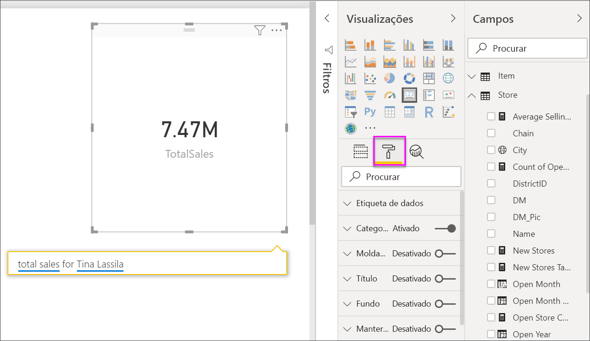
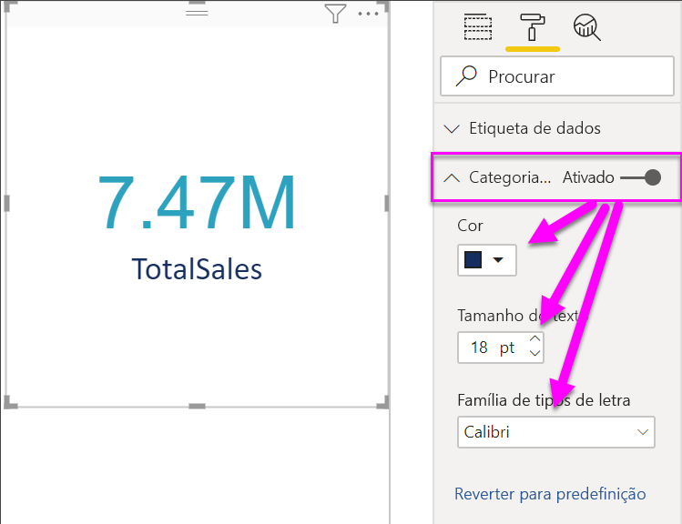
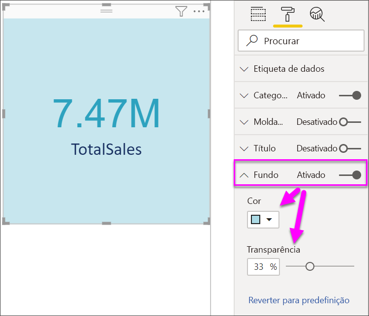

# Criar visualizações de cartão

[!INCLUDE[consumer-appliesto-nyyn](../includes/consumer-appliesto-nyyn.md)]

[!INCLUDE [power-bi-visuals-desktop-banner](../includes/power-bi-visuals-desktop-banner.md)]

Por vezes, um único número é a coisa mais importante que pretende controlar no seu dashboard ou relatório do Power BI, como as vendas totais, a quota de mercado ano após ano ou o total de oportunidades. Este tipo de visualização é denominado um *Cartão*. Tal como acontece com quase todas as visualizações nativas do Power BI, os Cartões podem ser criados com o editor de relatórios ou as Perguntas e Respostas.

> [!NOTE]
> Para partilhar o seu relatório com outro utilizador do Power BI, é necessário que ambos tenham licenças individuais do Power BI Pro ou que o relatório seja guardado numa capacidade Premium.

## Pré-requisito

Este tutorial utiliza o [ficheiro PBIX de Exemplo de Análise de Revenda](https://download.microsoft.com/download/9/6/D/96DDC2FF-2568-491D-AAFA-AFDD6F763AE3/Retail%20Analysis%20Sample%20PBIX.pbix).

1. Na secção superior esquerda da barra de menus, selecione **Ficheiro** \> **Abrir**
   
2. Encontre a sua cópia do **ficheiro PBIX de Exemplo de Análise de Revenda**.

1. Abra o **Ficheiro PBIX do Exemplo de Análise de Revenda** na vista de relatório .

1. Selecionar  para adicionar uma nova página.

## Opção 1: Criar um cartão com o editor de relatórios

O primeiro método para criar um cartão é utilizar o editor de relatórios no Power BI Desktop.

1. Comece numa página de relatório em branco e selecione o campo **Store** (Loja) \> **Open store count** (Contagem de lojas abertas).

    O Power BI cria um gráfico de colunas com um número.

   

2. No painel Visualizações, selecione o ícone de cartão.

   

Acabou de criar com êxito um cartão com o editor de relatórios. Segue abaixo a segunda opção para criar um cartão com a caixa de Perguntas e Respostas.

## Opção 2: Criar um cartão a partir da caixa de Perguntas e Respostas
A caixa de Perguntas e Respostas constitui outra opção para criar um cartão. Esta caixa está disponível na vista de relatório do Power BI Desktop.

1. Começar numa página de relatório em branco

1. Na parte superior da janela, selecione o ícone **Faça uma Pergunta**. 

    O Power BI criará um cartão e uma caixa para a sua pergunta. 

   

2. Por exemplo, escreva "Total Sales for Tina" (Total de Vendas de Tina) na caixa de perguntas.

    A caixa de perguntas ajuda-o com sugestões e reformulações e, finalmente, apresenta o número total.  

   

   

Concluiu a criação com êxito de um cartão com a caixa de Perguntas e Respostas. Seguem-se abaixo os passos para formatar o seu cartão de acordo com as suas necessidades específicas.

## Formatar um cartão
Tem várias opções para alterar etiquetas, texto, cor e muito mais. A melhor forma de aprender é criar um cartão e, em seguida, explorar o Painel de formatação. Seguem-se algumas das opções de formatação disponíveis. 

O painel Formatação está disponível ao interagir com o cartão num relatório. 

1. Comece por selecionar o ícone de rolo de pintura para abrir o painel Formatação. 

    

2. Com o cartão selecionado, expanda **Etiqueta de dados** e altere a cor, o tamanho e a família do tipo de letra. Se tiver milhares de arquivos, pode utilizar **Mostrar unidades** para mostrar o número de arquivos por milhares e controlar as casas decimais. Por exemplo, 125,8 mil em vez de 125 832,00.

    

3.  Expanda **Etiqueta de categoria** e altere a cor e o tamanho.

    

4. Expanda **Fundo** e mova o controlo de deslize para Ativo.  Agora, pode alterar a cor de fundo e a transparência.

    

5. Continue a explorar as opções de formatação até que o cartão esteja exatamente como gostaria. 

## Considerações e resolução de problemas
Se não vir uma caixa de perguntas, contacte o administrador do sistema ou inquilino.    

## Próximos passos
[Gráficos de combinação no Power BI](power-bi-visualization-combo-chart.md)

[Tipos de visualização no Power BI](power-bi-visualization-types-for-reports-and-q-and-a.md)
