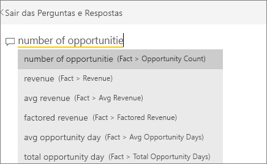

# Visualizações de cartão
Por vezes, um único número é a coisa mais importante que pretende controlar no seu dashboard ou relatório do Power BI, como as vendas totais, a quota de mercado ano após ano ou o total de oportunidades. Este tipo de visualização é denominado um *Cartão*. Tal como acontece com quase todas as visualizações nativas do Power BI, os Cartões podem ser criados com o editor de relatórios ou as Perguntas e Respostas.

## Criar um cartão com o editor de relatórios
Estas instruções utilizam o Exemplo de Análise de Retalho. Para acompanhar, [transfira o exemplo](../sample-datasets.md) do serviço do Power BI (app.powerbi.com) ou o Power BI Desktop.   

1. Comece numa página de relatório em branco e selecione o campo **Arquivo** \> **Contagem de arquivos abertos**. Se estiver a utilizar o serviço do Power BI, terá de abrir o relatório na [Vista de Edição](../service-interact-with-a-report-in-editing-view.md).

    O Power BI cria um gráfico de colunas com um número.

   
2. No painel de Visualizações, selecione o ícone de Cartão.

   
6. Passe o cursor sobre um cartão e selecione o ícone de afixar  para adicionar a visualização a um dashboard.

   
7. Afixe o mosaico num dashboard existente ou num novo dashboard.

   * Dashboard existente: selecione o nome do dashboard na lista pendente.
   * Novo dashboard: escreva o nome do novo dashboard.
8. Selecione **Afixar**.

   Uma mensagem de Êxito (perto do canto superior direito) informa que a visualização foi adicionada, como um mosaico, ao dashboard.

   
9. Selecione **Ir para o dashboard**. Aqui, pode [editar e mover](../service-dashboard-edit-tile.md) a visualização afixada.

## Criar um cartão a partir da caixa de Perguntas e Respostas
A caixa de Perguntas e Respostas é a forma mais fácil de criar um Cartão. A caixa de Perguntas e Respostas está disponível no serviço Power BI (app.powerbi.com) de um dashboard ou na vista de relatório do Desktop. Os passos abaixo descrevem a criação de um Cartão a partir de um dashboard do serviço do Power BI. Se gostaria de criar um cartão com as Perguntas e Respostas no Power BI Desktop, [siga estas instruções](https://powerbi.microsoft.com/blog/power-bi-desktop-december-feature-summary/#QandA) para a pré-visualização de Perguntas e Respostas para relatórios do Desktop.

1. Crie um [dashboard](../service-dashboards.md) e [obtenha dados](../service-get-data.md). Este exemplo utiliza o [Exemplo de Análise de Oportunidade](../sample-opportunity-analysis.md).

1. Na parte superior do dashboard, comece a escrever o que deseja saber sobre os dados na caixa de perguntas. 

   

> [!TIP]
> A partir de um relatório de serviço do Power BI, em Editar vista, selecione **Fazer uma pergunta** na barra de menu superior. A partir de um relatório do Power BI Desktop, encontre algum espaço livre num relatório e clique duas vezes para abrir uma caixa de perguntas.

3. Por exemplo, escreva "número de oportunidades" na caixa de perguntas.

   

   A caixa de perguntas ajuda-o com sugestões e reformulações e, finalmente, apresenta o número total.  
4. Selecione o ícone de afixar  no canto superior direito para adicionar o cartão a um dashboard.

   
5. Afixe o cartão, como um mosaico, num dashboard existente ou num novo dashboard.

   * Dashboard existente: selecione o nome do dashboard no menu suspenso. As suas opções estão limitadas apenas a estes dashboards na área de trabalho atual.
   * Novo dashboard: escreva o nome do novo dashboard e este será adicionado à sua área de trabalho atual.
6. Selecione **Afixar**.

   Uma mensagem de Êxito (junto ao canto superior direito) informa que a visualização foi adicionada, como um mosaico, ao dashboard.  

   
7. Selecione **Ir para o dashboard** para ver o novo mosaico. Aqui, pode [mudar o nome, redimensionar, adicionar uma hiperligação, reposicionar o mosaico e muito mais](../service-dashboard-edit-tile.md) no seu dashboard.

   

## Considerações e resolução de problemas
- Se não vir uma caixa de perguntas, contacte o administrador do sistema ou inquilino.    
- Se estiver a utilizar o Desktop e a clicar duas vezes em espaço vazio num relatório que não abre as Perguntas e Respostas, terá de o ativar.  Selecione **Ficheiro > Opções e Definições > Opções > Funcionalidades de pré-visualização > Perguntas e Respostas** e reinicie o Desktop.

## Formatar um cartão
Tem várias opções para alterar etiquetas, texto, cor e muito mais. A melhor forma de aprender é criar um cartão e, em seguida, explorar o Painel de formatação. Seguem-se algumas das opções de formatação disponíveis. 

1. Comece por selecionar o ícone do rolo de pintura para abrir o Painel de formatação. 

    
2. Expanda **Etiqueta de dados** e altere a cor, o tamanho e a família do tipo de letra. Se tiver milhares de arquivos, pode utilizar **Mostrar unidades** para mostrar o número de arquivos por milhares e controlar as casas decimais. Por exemplo, 125,8 mil em vez de 125 832,00.

3.  Expanda **Etiqueta de categoria** e altere a cor e o tamanho.

    

4. Expanda **Fundo** e mova o controlo de deslize para Ativo.  Agora, pode alterar a cor de fundo e a transparência.

    

5. Continue a explorar as opções de formatação até que o cartão esteja exatamente como gostaria. 

    

## Próximos passos
[Gráficos de combinação no Power BI](power-bi-visualization-combo-chart.md)

[Tipos de visualização no Power BI](power-bi-visualization-types-for-reports-and-q-and-a.md)
