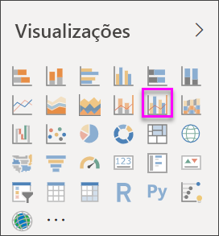
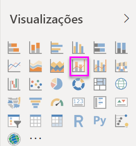

# Criar e utilizar gráficos de combinação no Power BI

[!INCLUDE [power-bi-visuals-desktop-banner](../includes/power-bi-visuals-desktop-banner.md)]

No Power BI, um gráfico de combinação é uma visualização única que combina um gráfico de linhas e um gráfico de colunas. Combinar os 2 gráficos em um, permite-lhe fazer uma comparação rápida dos dados.

Os gráficos de combinação podem ter um ou dois eixos Y.

## Quando utilizar um Gráfico de combinação
Os gráficos de combinação são uma ótima opção:

* quando tem um gráfico de linhas e um gráfico de colunas com o mesmo eixo X.
* para comparar várias medidas com intervalos de valores diferentes.
* para ilustrar a correlação entre duas medidas numa visualização.
* para verificar se uma medida atende o destino definido pela outra medida
* para conservar o espaço da tela.

### Pré-requisitos
Este tutorial utiliza o [ficheiro PBIX do Exemplo de Análise de Revenda](https://download.microsoft.com/download/9/6/D/96DDC2FF-2568-491D-AAFA-AFDD6F763AE3/Retail%20Analysis%20Sample%20PBIX.pbix).

1. Na secção superior esquerda da barra de menus, selecione **Ficheiro** > **Abrir**.
   
2. Procure a sua cópia do **ficheiro PBIX do Exemplo de Análise de Revenda**

1. Abra o **Ficheiro PBIX do Exemplo de Análise de Revenda** na vista de relatório .

1. Seleção  para adicionar uma nova página.

## Criar um Gráfico de Combinação básico de eixo único
Veja o Will a criar um gráfico de combinação através do exemplo Vendas e Marketing.
   > [!NOTE]
   > Este vídeo utiliza uma versão mais antiga do Power BI Desktop.
   > 
   > 
<iframe width="560" height="315" src="https://www.youtube.com/embed/lnv66cTZ5ho?list=PL1N57mwBHtN0JFoKSR0n-tBkUJHeMP2cP" frameborder="0" allowfullscreen></iframe>  

1. Comece numa página de relatório em branco e crie um gráfico de coluna que apresenta as vendas deste ano e a margem bruta por mês.

    a.  No painel Campos, selecione **Sales** (Vendas) \> **This Year Sales** (Vendas Deste Ano)  > **Value** (Valor).

    b.  Arraste **Sales** (Vendas) \> **Gross Margin This Year** (Margem Bruta Deste Ano) para o painel **Value** (Valor).

    c. Selecione **Time** (Hora) \> **FiscalMonth** (MêsFiscal) para adicionar este campo à área **Eixo**.

    
5. Selecione **Mais opções** (...) no canto superior direito da visualização e, em seguida, **Ordenar por > MêsFiscal**. Para alterar a sequência de ordenação, selecione as reticências novamente e selecione **Ordenação ascendente** ou **Ordenação descendente**. Para este exemplo, vamos utilizar **Ordenação ascendente**.

6. Converta o gráfico de colunas num gráfico de combinação. Existem dois gráficos de combinação disponíveis: **Linhas e colunas empilhadas**e **Linhas e colunas agrupadas**. Com o gráfico de colunas selecionado, no painel **Visualizações**, selecione **Gráfico de linhas e de colunas agrupadas**.

    
7. No painel **Campos**, arraste **Sales** (Vendas) \> **Last Year Sales** (Vendas do Ano Passado) até ao grupo **Valores de Linha**.

   

   O gráfico de combinação deve ter esta aparência:

   

## Criar um gráfico de combinação com dois eixos
Nesta tarefa, vamos comparar as vendas e a margem bruta.

1. Crie um novo gráfico de linhas que acompanha a **% da Margem Bruta do ano passado** por **Mês Fiscal**. Selecione as reticências para ordenar por **Mês** e **Ascendente**.  
Em janeiro, a % de Margem Bruta foi de 35%, alcançou o seu máximo de 45% em abril, caiu em julho e regressou ao máximo novamente em agosto. Será que vamos ver um padrão semelhante nas vendas do ano passado e deste ano?

   
2. Adicione **Vendas Deste Ano > Valor** e **Vendas do Ano Passado** ao gráfico de linhas. A escala de **% de Margem Bruta do Ano Passado** é muito inferior à escala de **Vendas**, o que dificulta a comparação.      

   
3. Para tornar o elemento visual mais fácil de ler e interpretar, converta o gráfico de linhas num Gráfico de Linhas e Coluna Empilhada.

   

4. Arraste **% de Margem Bruta no Ano Passado** de **Valores de Coluna** para **Valores de Linha**. O Power BI cria dois eixos, o que permite que os conjuntos de dados sejam escalados de modo diferente: o eixo à esquerda calcula as vendas em dólares e o eixo à direita calcula a percentagem. Vemos a resposta à nossa pergunta: sim, podemos ver um padrão semelhante.

       

## Adicionar títulos aos eixos
1. Selecione o ícone de rolo de pintura  para abrir o painel Formatação.
1. Selecione a seta para baixo para expandir as opções do **eixo Y** .
1. Para **Eixo Y (Coluna)** , defina **Posição** como **Esquerda**, **Título** como **Ativado**, **Estilo** como **Mostrar apenas título** e **Apresentar unidades** como **Milhões**.

   
4. Em **Eixo Y (Coluna)** , navegue para baixo até ver **Mostrar secundário**. Uma vez que há tantas opções para os eixos Y, poderá ter de utilizar ambas as barras de deslocamento. A secção Mostrar secundário apresenta as opções de formatação da parte do gráfico de linhas do gráfico de combinação.

   
5. Para **Eixo Y (Linha)** , deixe **Posição** como **Direita**, **Título** como **Ativado** e defina **Estilo** como **Mostrar apenas título**.

   O gráfico de combinação apresenta agora eixos duplos, ambos com títulos.

   

6. Opcionalmente, modifique o tipo de letra do texto, o tamanho e a cor, e defina outras opções de formatação para melhorar o ecrã e a facilidade de leitura do gráfico.

Aqui poderá:

* [Adicionar o gráfico de combinação como um mosaico do dashboard](../service-dashboard-tiles.md).
* [Guarde o relatório](../service-report-save.md).
* [Tornar o relatório mais acessível para pessoas portadoras de deficiência](../desktop-accessibility.md).

## Destaque e filtragem cruzada

Realçar uma coluna ou linha num gráfico de combinação destaca e filtra de forma cruzada as outras visualizações na página de relatório e vice-versa. Para alterar este comportamento padrão, utilize as [interações visuais](../service-reports-visual-interactions.md).

## Próximas etapas

[Gráficos em anel no Power BI](power-bi-visualization-doughnut-charts.md)

[Tipos de visualização no Power BI](power-bi-visualization-types-for-reports-and-q-and-a.md)
