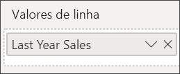

# Gráfico de Combinação no Power BI
No Power BI, um gráfico de combinação é uma visualização única que combina um gráfico de linhas e um gráfico de colunas. Combinar os 2 gráficos em um, permite-lhe fazer uma comparação rápida dos dados.

Os gráficos de combinação podem ter um ou dois eixos Y.

## Quando utilizar um Gráfico de Combinação
Os gráficos de combinação são uma ótima opção:

* quando tem um gráfico de linhas e um gráfico de colunas com o mesmo eixo X.
* para comparar várias medidas com intervalos de valores diferentes.
* para ilustrar a correlação entre duas medidas numa visualização.
* para verificar se uma medida atende o destino definido pela outra medida
* para conservar o espaço da tela.

### Pré-requisitos
Os Gráficos de combinação estão disponíveis no serviço Power BI e no Power BI Desktop. Este tutorial utiliza o serviço Power BI para criar um Gráfico de combinação. Para acompanhar, abra o serviço Power BI e ligue ao exemplo "Análise de Revenda" [instruções abaixo](#create)).

## Criar um Gráfico de Combinação básico de eixo único
Veja o Will a criar um gráfico de combinação através do exemplo Vendas e Marketing.

<iframe width="560" height="315" src="https://www.youtube.com/embed/lnv66cTZ5ho?list=PL1N57mwBHtN0JFoKSR0n-tBkUJHeMP2cP" frameborder="0" allowfullscreen></iframe>  

 Para criar o seu próprio gráfico de combinação, inicie sessão no serviço Power BI e selecione **Obter Dados \> Exemplos \> Exemplo de Análise de Revenda > Ligar > Aceder ao dashboard**.

1. No dashboard "Exemplo de Análise de Revenda", selecione o mosaico **Total de Lojas** para abrir o relatório "Exemplo de Análise de Revenda".
2. Selecione **Editar Relatório** para abrir o relatório na Vista de Edição.
3. Adicione uma nova página de relatório.
4. Crie um gráfico de coluna que apresenta as vendas deste ano e a margem bruta por mês.

    a.  No painel Campos, selecione **Vendas** \> **Vendas do Último Ano** > **Valor**.

    b.  Arraste **Vendas** \> **Margem Bruta Deste Ano** para o painel **Valor**.

    c. Selecione **Hora** \> **MêsFiscal** para adicionar este campo ao painel **Eixo**.

    
5. Selecione as reticências (…) no canto superior direito da visualização e selecione **Ordenar por > MêsFiscal**. Para alterar a sequência de ordenação, selecione as reticências novamente e selecione **Ordenação ascendente** ou **Ordenação descendente**.

6. Converta o gráfico de colunas num gráfico de combinação. Estão disponíveis dois gráficos de combinação: **Coluna de linhas e empilhada** e **Coluna de linhas e em cluster**. Com o gráfico de colunas selecionado, no painel **Visualizações**, selecione **Gráfico de linhas e de colunas agrupadas**.

    
7. No painel **Campos**, arraste **Vendas** \> **Vendas do Ano Passado** até ao registo **Valores de Linha**.

   

   O gráfico de combinação deve ter esta aparência:

   

## Criar um gráfico de combinação com dois eixos
Nesta tarefa, vamos comparar as vendas e a margem bruta.

1. Criar um novo gráfico de linhas que controla **margem bruta % do ano passado** por **Mêsfiscal**. Selecione as reticências para ordenar por **Mês** e **Ascendente**.  
Em janeiro, a percentagem de Margem Bruta foi de 35%, chegando ao máximo de 45% em abril, caindo em julho e chegando ao máximo novamente em agosto. Será que vamos ver um padrão semelhante nas vendas do ano passado e deste ano?

   
2. Adicione **Vendas Deste Ano > Valor** e **Vendas do Ano Passado** ao gráfico de linhas. A escala de **% de Margem Bruta do Ano Passado** é muito inferior à escala de **Vendas**, o que dificulta a comparação.      

   
3. Para tornar o elemento visual mais fácil de ler e interpretar, converta o gráfico de linhas num gráfico de Linhas e Colunas Empilhadas.

   
4. Arraste **% de Margem Bruta no Ano Passado** de **Valores de Coluna** para **Valores de Linha**. O Power BI cria dois eixos, o que permite que os conjuntos de dados sejam escalados de modo diferente: o eixo à esquerda calcula as vendas em dólares e o eixo à direita calcula a percentagem. Vemos a resposta à nossa pergunta: sim, podemos ver um padrão semelhante.

       

## Adicionar títulos aos eixos
1. Selecione o ícone de rolo de tinta  para abrir o painel Formatar.
2. Selecione a seta para baixo para expandir as opções do **eixo Y** .
3. Para **eixo y (coluna)** , defina **posição** para **esquerda**, defina **Title** para **no**,  **Estilo** para **Mostrar apenas título**, e **unidades de apresentação** como **milhões**.

   
4. Sob **eixo y (coluna)** , desloque para baixo até ver **Mostrar secundário**. Como existem muitas opções para os eixos Y, poderá ter de utilizar ambas as barras de rolagem. A secção de secundária Show apresenta as opções de formatação a parte do gráfico de linha do gráfico de combinação.

   
5. Para **Eixo Y (Linha)** , deixe **Posição** como **Direita**, **Título** como **Ativado** e defina **Estilo** como **Mostrar apenas título**.

   O gráfico de combinação apresenta agora eixos duplos, ambos com títulos.

   

6. Opcionalmente, modifique o tipo de letra do texto, o tamanho e a cor, e defina outras opções de formatação para melhorar o ecrã e a facilidade de leitura do gráfico.

Aqui poderá:

* [Adicionar o gráfico de combinação como um mosaico do dashboard](../service-dashboard-tiles.md).
* [Guarde o relatório](../service-report-save.md).
* [Tornar o relatório mais acessível para pessoas portadoras de deficiência](../desktop-accessibility.md).

## Destaque e filtragem cruzada

Realçar uma coluna ou linha num gráfico de combinação destaca e filtra de forma cruzada as outras visualizações na página de relatório e vice-versa. Para alterar este comportamento padrão, utilize as [interações visuais](../service-reports-visual-interactions.md).

## Próximos passos

[Gráficos em anel no Power BI](power-bi-visualization-doughnut-charts.md)

[Tipos de visualização no Power BI](power-bi-visualization-types-for-reports-and-q-and-a.md)
