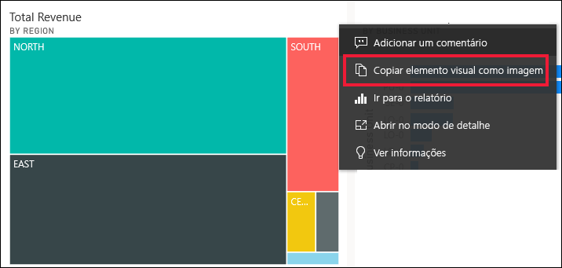
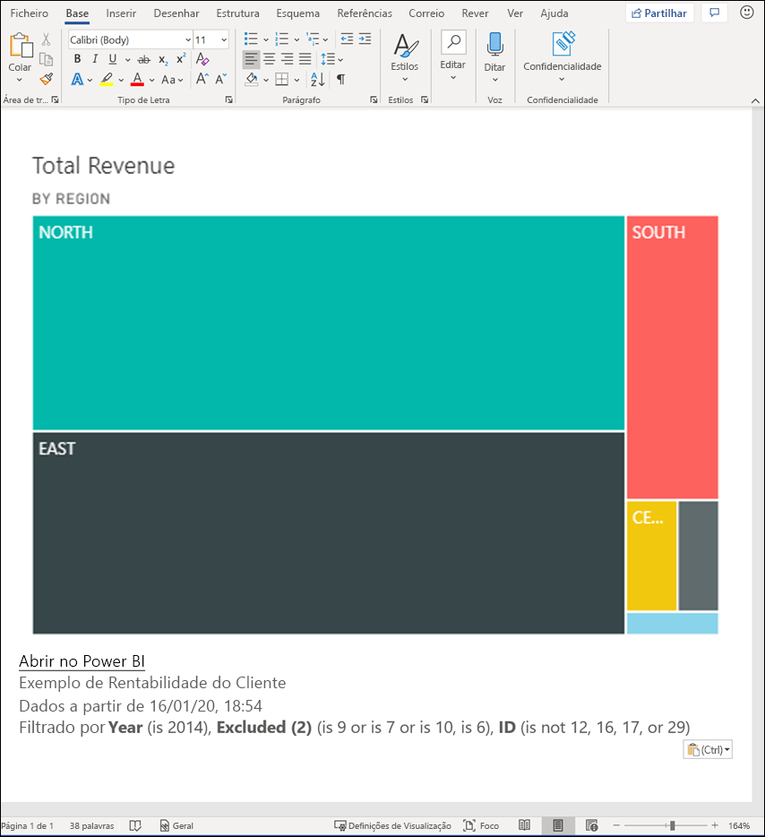
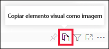
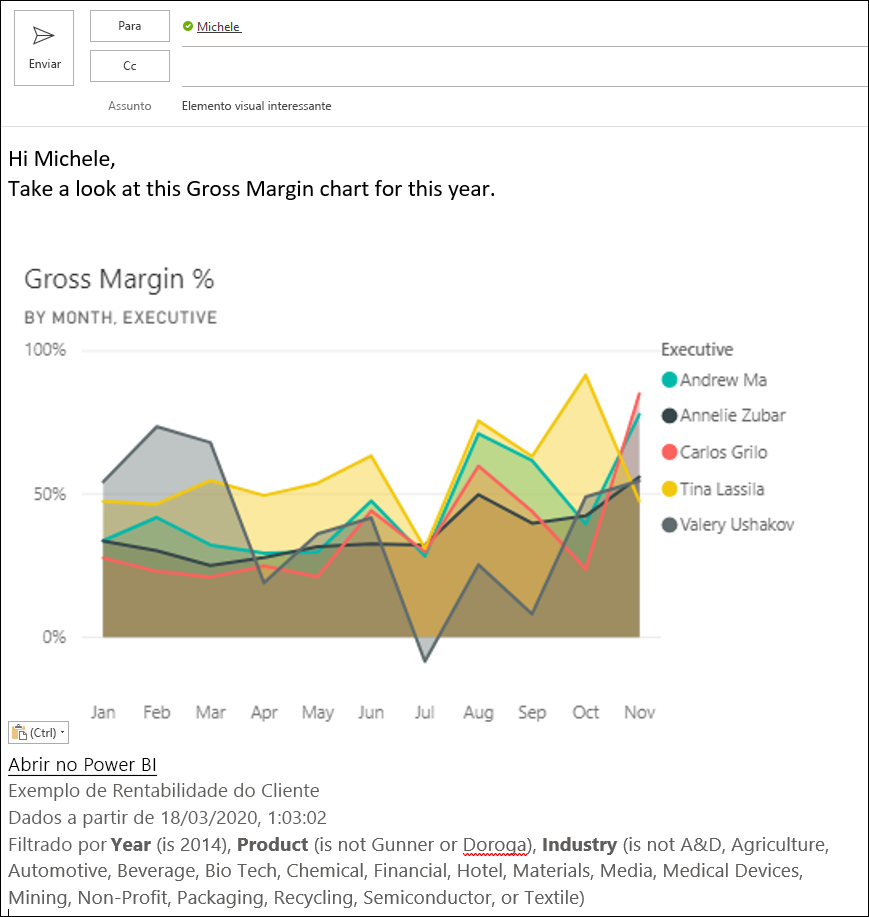
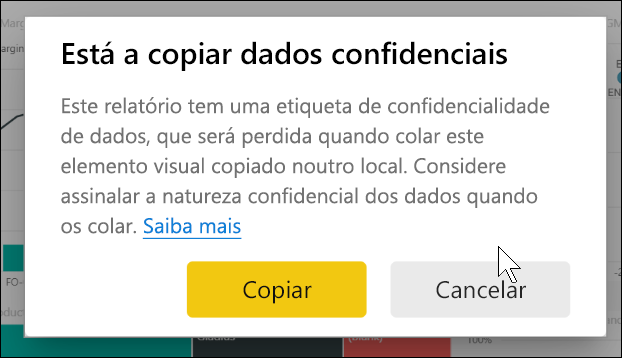
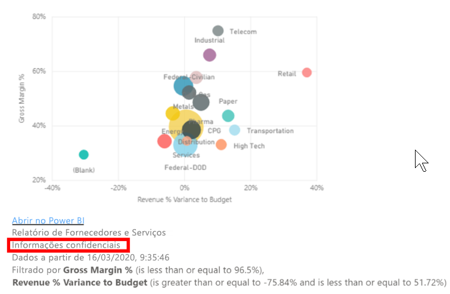
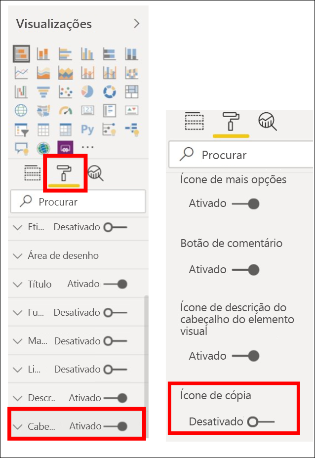
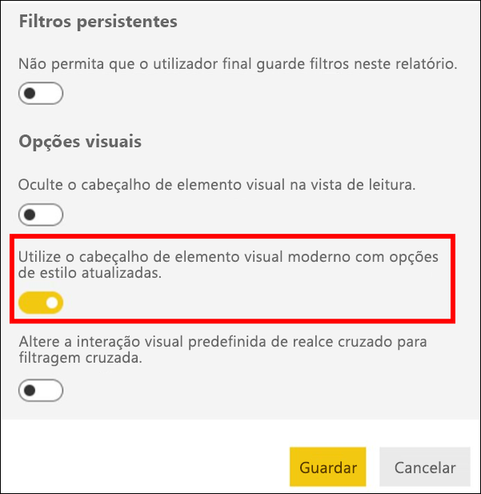
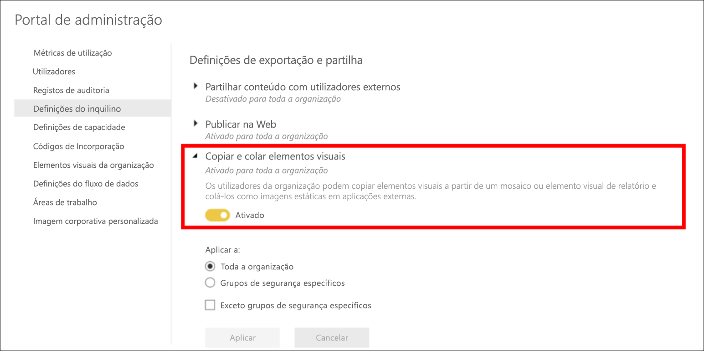
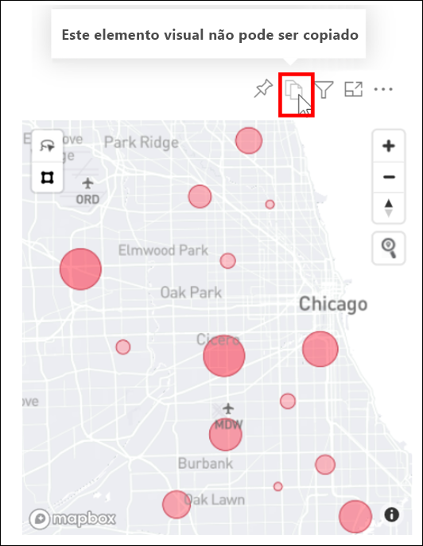

# Copiar e colar uma visualização de relatório

[!INCLUDE[consumer-appliesto-yyyn](../includes/consumer-appliesto-yyyn.md)]

Este artigo aborda duas formas diferentes de copiar e colar um elemento visual: 
* copiar um elemento visual num relatório e colá-lo noutra página de relatório (requer permissões de edição para o relatório)

* copiar uma imagem de um elemento visual do Power BI na área de transferência e colá-la noutras aplicações

## Copiar e colar dentro do mesmo relatório
Os elementos visuais nos relatórios do Power BI podem ser copiados de uma página no relatório para a mesma página ou para uma página diferente no mesmo relatório. 

Copiar e colar uma visualização exige permissões de edição para o relatório. No serviço Power BI, isto significa abrir o relatório na [Vista de Edição](../consumer/end-user-reading-view.md). 

Não pode copiar e colar as visualizações nos *dashboards* em relatórios do Power BI ou noutros dashboards.

1. Abra um relatório que tenha, pelo menos, uma visualização.  

2. Selecione a visualização e use **Ctrl + C** para copiar, e **Ctrl + V** para colar.      

   

## Copiar um elemento visual como uma imagem na área de transferência

Já alguma vez quis partilhar uma imagem de um dashboard ou relatório do Power BI? Agora, pode copiar o elemento visual e colá-lo em qualquer outra aplicação que suporte essa ação. 

Quando copiar uma imagem estática de um elemento visual, obterá uma cópia do elemento visual juntamente com os metadados. O que está incluído:
* ligar de volta ao dashboard ou relatório do Power BI
* título do dashboard ou relatório
* aviso se a imagem tiver informações confidenciais
* carimbo de data/hora da última atualização
* filtros aplicados ao elemento visual

### Copiar de um mosaico do dashboard

1. Navegue até ao dashboard a partir do qual quer copiar.

2. No canto superior direito do elemento visual, selecione **Mais opções(...)** e escolha **Copiar elemento visual como imagem**. 

    

3. Quando a caixa de diálogo **O elemento visual está pronto para a cópia**, selecione **Copiar para a área de transferência**.

    

4. Quando o elemento visual estiver pronto, cole-o noutra aplicação com **Ctrl + V** ou clique com o botão direito do rato > Colar. Na captura de ecrã abaixo, colamos o elemento visual no Microsoft Word. 

    

### Copiar a partir de um elemento visual de relatório 

1. Navegue até ao relatório a partir do qual quer copiar.

2. No canto superior direito do elemento visual, selecione o ícone **Copiar elemento visual como imagem**. 

    

3. Quando a caixa de diálogo **O elemento visual está pronto para a cópia**, selecione **Copiar para a área de transferência**.

    

4. Quando o elemento visual estiver pronto, cole-o noutra aplicação com **Ctrl + V** ou clique com o botão direito do rato > Colar. Na captura de ecrã abaixo, colamos o elemento visual num e-mail.

    

5. Se existir uma etiqueta de confidencialidade de dados aplicada ao relatório, receberá um aviso quando selecionar o ícone de cópia.  

    

    Além disso, será adicionada uma etiqueta de confidencialidade aos metadados abaixo do elemento visual colado. 

    

### Gerir a utilização da opção Copiar elemento visual como imagem
Se for proprietário do conteúdo ou for um administrador do inquilino, poderá controlar se um elemento visual pode ser copiado como uma imagem a partir de um relatório ou dashboard.

#### Desativar a opção Copiar como imagem para um elemento visual específico
Se não quiser que os utilizadores copiem um elemento visual específico, poderá remover o ícone de cópia desse elemento visual.
1. Selecione o ícone de rolo de tinta para abrir o painel Formatação. 

1. Abra o cartão **Formatação visual**.
1. Desloque-se até **Cabeçalho do elemento visual**, expanda o cartão e desative o **Ícone de copiar**.

    

1. Se não conseguir localizar a definição **Cabeçalho do elemento visual**, ative a opção de cabeçalho do elemento visual moderno em **Definições do relatório**. 

    

1. Guardar alterações. Partilhe e publique novamente conforme necessário.

#### Desativar a opção Copiar como imagem para um grupo de utilizadores

Se for proprietário do conteúdo ou administrador do inquilino, poderá controlar quem pode copiar os elementos visuais. Esta definição desativa a opção *Copiar elemento visual como imagem* para todos os conteúdos a que o utilizador acede no inquilino do Power BI.
  
1. Navegue até ao Portal de Administração.

1. Em **Configurações de inquilino**, selecione **Definições de exportação e partilha**. 

    

1. Desative **Copiar e colar elementos visuais**, para os grupos de utilizadores selecionados. 

1. Depois de guardar as alterações, os grupos especificados deixarão de poder utilizar **Copiar elemento visual como imagem** em todo o Power BI. 
  

## Considerações e resolução de problemas

   

P: Porque é que o ícone Copiar está desativado num elemento visual?    
R: Atualmente, suportamos elementos visuais nativos do Power BI e Elementos Visuais Certificados. Existe um suporte limitado para certos elementos visuais, incluindo: 
- Elementos visuais ESRI e outros elementos visuais de Mapa 
- Elementos visuais do Python 
- Visuais R 
- PowerApps 
- Elementos visuais personalizados não certificados para que o seu elemento visual personalizado seja suportado. Saiba mais sobre [como certificar o elemento visual personalizado](../developer/visuals/power-bi-custom-visuals-certified.md). 

P: Porque é que o meu elemento visual não está a ser colado corretamente?    
R: Existem limitações com a cópia de elementos visuais como imagem: 
- Para elementos visuais personalizados 
    - Elementos visuais com temas e cores aplicados 
    - Dimensionamento de mosaico ao colar 
    - Elementos visuais personalizados com animações 
- Restrições de cópia 
    - Não pode copiar um mosaico do dashboard recentemente afixado 
    - Não pode redirecionar os utilizadores para conteúdos com filtros OData e estados temporários, como marcadores pessoais 
- As aplicações com suporte limitado para colar conteúdos formatados em HTML a partir da área de transferência podem não compor tudo o que foi copiado do elemento visual 

## Próximos passos
Mais sobre [Visualizações nos relatórios do Power BI](power-bi-report-visualizations.md)

Mais perguntas? [Pergunte à Comunidade do Power BI](https://community.powerbi.com/)

