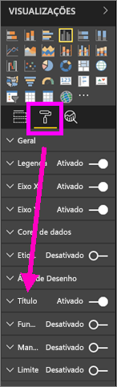
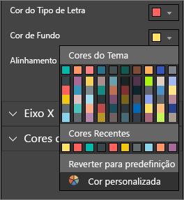
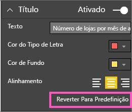
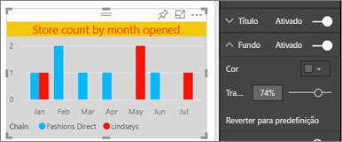
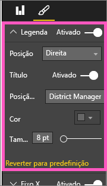
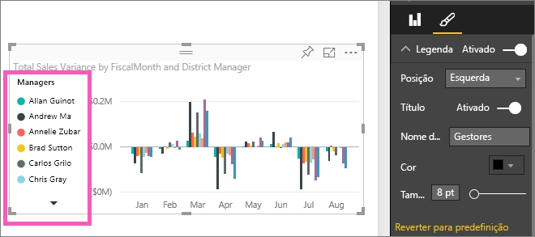

# Personalizar títulos, legendas e fundos de visualização
Neste tutorial, aprenderá várias formas de personalizar as visualizações.   Existem muitas opções para personalizar as visualizações. A melhor forma de obter informações sobre todas estas opções é explorar o painel de Formatação (selecione o ícone do rolo de tinta).  Para começar, este artigo mostra-lhe como pode personalizar um título, uma legenda e um fundo de visualização.  

Nem todas as visualizações podem ser personalizadas; [veja a lista completa](#list).  

Veja a Amanda a personalizar visualizações no seu relatório (avance para o minuto 4:50 do vídeo). Em seguida, siga as instruções por baixo do vídeo para experimentar com os seus próprios dados.

<iframe width="560" height="315" src="https://www.youtube.com/embed/IkJda4O7oGs" frameborder="0" allowfullscreen></iframe>

### Pré-requisitos
- Serviço Power BI ou Power BI Desktop
- Exemplo de Análise de Revenda

## Personalizar títulos de visualização em relatórios
Para acompanhar, inicie sessão no serviço Power BI (app.powerbi.com) e [abra o relatório Exemplo de Análise de Revenda](../sample-datasets.md) na [Vista de Edição](../service-interact-with-a-report-in-editing-view.md).

> [!NOTE]
> Ao afixar uma visualização num dashboard, ela se torna um mosaico do dashboard.  Os próprios mosaicos também podem ser personalizados com [novos títulos e subtítulos, assim como hiperligações, e podem ser redimensionados](../service-dashboard-edit-tile.md).
> 
> 

1. Navegue até a página "Nossas Lojas" do relatório e selecione o gráfico de colunas "Abrir contagem de armazenamento por mês em aberto...".
2. No painel Visualizações, selecione o ícone do rolo de tinta para apresentar as opções de formatação.  e selecione **Título** para expandir essa secção.  

   
3. Ative e desative o  **Título** selecionando o controlo deslizante Ativar (ou Desativar). Por enquanto, deixe em **Ativar**.  

   
4. Altere o **Texto do Título** escrevendo **Contagem de armazenamento por mês em aberto** no campo de texto.  
5. Altere a **Cor da origem** para cor de laranja e a **Cor do Plano de Fundo** para amarelo.

   * Selecione o menu suspenso e escolha uma cor em **Cores do Tema**, **Cores Recentes**ou **Cores Personalizadas**.
   * Selecione o menu suspenso para fechar a janela de cores.  
     

   Pode sempre voltar às cores predefinidas selecionando **Reverter para predefinido** na janela de cores.
6. Aumente o tamanho do texto para 12.
7. A última personalização que faremos no título do gráfico é alinhá-lo no centro da visualização. A posição do título por predefinição é alinhada à esquerda.  
   

    Nesta fase do tutorial, o gráfico de colunas **título** deverá ter um aspeto semelhante ao seguinte:  
    

    Para reverter toda a personalização de título que fizemos até agora, selecione **Reverter para Padrão**na parte inferior do painel de personalização **Título** .  
    

## Personalizar planos de fundo de visualização
Com o mesmo gráfico de coluna selecionado, expanda as opções do fundo.

1. Ative e desative o fundo selecionando o controlo deslizante Ativar (ou Desativar). Por enquanto, deixe em **Ativar**.
2. Altere a cor de fundo para 74% cinzento.

   * Selecione o menu pendente e escolha uma cor cinzenta em **Cores de Tema**, **Cores Recentes**ou **Cor personalizada**.
   * Altere a Transparência para 74%.   
     

   Para reverter a personalização do fundo do título que fizemos até agora, selecione **Reverter para padrão**na parte inferior do painel de personalização **Plano de fundo** .

## Personalizar legendas de visualização
1. Abra a página **Visão geral** do relatório e selecione o gráfico "Variação das vendas totais por mês fiscal e gerente do distrito".
2. No separador Visualização, selecione o ícone de pincel para abrir o painel de formatação.  
3. Expanda as opções de **Legenda** .

      
4. Ative e desative a legenda selecionando o controlo deslizante Ativar (ou Desativar). Por enquanto, deixe em **Ativar**.
5. Mova a legenda para a esquerda da visualização.    
6. Adicione um título de legenda alternando o **Título** para **Ativado** e, no campo **Nome da legenda**, escrevendo **Gerentes**.
   

   Para reverter toda a personalização de legenda que fizemos até agora, selecione **Reverter para Predefinição**na parte inferior do painel de personalização **Legenda** .

## Tipos de visualização que podem ser personalizados

| Visualização | Título | Fundo | Legenda |
|:--- |:--- |:--- |:--- |
| área |sim |sim |sim |
| barra |sim |sim |sim |
| cartão |sim |sim |n/a |
| cartão de várias linhas |sim |sim |n/a |
| coluna |sim |sim |sim |
| combinação |sim |sim |sim |
| rosca |sim |sim |sim |
| mapa de manchas |sim |sim |sim |
| funil |sim |sim |n/a |
| medidor |sim |sim |n/a |
| kpi |sim |sim |n/a |
| linha |sim |sim |sim |
| mapa |sim |sim |sim |
| matriz |sim |sim |n/a |
| circular |sim |sim |sim |
| dispersão |sim |sim |sim |
| segmentação de dados |sim |sim |n/a |
| tabela |sim |sim |n/a |
| caixa de texto |não |sim |n/a |
| mapa de árvore |sim |sim |sim |
| cascata |sim |sim |sim |

## Próximos passos
[Personalizar os eixos X e Y](power-bi-visualization-customize-x-axis-and-y-axis.md)  
[Personalizar propriedades de cores e de eixo](service-getting-started-with-color-formatting-and-axis-properties.md)  
[Power BI - Conceitos Básicos](../service-basic-concepts.md)  
Mais perguntas? [Pergunte à Comunidade do Power BI](http://community.powerbi.com/)

