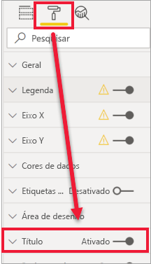
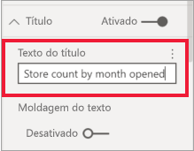
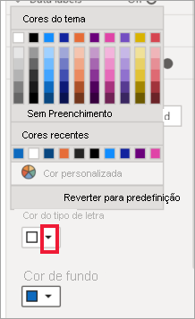
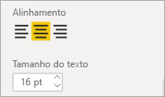
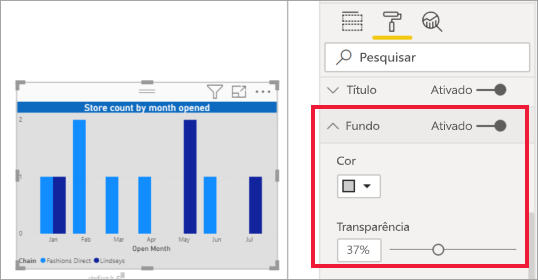
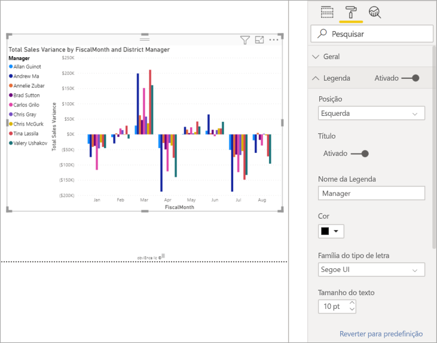
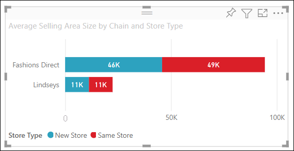
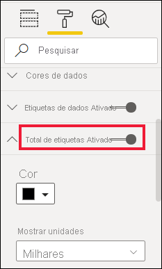
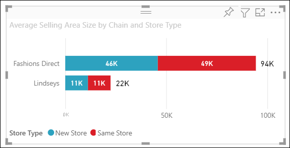
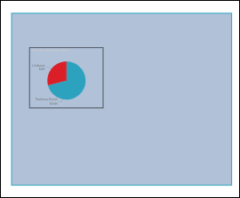

# Personalizar os títulos, os fundos, as etiquetas e as legendas das visualizações

[!INCLUDE[consumer-appliesto-nyyn](../includes/consumer-appliesto-nyyn.md)]

Neste tutorial, vai aprender várias formas de personalizar as visualizações. Existem muitas opções para personalizar as visualizações. A melhor forma de saber mais sobre todas elas é explorar o painel **Formatação** (selecione o ícone de rolo de pintura). Para começar, este artigo mostra-lhe como pode personalizar um título, uma legenda, um fundo, uma camada e uma etiqueta das visualizações e adicionar um tema.

Não pode personalizar todas as visualizações. Veja a [lista completa](#visualization-types-that-you-can-customize) das visualizações para obter mais detalhes.

## Pré-requisitos

- O serviço Power BI ou Power BI Desktop

- Relatório de Exemplo de Análise de Revenda

> [!NOTE]
> Para partilhar o seu relatório com outro utilizador do Power BI, é necessário que ambos tenham licenças individuais do Power BI Pro ou que o relatório seja guardado numa capacidade Premium. Veja [partilhar relatórios](../collaborate-share/service-share-reports.md).

## Personalizar títulos de visualização em relatórios

Inicie sessão no Power BI Desktop e abra o relatório [Exemplo de Análise de Revenda](../create-reports/sample-datasets.md).

> [!NOTE]
> Ao afixar uma visualização num dashboard, ela se torna um mosaico do dashboard. Também pode personalizar os próprios mosaicos com [novos títulos e subtítulos, hiperligações e redimensionamentos](../create-reports/service-dashboard-edit-tile.md).

1. Aceda à página **Novas Lojas** do relatório **Exemplo de Análise de Revenda**.

1. Selecione o gráfico de colunas agrupadas **Contagem de Lojas Abertas por Mês de Abertura e Cadeia**.

1. No painel **Visualizações**, selecione o ícone de rolo de pintura para apresentar as opções de formatação.

1. Selecione **Título** para expandir essa secção.

   

1. Mova o controlo de deslize **Mosaico** para **Ativado**.

1. Para alterar o título, insira a *Contagem de lojas por mês de abertura* no campo **Texto do título**.

    

1. Altere a **Cor do tipo de letra** para branco e a **Cor de fundo** para azul.

    a. Selecione a lista suspensa e escolha uma cor em **Cores do tema**, **Cores recentes** ou **Cor personalizada**.

    

    b. Selecione a lista suspensa para fechar a janela de cores.

1. Aumente o tamanho do texto para **16 pt**.

1. A última personalização feita ao título do gráfico será o seu alinhamento ao centro da visualização.

    

    Nesta fase do tutorial, o título do gráfico de colunas agrupadas deverá ter um aspeto semelhante ao seguinte:

    

Guarde as alterações realizadas e avance para a secção seguinte.

Se precisar de reverter todas as alterações, selecione **Reverter para predefinição**, na parte inferior do painel de personalização **Título**.

## Personalizar planos de fundo de visualização

Com o mesmo gráfico de colunas agrupadas selecionado, expanda as opções **Fundo**.

1. Mova o controlo de deslize **Fundo** para **Ativado**.

1. Selecione a lista suspensa e escolha uma cor cinzenta.

1. Altere a **Transparência** para **74%** .

Nesta fase do tutorial, o fundo do gráfico de colunas agrupadas deverá ter um aspeto semelhante ao seguinte:

Guarde as alterações realizadas e avance para a secção seguinte.

Se precisar de reverter todas as alterações, selecione **Reverter para predefinição**, na parte inferior do painel de personalização **Fundo**.

## Personalizar legendas de visualização

1. Abra a página de relatório **Visão geral** e selecione o gráfico **Variação das Vendas Totais por MêsFiscal e Gestor Distrital**.

1. No separador **Visualização**, selecione o ícone de rolo de pintura para abrir o painel Formatação.

1. Expanda as opções de **Legenda**:

    

1. Mova o controlo de deslize **Legenda** para **Ativado**.

1. Mova a legenda para a esquerda da visualização.

1. Adicione um título de legenda ao alternar o **Título** para **Ativado**.

1. Introduza *Gestor* no campo **Nome da legenda**.

1. Altere a **Cor** para preto.

Guarde as alterações realizadas e avance para a secção seguinte.

Se precisar de reverter todas as alterações, selecione **Reverter para predefinição**, na parte inferior do painel de personalização **Legenda**.

## Personalizar o total de etiquetas para elementos visuais empilhados

Os elementos visuais empilhados podem apresentar etiquetas de dados e o total de etiquetas. Num gráfico de colunas empilhadas, as etiquetas de dados identificam o valor de cada parte de uma coluna. O total de etiquetas apresenta o valor total para toda a coluna agregada. 

Veja o Rien a adicionar o total de etiquetas a um gráfico empilhado e, em seguida, siga os passos abaixo para experimentar.

> [!VIDEO https://www.youtube.com/embed/OgjX-pFGgfM]

1. Abra a página do relatório **Descrição geral** e selecione o gráfico de barras **Tamanho da área de vendas médio por cadeia e tipo de loja**.

1. No separador **Visualização**, selecione o  para converter este gráfico de barras num gráfico de barras empilhadas. Note que o elemento visual retém as etiquetas de dados.

    

1. No separador **Visualização**, selecione o ícone de rolo de pintura para abrir o painel Formatação.

1. Mova o controlo de deslize do **Total de etiquetas** para **Ativado**. 

    

1. Opcionalmente, formate o total de etiquetas. Neste exemplo, alterámos a cor para preto, aumentámos o tamanho do tipo de letra e optámos por apresentar os valores como **Milhares**.

    

## Personalizar a ordem das camadas

Altere a ordem das camadas dos elementos visuais e das formas nos relatórios. A ordem das camadas determina que objetos passarão para a frente após serem selecionados. Sempre que selecionar um objeto na tela de relatórios, o mesmo torna-se ativo e é movido para a camada superior. Isto faz com que sejam mais fácil interagir com o elemento visual selecionado. No entanto, para as formas e fundos, recomendamos que os coloque na camada inferior, para não selecionar inadvertidamente e cobrir ou ocultar os elementos visuais dos relatórios. 

Os controlos de camadas estão disponíveis no serviço Power BI, no Power BI Desktop, em dispositivos móveis e no servidor de relatórios. Este artigo mostra-lhe como alterar o comportamento da ordem das camadas no serviço Power BI.

Veja Rien a alterar o comportamento da ordem das camadas e, em seguida, siga os passos abaixo para experimentar.

> [!VIDEO https://www.microsoft.com/videoplayer/embed/RE4IY3L]

1. Adicione uma nova página de relatório ao selecionar o sinal de adição amarelo.

1. Adicione uma forma à tela. Aqui, adicionámos um retângulo azul.

    

1. Copie e cole um elemento visual de outra página do relatório.

    

    Agora que tem duas camadas, experimente selecionar o gráfico circular e, em seguida, o fundo. Ao selecionar o gráfico circular, o Power BI ativa esse objeto e apresenta o respetivo menu de cabeçalho. Ao selecionar o retângulo, o Power BI ativa esse objeto e inclui-o na frente, onde oculta o gráfico circular. Pode alterar este comportamento predefinido.

1. Selecione o retângulo e abra o painel Formatação. Expanda a janela **Geral** e localize o botão **Manter ordem das camadas**. Guarde as alterações ao relatório e mude para a vista Leitura.

    

1. Na vista Leitura, ao selecionar o retângulo azul, a página permanece na última camada.

## Personalizar cores com um tema

Com os temas de relatório, pode aplicar alterações de design a todo o relatório, como utilizar cores da empresa, alterar conjuntos de ícones ou aplicar uma nova formatação visual predefinida. Quando aplica um tema de relatório, todos os elementos visuais no relatório utilizam as cores e a formatação do tema selecionado.

Para aplicar um tema ao seu relatório, selecione **Mudar tema** a partir da barra de menu. Selecione um tema.  O relatório abaixo utiliza o tema **Solar**.

## Tipos de visualizações que pode personalizar

Veja a seguir uma lista de visualizações e as opções de personalização disponíveis para cada uma:

| Visualização | Título | Fundo | Legenda | Total de etiquetas
|:--- |:--- |:--- |:--- |:--- |
| Área | sim | sim |sim | sim  |
| Barras | sim | sim |sim | sim |
| Cartão | sim | sim |n/a | n/a |
| Cartão de Linhas múltiplas | sim | sim | n/a | n/a |
| Coluna | sim | sim | sim |  sim |
| Combinação | sim | sim | sim | sim |
| Anel | sim | sim | sim | n/a |
| Mapa de manchas | sim | sim | sim |n/a |
| Funil | sim | sim | n/a |n/a |
| Medidor | sim | sim | n/a |n/a |
| Principal Influenciador | sim | sim | n/a |n/a |
| KPI | sim | sim | n/a |n/a |
| Linha | sim | sim | sim |n/a |
| Mapa | sim | sim | sim |n/a |
| Matriz | sim | sim | n/a |sim |
| Circular | sim | sim | sim |n/a |
| Perguntas e Respostas | sim | sim | n/a |n/a |
| Dispersão | sim | sim | sim |n/a |
| Forma | sim | sim | sim |n/a |
| Segmentação de Dados | sim | sim | n/a |n/a |
| Tabela | sim | sim | n/a |sim |
| Caixa de texto | não | sim | n/a |n/a |
| Treemap | sim | sim | sim |n/a |
| Cascata | sim | sim | sim |n/a |

## Próximos passos

- [Personalizar as propriedades dos Eixos X e Y](power-bi-visualization-customize-x-axis-and-y-axis.md)

- [Getting started with color formatting and axis properties](service-getting-started-with-color-formatting-and-axis-properties.md) (Introdução às propriedades de eixo e formatação de cor)

Mais perguntas? [Pergunte à Comunidade do Power BI](https://community.powerbi.com/)
