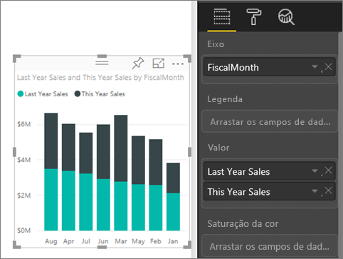
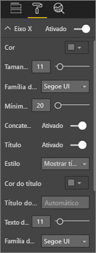
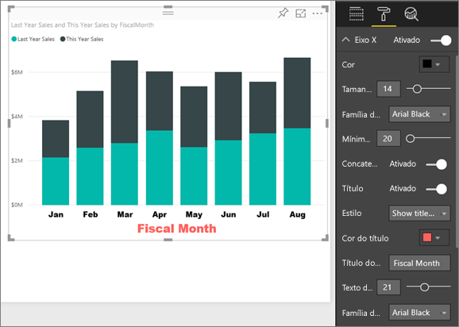
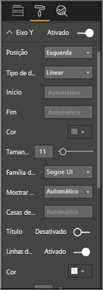
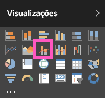
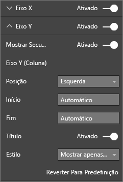

# Personalizar as propriedades dos Eixos X e Y

Neste tutorial, vai aprender várias formas diferentes de personalizar os Eixos X e Y dos elementos visuais. Nem todos os elementos visuais têm eixos. Por exemplo, os gráficos circulares não têm eixos. Por sua vez, as opções de personalização variam conforme o elemento visual. Existem demasiadas opções para abordar num único artigo, por isso, pode ver algumas das personalizações de eixos mais utilizadas e familiarizar-se com a utilização do painel **Formatação** do elemento visual na tela do relatório do Power BI.  

> [!NOTE]
> Esta página aplica-se tanto ao serviço Power BI como ao Power BI Desktop. Estas personalizações, que ficam disponíveis quando o ícone **Formatação** (o ícone de rolo de pintura ) é selecionado, também estão disponíveis no Power BI Desktop.

Veja a Amália a personalizar os Eixos X e Y. Vai demonstrar as diferentes formas de controlar a concatenação ao utilizar a desagregação e a agregação.

<iframe width="560" height="315" src="https://www.youtube.com/embed/9DeAKM4SNJM" frameborder="0" allowfullscreen></iframe>

## Pré-requisitos

- O serviço Power BI

- Relatório de Exemplo de Análise de Revenda

## Personalizar os Eixos X e Y de visualização nos relatórios

Para acompanhar, inicie sessão no [serviço Power BI](https://app.powerbi.com) e abra o relatório [Exemplo de Análise de Revenda](../sample-datasets.md) na vista [Editar relatório](../service-interact-with-a-report-in-editing-view.md).

### Criar uma visualização de gráficos de colunas empilhadas

Antes de personalizar a visualização, tem de a compilar.

1. No serviço Power BI, expanda **A Minha Área de Trabalho**.

1. Desloque-se para baixo e selecione **Exemplo de Análise de Revenda** na lista de **Conjuntos de dados**.

1. No painel **Visualizações**, selecione o ícone do gráfico de colunas empilhadas.

    

1. Para definir os valores do Eixo X, no painel **Campos**, selecione **Altura** > **MêsFiscal**.

1. Para definir os valores do Eixo Y, no painel **Campos**, selecione **Vendas** > **Vendas do Ano Passo** e **Vendas** > **Vendas Deste Ano** > **Valor**.

    

### Personalizar o Eixo X

Agora, pode personalizar o Eixo X.

1. No painel **Visualizações**, selecione **Formatação** (ícone de rolo de pintura) para revelar as opções de personalização.

1. Expanda as opções do eixo X.

   

1. Mova o controlo de deslize do **Eixo X** para **Ativo**.

    

    Uma razão para querer desativar o Eixo X é poupar espaço para obter mais dados.

1. Formate a cor, o tamanho e o tipo de letra do texto:

    - **Cor**: selecione preto

    - **Tamanho do texto**: introduza *14*

    - **Família de tipos de letra**: selecione **Arial Black**

1. Deslize a opção **Título** para **Ativo** para apresentar o nome do Eixo X. Neste caso, é **MêsFiscal**.

1. Formate a cor, o tamanho e o tipo de letra do texto do título:

    - **Cor do título**: selecione cor de laranja

    - **Título do eixo**: introduza *Mês Fiscal*

    - **Tamanho do texto do título**: introduza *21*

Depois de concluir as personalizações, o gráfico de colunas empilhadas vai ter o seguinte aspeto:

Guarde as alterações realizadas e avance para a secção seguinte.

Se precisar de reverter todas as alterações, selecione **Reverter para predefinição**, na parte inferior do painel de personalização **Eixo X**.

### Personalizar o Eixo Y

Em seguida, vai personalizar o Eixo Y.

1. Expanda as opções do eixo Y.

   

1. Mova o controlo de deslize do **Eixo Y** para **Ativo**.  

    

    Uma razão para querer desativar o Eixo Y é poupar espaço para obter mais dados.

1. Defina a **Posição** do Eixo Y para **Direita**.

1. Formate a cor, o tamanho e o tipo de letra do texto:

    - **Cor**: selecione preto

    - **Tamanho do texto**: introduza *14*

    - **Família de tipos de letra**: selecione **Arial Black**

1. Defina **Apresentar unidades** como **Milhões** e **Casas decimais de valor** como *0*.

1. Nesta visualização, ter um título do Eixo Y não melhora o elemento visual, por isso, deixe a opção **Título** **Desativada**.  

1. Vamos destacar as linhas de grelha ao alterar a cor e ao aumentar o traço:

    - **Cor**: selecione cinzento-escuro

    - **Traço**: introduza *2*

Depois de todas estas personalizações, o gráfico de colunas deve ser assim:

## Personalizar as visualizações com Eixo Y duplo

Em primeiro lugar, vai criar um gráfico de combinação que examina o impacto da contagem da loja nas vendas. Este é o mesmo gráfico criado no [Tutorial do gráfico de combinação](power-bi-visualization-combo-chart.md). Em seguida, vai formatar o Eixo Y duplo.

### Criar um gráfico com dois Eixos Y

1. Crie um novo gráfico de linhas que acompanhe **Vendas > % de Margem Bruta do ano passado** por **Tempo > MêsFiscal**.

    

    > [!NOTE]
    > Para obter ajuda a ordenar por mês, veja [Ordenar através de outros critérios](../consumer/end-user-change-sort.md#other).

    Em janeiro, a percentagem da Margem Bruta era de 35%, atingiu o pico em abril aos 45%, tendo caído em julho e chegado ao novamente ao pico em agosto. Será que vamos ver um padrão semelhante nas vendas do ano passado e deste ano?

1. Adicione **Vendas Deste Ano > Valor** e **Vendas do Ano Passado** ao gráfico de linhas.

    

    A escala da **% de Margem Bruta do Ano Passado** (a linha azul ao longo da linha de grelha **0M%** ) é muito menor do que a escala de **Vendas**, o que dificulta a comparação. As percentagens das etiquetas do eixo Y são ridículas.

1. Para facilitar a leitura e a interpretação do elemento visual, converta o gráfico de linhas num Gráfico de linhas e colunas empilhadas.

   

1. Arraste **% de Margem Bruta no Ano Passado** de **Valores de Coluna** para **Valores de Linha**.

    

    Agora, tem o gráfico de colunas empilhadas que criou na primeira secção com um gráfico de linhas sobreposto a este. Opcionalmente, aplique o que aprendeu acima para formatar a cor e o tamanho do tipo de letra dos eixos.

   

   O Power BI cria dois Eixos Y que permitem que os conjuntos de dados sejam dimensionados de modo diferente. O eixo à esquerda avalia os dólares e o eixo à direita avalia a percentagem.

### Formatar o Eixo Y secundário

1. No painel **Visualizações**, selecione o ícone de rolo de pintura para apresentar as opções de formatação.

1. Expanda as opções do eixo Y.

1. Desloque-se para baixo até encontrar a opção **Mostrar secundário**. Verifique se está **Ativo**.

   

1. (Opcional) Personalize os dois eixos. Se mudar a **posição** para o eixo de coluna ou o eixo de linha, os dois eixos mudam de lado.

### Adicionar títulos aos dois eixos

Com uma visualização tão complicada, convém adicionar títulos aos eixos.  Os títulos ajudam os seus colegas a perceberem a história que a visualização mostra.

1. Coloque **Título** como **Ativado** para **Eixo Y (Coluna)** e **Eixo Y (Linha)** .

1. Defina o **Estilo** como **Mostrar apenas o título** para ambos.

   

1. O gráfico de combinação apresenta agora os eixos duplos, ambos com títulos.

   

Para obter mais informações, veja [Sugestões e truques de formatação de cores no Power BI](service-tips-and-tricks-for-color-formatting.md).

## Considerações e resolução de problemas

Se o Eixo X for categorizado pelo proprietário do relatório como um tipo de data, a opção **Tipo** será apresentada e poderá selecionar entre contínuo ou categórico.

## Próximos passos

- [Visualizações em relatórios do Power BI](power-bi-report-visualizations.md)

- [Personalizar os títulos, as legendas e os fundos das visualizações](power-bi-visualization-customize-title-background-and-legend.md)

- [Getting started with color formatting and axis properties](service-getting-started-with-color-formatting-and-axis-properties.md) (Introdução às propriedades de eixo e formatação de cor)

- [Conceitos básicos para os consumidores do serviço Power BI](../consumer/end-user-basic-concepts.md)

Mais perguntas? [Pergunte à Comunidade do Power BI](http://community.powerbi.com/)
