# Personalizar as propriedades dos eixos X e Y

[!INCLUDE [power-bi-visuals-desktop-banner](../includes/power-bi-visuals-desktop-banner.md)]

Neste tutorial, vai aprender várias formas diferentes de personalizar os eixos X e Y dos elementos visuais. Nem todos os elementos visuais têm eixos. Por exemplo, os gráficos circulares não têm eixos. Por sua vez, as opções de personalização variam conforme o elemento visual. Existem demasiadas opções para abordar num único artigo, por isso, vamos ver algumas das personalizações mais utilizadas e familiarizarmo-nos com a utilização do painel **Formatação** do elemento visual na tela do relatório do Power BI.  

Veja a Amália a personalizar os eixos X e Y. Vai também demonstrar as diferentes formas de controlar a concatenação ao utilizar a desagregação e a agregação.

> [!NOTE]
> Este vídeo utiliza uma versão mais antiga do Power BI.

<iframe width="560" height="315" src="https://www.youtube.com/embed/9DeAKM4SNJM" frameborder="0" allowfullscreen></iframe>

## Pré-requisitos

- Power BI Desktop

- [Exemplo de Análise de Revenda](https://download.microsoft.com/download/9/6/D/96DDC2FF-2568-491D-AAFA-AFDD6F763AE3/Retail%20Analysis%20Sample%20PBIX.pbix)

## Adicionar uma nova visualização

Antes de personalizar a visualização, tem de a compilar.

1. No Power BI Desktop, abra o exemplo de Análise de Revenda.  

2. Na parte inferior, selecione o ícone de mais amarelo para adicionar uma nova página. 

    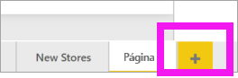

1. No painel **Visualizações**, selecione o ícone do gráfico de colunas empilhadas. Isto adiciona um modelo vazio à tela de relatório.

    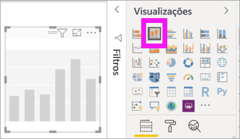

1. Para definir os valores do eixo X, no painel **Campos**, selecione **Altura** > **MêsFiscal**.

1. Para definir os valores do eixo Y, no painel **Campos**, selecione **Vendas** > **Vendas do Ano Passado** e **Vendas** > **Vendas deste Ano** > **Valor**.

    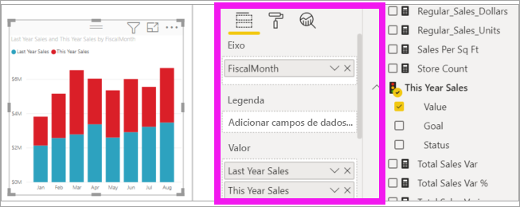

    Agora, pode personalizar o eixo X. O Power BI fornece opções quase ilimitadas para formatar a sua visualização. 

## Personalizar o eixo X
Existem muitos recursos personalizáveis para o eixo X. Pode adicionar e modificar as etiquetas de dados e o título do eixo X. Em categorias, pode modificar a largura, o tamanho e o preenchimento de barras, colunas, linhas e áreas. E em valores, pode modificar as unidades, as casas decimais e as linhas de grelha apresentadas. O exemplo seguinte mostra a personalização de um gráfico de colunas. Vamos adicionar algumas personalizações para que saiba as opções. Depois, pode explorar o resto por sua conta.

### Personalizar as etiquetas do eixo X
As etiquetas do eixo X são mostradas abaixo das colunas no gráfico. Neste momento, estão a cinzento claro, são pequenas e difíceis de ler. Vamos mudá-las.

1. No painel **Visualizações**, selecione **Formatação** (ícone de rolo de pintura ) para mostrar as opções de personalização.

2. Expanda as opções do eixo X.

   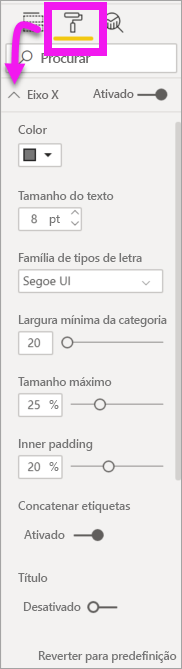

3. Mova o controlo de deslize do **eixo X** para **Ativo**.

    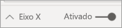

    Alguns motivos pelos quais pode querer definir o eixo X como **Desativado** são, por exemplo, se a visualização for evidente e não precisar de etiquetas ou se tiver uma página de relatório muito preenchida e precisar de criar espaço para mostrar mais dados.

4. Formate a cor, o tamanho e o tipo de letra do texto:

    - **Cor**: selecione preto

    - **Tamanho do texto**: introduza *14*

    - **Família de tipos de letra**: selecione **Arial Black**

    - **Área interna**: Introduzir *40%*

        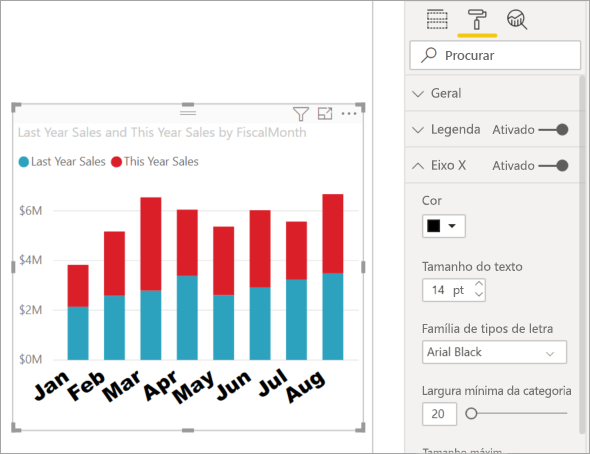
    
5. Talvez não goste da forma como o texto do eixo x aparece na diagonal. Tem várias opções. 
    - Altere o tamanho do texto para menor do que 14.
    - Aumente a visualização. 
    - Mostre menos colunas e adicione uma barra de deslocamento aumentando a **Largura mínima da categoria**. 
    
    Aqui, selecionámos a segunda opção e pegámos numa das barras de redimensionamento para tornar a visualização mais larga. Agora, tem espaço para texto de tamanho 14 sem ser preciso apresentar o texto num ângulo ou com uma barra de deslocamento. 

   

### Personalizar o título do eixo X
Quando o título do eixo X é **Em**, o título do eixo X é apresentado abaixo das etiquetas do eixo X. 

1. Comece por mudar o título do eixo X para **Em**.  

    

    A primeira coisa que verá é que a sua visualização tem agora um título predefinido do eixo X.  Neste caso, é **MêsFiscal**.

   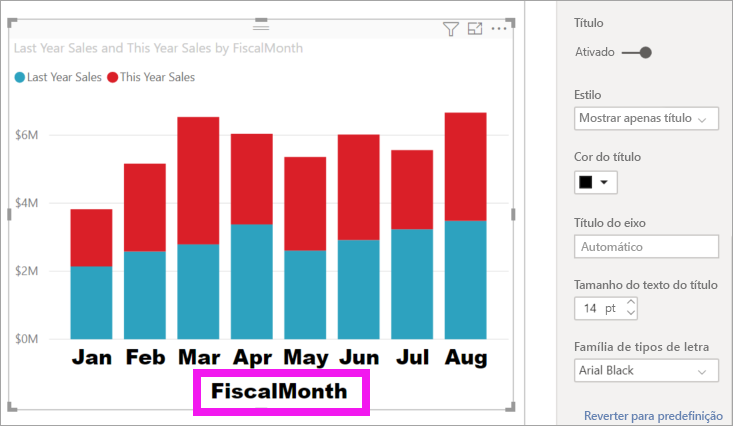

1. Formate a cor, o tamanho e o tipo de letra do texto do título:

    - **Cor do título**: selecione cor de laranja

    - **Título do eixo**: Escreva *Mês Fiscal* (com espaço)

    - **Tamanho do texto do título**: Introduza *18*

    Depois de concluir as personalizações, o gráfico de colunas empilhadas tem o seguinte aspeto:

    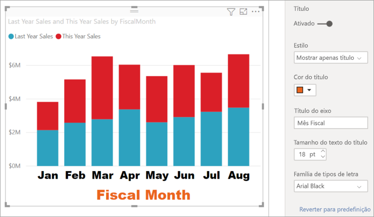

1. Guarde as alterações realizadas e avance para a secção seguinte. Se precisar de reverter todas as alterações, selecione **Reverter para predefinição**, na parte inferior do painel de personalização **Eixo X**. Em seguida, vai personalizar o Eixo Y.

## Personalizar o eixo Y
Existem muitas funcionalidades que podem ser personalizadas no eixo Y. Pode adicionar e modificar as etiquetas de dados, o título do eixo Y e as linhas de grelha. Em valores, pode modificar as unidades apresentadas, as casas decimais, o ponto de partida e o ponto final. E em categorias, pode modificar a largura, o tamanho e o preenchimento de barras, colunas, linhas e áreas. 

O seguinte exemplo continua a nossa personalização de um gráfico de colunas. Vamos fazer algumas alterações para que fique a par das opções. Depois, pode explorar o resto por sua conta.

### Personalizar as etiquetas do eixo Y
As etiquetas do eixo Y são apresentadas à esquerda por predefinição. Neste momento, estão a cinzento claro, são pequenas e difíceis de ler. Vamos mudá-las.

1. Expanda as opções do eixo Y.

   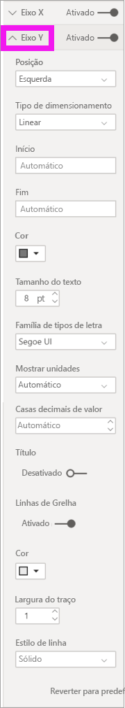

1. Mova o controlo de deslize do **Eixo Y** para **Ativo**.  

    

    Uma razão para querer desativar o eixo Y é poupar espaço para obter mais dados.

1. Formate a cor, o tamanho e o tipo de letra do texto:

    - **Cor**: selecione preto

    - **Tamanho do texto**: Introduza *10*

    - **Mostrar unidades**: selecione **Milhões**

    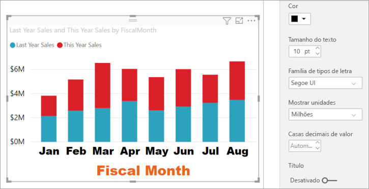

### Personalizar o título do eixo Y
Quando o título do eixo Y é **Em**, o título do eixo Y é apresentado ao lado das etiquetas do eixo Y. Nesta visualização, ter um título do Eixo Y não melhora o elemento visual, por isso, deixe a opção **Título** **Desativada**. Vamos adicionar os títulos do eixo Y a um elemento visual de eixo duplo mais adiante neste tutorial. 

### Personalizar as linhas de grelha
Vamos destacar as linhas de grelha ao alterar a cor e ao aumentar o traço:

- **Cor**: selecione cor de laranja

- **Traço**: introduza *2*

Depois de todas estas personalizações, o gráfico de colunas deve ser assim:

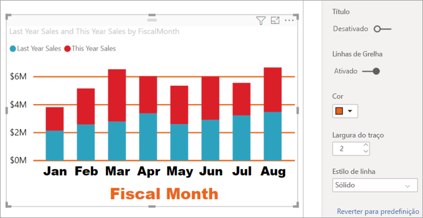

## Personalizar as visualizações com eixo Y duplo

Algumas visualizações podem tirar partido de ter dois eixos Y. Os gráficos de combinação são um bom exemplo. Antes de podermos formatar eixos Y duplos, vamos criar um gráfico de combinação que compara tendências de vendas e margem bruta.  

### Criar um gráfico com dois Eixos Y

1. Selecione o gráfico de colunas e mude-o para gráfico de *Linhas e colunas empilhadas*. Este tipo de elemento visual suporta um único valor de gráfico de linhas e múltiplos valores de coluna empilháveis. 

    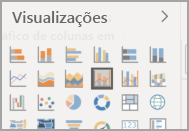
   

2. Arraste **Vendas** >  **% da Margem Bruta do Ano Passado** do painel de Campos para o registo **Valores de Linhas**.

    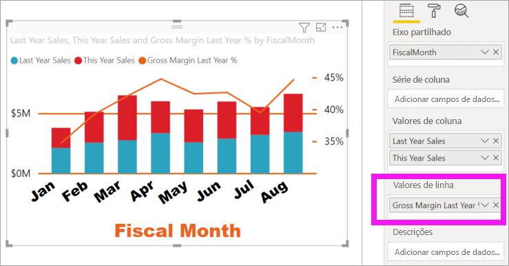

    
3. Reformate a visualização para remover as etiquetas do eixo X em ângulo. 

   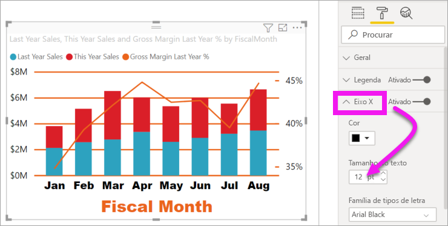

   O Power BI cria dois eixos Y que permitem que os valores sejam dimensionados de modo diferente. O eixo à esquerda avalia os lucros das vendas e o eixo à direita avalia a percentagem da margem bruta.

### Formatar o segundo Eixo Y
Uma vez que começámos com uma visualização com um eixo Y formatado, o Power BI criou o segundo eixo Y com as mesmas definições. Mas podemos mudar isso. 

1. No painel **Visualizações**, selecione o ícone de rolo de pintura para apresentar as opções de formatação.

1. Expanda as opções do eixo Y.

1. Desloque-se para baixo até encontrar a opção **Mostrar secundário**. Verifique se está **Ativo**. O nosso eixo Y secundário representa o gráfico de linhas.

   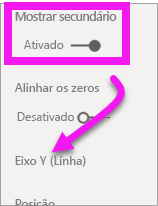

1. (Opcional) Personalize o tamanho e a cor do tipo de letra e mostre as unidades para ambos os eixos. Se mudar a **posição** para o eixo de coluna ou o eixo de linha, os dois eixos mudam de lado.

### Adicionar títulos aos dois eixos

Com uma visualização complexa, convém adicionar títulos aos eixos.  Os títulos ajudam os seus colegas a compreender a história que a sua visualização mostra.

1. Coloque **Título** como **Ativado** para **Eixo Y (Coluna)** e **Eixo Y (Linha)** .

1. Defina o **Estilo** como **Mostrar apenas o título** para ambos.

   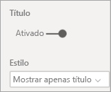

1. O gráfico de combinação apresenta agora os eixos duplos, ambos com títulos.

   

1. Formate os títulos. Neste exemplo, abreviámos um dos títulos e reduzimos o tamanho do tipo de letra em ambos os casos. 
    - Tamanho do tipo de letra: **9**
    - Abreviámos o **Título do eixo** no primeiro eixo Y (o gráfico de colunas): Vendas deste ano e do ano passado

    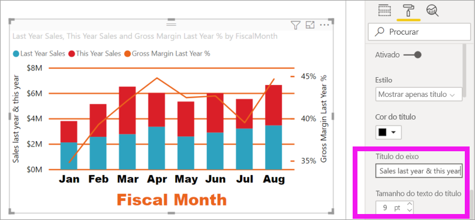

Para mais informações, consulte [Dicas e truques para formatação com cores no Power BI](service-tips-and-tricks-for-color-formatting.md) e [Personalizar títulos, legendas e fundos de visualização](power-bi-visualization-customize-title-background-and-legend.md). Esteja também atento a novas atualizações para formatação de títulos em breve. 

## Próximos passos

- [Visualizações em relatórios do Power BI](power-bi-report-visualizations.md)

Mais perguntas? [Pergunte à Comunidade do Power BI](https://community.powerbi.com/)
