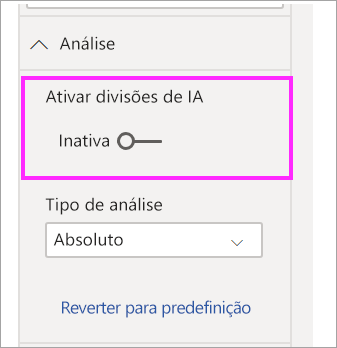

# Utilizar o elemento visual da árvore de decomposição no Power BI (Pré-visualização)
[!INCLUDE [power-bi-visuals-desktop-banner](../includes/power-bi-visuals-desktop-banner.md)]

O elemento visual da árvore de decomposição no Power BI permite-lhe visualizar os dados em várias dimensões. Agrega os dados automaticamente e permite uma desagregação nas dimensões pretendidas, em qualquer ordem. Também é uma visualização da inteligência artificial (IA), para que possa solicitar-lhe que encontre a próxima dimensão a desagregar com base em determinados critérios. Terá assim uma ferramenta valiosa para a exploração ad hoc e a realização de uma análise da causa principal.

Este tutorial utiliza dois exemplos:

- Um cenário de cadeia de fornecimento que analisa a percentagem de produtos que uma empresa possui em atraso (rutura de stock).  
- Um cenário de vendas que divide as vendas de jogos de vídeo por vários fatores, como o género e a editora dos jogos.

## Introdução
No painel Visualizações, selecione o ícone da árvore de decomposição.

A visualização requer dois tipos de entrada.

**Analisar** – a métrica que quer analisar. Tem de ser uma medida ou uma agregação.  
**Explicar Por** – uma ou mais dimensões que quer desagregar.

Depois de arrastar a medida para o conjunto de campo, as atualizações dos elementos visuais mostram a medida agregada. No exemplo abaixo, estamos a visualizar a % média dos produtos em atraso (5,07%) 

O próximo passo é importar uma ou mais dimensões que quer desagregar. Adicione estes campos ao registo **Explicar por**. Observe que um sinal de adição aparece ao lado do nó raiz. Ao selecionar o sinal +, pode escolher qual o campo que quer desagregar (pode desagregar os campos pela ordem que preferir).

Ao selecionar os resultados **Desvio da previsão** na árvore, pode expandir e desagregar a medida mediante os valores na coluna. Este processo pode ser repetido ao escolher outro nó para desagregar.

Ao selecionar um nó do último nível, filtrará os dados de forma cruzada. A seleção de um nó de um nível anterior altera o caminho.

A interação com outros elementos visuais filtra a árvore de decomposição de forma cruzada. Desta forma, a ordem dos nós dentro dos níveis pode ser alterada.
No exemplo abaixo, filtrámos a árvore por Ubisoft de forma cruzada. As atualizações do caminho e as vendas da Xbox passam do primeiro para o segundo lugar, sendo ultrapassadas pela PlayStation. 

Se, em seguida, filtrarmos a árvore por Nintendo de forma cruzada, as vendas da Xbox ficarão em branco pois não há jogos da Nintendo desenvolvidos para a Xbox. A Xbox, juntamente com o caminho subsequente, fica fora da visualização através da filtragem.

Apesar de o caminho desaparecer, os níveis existentes (neste caso, Género de Jogo) permanecem afixados na árvore. Desta forma, a seleção do nó Nintendo expande automaticamente a árvore para Género de Jogo.

## Divisões de IA

Pode utilizar as “Divisões de IA” para saber que dados deve observar. Estas divisões aparecem na parte superior da lista e estão marcadas com uma lâmpada. As divisões estão lá para ajudar a localizar autenticamente o valor alto e o valor baixo nos dados.

A análise pode funcionar de duas formas, independentemente das suas preferências. O comportamento predefinido é o seguinte:

**Valor Alto**: considera todos os campos disponíveis e determina qual vai desagregar para obter o valor mais alto da medida que está a ser analisada.  
**Valor Baixo**: considera todos os campos disponíveis e determina qual vai desagregar para obter o valor mais baixo da medida que está a ser analisada.  

Ao selecionar o **Valor Alto** no exemplo das encomendas em atraso, acontece o seguinte: 

É apresentada uma lâmpada ao lado de **Tipo de Produto** a indicar que foi uma “Divisão de IA”. A árvore também fornece uma linha pontilhada que recomenda o nó **Monitorização do Paciente**, uma vez que tal produz o valor mais alto das encomendas em atraso (9,2%). 

Coloque o rato sobre a lâmpada para ver uma descrição. Neste exemplo, a descrição é “A % das encomendas em atraso é mais alta quando o Tipo de Produto é Monitorização do Paciente”.

Pode configurar o elemento visual para encontrar divisões de AI **Relativas** ao invés de **Absolutas**. 

O modo Relativo procura valores altos que se destacam (em comparação com o resto dos dados na coluna). Para ilustrar isso, vamos ver um exemplo: 

Na captura de ecrã acima, podemos ver as vendas de jogos de vídeo na América do Norte. Primeiro, dividimos a árvore por **Nome da Editora** e, em seguida, desagregamos para Nintendo. A seleção de **Valor Alto** resulta na expansão de **Plataforma > Nintendo**. Como a Nintendo (a editora) apenas cria jogos para consolas da sua marca, há apenas um valor presente e, portanto, esse é naturalmente o valor mais alto.

No entanto, uma divisão mais interessante seria examinar em que valor alto se destaca em relação a outros valores na mesma coluna. Se alterarmos o tipo de Análise de **Absoluta** para **Relativa**, obteremos o seguinte resultado para a Nintendo: 

Desta vez, o valor recomendado é **Plataforma em Género de Jogo**.  A plataforma não produz um valor absoluto mais alto do que a Nintendo (19 950 000 $ vs. 46 950 000 $). No entanto, é um valor que se destaca.

Mais precisamente, como há 10 valores de Género de Jogo, o valor esperado para Plataforma seria 4,6 milhões de $, caso fossem divididos uniformemente. Como a Plataforma tem um valor de quase 20 milhões de $, é um resultado interessante pois é quatro vezes superior ao resultado esperado.

O cálculo é o seguinte:

Vendas da América do Norte para Plataforma/Abs(Média(Vendas da América do Norte para Géneros de Jogos))  
vs.  
Vendas da América do Norte para Nintendo/Abs(Média(Vendas da América do Norte para Plataforma))  

O que se traduz em:

19 550 000 / (19 550 000 + 11 140 000 +... + 470 000 + 60 000/10) = 4,25x  
vs.  
46 950 000/(46 950 000/1) = 1x  

Se preferir não utilizar as divisões de IA na árvore, poderá desativá-las nas opções **Formatação da análise**:  

## Interações da árvore com as divisões de IA

Pode ter vários níveis de IA subsequentes. Também pode misturar diferentes tipos de níveis de IA (do Valor Alto ao Valor Baixo e de volta ao Valor Alto): 

Se selecionar um nó diferente na árvore, as Divisões de IA serão recalculadas do zero. No exemplo abaixo, alterámos o nó selecionado no nível **Desvio da Previsão**. Os níveis subsequentes são alterados para produzir os Valores Alto e Baixo das 

Os níveis de IA também são recalculados quando filtra de forma cruzada a árvore de decomposição por outro elemento visual. No exemplo a seguir, podemos ver que a % das nossas encomendas em atraso é mais alta nas Instalações N.º 0477.

Porém, se selecionarmos **Abril** no gráfico de barras, o valor mais alto muda para **Tipo de Produto > Cirurgia Avançada**. Neste caso, não são apenas os nós que foram reordenados, mas foi escolhida uma coluna completamente diferente. 

Se quisermos que os níveis de IA se comportem como níveis não IA, selecione a lâmpada para reverter o comportamento para a predefinição. 

Embora se possa agregar vários níveis de IA, um nível não IA não pode seguir um nível de IA. Se fizermos uma divisão manual após uma divisão de IA, a lâmpada do nível de IA desaparece e o nível é transformado num nível normal. 

## Bloquear

Um criador de conteúdo pode bloquear os níveis para determinados consumidores dos relatórios. Quando um nível é bloqueado, este não pode ser removido nem alterado. Um consumidor pode explorar caminhos diferentes num nível bloqueado, mas não pode alterar o próprio nível. Enquanto criador, pode colocar o rato sobre os níveis existentes para ver o ícone de cadeado. Pode bloquear todos os níveis que pretender, mas não pode ter níveis desbloqueados anteriores aos níveis bloqueados.

No exemplo a seguir, os dois primeiros níveis estão bloqueados. Tal significa que os consumidores dos relatórios podem alterar os níveis 3 e 4 e até mesmo adicionar novos níveis posteriormente. No entanto, os dois primeiros níveis não podem ser alterados:

## Limitações conhecidas

A árvore de decomposição não é suportada nos seguintes cenários:  
-   Analysis Services no local

As divisões de IA não são suportadas nos seguintes cenários:  
-   Azure Analysis Services
-   Direct Query
-   Power BI Report Server
-   Publicar na Web
-   Medidas complexas e medidas de esquemas de extensão em “Analisar”

Outras limitações de pré-visualização:
- Power BI Mobile  
- Afixar no dashboard
- Mostrar a funcionalidade Dados
- Suporte nas Perguntas e Respostas

## Próximos passos

[Gráfico em anel do Power BI](power-bi-visualization-doughnut-charts.md)

[Visualizações do Power BI](power-bi-report-visualizations.md)

