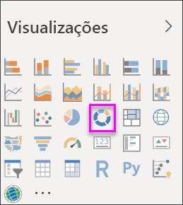

# Criar e utilizar gráficos em anel no Power BI

[!INCLUDE[consumer-appliesto-nyyn](../includes/consumer-appliesto-nyyn.md)]

[!INCLUDE [power-bi-visuals-desktop-banner](../includes/power-bi-visuals-desktop-banner.md)]

Um gráfico em anel é semelhante a um gráfico circular que mostra a relação das partes com um todo. A única diferença é que o centro está em branco e permite ter espaço para uma etiqueta ou ícone.

## Pré-requisito

Este tutorial utiliza o [ficheiro PBIX do Exemplo de Análise de Revenda](https://download.microsoft.com/download/9/6/D/96DDC2FF-2568-491D-AAFA-AFDD6F763AE3/Retail%20Analysis%20Sample%20PBIX.pbix).

1. Na secção superior esquerda da barra de menus, selecione **Ficheiro** > **Abrir**.
   
2. Procure a sua cópia do **ficheiro PBIX do Exemplo de Análise de Revenda**

1. Abra o **Ficheiro PBIX do Exemplo de Análise de Revenda** na vista de relatório .

1. Selecionar  para adicionar uma nova página.

> [!NOTE]
> Para partilhar o seu relatório com outro utilizador do Power BI, é necessário que ambos tenham licenças individuais do Power BI Pro ou que o relatório seja guardado numa capacidade Premium.    

## Criar um gráfico de anel

1. Comece numa página de relatório em branco e, no painel Campos, selecione **Vendas** \> **Vendas do Ano Passado**.  
   
3. No painel Visualizações, selecione o ícone de gráfico em anel  para converter o gráfico de barras num gráfico em anel. Se as **Vendas do Ano Passado** não estiverem na área **Valores** , arraste-as para aí.
     
   

4. Selecione **Item** \> **Categoria** para adicioná-lo à área **Legenda**. 
     
    

5. Opcionalmente, [ajuste o tamanho e a cor do texto do gráfico](power-bi-visualization-customize-title-background-and-legend.md). 

## Considerações e resolução de problemas
* A soma dos valores do gráfico em anel deve somar até 100%.
* Muitas categorias são difíceis de ler e interpretar.
* Os gráficos em anel são melhor utilizados para comparar uma determinada secção com o todo, em vez de comparar secções individuais entre si. 

## Próximos passos
[Gráficos de funil no Power BI](power-bi-visualization-funnel-charts.md)

[Tipos de visualização no Power BI](power-bi-visualization-types-for-reports-and-q-and-a.md)

