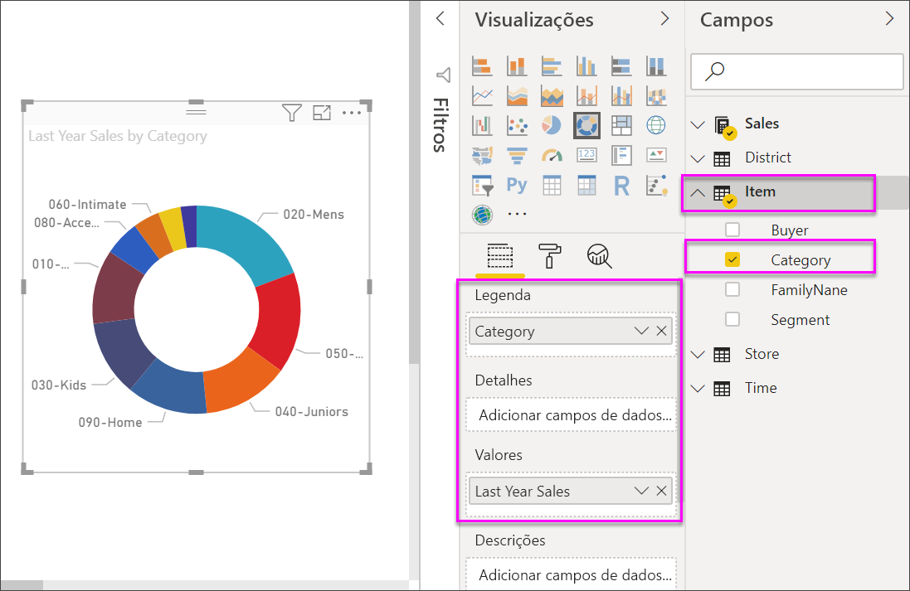

# Gráficos em anel no Power BI
Um gráfico em anel é semelhante a um gráfico circular que mostra a relação das partes com um todo. A única diferença é que o centro está em branco e permite ter espaço para uma etiqueta ou ícone.

## Criar um gráfico de anel
Estas instruções utilizam o Exemplo de Análise de Revenda para criar um gráfico em anel que apresenta as vendas deste ano por categoria. Para acompanhar, [transfira o exemplo](../sample-datasets.md) do serviço do Power BI ou Power BI Desktop.

1. Comece numa página de relatório em branco. Se estiver a utilizar o serviço Power BI, garanta que abre o relatório na [Vista de edição](../service-interact-with-a-report-in-editing-view.md).

2. No painel Campos, selecione **Vendas** \> **Vendas do Ano Passado**.  
   
3. No painel Visualizações, selecione o ícone de gráfico em anel  para converter o gráfico de barras num gráfico em anel. Se as **Vendas do Ano Passado** não estiverem na área **Valores**, arraste-as para aí.
     
   

4. Selecione **Item** \> **Categoria** para adicioná-lo à área **Legenda**. 
     
    

5. Opcionalmente, [ajuste o tamanho e a cor do texto do gráfico](power-bi-visualization-customize-title-background-and-legend.md). 

## Considerações e resolução de problemas
* A soma dos valores do gráfico em anel deve somar até 100%.
* Muitas categorias são difíceis de ler e interpretar.
* Os gráficos em anel são melhor utilizados para comparar uma determinada secção com o todo, em vez de comparar secções individuais entre si. 

## Próximos passos
[Gráficos de funil no Power BI](power-bi-visualization-funnel-charts.md)

[Tipos de visualização no Power BI](power-bi-visualization-types-for-reports-and-q-and-a.md)

