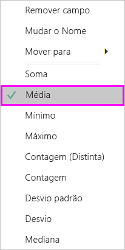
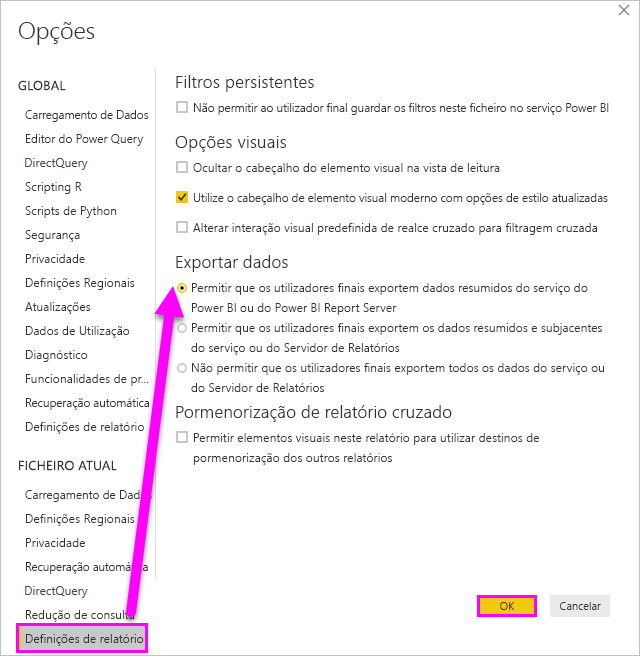

# Exportar os dados que foram utilizados para criar uma visualização

> [!IMPORTANT]
> Nem todos os dados podem ser vistos ou exportados por todos os utilizadores. Existem proteções que os designers e administradores de relatórios utilizam na criação de dashboards e relatórios. Alguns dados são restritos, ocultos ou confidenciais e não podem ser vistos ou exportados sem permissões especiais. 

## Quem pode exportar dados

Se tiver permissões para os dados, pode ver e exportar os dados que o Power BI utiliza para criar uma visualização. Muitas vezes, os dados são confidenciais ou encontram-se limitados a utilizadores específicos. Nesses casos, não poderá ver ou exportar esses dados. Para obter mais informações, veja a secção **Limitações e considerações** no final deste documento. 

## Ver e exportar dados

Se quiser ver os dados que o Power BI utiliza para criar uma visualização, [poderá visualizar esses dados no Power BI](service-reports-show-data.md). Também pode exportar esses dados para o Excel como um ficheiro *.xlsx* ou *.csv*. A opção para exportar os dados requer uma licença Pro ou Premium e permissões de edição no conjunto de dados e no relatório. Se tiver acesso ao dashboard ou relatório, mas os dados estiverem classificados como *altamente confidenciais*, o Power BI não lhe permitirá exportar os dados.

Veja o Will a exportar os dados a partir de uma das visualizações no seu relatório, a guardá-los como um ficheiro *.xlsx* e a abri o ficheiro no Excel. Em seguida, siga as instruções passo-a-passo abaixo do vídeo para experimentar. Tenha em atenção que este vídeo utiliza uma versão mais antiga do Power BI.

<iframe width="560" height="315" src="https://www.youtube.com/embed/KjheMTGjDXw" frameborder="0" allowfullscreen></iframe>

## Exportar dados a partir de um dashboard do Power BI

1. Selecione Mais ações (...) no canto superior direito da visualização.

    

1. Selecione a opção **Exportar para .csv**.

    

1. O Power BI exporta os dados para um ficheiro *.csv*. Se filtrar a visualização, a exportação para .csv também será filtrada. 

1. O browser pedirá para guardar o ficheiro.  Depois de guardado, abra o ficheiro *.csv* no Excel.

    

## Exportar dados de um relatório

Para acompanhar, abra o [Relatório de exemplo de análise de aprovisionamento](../create-reports/sample-procurement.md) no serviço Power BI, na Vista de Edição. Adicione uma nova página de relatório em branco. Em seguida, siga os passos abaixo para adicionar uma agregação, uma hierarquia e um filtro de nível de visualização.

### Criar um gráfico de colunas empilhadas

1. Crie um novo **gráfico de colunas empilhadas**.

    

1. No painel **Campos**, selecione **Location > City**, **Location > Country/Region** e **Invoice > Discount Percent**.  Poderá ter de mover o campo **Percentagem de Desconto** para a área **Valor**.

    

1. Altere a agregação para **Percentagem de desconto** de **Contagem** para **Média**. Na área **Valor**, selecione a seta à direita de **Percentagem de Desconto** (poderá indicar **Valor da Percentagem de Desconto**) e escolha a opção **Média**.

    

1. Adicione um filtro a **Cidade**, selecione todas as cidades e, em seguida, remova **Atlanta**.

    

   
1. Desagregar um nível na hierarquia. Ative a desagregação e desagregue para o nível de **City**. 

    

Agora, estamos prontos para experimentar ambas as opções para exportar dados.

### Exportar dados **_resumidos_* _
Selecione a opção de _ *Dados resumidos** se quiser exportar dados do que vê nesse elemento visual.  Este tipo de exportação mostra-lhe apenas os dados (colunas e medidas) que estão a ser utilizados para criar o elemento visual.  Se o elemento visual tiver uma agregação, irá exportar os dados agregados. Por exemplo, se tiver um gráfico de barras que mostre quatro barras, obterá quatro linhas de dados do Excel. Os dados resumidos estão disponíveis no serviço Power BI como *.xlsx* e *.csv* e no Power BI Desktop como .csv.

1. Selecione as reticências (…) no canto superior direito da visualização. Selecione **Exportar dados**.

    

    No serviço Power BI, uma vez que a sua visualização tem uma agregação (alterou **Contagem** para *média*), terá duas opções:

    - **Dados resumidos**

    - **Dados subjacentes**

    Para o ajudar a compreender as agregações, veja [Agregações no Power BI](../create-reports/service-aggregates.md).

    > [!NOTE]
    > No Power BI Desktop, terá apenas a opção para exportar os dados resumidos como ficheiro .csv. 
    
    
1. Em **Exportar dados**, selecione **Dados resumidos**, escolha *.xlsx* ou *.csv* e, em seguida, selecione **Exportar**. O Power BI exporta os dados.

    

1. Quando seleciona **Exportar**, o browser pede-lhe para guardar o ficheiro. Depois de guardado, abra o ficheiro no Excel.

    

    Neste exemplo, a nossa exportação de Excel mostra um total para cada cidade. Uma vez que excluímos Atlanta no filtro, esta cidade não está incluída nos resultados. A primeira linha da nossa folha de cálculo mostra os filtros que o Power BI utilizou na extração dos dados.
    
    - Todos os dados utilizados pela hierarquia são exportados e não apenas os dados utilizados para o nível de desagregação atual do elemento visual. Por exemplo, desagregámos até ao nível de cidade, mas a nossa exportação também inclui dados do país.  

    - Os nossos dados exportados são agregados. Obtemos um total, uma linha, para cada cidade.

    - Uma vez que aplicámos filtros à visualização, os dados exportados serão exportados como filtrados. Repare que a primeira linha apresenta **Applied filters: City is not Atlanta, GA** (Filtros aplicados: a Cidade não é Atlanta, GA). 

### Exportar dados **_subjacentes_* _

Selecione esta opção se quiser ver os dados no elemento visual _*_e_*_ os dados adicionais do conjunto de dados (veja o gráfico abaixo para obter detalhes). Se a sua visualização tiver uma agregação, selecionar _ *Dados subjacentes** removerá a mesma. Neste exemplo, a exportação do Excel mostra uma linha para cada Cidade no nosso conjunto de dados e a percentagem de desconto para essa entrada individual. O Power BI uniformiza os dados, não os agrega.  

Quando seleciona **Exportar**, o Power BI exporta os dados para um ficheiro *.xlsx* e o browser pede-lhe para guardar o ficheiro. Depois de guardado, abra o ficheiro no Excel.

1. Selecione as reticências (…) no canto superior direito da visualização. Selecione **Exportar dados**.

    

    No serviço Power BI, uma vez que a sua visualização tem uma agregação (alterou **Contagem** para **média**), terá duas opções:

    - **Dados resumidos**

    - **Dados subjacentes**

    Para o ajudar a compreender as agregações, veja [Agregações no Power BI](../create-reports/service-aggregates.md).

    > [!NOTE]
    > No Power BI Desktop, terá apenas a opção para exportar os dados resumidos. 
    
    
1. Em **Exportar dados**, selecione **Dados subjacentes** e, em seguida, selecione **Exportar**. O Power BI exporta os dados.

    

1. Quando seleciona **Exportar**, o browser pede-lhe para guardar o ficheiro. Depois de guardado, abra o ficheiro no Excel.

    
    
    - Esta captura de ecrã mostra-lhe apenas uma pequena parte do ficheiro Excel, o qual tem mais de 100 mil linhas.  
    
    - Todos os dados utilizados pela hierarquia são exportados e não apenas os dados utilizados para o nível de desagregação atual do elemento visual. Por exemplo, desagregámos até ao nível de cidade, mas a nossa exportação também inclui dados do país.  

    - Uma vez que aplicámos filtros à visualização, os dados exportados serão exportados como filtrados. Repare que a primeira linha apresenta **Applied filters: City is not Atlanta, GA** (Filtros aplicados: a Cidade não é Atlanta, GA). 

## Personalizar a experiência de exportação de dados do utilizador

Os utilizadores a quem é concedido acesso a um relatório **têm acesso a todo o conjunto de dados subjacente**, a menos que a [segurança ao nível da linha (RLS)](../admin/service-admin-rls.md) limite o acesso. Os autores de relatórios e os administradores do Power BI podem utilizar as funcionalidades descritas abaixo para personalizar a experiência do utilizador.

- Os autores de relatórios [decidem que *opções de exportação*](#set-the-export-options) estão disponíveis para os utilizadores.  

- Os administradores do Power BI podem desativar algumas ou todas as opções de exportação de dados para a sua organização.  

- Os proprietários de conjuntos de dados podem definir a segurança ao nível da linha (RLS). A RLS irá restringir o acesso a utilizadores com permissão só de leitura. No entanto, se tiver configurado uma área de trabalho de aplicação e dado aos membros permissões de edição, as funções de RLS não serão aplicadas às mesmas. Para obter mais informações, veja [Segurança ao nível da linha](../admin/service-admin-rls.md).

- Os autores de relatórios podem ocultar colunas para que estas não sejam apresentadas na lista de **Campos**. Para obter mais informações, veja [Propriedades de conjuntos de dados](../developer/automation/api-dataset-properties.md)

**Estas experiências de utilizador personalizadas não restringem os dados a que os utilizadores podem aceder no conjunto de dados. Utilize a [segurança ao nível da linha (RLS)](../admin/service-admin-rls.md) no conjunto de dados para que as credenciais de cada pessoa determinem a que dados a mesma pode aceder.**

## Proteger os dados quando os mesmos são exportados para fora do Power BI

- Os autores de relatórios podem classificar e etiquetar relatórios com as [etiquetas de confidencialidade](../admin/service-security-data-protection-overview.md) do Microsoft Information Protection. Se a etiqueta de confidencialidade tiver definições de proteção, o Power BI aplicará estas definições de proteção quando exportar os dados do relatório para ficheiros do Excel, do PowerPoint ou PDF. Apenas os utilizadores autorizados podem abrir ficheiros protegidos.

- Os administradores de segurança e do Power BI podem utilizar o [Microsoft Cloud App Security](../admin/service-security-data-protection-overview.md) para monitorizar o acesso e a atividade dos utilizadores, executar a análise dos riscos em tempo real e definir controlos específicos de uma etiqueta. Por exemplo, as organizações podem utilizar o Microsoft Cloud App Security para configurar uma política que impeça os utilizadores de transferirem dados confidenciais do Power BI para dispositivos não geridos.

## Exportar detalhes de dados subjacentes

O que vê quando seleciona **Dados subjacentes** pode variar. Poderá precisar da ajuda do seu administrador ou do departamento de TI para compreender estes detalhes. 

>

| O elemento visual contém | O que verá na exportação  |
|---------------- | ---------------------------|
| Agregados | O *primeiro* agregado e dados não ocultos da tabela inteira desse agregado |
| Agregados | Dados relacionados: se o elemento visual utilizar dados de outras tabelas de dados que estão *relacionados* com a tabela de dados que contém o agregado (desde que a relação seja \*:1 ou 1:1) |
| Medidas* | todas as medidas no elemento visual *e* todas as medidas de qualquer tabela de dados que contenham uma medida utilizada no elemento visual |
| Medidas* | todos os dados não ocultos de tabelas que contenham essa medida (desde que essa relação seja \*:1 ou 1:1) |
| Medidas* | todos os dados de todas as tabelas que estão relacionados com as tabelas que contêm as medidas através de uma cadeia \*:1 ou 1:1) |
| Apenas medidas | todas as colunas não ocultas de todas as tabelas relacionadas (para expandir a medida) |
| Apenas medidas | dados resumidos de todas as linhas duplicadas das medidas modelo |

\* No Power BI Desktop ou no serviço Power BI, na vista de relatório, é apresentada uma *medida* na lista **Campos** com um ícone de calculadora . As medidas podem ser criadas no Power BI Desktop.

### Definir as opções de exportação

Os designers de relatórios do Power BI controlam os tipos de opções de exportação dos dados que estão disponíveis para os seus consumidores. As opções são:

- Permitir que os utilizadores finais exportem os dados resumidos do serviço Power BI ou do Power BI Report Server

- Permitir que os utilizadores finais exportem os dados resumidos e os dados subjacentes do serviço ou do Report Server

- Não permitir que os utilizadores finais exportem todos os dados do serviço ou do Report Server

    > [!IMPORTANT]
    > Recomendamos que os estruturadores de relatórios revejam os relatórios antigos e reponham manualmente a opção de exportação, conforme necessário.

Para definir estas opções:

1. Comece no Power BI Desktop.

1. No canto superior esquerdo, selecione **Ficheiro** > **Opções e Definições** > **Opções**.

1. Em **FICHEIRO ATUAL**, selecione **Definições de relatório**.

    

1. Faça a sua seleção na secção **Exportar dados**.

Também pode atualizar esta definição no serviço Power BI.

É importante referir que, se as definições do portal de administração do Power BI entrarem em conflito com as definições do relatório para a exportação de dados, as definições de administração substituirão as definições da exportação de dados.

## Limitações e considerações
Estas limitações e considerações aplicam-se ao Power BI Desktop e ao serviço Power BI, incluindo o Power BI Pro e o Premium.

- Para exportar os dados de um elemento visual, tem de ter ativada a opção [Criar permissão do conjunto de dados subjacente](../connect-data/service-datasets-build-permissions.md).

-  O número máximo de linhas que o **Power BI Desktop** e o **serviço Power BI** podem exportar de um **relatório em modo de importação** para um ficheiro *.csv* é 30 000.

- O número máximo de linhas que as aplicações podem exportar de um **relatório em modo de importação** para um ficheiro *.xlsx* é 150 000.

- A exportação com *Dados subjacentes* não funcionará se:

  - a versão for anterior a 2016.

  - as tabelas no modelo não tiverem uma chave exclusiva.
    
  -  um administrador ou criador de relatórios tiver desativado esta funcionalidade.

- A exportação com *Dados subjacentes* não funcionará se a opção *Mostrar itens sem dados* estiver ativada para a visualização que o Power BI estiver a exportar.

- Ao utilizar o DirectQuery, a quantidade máxima de dados que o Power BI pode exportar é 16 MB de dados não comprimidos. Um resultado indesejado poderá ser uma exportação inferior ao número máximo de 150 000 linhas. É provável que esta situação aconteça se:

    - Existirem demasiadas colunas. Experimente reduzir o número de colunas e exportar novamente.

    - Existirem dados difíceis de comprimir.

    - Outros fatores implicarem o aumento do tamanho do ficheiro e a diminuição do número de linhas que o Power BI pode exportar.

- Se a visualização utilizar dados provenientes de mais do que uma tabela de dados e se não existir uma relação entre essas tabelas no modelo de dados, o Power BI só exportará os dados da primeira tabela.

- Atualmente, não são suportados elementos visuais do Power BI e elementos visuais R.

- No Power BI, pode mudar o nome de um campo (coluna) ao fazer duplo clique no campo e escrever um novo nome. O Power BI refere-se ao novo nome como *alias*. É possível que um relatório do Power BI possa ter nomes de campo duplicados, mas o Excel não permite duplicados. Por isso, quando o Power BI exportar os dados para o Excel, os alias dos campos são revertidos para os nomes de campo (colunas) originais.  

- Se existirem carateres Unicode no ficheiro *.csv*, o texto no Excel pode não ser corretamente apresentado. Exemplos de carateres Unicode: símbolos de moeda e palavras estrangeiras. Se abrir o ficheiro no bloco de notas, o Unicode será exibido corretamente. Se preferir abrir o ficheiro no Excel, a solução alternativa será importar o *.csv*. Para importar o ficheiro para o Excel:

  1. Abra o Excel.

  1. Aceda ao separador **Dados**.
  
  1. Selecione **Obter dados externos** > **Do texto**.
  
  1. Aceda à pasta local onde o ficheiro está armazenado e selecione o *.csv*.

- Ao exportar para *.cvs*, determinados carateres terão um **'** à esquerda para impedir a execução do script quando for aberto no Excel. Isto acontece quando:
  - A coluna é definida como tipo “texto” no modelo de dados **_e_**
  - O primeiro caráter do texto é um dos seguintes: **=, @, +, -**

- Os administradores do Power BI têm a capacidade de desativar a exportação de dados.

Mais perguntas? [Experimente perguntar à Comunidade do Power BI](https://community.powerbi.com/)