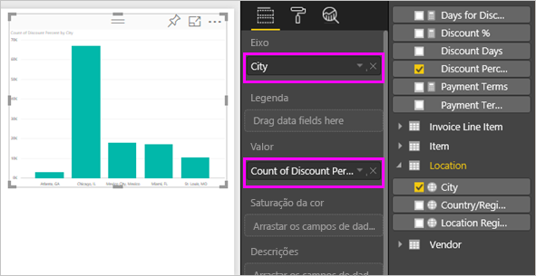
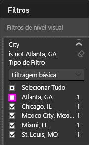

# Exportar dados de visualizações

Se quiser ver os dados que o Power BI utiliza para criar uma visualização, [poderá visualizar esses dados no Power BI](service-reports-show-data.md). Também pode exportar esses dados para o Excel como um ficheiro *.xlsx* ou *.csv*. A opção para exportar os dados requer uma licença Pro ou Premium e permissões de edição no conjunto de dados e no relatório. <!--If you have access to the dashboard or report but the data is classified as *highly confidential*, Power BI will not allow you to export the data.-->

Veja o Will a exportar os dados a partir de uma das visualizações no seu relatório, a guardá-los como um ficheiro *.xlsx* e a abri o ficheiro no Excel. Em seguida, siga as instruções passo-a-passo abaixo do vídeo para experimentar.

<iframe width="560" height="315" src="https://www.youtube.com/embed/KjheMTGjDXw" frameborder="0" allowfullscreen></iframe>

## Exportar dados a partir de um dashboard do Power BI

1. Selecione as reticências (…) no canto superior direito da visualização.

    

1. Escolha o ícone **Exportar dados**.

    

1. O Power BI exporta os dados para um ficheiro *.csv*. Se filtrar a visualização, a aplicação filtrará os dados transferidos.

1. O browser pedirá para guardar o ficheiro.  Depois de guardado, abra o ficheiro *.csv* no Excel.

    

## Exportar dados de um relatório

Para acompanhar, abra o [Relatório de exemplo de análise de aprovisionamento](../sample-procurement.md) na Vista de Edição. Adicione uma nova página de relatório em branco. Em seguida, siga os passos abaixo para adicionar uma agregação e um filtro de nível de visualização.

1. Crie um novo **gráfico de colunas empilhadas**.

1. No painel **Campos**, selecione **Localização > Cidade** e **Fatura > Percentagem de Desconto**.  Poderá ter de mover o campo **Percentagem de Desconto** para a área **Valor**.

    

1. Altere a agregação para **Percentagem de desconto** de **Contagem** para **Média**. Na área **Valor**, selecione a seta à direita de **Percentagem de Desconto** (poderá indicar **Valor da Percentagem de Desconto**) e escolha a opção **Média**.

    

1. Adicione um filtro a **Cidade**, selecione todas as cidades e, em seguida, remova **Atlanta**.

    

   Agora, estamos prontos para experimentar ambas as opções para exportar dados.

1. Selecione as reticências (…) no canto superior direito da visualização. Selecione **Exportar dados**.

    

    No Power BI online, se a visualização tiver uma agregação (por exemplo, se tivesse alterado o **Valor** para *média*, *soma* ou *mínimo*), terá duas opções:

    - **Dados resumidos**

    - **Dados subjacentes**

    No Power BI Desktop, terá apenas a opção para **Dados resumidos**. Para o ajudar a compreender as agregações, veja [Agregações no Power BI](../service-aggregates.md).

1. Em **Exportar dados**, selecione **Dados resumidos**, escolha *.xlsx* ou *.csv* e, em seguida, selecione **Exportar**. O Power BI exporta os dados.

    

    Se tiver aplicado filtros à visualização, os dados exportados serão exportar como filtrados. Quando seleciona **Exportar**, o browser pede-lhe para guardar o ficheiro. Depois de guardado, abra o ficheiro no Excel.
    
    Todos os dados utilizados pela hierarquia são exportados e não apenas os dados utilizados para o nível de desagregação atual do elemento visual. Por exemplo, se a visualização ainda não tiver sido desagregada do nível superior, os dados exportados incluirão todos os dados na hierarquia e não apenas os dados utilizados para criar o elemento visual no nível atualmente desagregado.

    **Dados resumidos**: selecione esta opção se quiser exportar os dados do que vê nesse elemento visual.  Este tipo de exportação mostra-lhe apenas os dados (colunas e medidas) que escolhe para criar o elemento visual.  Se o elemento visual tiver uma agregação, irá exportar os dados agregados. Por exemplo, se tiver um gráfico de barras que mostre quatro barras, obterá quatro linhas de dados. Os dados resumidos estão disponíveis como *.xlsx* e *.csv*.

    Neste exemplo, a nossa exportação de Excel mostra um total para cada cidade. Uma vez que excluímos Atlanta no filtro, esta cidade não está incluída nos resultados. A primeira linha da nossa folha de cálculo mostra os filtros que o Power BI utilizou na extração dos dados.

    

1. Experimente agora selecionar **Dados subjacentes**, *. xlsx* e, em seguida **Exportar**. O Power BI exporta os dados. 

    > [!NOTE]
    > Dependendo das definições do relatório, pode ou não ter a opção para exportar os dados subjacentes.

    Se tiver aplicado filtros à visualização, os dados exportados serão exportar como filtrados. Quando seleciona **Exportar**, o browser pede-lhe para guardar o ficheiro. Depois de guardado, abra o ficheiro no Excel.
    
    Todos os dados utilizados pela hierarquia são exportados e não apenas os dados utilizados para o nível de desagregação atual do elemento visual. Por exemplo, se a visualização ainda não tiver sido desagregada do nível superior, os dados exportados incluirão todos os dados na hierarquia e não apenas os dados utilizados para criar o elemento visual no nível atualmente desagregado.

    >[!WARNING]
    >A exportação dos dados subjacentes permite aos utilizadores ver todos os dados detalhados – todas as colunas nos dados. Os administradores do serviço Power BI podem desativar esta definição para a sua organização. Se for proprietário de um conjunto de dados, poderá definir as colunas proprietárias como **ocultas** para que não sejam apresentadas na lista de **campos** no Desktop ou no serviço Power BI.

    **Dados subjacentes**: selecione esta opção se quiser ver os dados no elemento visual ***e*** os dados adicionais do modelo (veja o gráfico abaixo para obter detalhes). Se a sua visualização tiver uma agregação, selecionar *Dados subjacentes* removerá a mesma. Quando seleciona **Exportar**, o Power BI exporta os dados para um ficheiro *.xlsx* e o browser pede-lhe para guardar o ficheiro. Depois de guardado, abra o ficheiro no Excel.

    Neste exemplo, a exportação do Excel mostra uma linha para cada Cidade no nosso conjunto de dados e a percentagem de desconto para essa entrada individual. O Power BI nivela os dados. Não os agrega. A primeira linha da nossa folha de cálculo mostra os filtros que o Power BI utilizou na extração dos dados.  

    

## Exportar detalhes de dados subjacentes

O que vê quando seleciona **Dados subjacentes** pode variar. Poderá precisar da ajuda do seu administrador ou do departamento de TI para compreender estes detalhes. No Power BI Desktop ou no serviço Power BI, na vista de relatório, é apresentada uma *medida* na lista **Campos** com um ícone de calculadora . O Power BI Desktop cria Medidas. O serviço Power BI não o faz.

| O elemento visual contém | O que verá na exportação  |
|---------------- | ---------------------------|
| Agregados | O *primeiro* agregado e dados não ocultos da tabela inteira desse agregado |
| Agregados | Dados relacionados: se o elemento visual utilizar dados de outras tabelas de dados que estão *relacionados* com a tabela de dados que contém o agregado (desde que a relação seja \*:1 ou 1:1) |
| Medidas | todas as medidas no elemento visual *e* todas as medidas de qualquer tabela de dados que contenham uma medida utilizada no elemento visual |
| Medidas | todos os dados não ocultos de tabelas que contenham essa medida (desde que essa relação seja \*:1 ou 1:1) |
| Medidas | todos os dados de todas as tabelas que estão relacionados com as tabelas que contêm as medidas através de uma cadeia \*:1 ou 1:1) |
| Apenas medidas | todas as colunas não ocultas de todas as tabelas relacionadas (para expandir a medida) |
| Apenas medidas | dados resumidos de todas as linhas duplicadas das medidas modelo |

### Definir as opções de exportação

Os designers de relatórios do Power BI controlam os tipos de opções de exportação dos dados que estão disponíveis para os seus consumidores. As opções são:

- Permitir que os utilizadores finais exportem os dados resumidos do serviço Power BI ou do Power BI Report Server

- Permitir que os utilizadores finais exportem os dados resumidos e os dados subjacentes do serviço ou do Report Server

- Não permitir que os utilizadores finais exportem todos os dados do serviço ou do Report Server

    > [!IMPORTANT]
    > Recomendamos que os estruturadores de relatórios revejam os relatórios antigos e reponham manualmente a opção de exportação, conforme necessário.

Para definir estas opções:

1. Comece no Power BI Desktop.

1. No canto superior esquerdo, selecione **Ficheiro** > **Opções e Definições** > **Opções**.

1. Em **FICHEIRO ATUAL**, selecione **Definições de relatório**.

    

1. Faça a sua seleção na secção **Exportar dados**.

Também pode atualizar esta definição no serviço Power BI.

É importante referir que, se as definições do portal de administração do Power BI entrarem em conflito com as definições do relatório para a exportação de dados, as definições de administração substituirão as definições da exportação de dados.

## Limitações e considerações
Estas limitações e considerações aplicam-se ao Power BI Desktop e ao serviço Power BI, incluindo o Power BI Pro e o Premium.

- Para exportar os dados de um elemento visual, tem de ter ativada a opção [Criar permissão do conjunto de dados subjacente](https://docs.microsoft.com/power-bi/service-datasets-build-permissions).

-  O número máximo de linhas que o **Power BI Desktop** e o **serviço Power BI** podem exportar de um **relatório em modo de importação** para um ficheiro *.csv* é 30 000.

- O número máximo de linhas que as aplicações podem exportar de um **relatório em modo de importação** para um ficheiro *.xlsx* é 150 000.

- A exportação com *Dados subjacentes* não funcionará se:

  - a versão for anterior a 2016.

  - as tabelas no modelo não tiverem uma chave exclusiva.
    
  -  um administrador ou criador de relatórios tiver desativado esta funcionalidade.

- A exportação com *Dados subjacentes* não funcionará se a opção *Mostrar itens sem dados* estiver ativada para a visualização que o Power BI estiver a exportar.

- Ao utilizar o DirectQuery, a quantidade máxima de dados que o Power BI pode exportar é 16 MB de dados não comprimidos. Um resultado indesejado pode ser uma exportação inferior ao número máximo de linhas. É provável que esta situação aconteça se:

    - Existirem várias colunas.

    - Existirem dados difíceis de comprimir.

    - Outros fatores implicarem o aumento do tamanho do ficheiro e a diminuição do número de linhas que o Power BI pode exportar.

- Se a visualização utilizar dados provenientes de mais do que uma tabela de dados e se não existir uma relação entre essas tabelas no modelo de dados, o Power BI só exportará os dados da primeira tabela.

- Atualmente, não são suportados elementos visuais personalizados e elementos visuais R.

- No Power BI, pode mudar o nome de um campo (coluna) ao fazer duplo clique no campo e escrever um novo nome. O Power BI refere-se ao novo nome como *alias*. É possível que um relatório do Power BI possa ter nomes de campo duplicados, mas o Excel não permite duplicados. Por isso, quando o Power BI exportar os dados para o Excel, os alias dos campos são revertidos para os nomes de campo (colunas) originais.  

- Se existirem carateres Unicode no ficheiro *.csv*, o texto no Excel pode não ser corretamente apresentado. Exemplos de carateres Unicode: símbolos de moeda e palavras estrangeiras. Se abrir o ficheiro no bloco de notas, o Unicode será exibido corretamente. Se preferir abrir o ficheiro no Excel, a solução alternativa será importar o *.csv*. Para importar o ficheiro para o Excel:

  1. Abra o Excel.

  1. Aceda ao separador **Dados**.
  
  1. Selecione **Obter dados externos** > **Do texto**.
  
  1. Aceda à pasta local onde o ficheiro está armazenado e selecione o *.csv*.

- Os administradores do Power BI têm a capacidade de desativar a exportação de dados.

Mais perguntas? [Experimente perguntar à Comunidade do Power BI](https://community.powerbi.com/)
