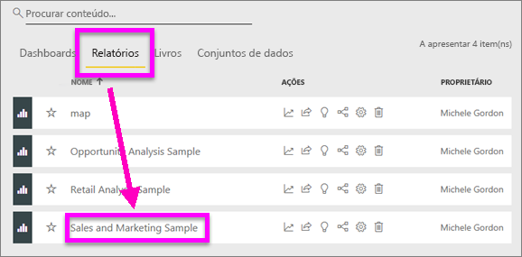
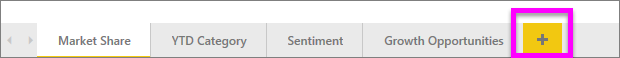
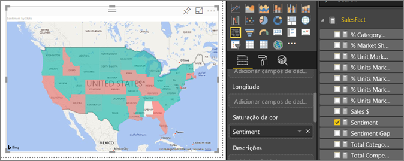
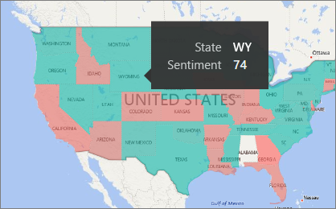
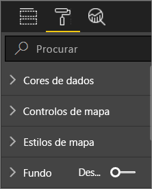
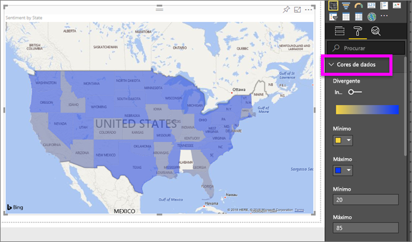
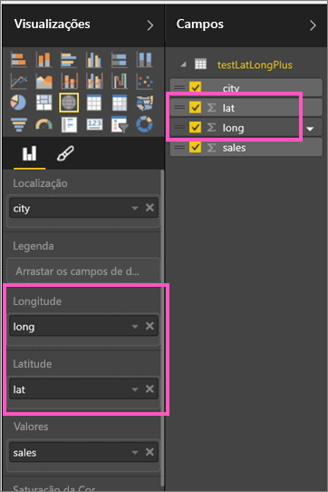

# Mapas de manchas (coropletos) no Power BI
Um mapa de manchas utiliza sombreado, tonalidade ou padrões para mostrar como um valor difere em proporção numa localização geográfica ou região.  Exiba rapidamente estas diferenças relativas com sombreado que varia de claro (menos frequente/inferior) a escuro (mais frequente/mais).    

## O que é enviado ao Bing
O Power BI está integrado no Bing para fornecer coordenadas de mapa predefinidas (um processo denominado geocodificação). Quando cria uma visualização de mapa no serviço Power BI ou Power BI Desktop, os dados nos registos **Localização**, **Latitude** e **Longitude** (que estão a ser utilizados para criar a visualização) são enviados ao Bing.

O utilizador ou o administrador, pode ter que atualizar a sua firewall para permitir o acesso aos URLs que o Bing utiliza para geocodificação.  Os URLs são:
- https://dev.virtualearth.net/REST/V1/Locations    
- https://platform.bing.com/geo/spatial/v1/public/Geodata    
- https://www.bing.com/api/maps/mapcontrol

Para obter mais informações sobre os dados enviados ao Bing e obter sugestões para aumentar o êxito da geocodificação, veja [Sugestões e truques para visualizações de mapas](power-bi-map-tips-and-tricks.md).

## Quando utilizar um mapa de manchas
Os mapas de manchas são uma ótima opção:

* para apresentar informações quantitativas num mapa.
* para mostrar as relações e os padrões espaciais.
* quando os dados são padronizados.
* ao trabalhar com dados socioeconómicos.
* quando as regiões definidas são importantes.
* para obter uma visão geral da distribuição entre as localizações geográficas.

### Pré-requisitos
- Serviço Power BI ou Power BI Desktop
- Sales and Marketing Sample

Para acompanhar, o tutorial utiliza o serviço Power BI, não o Power BI Desktop.

## Criar um mapa de manchas básico
Neste vídeo, a Rita cria um mapa básico e converte-o num mapa de manchas.

<iframe width="560" height="315" src="https://www.youtube.com/embed/ajTPGNpthcg" frameborder="0" allowfullscreen></iframe>

### Obter dados e adicionar uma nova página em branco ao relatório
1. Para criar o seu próprio mapa de manchas, [transfira o exemplo Vendas e Marketing](../sample-datasets.md) ao iniciar sessão no Power BI e ao selecionar **Obter Dados \> Exemplos \> Vendas e Marketing \> Ligar**.
2. Quando aparecer a mensagem de êxito, feche-a e selecione o separador **Relatórios**. Em seguida, selecione **Exemplo de Vendas e Marketing** para abrir o relatório.

   
3. O Power BI abre o relatório. Selecione **Editar relatório** para abrir o relatório na [Vista de Edição](../service-interact-with-a-report-in-editing-view.md).

4. Adicione uma nova página ao selecionar o sinal de adição amarelo na parte inferior do ecrã do relatório.

    

### Criar um mapa de manchas
1. No painel Campos, selecione o campo **Geo** \> **Estado**.    

   
5. [Converta o gráfico](power-bi-report-change-visualization-type.md) num mapa de manchas. Repare que o **Estado** está, agora, no grupo **Local**. O Bing Maps usa o campo no grupo **Local** para criar o mapa.  O local pode ser uma variedade de locais válidos: países, estados, condados, cidades, CEPs ou outros códigos postais, etc. O Bing Maps fornece formas de mapa de manchas para locais em todo o mundo. Sem uma entrada válida no painel Localização, o Power BI não pode criar o mapa de manchas.  

   
6. Filtre o mapa para apresentar apenas os Estados Unidos.

   a.  Na parte inferior do painel Visualizações, procure a área **Filtros** .

   b.  Passe o rato sobre **Estado** e clique na divisa de expansão  
   

   c.  Coloque uma marca de verificação junto a **Todos** e remova a marca de verificação junto a **AK**.

   
7. Selecione **SalesFact** \>  **Sentimento** para adicioná-lo ao painel **Saturação da cor**. O campo no painel **Valores** controla o sombreado do mapa.  
   
8. O mapa de manchas é sombreado a verde e vermelho, com o vermelho a representar os números de sentimento inferiores e o verde a representar o sentimento superior mais positivo.  Aqui, destacamos o estado de Wyoming (WY) e vemos que o Sentimento é muito bom, 74.  
   
9. [Guarde o relatório](../service-report-save.md).
##    Ajustar a formatação da cor
O Power BI oferece muito controlo sobre o aspeto do seu mapa de manchas.
1. Selecione o ícone de rolo de tinta para abrir o painel Formatação.

    

2. Selecione **Cores de dados** para apresentar as opções de cor.
3. Defina as cores Mínima e Máxima para amarelo e azul. Adicione também os valores Mínima e Máxima, com base nos seus dados. Experimente estes controlos até obter o aspeto pretendido. 

    

## Realce e filtragem cruzada
Para obter informações sobre como utilizar o painel Filtros, veja [Adicionar um filtro a um relatório](../power-bi-report-add-filter.md).

Destacar um local num Mapa de Manchas faz a filtragem cruzada com outras visualizações na página do relatório e vice-versa.

1. Para acompanhar, guarde primeiro este relatório ao selecionar **Ficheiro > Guardar**. 

2. Copie o mapa de manchas através de Ctrl+C.

3. Na parte inferior da tela do relatório, selecione o separador **Sentimento** para abrir a página de relatório de Sentimentos.

    

4. Mova e redimensione as visualizações na página para libertar algum espaço. Em seguida, utilize Ctrl+V para colar o mapa de manchas do relatório anterior.

   

5. No mapa de manchas, selecione um estado.  Isto destaca as outras visualizações na página. Se selecionar **Texas**, por exemplo, mostra que o Sentimento é 74 e Texas encontra-se no Distrito Central \#23.   
   
2. Selecione um ponto de dados no gráfico de linhas VanArsdel – Sentimentos por Mês. Isto filtra o mapa de manchas para mostrar dados de Sentimento para VanArsdel e não para a concorrência de VanArsdel.  
   

## Considerações e resolução de problemas
Os dados de mapa podem ser ambíguos.  Por exemplo, existe Paris, França, mas também existe Paris, Texas. Os dados geográficos são, provavelmente, armazenados em colunas separadas – uma coluna de nomes de cidades, uma coluna de nomes de estado ou província, etc. – portanto, o Bing pode não ser capaz de dizer que Paris é. Se o conjunto de dados já contém dados de latitude e longitude, o Power BI tem campos especiais para ajudar a tornar os dados do mapa inequívocos. Basta arrastar o campo que contém os dados de latitude na área Visualizações \> Latitude.  E faça o mesmo para os dados de longitude.    

Se tiver permissões para editar o conjunto de dados no Power BI Desktop, veja este vídeo para ajudar a resolver a ambiguidade do mapa.

<iframe width="560" height="315" src="https://www.youtube.com/embed/Co2z9b-s_yM" frameborder="0" allowfullscreen></iframe>

Se não tiver acesso aos dados de latitude e longitude, [siga estas instruções para atualizar o conjunto de dados](https://support.office.com/article/Maps-in-Power-View-8A9B2AF3-A055-4131-A327-85CC835271F7).

Para obter mais ajuda com visualizações de mapas, veja [Sugestões e truques para visualizações de mapas](../power-bi-map-tips-and-tricks.md).

## Próximos passos

[Mapa de forma](desktop-shape-map.md)

[Tipos de visualização no Power BI](power-bi-visualization-types-for-reports-and-q-and-a.md)