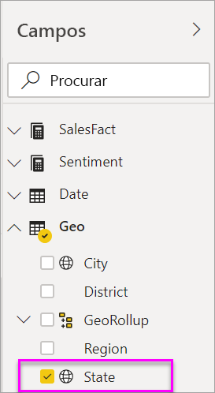
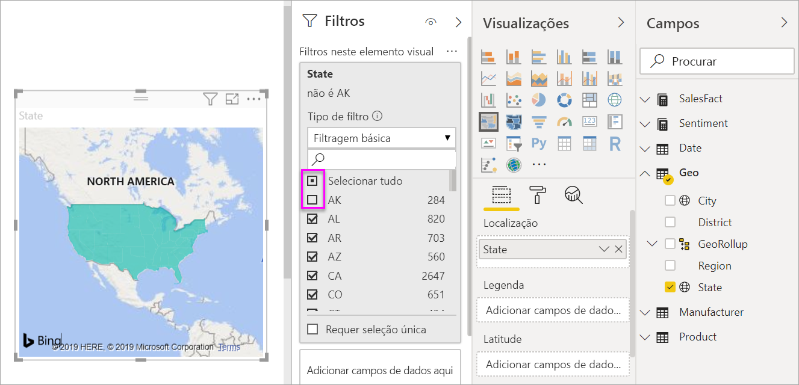
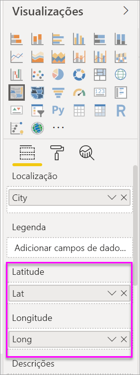

# Criar e utilizar mapas de manchas (mapas coropletos) no Power BI

[!INCLUDE[consumer-appliesto-nyyn](../includes/consumer-appliesto-nyyn.md)]

[!INCLUDE [power-bi-visuals-desktop-banner](../includes/power-bi-visuals-desktop-banner.md)]

Um mapa de manchas utiliza sombreado, tonalidade ou padrões para mostrar como um valor difere em proporção numa localização geográfica ou região.  Exiba rapidamente estas diferenças relativas com sombreado que varia de claro (menos frequente/inferior) a escuro (mais frequente/mais).    

## O que é enviado ao Bing
O Power BI está integrado no Bing para fornecer coordenadas de mapa predefinidas (um processo denominado geocodificação). Quando cria uma visualização de mapa no serviço Power BI ou Power BI Desktop, os dados nos registos **Localização** , **Latitude** e **Longitude** (que estão a ser utilizados para criar a visualização) são enviados ao Bing.

O utilizador ou o administrador, pode ter que atualizar a sua firewall para permitir o acesso aos URLs que o Bing utiliza para geocodificação.  Os URLs são:
- https://dev.virtualearth.net/REST/V1/Locations    
- https://platform.bing.com/geo/spatial/v1/public/Geodata    
- https://www.bing.com/api/maps/mapcontrol

Para obter mais informações sobre os dados enviados ao Bing e obter sugestões para aumentar o êxito da geocodificação, veja [Sugestões e truques para visualizações de mapas](power-bi-map-tips-and-tricks.md).

## Quando utilizar um mapa de manchas
Os mapas de manchas são uma ótima opção:

* para apresentar informações quantitativas num mapa.
* para mostrar as relações e os padrões espaciais.
* quando os dados são padronizados.
* ao trabalhar com dados socioeconómicos.
* quando as regiões definidas são importantes.
* para obter uma visão geral da distribuição entre as localizações geográficas.

### Pré-requisitos
Este tutorial utiliza o [ficheiro PBIX de exemplo de Vendas e Marketing](https://download.microsoft.com/download/9/7/6/9767913A-29DB-40CF-8944-9AC2BC940C53/Sales%20and%20Marketing%20Sample%20PBIX.pbix).
1. Na secção superior esquerda da barra de menus, selecione **Ficheiro** > **Abrir**
   
2. Localize a sua cópia do **ficheiro PBIX de Vendas e Marketing**.

1. Abra o **ficheiro PBIX de Vendas e Marketing** na vista de relatório .

1. Selecionar  para adicionar uma nova página.

> [!NOTE]
> Para partilhar o seu relatório com outro utilizador do Power BI, é necessário que ambos tenham licenças individuais do Power BI Pro ou que o relatório seja guardado numa capacidade Premium.    

### Criar um mapa de manchas
1. No painel Campos, selecione o campo **Geo** \> **Estado**.    

   
2. [Converta o gráfico](power-bi-report-change-visualization-type.md) num mapa de manchas. Repare que o **Estado** está, agora, no grupo **Local**. O Bing Maps usa o campo no grupo **Local** para criar o mapa.  O local pode ser uma variedade de locais válidos: países, estados, condados, cidades, códigos postais, etc. O Bing Maps fornece formas de mapa de manchas para locais em todo o mundo. Sem uma entrada válida no painel Localização, o Power BI não pode criar o mapa de manchas.  

   
3. Filtre o mapa para apresentar apenas os Estados Unidos.

   a.  Na parte esquerda do painel Visualizações, procure o painel **Filtros**. Expanda-o se estiver minimizado

   b.  Passe o rato sobre **Estado** e selecione a divisa de expansão  
   

   c.  Coloque uma marca de verificação junto a **Todos** e remova a marca de verificação junto a **AK**.

   
4. Selecione o ícone de rolo de tinta para abrir o painel Formatação e selecione **Cores de dados**.

    

5. Selecione o ícone de três pontos verticais e selecione **Formatação condicional**.

    

6. Utilize o ecrã **Cor predefinida - Cores de dados** para determinar como é que o mapa de manchas será sombreado. As opções disponíveis incluem o campo no qual o sombreado se irá basear e como o aplicar. Neste exemplo, estamos a utilizar o campo **SalesFact** > **Sentiment** e a definir o valor mais baixo como laranja e o valor mais alto como azul. Os valores que ficarem entre o número máximo e o mínimo terão tons de laranja e azul. A ilustração na parte inferior do ecrã mostra a variedade de cores que vai ser utilizada. 

    

7. O mapa de manchas é sombreado a verde e vermelho, com o vermelho a representar os números de sentimento inferiores e o verde a representar o sentimento superior mais positivo.  Para apresentar detalhes adicionais, arraste um campo para a zona das Descrições.  Aqui, adicionámos o **SalesFact** > **Sentiment gap**. Ao realçar o estado de Idaho (ID), constatamos que o intervalo de sentimento é baixo, com o valor 6.
   

10. [Guarde o relatório](../create-reports/service-report-save.md).

O Power BI oferece muito controlo sobre o aspeto do seu mapa de manchas. Experimente estes controlos de cor de dados até obter o aspeto pretendido. 

## Realce e filtragem cruzada
Para obter informações sobre como utilizar o painel Filtros, veja [Adicionar um filtro a um relatório](../create-reports/power-bi-report-add-filter.md).

Destacar um local num mapa de manchas faz a filtragem cruzada com outras visualizações na página do relatório e vice-versa.

1. Para acompanhar, guarde primeiro este relatório ao selecionar **Ficheiro > Guardar**. 

2. Copie o mapa de manchas através de Ctrl+C.

3. Na parte inferior da tela do relatório, selecione o separador **Sentimento** para abrir a página de relatório de Sentimentos.

    

4. Mova e redimensione as visualizações na página para libertar algum espaço. Em seguida, utilize Ctrl+V para colar o mapa de manchas do relatório anterior. Veja as seguintes imagens.

   

5. No mapa de manchas, selecione um estado.  As outras visualizações na página serão apresentadas com realce cruzado e com filtragem cruzada. Selecionar **Texas** , por exemplo, filtrará os cartões de forma cruzada e realçará o gráfico de barras de forma cruzada. A partir daqui, sabemos que o Sentimento é 75 e que Texas se encontra no Distrito Central N.º 23.   
   
2. Selecione um ponto de dados no gráfico de linhas VanArsdel – Sentimentos por Mês. Isto filtra o mapa de manchas para mostrar dados de Sentimento para VanArsdel e não para a concorrência de VanArsdel.  
   

## Considerações e resolução de problemas
Os dados de mapa podem ser ambíguos.  Por exemplo, existe Paris, França, mas também existe Paris, Texas. Os dados geográficos são, provavelmente, armazenados em colunas separadas – uma coluna de nomes de cidades, uma coluna de nomes de estado ou província, etc. – portanto, o Bing pode não ser capaz de dizer que Paris é. Se o conjunto de dados já contém dados de latitude e longitude, o Power BI tem campos especiais para ajudar a tornar os dados do mapa inequívocos. Basta arrastar o campo que contém os dados de latitude na área Visualizações \> Latitude.  E faça o mesmo para os dados de longitude.    

Se tiver permissões para editar o conjunto de dados no Power BI Desktop, veja este vídeo para obter ajuda a resolver a ambiguidade do mapa.

> [VÍDEO https://www.youtube.com/embed/Co2z9b-s_yM ]

Se não tiver acesso aos dados de latitude e longitude, mas tiver acesso de edição ao conjunto de dados, [siga estas instruções para atualizar o conjunto de dados](https://support.office.com/article/Maps-in-Power-View-8A9B2AF3-A055-4131-A327-85CC835271F7).

Para obter mais ajuda com visualizações de mapas, veja [Sugestões e truques para visualizações de mapas](./power-bi-map-tips-and-tricks.md).

## Próximos passos

[Mapa de forma](desktop-shape-map.md)

[Tipos de visualização no Power BI](power-bi-visualization-types-for-reports-and-q-and-a.md)