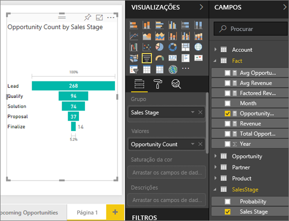
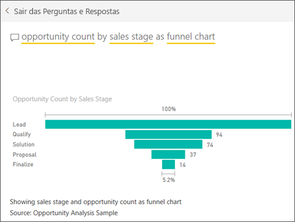

# Gráficos de funil
Um gráfico de funil ajuda-o a visualizar um processo linear com fases ligadas de forma sequencial. Por exemplo, um funil de vendas que controla os clientes por fases: Oportunidade Potencial \> Oportunidade Potencial Qualificada \> Potencial Interessado \> Contrato \> Fecho.  Num relance, a forma do funil transmite a integridade do processo que está a controlar.

Cada fase do funil representa um ponto percentual do total. Portanto, na maioria dos casos, um gráfico de funil tem a forma de um funil – com a primeiro fase, sendo a maior e cada fase subsequente menor do que a antecessor.  Um funil em forma de pêra também é útil - pode identificar um problema no processo.  Mas, em geral, a primeira fase, a fase de "entrada", é a maior.

## Quando usar um gráfico de funil
Os gráficos de funil são uma ótima opção:

* Quando os dados são sequenciais e movimentam-se em pelo menos 4 fases.
* Quando o número de "itens" na primeira for maior que o número na fase final.
* calcular o potencial (receita de vendas/negociações/etc.) por fases.
* calcular e controlar as taxas de conversão e retenção.
* revelar afunilamentos num processo linear.
* controlar o fluxo de trabalho do carrinho de compras.
* acompanhar o progresso e o sucesso das campanhas de publicidade/marketing.

## Trabalhando com gráficos de funil
Gráficos de funil:

* Pode ser fixado através dos relatórios e de perguntas e respostas.
* Podem ser ordenados.
* Vários suportes.
* Podem ser destacados e cruzados por outras visualizações na mesma página de relatório.
* Podem ser utilizados para destacar e cruzar outras visualizações na mesma página de relatório.

## Criar um gráfico de funil básico
Veja este vídeo para ver o Will a criar um gráfico de funil através do exemplo Vendas e Marketing.

<iframe width="560" height="315" src="https://www.youtube.com/embed/qKRZPBnaUXM" frameborder="0" allow="autoplay; encrypted-media" allowfullscreen></iframe>

Agra crie o seu próprio gráfico de funil que mostra o número de oportunidades que temos em cada uma das nossas fases de vendas.

Estas instruções utilizam o Exemplo de Análise de Oportunidade. Para acompanhar, [transfira o exemplo](../sample-datasets.md) do serviço do Power BI (app.powerbi.com) ou o Power BI Desktop.   

1. Comece numa página de relatório em branco e selecione o campo **SalesStage** \> **Fase de Venda**. Se estiver a utilizar o serviço Power BI, garanta que abre o relatório na [Vista de edição](../service-interact-with-a-report-in-editing-view.md).
   
    
2. [Converta o gráfico](power-bi-report-change-visualization-type.md) num funil. Repare que **Fase de Vendas** está no **Grupo**. 
3. No painel **Campos**, selecione **Facto** \> **Contagem de Oportunidades**.
   
    
4. Passar o rato por cima de uma barra mostra uma variedade de informações.
   
   * O nome da fase
   * Número de oportunidades no momento desta fase
   * Taxa de conversão geral (% do cliente potencial) 
   * Passo a passo (também conhecido como taxa de eliminação) que é % da fase anterior (nesse caso, Fase de Proposta/Fase de Solução)
     
     
5. [Adicionar o funil como um bloco do dashboard](../service-dashboard-tiles.md). 
6. [Guarde o relatório](../service-report-save.md).

## Destaque e filtragem cruzada
Para obter informações sobre como utilizar o painel Filtros, veja [Adicionar um filtro a um relatório](../power-bi-report-add-filter.md).

Realçar uma barra em um funil cruza os filtros de outras visualizações na página do relatório e vice-versa. Para acompanhar, adicione mais alguns elementos visuais à página do relatório que contém o gráfico de funil.

1. No funil, selecione a barra **Proposta**. Isso destaca de forma cruzada as outras visualizações na página. Utilize CTRL para selecionar vários.
   
   
2. Para definir preferências de como os elementos visuais são destacados e filtrados de forma cruzada entre si, veja [Interações visuais no Power BI](../service-reports-visual-interactions.md)

## Criar um gráfico de funil com Perguntas e Respostas
Abra o dashboard do Exemplo de Análise de Oportunidade ou qualquer outro dashboard que tenha, pelo menos, uma visualização afixada do conjunto de dados do Exemplo de Análise de Oportunidade.  Quando escrever uma pergunta nas Perguntas e Respostas, o Power BI procura por respostas em todos os conjuntos de dados associados (blocos fixados) ao dashboard selecionado. Para obter mais informações, veja [Power BI - conceitos básicos](../service-basic-concepts.md).

1. No dashboard do Exemplo de Análise de Oportunidade, comece a escrever a sua pergunta na caixa Perguntas e Respostas.
   
   
   
2. Certifique-se de que adiciona "como funil" para o que Power BI saiba qual o tipo de visualização que prefere.

## Próximos passos

[Medidores no Power BI](power-bi-visualization-radial-gauge-charts.md)

[Tipos de visualização no Power BI](power-bi-visualization-types-for-reports-and-q-and-a.md)
