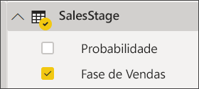
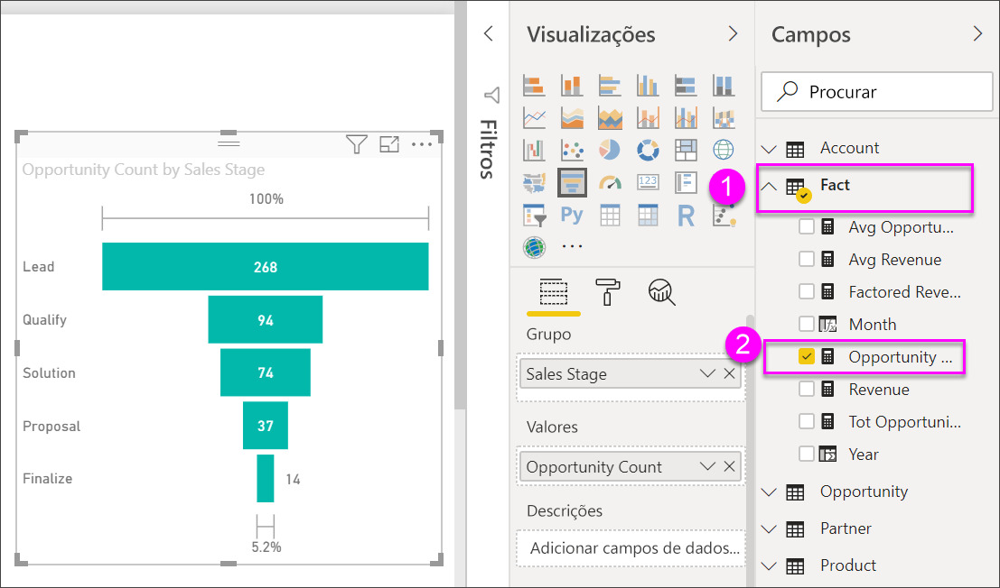

# Gráficos de funil

[!INCLUDE [power-bi-visuals-desktop-banner](../includes/power-bi-visuals-desktop-banner.md)]

Um gráfico de funil ajuda-o a visualizar um processo linear com fases ligadas de forma sequencial. Por exemplo, um funil de vendas que controla os clientes por fases: Oportunidade Potencial \> Oportunidade Potencial Qualificada \> Potencial Interessado \> Contrato \> Fecho.  Num relance, a forma do funil transmite a integridade do processo que está a controlar.

Cada fase do funil representa um ponto percentual do total. Portanto, na maioria dos casos, um gráfico de funil tem a forma de um funil – com a primeiro fase, sendo a maior e cada fase subsequente menor do que a antecessor.  Um funil em forma de pêra também é útil - pode identificar um problema no processo.  Mas, em geral, a primeira fase, a fase de "entrada", é a maior.

## Quando usar um gráfico de funil
Os gráficos de funil são uma ótima opção:

* Quando os dados são sequenciais e movimentam-se em pelo menos 4 fases.
* Quando o número de "itens" na primeira for maior que o número na fase final.
* calcular o potencial (receita de vendas/negociações/etc.) por fases.
* calcular e controlar as taxas de conversão e retenção.
* revelar afunilamentos num processo linear.
* controlar o fluxo de trabalho do carrinho de compras.
* acompanhar o progresso e o sucesso das campanhas de publicidade/marketing.

## Trabalhando com gráficos de funil
Gráficos de funil:

* Podem ser ordenados.
* Vários suportes.
* Podem ser destacados e cruzados por outras visualizações na mesma página de relatório.
* Podem ser utilizados para destacar e cruzar outras visualizações na mesma página de relatório.
   > [!NOTE]
   > Veja este vídeo para ver o Will a criar um gráfico de funil através do exemplo Vendas e Marketing. Depois, siga os passos abaixo do vídeo para experimentar por si próprio, com o exemplo de PBIX de Análise de Oportunidade
   > 
   > 
## Pré-requisito

Este tutorial utiliza o [ficheiro PBIX do Exemplo de Análise de Oportunidade](https://download.microsoft.com/download/9/1/5/915ABCFA-7125-4D85-A7BD-05645BD95BD8/Opportunity%20Analysis%20Sample%20PBIX.pbix
).

1. Na secção superior esquerda da barra de menus, selecione **Ficheiro** > **Abrir**
   
2. Procure a sua cópia do **ficheiro PBIX do Exemplo de Análise de Oportunidade**

1. Abra o **Ficheiro PBIX do Exemplo de Análise de Oportunidade** na vista de relatório .

1. Selecionar  para adicionar uma nova página.

## Criar um gráfico de funil básico
Veja este vídeo para ver o Will a criar um gráfico de funil através do exemplo Vendas e Marketing.

<iframe width="560" height="315" src="https://www.youtube.com/embed/qKRZPBnaUXM" frameborder="0" allow="autoplay; encrypted-media" allowfullscreen></iframe>

Agra crie o seu próprio gráfico de funil que mostra o número de oportunidades que temos em cada uma das nossas fases de vendas.

1. Comece numa página de relatório em branco e selecione o campo **SalesStage** \> **Fase de Venda**.
   
    

1. Selecione o ícone de funil  para converter o gráfico de colunas num gráfico de funil.

2. No painel **Campos**, selecione **Facto** \> **Contagem de Oportunidades**.
   
    
4. Passar o rato por cima de uma barra mostra uma variedade de informações.
   
   * O nome da fase
   * Número de oportunidades no momento desta fase
   * Taxa de conversão geral (% do cliente potencial) 
   * Passo a passo (também conhecido como Taxa de Eliminação) que é % da fase anterior (nesse caso, Fase de Proposta/Fase de Solução)
     
     

6. [Guarde o relatório](../service-report-save.md).

## Destaque e filtragem cruzada
Para obter informações sobre como utilizar o painel Filtros, veja [Adicionar um filtro a um relatório](../power-bi-report-add-filter.md).

Realçar uma barra em um funil cruza os filtros de outras visualizações na página do relatório e vice-versa. Para acompanhar, adicione mais alguns elementos visuais à página do relatório que contém o gráfico de funil.

1. No funil, selecione a barra **Proposta**. Isso destaca de forma cruzada as outras visualizações na página. Utilize CTRL para selecionar vários.
   
   
2. Para definir preferências de como os elementos visuais são destacados e filtrados de forma cruzada entre si, veja [Interações visuais no Power BI](../service-reports-visual-interactions.md)

## Próximos passos

[Medidores no Power BI](power-bi-visualization-radial-gauge-charts.md)

[Tipos de visualização no Power BI](power-bi-visualization-types-for-reports-and-q-and-a.md)
