# Visualização de influenciadores principais

[!INCLUDE [power-bi-visuals-desktop-banner](../includes/power-bi-visuals-desktop-banner.md)]

O elemento visual de influenciadores principais ajuda a compreender os fatores que motivam uma métrica em que esteja interessado. Este analisa os seus dados, classifica os fatores que são importantes e apresenta-os como influenciadores principais. Por exemplo, imagine que pretende determinar o que influencia a rotatividade dos colaboradores. Alguns dos fatores podem ser a duração dos contratos de trabalho e a idade dos colaboradores. 
 
## Quando devem ser utilizados os influenciadores principais 
O elemento visual de influenciadores principais é uma ótima opção caso queira: 
- Determinar os fatores que afetam a métrica sob análise.
- Contrastar a importância relativa destes fatores. Por exemplo, os contratos a curto prazo têm maior impacto sobre a rotatividade do que os contratos a longo prazo? 

## Funcionalidades do elemento visual de influenciadores principais

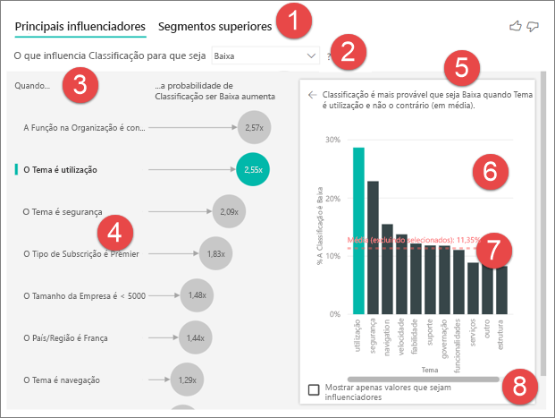

1. **Separadores**: selecione um separador para alternar entre vistas. Os **influenciadores principais** mostram os contribuidores principais para o valor de métrica selecionado. Os **segmentos superiores** mostram os principais segmentos que contribuem para o valor de métrica selecionado. Um *segmento* é composto por uma combinação de valores. Por exemplo, um segmento pode ser um conjunto de consumidores que são clientes há pelo menos 20 anos e que vivem na região oeste. 

2. **Caixa pendente**: o valor da métrica sob investigação. Neste exemplo, repare na métrica **Rating** (Classificação). O valor selecionado é **Low** (Baixa).

3. **Revisão**: ajuda-o a interpretar o elemento visual no painel esquerdo.

4. **Painel esquerdo**: o painel esquerdo contém um elemento visual. Neste caso, o painel esquerdo mostra uma lista dos influenciadores principais.

5. **Revisão**: ajuda-o a interpretar o elemento visual no painel direito.

6. **Painel direito**: o painel direito contém um elemento visual. Neste caso, o gráfico de colunas apresenta todos os valores do **Theme** (Tema) do influenciador principal que foi selecionado no painel esquerdo. O valor específico de **usability** (utilização) do painel esquerdo é apresentado a verde. Todos os outros valores de **Theme** (Tema) são apresentados a preto.

7. **Linha média**: a média é calculada para todos os valores possíveis de **Theme** (Tema), à exceção de **usability** (utilização) (que é o influenciador selecionado). Deste modo, o cálculo aplica-se a todos os valores a preto. A média indica-nos a percentagem de outros **Themes** (Temas) que tinham uma classificação baixa. Neste caso, 11,35% tinha uma classificação baixa (apresentada pela linha pontilhada).

8. **Caixa de verificação**: filtra o elemento visual no painel direito para apresentar apenas valores que são influenciadores para esse campo. Neste exemplo, iria filtrar o elemento visual para utilização, segurança e navegação.

## Analisar uma métrica categórica
 
Veja este vídeo para saber como criar um elemento visual de influenciadores principais com uma métrica categórica. Em seguida, siga estes passos para criar um. 

   > [!NOTE]
   > Este vídeo utiliza uma versão anterior do Power BI Desktop.
   > 
   > 
<iframe width="560" height="315" src="https://www.youtube.com/embed/fDb5zZ3xmxU" frameborder="0" allow="accelerometer; autoplay; encrypted-media; gyroscope; picture-in-picture" allowfullscreen></iframe>

O seu Gestor de Produtos pretende que descubra quais são os fatores que levam os clientes a tecer críticas negativas sobre o nosso serviço cloud. Para acompanhar, abra o [ficheiro PBIX Customer Feedback](https://github.com/Microsoft/powerbi-desktop-samples/blob/master/2019/customerfeedback.pbix) (Feedback dos Clientes) no Power BI Desktop. Também pode transferir o [ficheiro do Excel Customer Feedback (Feedback dos Clientes) para o serviço Power BI ou Power BI Desktop](https://github.com/Microsoft/powerbi-desktop-samples/blob/master/2019/customerfeedback.xlsx). Selecione uma ligação e, em seguida, selecione **Transferir** na página do GitHub que é apresentada.

> [!NOTE]
> O conjunto de dados Customer Feedback (Feedback dos Clientes) é baseado em [Moro et al., 2014] S. Moro, P. Cortez e P. Rita. "A Data-Driven Approach to Predict the Success of Bank Telemarketing." (Uma Abordagem Baseada em Dados para Prever o Êxito de Telemarketing na Banca). *Decision Support Systems*, Elsevier, 62:22-31, junho de 2014. 

1. Abra o relatório e selecione o ícone de **Principais influenciadores**. 

    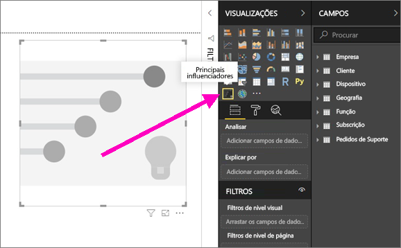

2. Mova a métrica que pretende investigar para o campo **Analisar**. Para ver o que motiva um cliente a classificar a qualidade do serviço como baixa, selecione **Customer Table** (Tabela de Clientes)  > **Rating** (Classificação).

3. Mova os campos que acredita que podem influenciar a **Rating** (Classificação) para o campo **Explicar por**. Pode mover os campos que quiser. Neste caso, comece pelos campos:
    - País/Região 
    - Função na Organização 
    - Tipo de Subscrição 
    - Tamanho da Empresa 
    - Tema
    
4. Deixe o campo **Expandir por** vazio. Este campo só é utilizado ao analisar uma medida ou um campo resumido. 

5. Para se focar nas classificações negativas, selecione **Low** (Baixa) na caixa pendente **O que influencia Rating (Classificação) para que seja**.  

    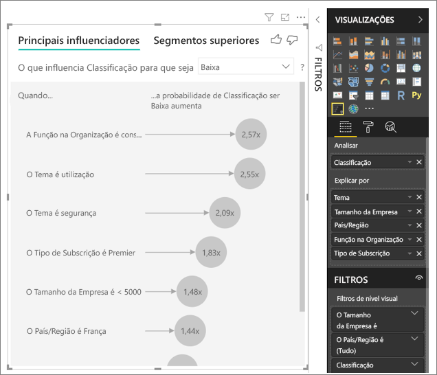

A análise é executada ao nível da tabela do campo que está a ser analisado. Neste caso, trata-se da métrica **Rating** (Classificação). Esta métrica é definida ao nível do cliente. Cada cliente atribuiu uma classificação alta ou baixa. Todos os fatores explicativos têm de ser definidos ao nível do cliente para que o elemento visual os possa utilizar. 

No exemplo anterior, todos os fatores explicativos têm uma relação um para um ou muitos para um com a métrica. Neste caso, cada cliente atribuiu um único tema à respetiva classificação. Do mesmo modo, os clientes são provenientes de um país, têm um tipo de subscrição e uma função na respetiva organização. Os fatores explicativos já são os atributos de um cliente, pelo que não são necessárias transformações. O elemento visual poderá utilizá-los imediatamente. 

Mais adiante neste tutorial, verá exemplos mais complexos com relações de um para muitos. Nesses casos, as colunas têm de ser agregadas ao nível do cliente antes de poder realizar a análise. 

As medidas e agregações utilizadas como fatores explicativos também são avaliadas ao nível da tabela da métrica **Analyze** (Análise). Serão mostrados alguns exemplos mais à frente neste artigo. 

## Interpretar as categorias de influenciadores principais 
Vejamos os influenciadores principais para classificações baixas. 

### Principal fator que influencia a probabilidade de atribuir uma classificação baixa

O cliente neste exemplo pode ter três funções: consumidor, administrador e publicador. Os consumidores são o principal fator que contribui para a atribuição de uma classificação baixa. 

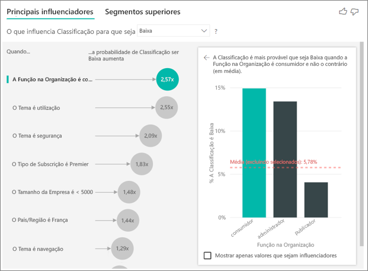

Mais precisamente, os seus consumidores têm uma probabilidade 2,57 vezes maior de atribuir uma classificação negativa ao seu serviço. O gráfico de influenciadores principais indica que **Role in Org is consumer** (Função na Organização é consumidor) está em primeiro lugar na lista à esquerda. Ao selecionar **Role in Org is consumer**, (Função na Organização é consumidor), o Power BI apresenta detalhes adicionais no painel direito. É apresentada a comparação do impacto de cada função sobre a probabilidade de uma classificação ser baixa.
  
- 14,93% dos consumidores atribuem uma classificação baixa. 
- Em média, todas as outras funções atribuem uma classificação baixa 5,78% das vezes.
- Em comparação com todas as outras funções, os consumidores têm uma probabilidade 2,57 vezes maior de atribuir uma classificação baixa. Pode determinar este valor ao dividir a barra verde pela linha pontilhada a vermelho. 

### Fator secundário que influencia a probabilidade de atribuir uma classificação baixa

O elemento visual de influenciadores principais compara e classifica fatores de diversas variáveis diferentes. O segundo influenciador não tem nenhuma relação com **Role in Org** (Função na Organização). Selecione o segundo influenciador na lista: **Theme is usability** (Tema é utilização). 

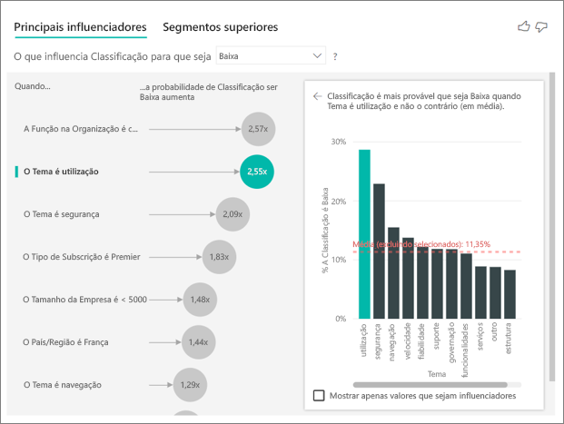

O segundo fator mais importante está relacionado com o tema da crítica do cliente. Os clientes que comentaram sobre a utilização do produto apresentaram uma probabilidade 2,55 vezes maior de atribuir uma classificação baixa em comparação com os clientes que comentaram sobre outros temas, como a fiabilidade, design ou velocidade. 

Entre os elementos visuais, a média (linha pontilhada a vermelho) mudou de 5,78% para 11,34%. A média é dinâmica porque se baseia no resultado médio de todos os outros valores. Para o primeiro influenciador, a média exclui a função dos clientes. Para o segundo influenciador, a média exclui o tema de utilização. 
 
Selecione a caixa de verificação **Mostrar apenas valores que sejam influenciadores** para filtrar apenas pelos valores influentes. Neste caso, são as funções que motivam a atribuição de uma classificação baixa. De doze temas, passamos para quatro que o Power BI identificou como os temas que motivam classificações baixas. 

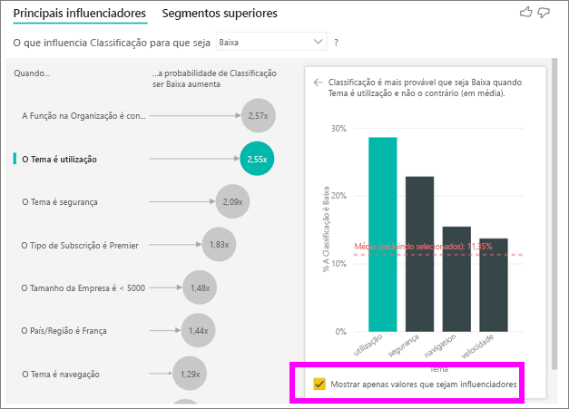

## Interagir com outros elementos visuais 
 
Sempre que selecionar uma segmentação de dados, um filtro ou outro elemento visual na tela, o elemento visual de influenciadores principais volta a executar a análise na nova parcela de dados. Por exemplo, pode mover o campo **Company Size** (Tamanho da Empresa) para o relatório e utilizá-lo como uma segmentação de dados. Utilize-o para ver se os influenciadores principais dos clientes da sua empresa são diferentes em comparação com a população em geral. Uma grande empresa tem mais de 50 mil colaboradores.
 
Ao selecionar **>50,000**, a análise é executada novamente e pode ver que os influenciadores mudaram. Para os clientes de grandes empresas, o principal influenciador para a atribuição de classificações baixas é um tema relacionado com segurança. Poderá querer fazer uma investigação mais aprofundada para determinar se existem funcionalidades de segurança específicas com as quais os seus clientes não estejam satisfeitos. 

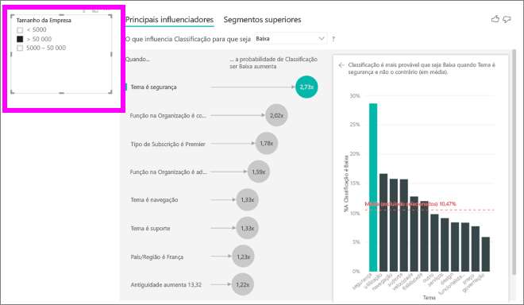

## Interpretar influenciadores principais contínuos 
 
Até agora, viu como utilizar o elemento visual para explorar como os diversos campos categóricos influenciam a atribuição de classificações baixas. Também é possível incluir fatores contínuos, como a idade, altura e preço, no campo **Explicar por**. Vejamos o que acontece se movermos o campo **Tenure** (Antiguidade) da Customer Table (Tabela de Clientes) para o campo **Explicar por**. A antiguidade representa há quanto tempo um cliente utiliza o serviço. 
 
À medida que a antiguidade aumenta, a probabilidade de receber uma classificação mais baixa também aumenta. Esta tendência sugere que os clientes de longa data apresentam uma maior probabilidade de atribuir uma classificação baixa. Esta informação é interessante, pelo que recomendamos que a analise melhor mais tarde. 
 
A visualização indica que sempre que a antiguidade sobe 13,44 meses, a probabilidade média de receber uma classificação baixa torna-se 1,23 vezes superior. Neste caso, o valor de 13,44 meses descreve o desvio-padrão da antiguidade. Por isso, a informação obtida analisa a forma como o aumento da antiguidade numa quantidade padrão (o desvio padrão da antiguidade) afeta a probabilidade de receber uma classificação baixa. 
 
O gráfico de dispersão no painel direito indica a percentagem média de classificações baixas por cada valor de antiguidade. O declive é realçado com uma linha de tendência.

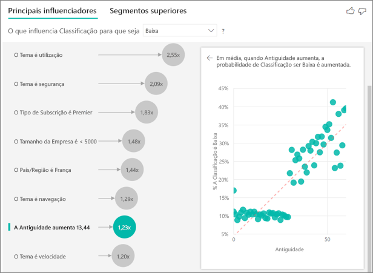

## Influenciadores principais contínuos posicionados

Em alguns casos, poderá reparar que os seus fatores contínuos foram automaticamente transformados em fatores categóricos. Isto ocorre porque nos apercebemos de que a relação entre variáveis não é linear, pelo que não podemos descrever a relação simplesmente como uma relação que está a aumentar ou a diminuir (como fizemos no exemplo acima).

Executamos testes de correlação para determinar o grau de linearidade do influenciador em relação ao destino. Se o destino for contínuo, executamos a correlação de Pearson e, se o destino for categórico, executamos os testes de correlação Ponto-Bisserial. Se detetarmos que a relação não é suficientemente linear, realizamos discretização supervisionada e geramos um máximo de 5 discretizações. Para descobrir que discretizações fazem mais sentido, utilizamos um método de discretização supervisionada que observa a relação entre o fator explicativo e o destino a ser analisado.

## Interpretar medidas e agregações como influenciadores principais 
 
Pode utilizar medidas e agregações como fatores explicativos na sua análise. Por exemplo, poderá querer ver o impacto do número de pedidos de suporte dos clientes ou da duração média de um pedido aberto na classificação recebida. 
 
Neste caso, quer ver se o número de pedidos de suporte de um cliente tem influência na classificação atribuída pelo mesmo. Agora vamos incluir o campo **Support Ticket ID** (ID do Pedido de Suporte) da tabela Support Ticket (Pedido de Suporte). Dado que um cliente pode ter múltiplos pedidos de suporte, tem de agregar o ID ao nível do cliente. A agregação é importante porque a análise é executada ao nível do cliente, pelo que todas as motivações têm de ser definidas nesse nível de granularidade. 
 
Vejamos o número de IDs. Cada linha de cliente tem um número de pedidos de suporte associados. Neste caso, à medida que o número de pedidos de suporte aumenta, a probabilidade de as classificações serem baixas aumenta 5,51 vezes. O elemento visual do lado direito mostra o número médio de pedidos de suporte segundo diferentes valores de **Rating** (Classificação) avaliados ao nível do cliente. 

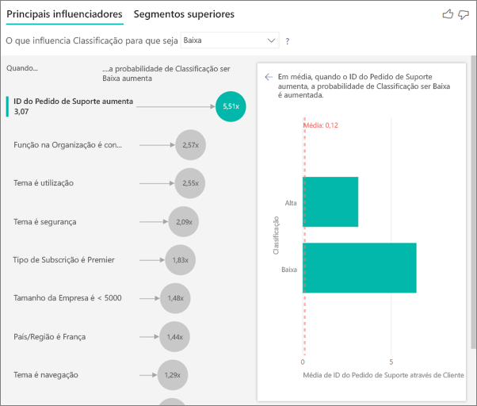

## Interpretar os resultados: Segmentos superiores 
 
Pode utilizar o separador **Principais influenciadores** para avaliar cada fator individualmente. Também pode utilizar o separador **Segmentos superiores** para ver como uma combinação de fatores afeta a métrica analisada. 
 
Inicialmente, os segmentos superiores mostram uma descrição geral de todos os segmentos detetados pelo Power BI. O exemplo seguinte mostra que foram encontrados seis segmentos. Estes segmentos são ordenados segundo a percentagem de classificações baixas em cada segmento. Por exemplo, o Segmento 1 possui 74,3% de classificações baixas atribuídas pelos clientes. Quanto maior for a bolha, maior será a proporção de classificações baixas. O tamanho da bolha representa a quantidade de clientes que se encontram no segmento. 

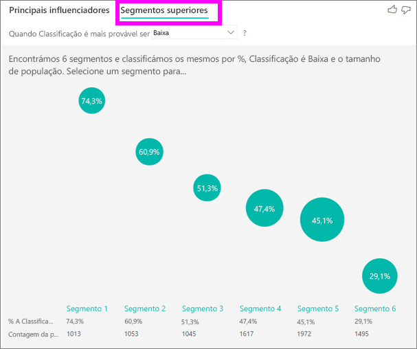

Ao selecionar uma bolha, os detalhes do segmento em questão são apresentados. Por exemplo, se selecionar Segmento 1, verá que é composto por clientes relativamente estabelecidos. Tratam-se de clientes há mais de 29 meses e têm mais do que quatro pedidos de suporte. Por fim, como não são publicadores, tratam-se de consumidores ou administradores. 
 
Neste grupo, 74,3% dos clientes atribuíram uma classificação baixa. O cliente comum atribuiu uma classificação baixa 11,7% das vezes, pelo que este segmento mostra uma proporção das classificações baixas 63% superior. O Segmento 1 também contém aproximadamente 2,2% dos dados, representando uma parte considerável da população. 

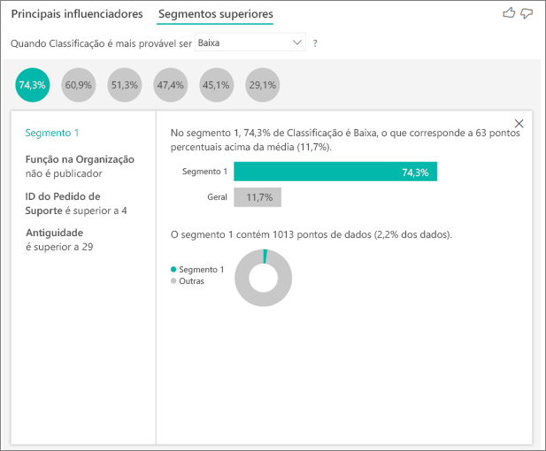

## Adicionar contagens

Por vezes, um influenciador pode ter um grande impacto mas representar muito pouco dos dados. Por exemplo, **Theme** is **usability** (Tema é utilização) é o segundo maior influenciador para classificações baixas. No entanto, apenas alguns clientes poderão ter reclamado da utilização. As contagens podem ajudar a priorizar em que influenciadores se quer concentrar.

Pode ativar as contagens através do **cartão Análise** do painel de formatação.

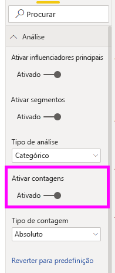

Assim que as contagens forem ativadas, verá um anel à volta da bolha de cada influenciador, que representa a percentagem aproximada dos dados que o influenciador contém. Quanto maior for anel circular à volta da bolha, mais dados contém. Podemos ver que **Theme** is **usability** (Tema é utilização) contém uma pequena porção de dados.

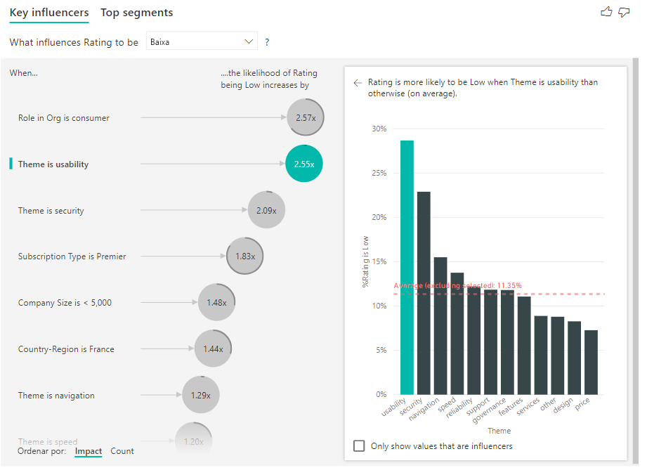

Também pode utilizar o botão Ordenar por no canto inferior esquerdo do elemento visual para ordenar as bolhas por contagem, em vez de impacto. **Subscription Type** is **Premier** (O Tipo de Subscrição é Premier) é o principal influenciador com base na contagem.

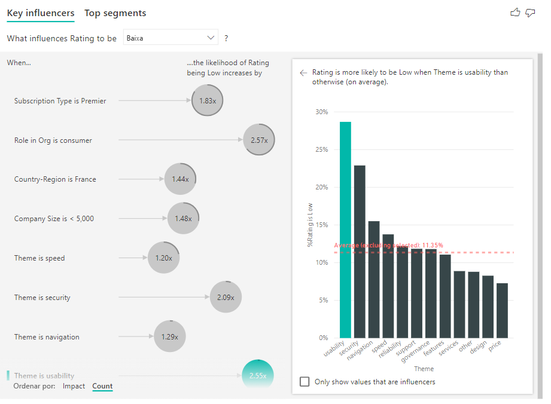

Ter um anel completo à volta do círculo significa que o influenciador contém 100% dos dados. Pode alterar o tipo de contagem para ser relativo ao influenciador máximo ao utilizar o menu pendente **Tipo de contagem** no **cartão Análise** do painel de formatação. Agora o influenciador com a maior quantidade de dados será representado por um anel completo e todas as outras contagens serão relativas ao mesmo.

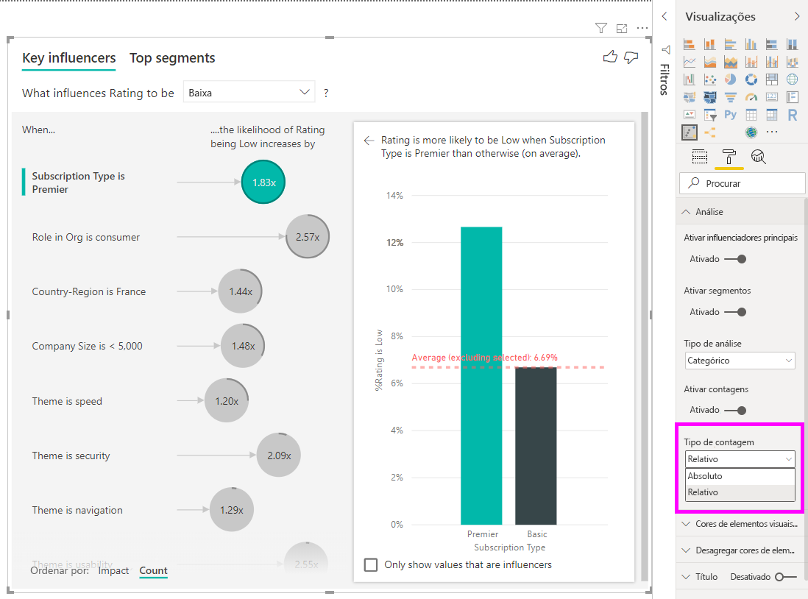

## Analisar uma métrica numérica

Se mover um campo numérico não resumido para o campo **Analisar**, pode selecionar como lidar com esse cenário. Pode alterar o comportamento do elemento visual ao aceder ao **Painel Formatação** e alternar entre o **Tipo de Análise Categórico** e o **Tipo de Análise Contínuo**.

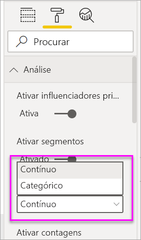

Um **Tipo de Análise Categórico** funciona conforme descrito acima. Por exemplo, se estiver a analisar classificações de inquéritos de 1 a 10, poderia perguntar "O que influencia Classificações de Inquéritos para que seja 1?"

Por outro lado, um **Tipo de Análise Contínuo** utiliza uma pergunta contínua. No exemplo acima, a nossa nova pergunta seria "O que influencia Classificações de Inquéritos para que aumentem/diminuam?"

Esta distinção é bastante útil quando tem muitos valores exclusivos no campo que está a analisar. No exemplo abaixo, analisamos preços de casas. Não seria muito relevante perguntar "O que influencia o Preço de uma Casa para que seja 156 214?", pois é uma pergunta muito específica e é possível que não tenhamos dados suficientes para deduzir que há um padrão.

Em alternativa, poderíamos perguntar "O que influencia o Preço de uma Casa para que aumente?", o que nos permite processar os preços de casas como um intervalo, em vez de como valores distintos.

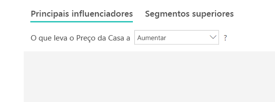

## Interpretar os resultados: Principais influenciadores 

Neste cenário, analisamos a pergunta "O que influencia o Preço de uma casa para que aumente?". Temos em consideração vários fatores explicativos que podem afetar o preço de uma casa, como o **YearBuilt** (ano de construção da casa), **KitchenQual** (qualidade da cozinha) e **YearRemodAdd** (ano de remodelação da casa). 

No exemplo abaixo, analisamos o nosso influenciador principal, que é a qualidade da cozinha ser Excelente. Os resultados são bastante semelhantes aos que vimos na análise de métricas categóricas, com a exceção de algumas diferenças importantes:

- O gráfico de colunas à direita expõe médias e não percentagens. Assim, mostra-nos o preço médio de uma casa com uma cozinha de qualidade excelente (barra verde) em comparação com o preço médio de uma casa sem uma cozinha de excelente qualidade (linha pontilhada).
- O número na bolha continua a ser a diferença entre a linha pontilhada a vermelho e a barra verde, mas é um valor (158,49 mil $) e não uma probabilidade (1,93 vezes). Em média, as casas com cozinhas de excelente qualidade são quase 160 mil $ mais caras do que as casas sem cozinhas de excelente qualidade.

No exemplo abaixo, analisamos o impacto de um fator contínuo (ano de remodelação da casa) no preço de uma casa. Em comparação com o método de análise de influenciadores contínuos de métricas categóricas, as diferenças são as seguintes:

-   O gráfico de dispersão no painel direito expõe o preço médio de uma casa para cada valor distinto do ano de remodelação. 
-   O valor na bolha mostra quanto aumenta o preço médio de uma casa (neste caso, 2,87 mil $) quando o ano de remodelação da casa aumenta pelo respetivo desvio padrão (neste caso, 20 anos).

Por último, no caso das medidas, analisamos o ano médio de construção de uma casa. A análise é a seguinte:

-   O gráfico de dispersão no painel direito expõe o preço médio de uma casa para cada valor distinto na tabela.
-   O valor na bolha mostra quanto aumenta o preço médio de uma casa (neste caso, 1,35 mil $) quando o ano médio aumenta pelo respetivo desvio padrão (neste caso, 30 anos).

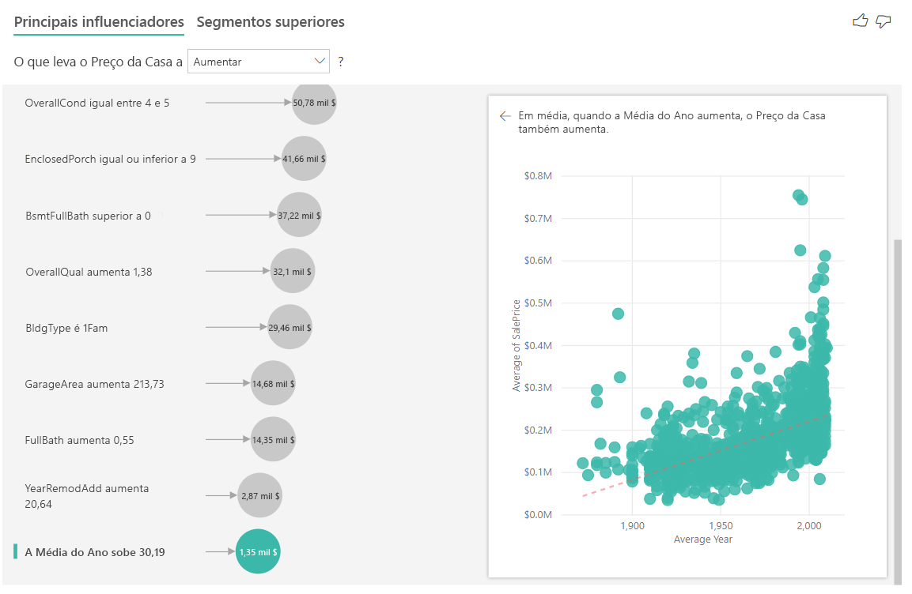

## Interpretar os resultados: Segmentos Superiores

Os segmentos superiores de destinos numéricos mostram grupos em que os preços de casas são em média mais elevados do que no conjunto de dados geral. Por exemplo, abaixo podemos ver que o **Segmento 1** é composto por casas em que **GarageCars** (número de automóveis que cabem na garagem) é superior a 2 e o **RoofStyle** (Estilo de Telhado) é Hip (Telha). As casas com estas características têm um preço médio de 355 mil $ em comparação com o preço médio geral nos dados, que é de 180 mil $.

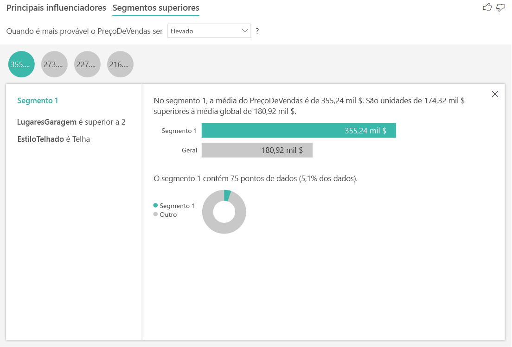

## Analisar uma métrica que é uma medida ou uma coluna resumida

No caso de uma medida ou coluna resumida, a análise é predefinida para o **Tipo de Análise Contínuo** descrito [acima](https://docs.microsoft.com/power-bi/visuals/power-bi-visualization-influencers#analyze-a-metric-that-is-numeric). Esta opção não pode ser alterada. A maior diferença entre analisar uma medida/coluna resumida e uma coluna numérica não resumida é o nível a que a análise é executada.

No caso de colunas não resumidas, a análise é sempre executada ao nível da tabela. No exemplo do preço da casa acima, analisámos a métrica **House Price** (Preço da Casa) para ver o que influencia o aumento/diminuição do preço da casa. A análise é executada automaticamente ao nível da tabela. A nossa tabela tem um ID exclusivo para cada casa, por isso a análise é executada ao nível da casa.

Para medidas e colunas resumidas, não sabemos imediatamente a que nível as devemos analisar. Se o **House Price** (Preço da Casa) for resumido como uma **Média**, temos de considerar a que nível gostaríamos que o preço médio da casa fosse calculado. O preço médio da casa está ao nível da vizinhança? Ou talvez ao nível da região?

As medidas e colunas resumidas são analisadas automaticamente ao nível dos campos **Explicar por** utilizados. Imagine que temos três campos em **Explicar por** em que estamos interessados: **Kitchen Quality** (Qualidade da Cozinha), **Building Type** (Tipo de Edifício) e **Air Conditioning** (Ar Condicionado). O **Average House Price** (Preço Médio da Casa) seria calculado para cada combinação exclusiva destes três campos. Geralmente, é útil mudar para uma vista de tabela para ver os dados que estão a ser avaliados.

Esta análise é muito resumida e, portanto, será difícil para o modelo de regressão encontrar padrões nos dados a partir dos quais pode aprender. Devemos executar a análise a um nível mais detalhado para obter resultados melhores. Se quiséssemos analisar o preço da casa ao nível da casa, teríamos de adicionar explicitamente o campo **ID** à análise. No entanto, não queremos que o ID da casa seja considerado um influenciador. Não é útil saber que, à medida que o ID da casa aumenta, o preço de uma casa aumenta. É aqui que a opção do grupo de campos **Expandir por** se torna útil. Pode utilizar a opção **Expandir por** para adicionar campos que pretende utilizar para definir o nível da análise sem procurar novos influenciadores.

Observe o aspeto da visualização assim que adicionarmos **ID** a **Expandir por**. Assim que definir o nível a que pretende que a sua medida seja avaliada, a interpretação dos influenciadores é exatamente igual para [colunas numéricas não resumidas](https://docs.microsoft.com/power-bi/visuals/power-bi-visualization-influencers#analyze-a-metric-that-is-numeric).

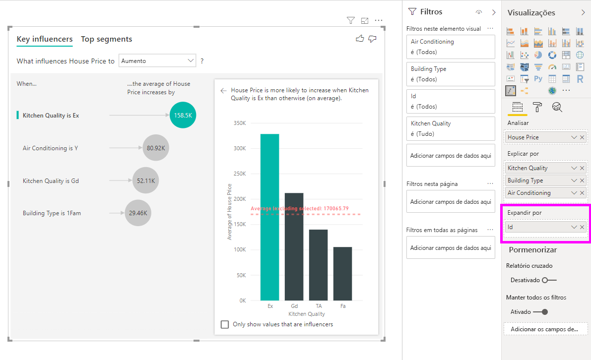

Se quiser saber mais sobre como pode analisar medidas com a visualização de influenciadores principais, veja o seguinte tutorial.

<iframe width="1167" height="631" src="https://www.youtube.com/embed/2X1cW8oPtc8" frameborder="0" allow="accelerometer; autoplay; encrypted-media; gyroscope; picture-in-picture" allowfullscreen></iframe>

## Considerações e resolução de problemas 
 
**Quais são as limitações do elemento visual?** 
 
O elemento visual dos influenciadores principais tem algumas limitações:

- O Direct Query não é suportado
- A ligação em direto com o Azure Analysis Services e o SQL Server Analysis Services não é suportada
- A publicação na Web não é suportada
- É necessário o .NET Framework 4.6 ou posterior

**Vejo um erro que indica que não foram encontrados influenciadores ou segmentos. Porque é que isto acontece?** 

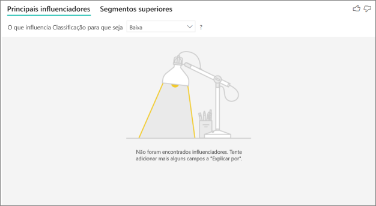

Este erro ocorre caso tenha incluído campos em **Explicar por** sem terem sido encontrados influenciadores. 
- Incluiu a métrica que estava a analisar no campo **Analisar** e **Explicar por**. Remova-a do campo **Explicar por**. 
- Os seus campos explicativos contêm demasiadas categorias com poucas observações. Esta situação dificulta que a visualização determine quais fatores são influenciadores. É difícil generalizar tendo como base apenas algumas observações. Se estiver a analisar um campo numérico, recomendamos que mude de **Análise Categórica** para **Análise Contínua** no **Painel Formatação**, no cartão **Análise**.
- Os seus fatores explicativos possuem observações suficientes para que possa generalizar, mas a visualização não encontrou correlações relevantes a observar.
 
**Vejo um erro que indica que a métrica analisada não tem dados suficientes para executar a análise. Porque é que isto acontece?** 

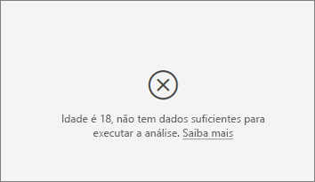

A visualização funciona ao analisar os padrões nos dados de um grupo em comparação com outros grupos. Por exemplo, procura os clientes que atribuíram classificações baixas em comparação com os clientes que atribuíram classificações altas. Caso os dados no seu modelo tenham apenas algumas observações, será difícil encontrar padrões. Se a visualização não tiver dados suficientes para encontrar influenciadores relevantes, indicará que são necessários mais dados para executar a análise. 

Recomendamos que tenha pelo menos 100 observações para o estado selecionado. Neste caso, o estado é o abandono dos clientes. Também precisa de pelo menos 10 observações para os estados utilizados para comparação. Neste caso, o estado de comparação é o não abandono dos clientes.

Se estiver a analisar um campo numérico, recomendamos que mude de **Análise Categórica** para **Análise Contínua** no **Painel Formatação**, no cartão **Análise**.

**Vejo um erro quando o campo "Analisar" não é resumido e a análise é sempre executada ao nível da linha da tabela principal. Não é permitido alterar este nível através dos campos "Expandir por". Porque é que isto acontece?**

Ao analisar uma coluna categórica ou numérica, a análise deve ser sempre executada ao nível da tabela. Por exemplo, se estiver a analisar os preços da casa e a sua tabela contiver uma coluna ID, a análise será executada automaticamente ao nível do ID da casa. 

Quando estiver a analisar uma medida ou coluna resumida, tem de indicar explicitamente a que nível pretende que a análise seja executada. Pode utilizar a opção **Expandir por** para alterar o nível da análise para medidas e colunas resumidas sem adicionar novos influenciadores. Se **House price** (Preço da casa) for definido como uma medida, pode adicionar a coluna ID da casa a **Expandir por** para alterar o nível da análise.

**Vejo um erro que indica que um campo em *Explicar por* não está exclusivamente relacionado com a tabela que inclui a métrica analisada. Porque é que isto acontece?**
 
A análise é executada ao nível da tabela do campo que está a ser analisado. Por exemplo, se estiver a analisar o feedback dos clientes sobre o seu serviço, poderá ter uma tabela que lhe indica se um cliente atribuiu uma classificação baixa ou alta. Neste caso, a sua análise é executada ao nível da tabela de clientes. 

Se tiver uma tabela relacionada definida a um nível mais detalhado do que a tabela que contém a sua métrica, verá este erro. Eis um exemplo: 
 
- Imagine que está a analisar os motivos que levam os seus clientes a atribuírem classificações baixas ao seu serviço.
- Quer determinar se o dispositivo no qual os clientes utilizam o seu serviço tem influência nas críticas atribuídas.
- Um cliente pode utilizar o serviço de múltiplas formas diferentes.
- No exemplo seguinte, o cliente n.º 10 000 000 utiliza um browser e um tablet para interagir com o serviço.

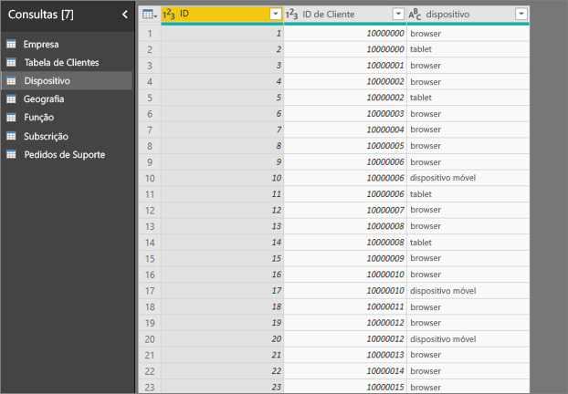

Se tentar utilizar a coluna de dispositivos como um fator explicativo, verá o seguinte erro: 

Este erro é apresentado porque o dispositivo não está definido ao nível do cliente. Um cliente pode utilizar o serviço em múltiplos dispositivos. Para que a visualização possa encontrar padrões, o dispositivo tem de ser um atributo do cliente. Existem várias soluções que dependem da sua compreensão da empresa: 
 
- Pode alterar o resumo de dispositivos a contabilizar. Por exemplo, utilize a contagem caso o número de dispositivos possa afetar a classificação atribuída por um cliente. 
- Pode dinamizar a coluna de dispositivos para ver se a utilização do serviço num dispositivo específico tem influência sobre a classificação de um cliente.
 
Neste exemplo, os dados foram dinamizados para criar novas colunas para browser, telemóvel e tablet (certifique-se de que exclui e recria as suas relações na vista de modelação depois de dinamizar os seus dados). Agora pode utilizar estes dispositivos específicos em **Explicar por**. Todos os dispositivos são influenciadores e a utilização de um browser tem o maior impacto na classificação dos clientes.

Mais precisamente, os clientes que não utilizam o browser para consumir o serviço apresentam uma probabilidade 3,79 vezes maior de atribuir uma classificação baixa do que os clientes que utilizam o browser. Mais abaixo na lista, ocorre o inverso para mobile (telemóvel). Os clientes que utilizam a aplicação móvel apresentam uma maior probabilidade de atribuir uma classificação baixa do que os clientes que não a utilizam. 

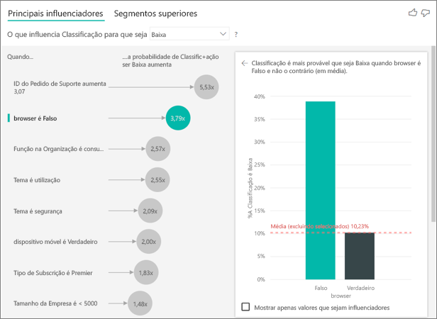

**Vejo um aviso a indicar que as medidas não foram incluídas na minha análise. Porque é que isto acontece?** 

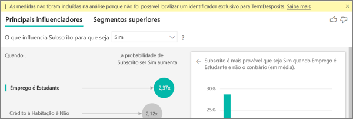

A análise é executada ao nível da tabela do campo que está a ser analisado. Se estiver a analisar a taxa de abandono dos clientes, poderá ter uma tabela a indicar se um cliente abandonou ou não o serviço. Neste caso, a sua análise é executada ao nível da tabela de clientes.
 
Por predefinição, as medidas e agregações são analisadas ao nível da tabela. Se existisse uma medida para a média de gastos mensais, a mesma seria analisada ao nível da tabela de clientes. 

Se a tabela de clientes não tiver um identificador exclusivo, não poderá avaliar a medida e esta será ignorada pela análise. Para evitar este problema, certifique-se de que a sua métrica tem um identificador exclusivo. Neste caso, é a tabela de clientes e o identificador exclusivo é o ID de cliente. Também é fácil adicionar uma coluna de índice através do Power Query.
 
**Vejo um aviso a indicar que a métrica que estou a analisar contém mais de 10 valores exclusivos e que isto pode afetar a qualidade da minha análise. Porque é que isto acontece?** 

A visualização de IA pode analisar campos numéricos e categóricos. No caso de campos categóricos, um exemplo pode ser "Churn (Abandono) é Yes (Sim) ou No (Não)" e "Customer Satisfaction (Satisfação do Cliente) é High (Alta), Medium (Média) ou Low (Baixa)". O aumento do número de categorias a analisar significa que haverá uma diminuição das observações por categoria. Esta situação dificulta que a visualização encontre padrões nos dados. 

Ao analisar os campos numéricos, pode optar por processá-los como texto. Nesse caso, executaria a mesma análise que faria para dados categóricos (**Análise Categórica)** . Se tiver vários valores diferentes, recomendamos que mude para a **Análise Contínua**, pois permite-nos deduzir a existência de padrões quando ocorrem aumentos ou diminuições de valores, em vez de os processar como valores distintos. Pode mudar da **Análise Categórica** para a **Análise Contínua** no **Painel Formatação**, no cartão **Análise**.

Para encontrar influenciadores mais fiáveis, recomendamos que agrupe os valores semelhantes numa única unidade. Por exemplo, se tiver uma métrica para o preço, é provável que obtenha melhores resultados ao agrupar preços semelhantes em categorias como Alto, Médio e Baixo, ao invés de utilizar níveis de preços individuais. 

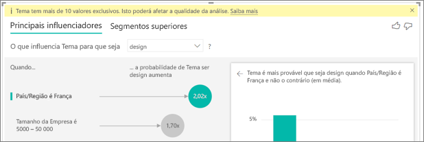

**Existem fatores nos meus dados que aparentam tratar-se de influenciadores principais, embora não o sejam. Como é que isto pode acontecer?**

No exemplo seguinte, os clientes que são consumidores motivam classificações baixas, com 14,93% de classificações baixas. A função de administrador também tem uma proporção elevada de classificações baixas (13,42%), embora não seja considerada um influenciador. 

O motivo disto é que a visualização também considera o número de pontos de dados quando encontra influenciadores. O exemplo seguinte inclui mais de 29 mil consumidores e cerca de 2900 administradores, ou seja, um valor 10 vezes inferior de administradores. Apenas 390 dos mesmos atribuíram uma classificação baixa. O elemento visual não tem dados suficientes para determinar se encontrou um padrão com classificações dos administradores ou se apenas detetou uma hipótese. 

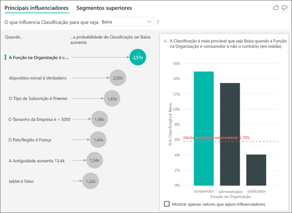

**Como se calculam os influenciadores principais para análises categóricas?**

A visualização de IA utiliza [ML.NET](https://dotnet.microsoft.com/apps/machinelearning-ai/ml-dotnet) para executar uma regressão logística em segundo plano para calcular os influenciadores principais. Uma regressão logística é um modelo estatístico que compara diferentes grupos entre si. 

Se quiser ver o que motiva a atribuição de classificação baixas, a regressão logística avalia a forma como os clientes que atribuíram uma classificação baixa diferem daqueles que atribuíram uma classificação alta. Se tiver múltiplas categorias (como classificações altas, neutras e baixas), pode avaliar a forma como os clientes que atribuíram uma classificação baixa diferem daqueles que não atribuíram uma classificação baixa. Neste caso, de que forma é que os clientes que atribuíram uma classificação baixa diferem dos clientes que atribuíram uma classificação alta ou neutra? 
 
A regressão logística procura padrões nos dados e analisa a forma como os clientes que atribuíram uma classificação baixa podem diferir dos que atribuíram uma classificação alta. Poderá verificar, por exemplo, que os clientes com mais pedidos de suporte atribuíram uma percentagem mais elevada de classificações baixas do que os clientes com poucos ou nenhum pedido de suporte.
 
A regressão logística também considera a forma como são apresentados os pontos de dados. Por exemplo, se os clientes com uma função de administrador atribuíssem uma proporção maior de classificações negativas, mas apenas existissem poucos administradores, esse fator não seria considerado influente. Esta resolução é feita porque não existem pontos de dados suficientes disponíveis para deduzir a existência de um padrão. É utilizado um teste estatístico (conhecido como teste de Wald) para determinar se um fator pode ser considerado um influenciador. O elemento visual utiliza um valor-p de 0,05 para determinar o limite. 

**Como se calculam os influenciadores principais para análises numéricas?**

A visualização de IA utiliza [ML.NET](https://dotnet.microsoft.com/apps/machinelearning-ai/ml-dotnet) para executar uma regressão linear em segundo plano para calcular os influenciadores principais. Uma regressão linear é um modelo estatístico que analisa a forma como o resultado do campo que está a analisar muda com base nos seus fatores explicativos.

Por exemplo, se estivermos a analisar os preços de casas, uma regressão linear irá determinar o impacto que uma cozinha de excelente qualidade terá no preço da casa. As casas com cozinhas de excelente qualidade têm geralmente preços superiores ou inferiores em comparação com as casas sem cozinhas de excelente qualidade?

A regressão linear também considera o número de pontos de dados. Por exemplo, se as casas com campos de ténis tiverem preços mais altos, mas tivermos muito poucas casas com campos de ténis, este fator não será considerado influente. Esta resolução é feita porque não existem pontos de dados suficientes disponíveis para deduzir a existência de um padrão. É utilizado um teste estatístico (conhecido como teste de Wald) para determinar se um fator pode ser considerado um influenciador. O elemento visual utiliza um valor-p de 0,05 para determinar o limite. 

**Como se calculam os segmentos?**

A visualização de IA utiliza [ML.NET](https://dotnet.microsoft.com/apps/machinelearning-ai/ml-dotnet) para executar uma árvore de decisões de forma a detetar subgrupos de interesse. O objetivo da árvore de decisões é ficar com um subgrupo de pontos de dados relativamente alto na métrica em que está interessado. Este grupo pode incluir os clientes com classificações baixas ou as casas com preços altos.

A árvore de decisões analisa cada fator explicativo e tenta determinar qual dos mesmos proporciona a melhor *divisão*. Por exemplo, se filtrar os dados de modo a incluir apenas grandes clientes empresariais, irá essa ação separar os clientes que atribuíram uma classificação alta dos que atribuíram uma classificação baixa? Por outro lado, será melhor filtrar os dados de forma a incluir apenas os clientes que fizeram comentários sobre a segurança? 

Depois de a árvore de decisões realizar a divisão, utiliza o subgrupo de dados e determina a divisão seguinte mais adequada para esses dados. Neste caso, o subgrupo são os clientes que fizeram comentários sobre a segurança. Após cada divisão, a árvore também considera se possui pontos de dados suficientes que tornem este grupo suficientemente representativo para deduzir a existência de um padrão ou se representa uma anomalia nos dados e não um segmento verdadeiro. É aplicado outro teste estatístico para verificar a significância estatística da condição de divisão, com um valor-p de 0,05. 

Quando a execução da árvore de decisões for concluída, irá reunir todas as divisões (como comentários sobre segurança e grandes empresas) e criar filtros do Power BI. Esta combinação de filtros é agrupada como um segmento no elemento visual. 
 
**Por que motivo é que determinados fatores se tornam influenciadores ou deixam de ser influenciadores à medida que movo mais campos para o campo *Explicar por*?**

A visualização avalia todos os fatores explicativos em conjunto. Um fator pode ser um influenciador por si só, mas poderá não o ser quando for considerado juntamente com outros fatores. Imagine que pretende analisar o que faz com que o preço de uma casa seja alto, tendo os quartos e o tamanho da casa como fatores explicativos:

- Por si só, um número de quartos maior pode fazer com que os preços das casas sejam altos.
- A inclusão do tamanho da casa na análise significa que avalia o que acontece aos quartos ao manter o tamanho da casa constante.
- Se o tamanho da casa for fixado em 140 metros quadrados, é improvável que um aumento contínuo do número de quartos aumente drasticamente o preço da casa. 
- O fator Quartos poderá perder a importância que tinha antes de considerarmos o tamanho da casa. 

## Próximos passos
- [Gráficos de combinação no Power BI](power-bi-visualization-combo-chart.md)
- [Tipos de visualização no Power BI](power-bi-visualization-types-for-reports-and-q-and-a.md)
