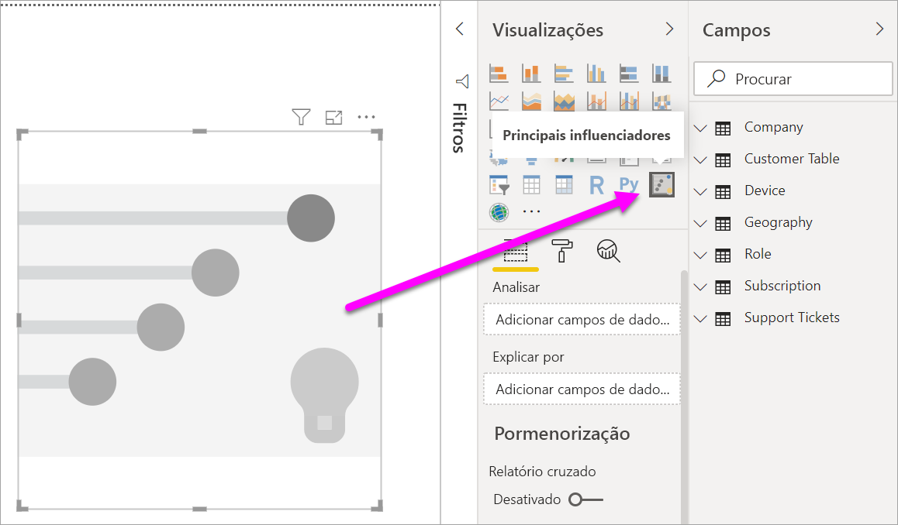
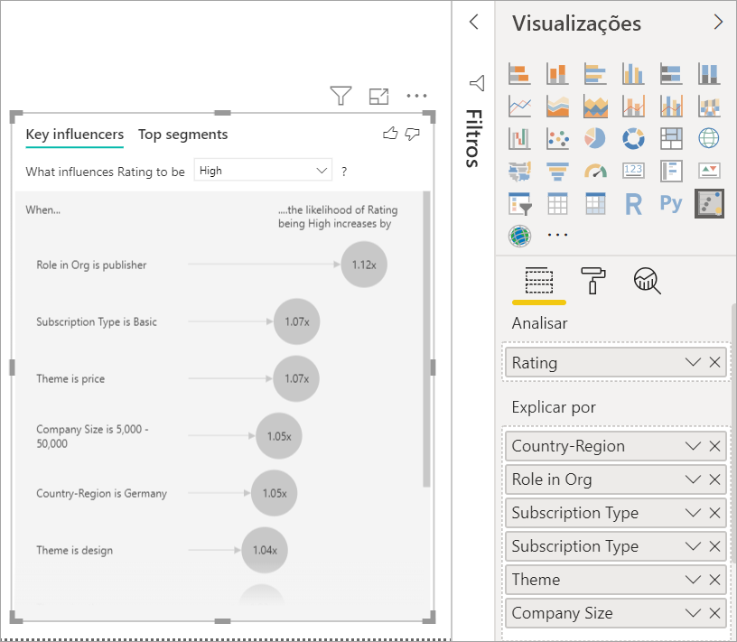

# Visualização de influenciadores principais
Os influenciadores principais visual ajuda-o a compreender os fatores nessa unidade uma métrica que está interessado. Este analisa os seus dados, classifica os fatores que são importantes e apresenta-os como influenciadores principais. Por exemplo, suponha que queira descobrir quais influências rotatividade de funcionários, que é também conhecido como alterações da impressora. Um dos fatores pode ser o comprimento do contrato de emprego e outro fator pode ser a idade do funcionário. 
 
## Quando utilizar os influenciadores principais 
O elemento visual de influenciadores principais é uma ótima opção se pretender: 
- Veja quais fatores afetam a métrica a ser analisada.
- Contraste a importância relativa desses fatores. Por exemplo, os contratos a curto prazo têm maior impacto sobre a rotatividade do que os contratos a longo prazo? 

## Requisitos dos influenciadores principais 
A métrica é analisar tem de ser o campo categórico ou numérico (agregados e medidas ainda não são suportadas).

## Recursos dos influenciadores principais visual

1. **Separadores**: Selecione um separador para alternar entre modos de exibição. **Chave influenciadores** mostra-lhe os contribuintes principais para o valor de métrica selecionado. **Principais segmentos** mostra-lhe os segmentos principais que contribuem para o valor de métrica selecionado. Um *segmento* é composto por uma combinação de valores. Por exemplo, um segmento pode ser consumidores que tenham sido os clientes para, pelo menos, 20 anos e ao vivo na região Oeste. 

2. **Caixa suspensa**: O valor da métrica sendo investigado. Neste exemplo, examinar a métrica **classificação**. O valor selecionado está **baixa**.

3. **Reformulação**: Ele ajuda a interpretar o elemento visual no painel esquerdo.

4. **Painel esquerdo**: Painel do lado esquerdo contém um elemento visual. Neste caso, o painel do lado esquerdo mostra uma lista dos influenciadores principais superior.

5. **Reformulação**: Ele ajuda a interpretar o elemento visual no painel da direita.

6. **Painel direito**: O painel da direita contém um elemento visual. Neste caso, o gráfico de colunas apresenta todos os valores para a chave influencer **tema** que foi selecionado no painel esquerdo. O valor específico da **usabilidade** no painel à esquerda é mostrado em verde. Todos os outros valores para **tema** são mostrados em preto.

7. **Linha média**: A média é calculada para todos os outros valores possíveis para **tema** exceto **usabilidade**. Deste modo, o cálculo aplica-se a todos os valores a preto. Ele informa ao qual é a porcentagem das outras **temas** lhe forneceu uma classificação baixa. Em outras palavras, quando uma classificação é dado por um cliente, que o cliente também descreve o motivo ou tema para a classificação. Alguns temas são a facilidade de utilização, a velocidade e segurança. 

   **Tema é usabilidade** é o segundo maior chave influencer para uma classificação baixa, de acordo com o elemento visual no painel esquerdo. Se média de todos os outros temas e sua contribuição a uma classificação de **baixa**, obtém o resultado mostrado em vermelho. De todos os outros temas tendo em conta, apenas 11.35% são superiores aos **usabilidade**.

8. **Caixa de verificação**: **Mostrar apenas os valores que são influenciadores**.

## Criar um elemento visual de influenciadores principais 
 
Veja este vídeo para saber como criar um influenciadores principais visual. Em seguida, siga estes passos para criar um. 

<iframe width="560" height="315" src="https://www.youtube.com/embed/fDb5zZ3xmxU" frameborder="0" allow="accelerometer; autoplay; encrypted-media; gyroscope; picture-in-picture" allowfullscreen></iframe>

O Gestor de produto quer a descobrir quais fatores de oportunidades potenciais clientes deixar revisões negativas sobre o seu serviço cloud. Para acompanhar, abra o [ficheiro PBIX Customer Feedback](https://github.com/Microsoft/powerbi-desktop-samples/blob/master/2019/customerfeedback.pbix) (Feedback dos Clientes) no Power BI Desktop. Também pode transferir o [ficheiro do Excel de comentários do cliente para o serviço Power BI ou Power BI Desktop](https://github.com/Microsoft/powerbi-desktop-samples/blob/master/2019/customerfeedback.xlsx). 

> [!NOTE]
> O conjunto de dados de comentários dos clientes é com base no [Moro et al., 2014] S. Moro, P. Cortez e Rita P. "Uma condicionada por dados abordagem para prever o sucesso do banco Telemarketing." *Sistemas de suporte de decisão*, Elsevier, 62:22-31, Junho de 2014. 

1. Abra o relatório e selecione o **chave influenciadores** ícone. 

    

2. Mover a métrica que pretende investigar para o **Analyze** campo. O **Analyze** categóricas, noncontinuous, as variáveis ou apenas oferece suporte a campo. Para ver o que pauta um cliente classificação do serviço baixa, selecione **tabela de clientes** > **classificação**. 
3. Mover campos que acredita que podem influenciar **classificação** para o **explicar por** campo. Pode mover campos de quantos desejar. Neste caso, comece com:
    - País/Região 
    - Função na Organização 
    - Tipo de Subscrição 
    - Tamanho da Empresa 
    - Tema 
1. Para se concentrar nas classificações negativas, selecione **baixa** no **o que influenciará a classificação ser** caixa pendente.  

    

A análise é executada no nível da tabela do campo que está a ser analisado. Neste caso, ele tem o **classificação** métrica. Esta métrica é definida num nível de cliente. Cada cliente tenha dado uma classificação alta ou uma pontuação baixa. Todos os fatores explicativo tem de ser definidos ao nível do cliente para o elemento visual fazer utilizá-los. 

No exemplo anterior, todos os fatores explicativo possuem uma correspondência ou uma relação muitos-para-um com a métrica. Neste caso, cada classificação tem exatamente um tema associado a ele. Este tema foi o tema principal da revisão dos clientes. Da mesma forma, os clientes se de um país, têm um tipo de associação e executar uma função na sua organização. Os fatores explicativo já são atributos de um cliente, e nenhuma transformação é necessárias. O elemento visual pode fazer uso imediato deles. 

Mais tarde no tutorial, ver exemplos mais complexos que têm relações um-para-muitos. Nesses casos, as colunas têm primeiro ser agregados no nível de cliente antes de poder executar a análise. 

Medidas e agregações utilizadas como fatores explicativo também são avaliadas no nível da tabela do **Analyze** métrica. Alguns exemplos são mostrados neste artigo. 

## Interpretar os influenciadores principais categóricos 
Vamos dar uma olhada nos influenciadores principais para classificações baixas. 

### Principal único fator que influencia a probabilidade de uma classificação baixa

A organização neste exemplo tem três funções: consumidor, o administrador e o publicador. Sendo um consumidor é o fator principal que contribui para uma classificação baixa. 

Mais precisamente, os consumidores são 2.57 vezes mais prováveis dar o seu serviço uma pontuação negativa. Os influenciadores principais do gráfico listas **função na organização é consumidor** primeiro na lista à esquerda. Selecionando **função na organização é consumidor**, Power BI mostra detalhes adicionais no painel da direita. O efeito comparativa de cada função sobre a probabilidade de uma classificação baixa é mostrado.
  
- % de 14.93 de consumidores dar uma pontuação baixa. 
- Em média, todas as outras funções dar uma pontuação baixa 5.78% do tempo.
- Os consumidores são 2.57 vezes mais prováveis dar uma pontuação baixa em comparação comparada todas as outras funções. Pode determinar isto, dividindo a barra de verde pela linha ponteada vermelha. 

### Segundo fator único que influencia a probabilidade de uma classificação baixa

Os influenciadores principais visual compara e classifica os fatores de muitas variáveis diferentes. O segundo influencer não tem nada a ver com **função na organização**. Na lista, que é, selecione a segunda influencer **tema é usabilidade**. 

O fator em segundo lugar mais importante está relacionada com o tema da revisão do cliente. Os clientes que inserido um comentário sobre a usabilidade do produto foram 2.55 vezes mais prováveis dar uma pontuação baixa em comparação comparada os clientes que comentado outros temas, como fiabilidade, design ou velocidade. 

Entre os elementos visuais, a média, o que é mostrada pela linha ponteada vermelha, mudou de % de 5.78 11.34%. A média é dinâmica, como se baseia na média de todos os outros valores. Para o primeiro influencer, a média não inclui a função de cliente. Para o segundo influencer, ele não inclui o tema de usabilidade. 
 
Selecione o **Mostrar apenas os valores que são influenciadores** caixa de verificação para filtrar com apenas os valores influentes. Neste caso, eles são as funções que orientam uma pontuação baixa. Doze temas são reduzidos para os quatro que o Power BI identificado como os temas que classificações baixas de unidade. 

## Interagir com outros elementos visuais 
 
Sempre que selecione uma segmentação de dados, filtro ou outro elemento visual na tela, os influenciadores principais visual volta a executar a análise na nova parte de dados. Por exemplo, pode mover **tamanho da empresa** no relatório e utilizá-la como uma segmentação de dados. Utilize-o para ver se os influenciadores principais para os seus clientes empresariais são diferentes de população geral. Um tamanho de empresa enterprise é maior do que 50 000 funcionários.
 
Selecionando **> 50.000** volta a executar a análise e pode ver que foi alterada de influenciadores. Para clientes de empresas de grande porte, a influencer superior para classificações baixas tem um tema relacionados com segurança. Talvez queira investigar para ver se existem recursos de segurança específicos que seus grandes clientes são infelizes sobre. 

## Interpretar os influenciadores principais contínuos 
 
Até agora, viu como usar o elemento visual para explorar os diferentes campos categóricos influenciar classificações baixas. Também é possível ter contínuas fatores como a idade e preço na altura da **explicar por** campo. Vejamos o que acontece quando **no escritório** é movido da tabela customer para **explicar por**. No escritório ilustra o tempo que um cliente tenha utilizado o serviço. 
 
À medida que aumenta a no escritório, também aumenta a probabilidade de receber uma classificação mais baixa. Essa tendência sugere que os clientes de longo prazo são mais provável que dê uma pontuação negativa. Esta informação é interessante e outro que talvez queira dar seguimento mais tarde. 
 
A visualização mostra que cada vez no escritório sobe por 13.44 meses, em média a probabilidade de uma classificação baixa aumenta por tempos de 1,23. Neste caso, o valor de 13,44 meses descreve o desvio-padrão da antiguidade. Portanto, a informação receberá analisa como aumentar no escritório, uma quantidade padrão, o que é o desvio padrão no escritório, afeta a probabilidade de receber uma classificação baixa. 
 
O gráfico de dispersão no painel da direita indica a percentagem média de classificações baixas para cada valor no escritório. Ele destaca o declive com uma linha de tendência.

## Interpretar agregados e medidas como influenciadores principais 
 
Pode usar agregados e medidas como fatores explicativo dentro de sua análise. Por exemplo, poderá ver o efeito resultante da contagem de pedidos de suporte ao cliente ou a duração média de um pedido de suporte aberto tem sobre a classificação de receber. 
 
Neste caso, pretende ver se o número de pedidos de suporte que um cliente tiver influencia a pontuação que eles apresentam. Agora traga **ID de pedido de suporte** da tabela de pedido de suporte. Como um cliente pode ter vários pedidos de suporte, agrega o ID para o nível de cliente. Agregação é importante porque a análise é executada no nível do cliente, para que todos os controladores tem de ser definidos nesse nível de granularidade. 
 
Vamos examinar a contagem de IDs. Cada linha customer tem uma contagem de pedidos de suporte associados a ele. Neste caso, como a contagem de aumentos de pedidos de suporte, a probabilidade de ser a classificação baixa sobe 5.51 vezes. O elemento visual no lado direito mostra o número médio de pedidos de suporte por diferentes **classificação** valores avaliadas ao nível do cliente. 

## Interprete os resultados: Segmentos superiores 
 
Pode utilizar o **chave influenciadores** separador para avaliar cada fator individualmente. Também pode utilizar o **principais segmentos** separador para ver como uma combinação de fatores afeta a métrica que está a analisar. 
 
Principais segmentos inicialmente mostram uma visão geral de todos os segmentos que detetados do Power BI. O exemplo seguinte mostra que os segmentos de seis foram encontrados. Esses segmentos estão ordenados pela porcentagem de classificações baixas nesse segmento. Por exemplo, o segmento 1, tem as classificações de cliente de 74.3% são baixas. Quanto maior for a bolha, maior será a proporção de classificações baixas. O tamanho da bolha representa o número de clientes é do segmento. 

Ao selecionar uma bolha, os detalhes do segmento em questão são apresentados. Se selecionar 1 do segmento, por exemplo, descobrir que ele é composto de clientes relativamente estabelecidos. Eles já foram os clientes durante mais de 29 meses e ter mais de quatro pedidos de suporte. Por fim, eles não são publicadores, para que sejam os consumidores ou administradores. 
 
Neste grupo, 74.3% dos clientes deu uma classificação baixa. A média do cliente lhe forneceu uma baixa de classificação de 11,7% do tempo, para que este segmento tem uma maior proporção de classificações baixas. É 63 pontos de percentagem mais elevados. Segmento 1 também contém aproximadamente 2.2% dos dados, para que ele representa uma parte endereçável da população. 

## Trabalhar com dados numéricos

Se mover um campo numérico para o **Analyze** campo, tem uma opção como lidar com esse cenário. Pode alterar o comportamento do elemento visual ao entrar a **painel de formatação** e alternar entre **Categóricos de análise de tipo** e **tipo de análise contínua**.

R **Categóricos de análise de tipo** se comporta conforme descrito acima. Por exemplo, se vocês estivessem olhando as pontuações de pesquisa, entre 1 e 10, pode perguntar "O que influencia as pontuações de pesquisa para ser 1?"

R **tipo de análise contínua** a pergunta é alterado para um contínuo. No exemplo acima, nossa nova pergunta seria "O que influencia as pontuações de pesquisa para aumentar/diminuir?"

Essa distinção é muito útil quando tem muitos valores exclusivos no campo que está analisando. No exemplo a seguir vamos ver os preços de casa. Não é muito significativo para perguntar "O que influencia o preço de casa para ser 156,214?" como isso é muito específicas e é provável que não tenham dados suficientes para inferir um padrão.

Em vez disso, podemos querer perguntar: "O que influencia o preço de casa para aumentar a"? que permite tratar os preços de casa como um intervalo, em vez de valores distintos.

## Interprete os resultados: Principais influenciadores 

Neste cenário, vamos ver em "O que influencia o preço de casa para aumentar a". Estamos à procura em vários fatores explicativo que podem afetar um preço de casa, como **ano criado** (ano foi criada a casa), **KitchenQual** (qualidade de cozinha) e **YearRemodAdd** (ano que foi remodeled a casa). 

No exemplo a seguir vamos ver nossa influencer principal que está a ser excelente de qualidade de cozinha. Os resultados são muito semelhantes para aqueles que vimos quando estamos foram análise de métricas categóricas com algumas diferenças importantes:

- O gráfico de colunas à direita é analisar as médias em vez de percentagens. Por isso mostra-no que o preço médio de casa de uma casa com uma excelente cozinha é (verde barra) em comparação com o preço médio de casa de uma casa sem uma cozinha excelente (linha ponteada)
- O número na bolha ainda é a diferença entre a linha ponteada com o vermelha e barras verdes, mas ele é expresso como um número (US $158. 49K) em vez de uma probabilidade (1.93 x). Assim por diante médio, casas com kitchens excelentes são quase us $160K mais caras do que casas sem kitchens excelentes.

No exemplo abaixo, que vamos examinar o impacto um fator contínuo (ano foi remodeled casa) tem no preço de casa. As diferenças em comparação comparadas como podemos analisar os influenciadores contínuas para métricas categóricas são os seguintes:

-   O gráfico de dispersão no painel da direita desenha o preço médio de casa para cada valor distinto do ano remodeled. 
-   O valor na bolha mostra por quanto a casa média preço aumenta (neste caso us $2.87 mil) quando o ano foi a casa remodeled aumenta, o desvio padrão (neste caso, 20 anos)

Por fim, no caso de medidas que está a visualizar o ano média uma casa foi criada. A análise aqui é o seguinte:

-   O gráfico de dispersão no painel da direita desenha o preço médio de casa para cada valor distinto na tabela
-   O valor na bolha mostra por quanto a casa média preço aumenta (neste caso, US $1.35 mil) quando o ano médio aumenta, o desvio padrão (neste caso, 30 anos)

## Interprete os resultados: Principais segmentos

Principais segmentos para destinos numéricos mostram grupos onde em que a casa os preços em média são maiores do que em geral o conjunto de dados. Por exemplo, abaixo, pode ver que **segmento 1** é constituído por casas onde **GarageCars** (número de carros se encaixa a garagem) for superior a 2 e o **RoofStyle** é Hip. Casas com essas caraterísticas de tem um preço médio de US $355K em comparação com a média global dos dados que é $180 mil.

## Considerações e resolução de problemas 
 
**Quais são as limitações da pré-visualização?** 
 
Os influenciadores principais visual está atualmente em pré-visualização pública, e ele tem algumas limitações. Inclui a funcionalidade que não está atualmente disponível: 
- Análise de métricas que são agregados ou medidas.
- Consumindo o elemento visual no Power BI Embedded.
- Consumindo o elemento visual nas aplicações móveis do Power BI.
- Suporta a RLS.
- Suporte de consulta direta.
- Suporte para ligações em direto.

**Posso ver um erro não influenciadores ou segmentos encontrados. Porque é que isto acontece?** 

Este erro ocorre quando incluído campos na **explicar por** mas não influenciadores foram encontrados. 
- Incluído a métrica que foram a analisar nos dois **Analyze** e **explicar por**. Remova-o partir **explicar por**. 
- Os seus campos explicativos contêm demasiadas categorias com poucas observações. Esta situação fica difícil para a visualização determinar quais fatores são influenciadores. É difícil generalizar com base em apenas algumas observações. Se está analisando um campo numérico pode querer mudar da **Analysis Categóricos** para **análise contínua** no **painel formatação** sob o  **Análise** cartão.
- Os fatores explicativo têm observações sobre o suficiente para generalizar, mas a visualização não foram encontradas quaisquer correlações significativas ao relatório.
 
**Posso ver um erro que a métrica que estiver a analisar as não tem dados suficientes para executar a análise no. Porque é que isto acontece?** 

A visualização funciona ao examinar padrões nos dados para um grupo em comparação comparado outros grupos. Por exemplo, ele procura por clientes que lhe forneceu classificações baixas em comparação aos clientes que lhe forneceu classificações altas. Se os dados no seu modelo tem apenas algumas observações, os padrões são difíceis de encontrar. Se a visualização não tiver dados suficientes para encontrar influenciadores significativos, tal indica que são necessários mais dados para executar a análise. 

Recomendamos que tenha, pelo menos, 100 observações sobre o estado selecionado. Neste caso, o estado é os clientes que alterações a dados. Também precisa de, pelo menos, 10 observações para os Estados que utiliza para comparação. Neste caso, o estado de comparação é os clientes que não alterações a dados.

Se está analisando um campo numérico pode querer mudar da **Analysis Categóricos** para **análise contínua** no **painel formatação** sob o  **Análise** cartão.

**Posso ver um erro que um campo numa *explicar por* exclusivamente não está relacionado com a tabela que contém a métrica que estiver a analisar. Porque é que isto acontece?**
 
A análise é executada no nível da tabela do campo que está a ser analisado. Por exemplo, se analisar comentários dos clientes para o seu serviço, poderá ter uma tabela que indica se um cliente lhe forneceu uma classificação alta ou uma classificação baixa. Neste caso, a análise está em execução no nível da tabela de clientes. 

Se tiver uma tabela relacionada que está definida num nível mais granular do que a tabela que contém sua métrica, verá este erro. Eis um exemplo: 
 
- Analisar o que orienta os clientes para dar classificações baixas do seu serviço.
- Pretende ver se o dispositivo no qual o cliente está a utilizar o serviço influencia as revisões de que dar a eles.
- Um cliente pode consumir o serviço de várias formas diferentes.
- No exemplo a seguir, o cliente 10000000 utiliza um browser e um tablet para interagir com o serviço.

Se tentar utilizar a coluna de dispositivo como um fator explicativo, verá o seguinte erro: 

Este erro ocorre porque o dispositivo não está definido ao nível do cliente. Um cliente pode consumir o serviço em vários dispositivos. Para a visualização encontrar padrões, o dispositivo tem de ser um atributo do cliente. Existem várias soluções que dependem de sua compreensão do negócio: 
 
- Pode alterar o resumo de dispositivos para contar. Por exemplo, utilize a contagem se o número de dispositivos poderá afetar a classificação que dá um cliente. 
- Pode dinamizar a coluna de dispositivo para ver se consumindo o serviço num dispositivo específico influencia a classificação de um cliente.
 
Neste exemplo, os dados foi articulados para criar novas colunas para o navegador, dispositivos móvel e tablets. Agora, pode utilizar estes dispositivos específicos no **explicar por**. Todos os dispositivos se tornar influenciadores e o navegador tem o maior efeito na classificação de cliente.

Mais precisamente, os clientes que não utilizam o browser para consumir o serviço são 3.79 vezes mais provável que dê uma pontuação baixa do que os clientes que lidam com. Inferior para baixo na lista, para dispositivos móveis o inverso é verdadeiro. Os clientes que utilizam a aplicação móvel são mais provável que dê uma pontuação baixa do que os clientes que não o fazem. 

**Posso ver um aviso que medidas não foram incluídas em minha análise. Porque é que isto acontece?** 

A análise é executada no nível da tabela do campo que está a ser analisado. Se analisar o abandono de clientes, poderá ter uma tabela que indica se um cliente formados ou não. Neste caso, sua análise é executada no nível da tabela de clientes.
 
Agregados e medidas são, por predefinição analisada no nível da tabela. Se houvesse uma medida de gastos mensal médio, teria de ser analisado no nível da tabela de clientes. 

Se a tabela customer não tiver um identificador exclusivo, não é possível avaliar a medida e ela é ignorada pela análise. Para evitar esta situação, certifique-se de que a tabela com a métrica tem um identificador exclusivo. Neste caso, é a tabela customer e o identificador exclusivo é o ID de cliente. Também é fácil adicionar uma coluna de índice com o Power Query.
 
**Posso ver um aviso de que a métrica que estiver a analisar tem mais de 10 valores exclusivos e que este é o valor pode afetar a qualidade da minha análise. Porque é que isto acontece?** 

A visualização de IA pode analisar os campos categóricos e campos numéricos. No caso de campos categóricos, um exemplo poderá ser alterações é Sim ou não, e a satisfação do cliente é alta, média ou baixa. Aumentar o número de categorias para analisar significa que existem menos observações por categoria. Esta situação torna mais difícil a visualização para detetar padrões nos dados. 

Ao analisar campos numéricos tem uma opção entre tratando os campos numéricos, como texto, caso em que irá executar a análise do mesmo para dados categóricos (**Analysis Categóricos**). Se tiver muitos distintos valores, recomendamos que mude a análise seja **análise contínua** conforme o que significa que podemos inferir a padrões de quando os números de aumentar ou diminuir em vez de tratá-las valores como distintos. Pode mudar de **Analysis Categóricos** para **análise contínua** no **painel formatação** sob o **análise** cartão.

Para localizar influenciadores mais fortes, recomendamos que agrupe valores semelhante numa única unidade. Por exemplo, se tiver uma métrica para o preço, que provavelmente para obter melhores resultados, agrupando os preços semelhante em alta, média e baixas categorias vs. utilizar pontos de preço individuais. 

**Há fatores em meus dados que devem ser influenciadores principais, mas eles não são. Como é que isto pode acontecer?**

No exemplo a seguir, os clientes que são os consumidores unidade classificações baixas, com o % 14.93 de classificações que são baixas. A função de administrador também tem uma grande quantidade de classificações baixas, em 13.42%, mas ele não é considerado um influencer. 

O motivo para essa determinação é que a visualização também considera o número de pontos de dados quando encontra influenciadores. O exemplo seguinte tem mais do que 29,000 consumidores e administradores de menos de 10 vezes, cerca de 2,900. Apenas 390 deles deu uma classificação baixa. O elemento visual não tem dados suficientes para determinar se ele encontrar um padrão com classificações de administrador ou se é apenas uma oportunidade de se encontrar. 

**Como calcula os influenciadores principais para análise categórico?**

Em segundo plano, utiliza a visualização de IA [ML.NET](https://dotnet.microsoft.com/apps/machinelearning-ai/ml-dotnet) para executar um regressão logística para calcular os influenciadores principais. Uma regressão logística é um modelo estatístico que compara diferentes grupos entre si. 

Se pretender ver o que pauta classificações baixas, a regressão logística analisa como os clientes que lhe forneceu uma pontuação baixa diferem dos clientes que lhe forneceu uma classificação alta. Se tiver várias categorias, como elevadas, neutras e baixas pontuações, ver como os clientes que lhe forneceu uma classificação baixa diferem dos clientes que não dei a uma classificação baixa. Neste caso, como os clientes que lhe forneceu uma pontuação baixa diferem dos clientes que lhe forneceu uma classificação alta ou uma classificação neutra? 
 
A regressão logística pesquisa padrões nos dados e procura como os clientes que lhe forneceu uma classificação baixa podem diferir dos clientes que lhe forneceu uma classificação alta. Ele pode localizar, por exemplo, que os clientes com pedidos de suporte mais dê uma porcentagem maior de classificações baixas do que os clientes com pedidos de suporte de alguns ou nenhum.
 
A regressão logística também considera o número de pontos de dados está presente. Por exemplo, se os clientes que desempenham uma função de administrador dar pontuações proporcionalmente mais negativas, mas há apenas alguns administradores, esse fator não é considerado influential. Essa determinação é feita porque não existem pontos de dados suficientes disponíveis para inferir um padrão. Um teste de estatístico, conhecido como um teste de Wald, é utilizado para determinar se um fator é considerado uma influencer. O elemento visual utiliza um valor-p de 0,05 para determinar o limite. 

**Como calcula os influenciadores principais para análise numérica?**

Em segundo plano, utiliza a visualização de IA [ML.NET](https://dotnet.microsoft.com/apps/machinelearning-ai/ml-dotnet) para executar um regressão linear para calcular os influenciadores principais. Uma regressão linear é um modelo estatístico que examina como o resultado do campo que está analisando é alterada com base em sua fatores explicativo.

Por exemplo, se o que estamos a analisar os preços de casa, uma regressão linear examinará o impacto de ter que uma cozinha excelente terá sobre o preço de casa. Casas com kitchens excelentes geralmente têm os preços de casa inferior ou superior em comparação com casas sem kitchens excelentes?

A regressão linear também considera o número de pontos de dados. Por exemplo, se casas com tribunais de tênis tem os preços mais elevados, mas temos muito poucos casas que tenham um Tribunal de tênis, esse fator não é considerado influential. Essa determinação é feita porque não existem pontos de dados suficientes disponíveis para inferir um padrão. Um teste de estatístico, conhecido como um teste de Wald, é utilizado para determinar se um fator é considerado uma influencer. O elemento visual utiliza um valor-p de 0,05 para determinar o limite. 

**Como se calculam os segmentos?**

Em segundo plano, utiliza a visualização de IA [ML.NET](https://dotnet.microsoft.com/apps/machinelearning-ai/ml-dotnet) para executar uma árvore de decisão para encontrar os subgrupos interessantes. O objetivo da árvore de decisão é contar com um subgrupo de pontos de dados que é relativamente alto na métrica que está interessado. Isto pode ser os clientes com classificações baixas ou casas com preços elevadas.

A árvore de decisões usa cada fator explicativo e tenta motivo que fator concede-lhe o melhor *dividir*. Por exemplo, se filtrar os dados para incluir apenas os clientes de empresas de grande porte, será que separar os clientes que lhe forneceu uma classificação alta versus uma classificação baixa? Ou talvez é melhor para filtrar os dados para incluir apenas os clientes que inserido um comentário sobre a segurança? 

Depois da árvore de decisões faz uma divisão, ele usa subgrupo de dados e determina a divisão próxima melhor para esses dados. Neste caso, o subgrupo é os clientes que inserido um comentário sobre segurança. Depois de cada divisão, também considera se tem pontos de dados suficientes para este grupo é representativo suficiente para inferir um padrão de ou se é uma anomalia nos dados e não um segmento real. Outro teste estatístico é aplicado para procurar o significado de estatístico da condição de divisão com o valor p de 0,05. 

Após a conclusão da árvore de decisão em execução, ele aceita todas as divisões, como comentários de segurança e empresas de grande porte e cria filtros do Power BI. Esta combinação de filtros é agrupada como um segmento no elemento visual. 
 
**Por que determinadas fatores se tornar influenciadores ou parar a ser influenciadores enquanto passo mais campos para o *explicar por* campo?**

A visualização avalia todos os fatores explicativos em conjunto. Um fator pode ser um influencer por si só, mas quando ele é considerado com outros fatores talvez não. Suponha que queira analisar o que pauta um preço de casa a ser alto, com quartos e tamanho de casa como explicativo fatores:

- Por si só, quartos mais podem ser um controlador para os preços de casa ser elevada.
- Incluindo tamanho de casa na análise significa que agora, veja o que acontece aos quartos enquanto o tamanho de casa permanece constante.
- Se o tamanho de casa é fixa em metros quadrados 1.500, é improvável que um aumento contínuo no número de quartos irá aumentar, significativamente o preço de casa. 
- Quartos podem não ser tão importantes de um fator que estava antes de que foi considerado o tamanho de casa. 

## Próximos passos
- [Gráficos de combinação no Power BI](power-bi-visualization-combo-chart.md)
- [Tipos de visualização no Power BI](power-bi-visualization-types-for-reports-and-q-and-a.md)
