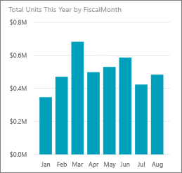
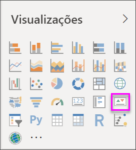

# Elementos visuais do Indicador Chave de Desempenho (KPI)

Um KPI (Indicador Chave de Desempenho) é uma indicação visual que comunica a quantidade de progresso feito em relação a uma meta mensurável. Para obter mais informações sobre os KPIs, veja [Key Performance Indicators (KPIs) in PowerPivot](/previous-versions/sql/sql-server-2012/hh272050(v=sql.110)) (Indicadores Chave de Desempenho (KPIs) no PowerPivot).

Deixe que o Will lhe mostre como criar elementos visuais de métrica única: medidores, cartões e KPIs.

<iframe width="560" height="315" src="https://www.youtube.com/embed/xmja6EpqaO0?list=PL1N57mwBHtN0JFoKSR0n-tBkUJHeMP2cP" frameborder="0" allowfullscreen></iframe>

## Quando usar um KPI

Os KPIs são uma ótima opção:

* Para avaliar o progresso. Responde à pergunta: “Em que estou adiantado ou atrasado?”

* Para avaliar a distância até um objetivo. Responde à pergunta: “Quão adiantado ou atrasado estou?”

## Requisitos do KPI

Um designer baseia um elemento visual do KPI numa medida específica. A intenção do KPI é ajudar a avaliar o valor atual e o estado de uma métrica em relação a um objetivo definido. Um elemento visual do KPI requer uma medida *base*, que é avaliada como um valor, um valor ou uma medida de *destino* e um *limiar* ou *objetivo*.

Um conjunto de dados de KPI deve conter valores de objetivo para um KPI. Se o conjunto de dados não contiver valores de objetivo, poderá criá-los. Para tal, adicione uma folha do Excel com os objetivos ao seu modelo de dados ou ficheiro PBIX.

## Pré-requisitos

Se não estiver inscrito no Power BI, [inscreva-se para uma avaliação gratuita](https://app.powerbi.com/signupredirect?pbi_source=web) antes de começar.

* O [Power BI Desktop](https://powerbi.microsoft.com/get-started/) é gratuito!

* [O ficheiro PBIX de Exemplo de Análise de Revenda](http://download.microsoft.com/download/9/6/D/96DDC2FF-2568-491D-AAFA-AFDD6F763AE3/Retail%20Analysis%20Sample%20PBIX.pbix)

## Como criar um KPI

Para acompanhar, abra o [ficheiro .PBIX de Retail Analysis](http://download.microsoft.com/download/9/6/D/96DDC2FF-2568-491D-AAFA-AFDD6F763AE3/Retail%20Analysis%20Sample%20PBIX.pbix) (Análise de Revenda) no Power BI Desktop. Vai criar um KPI que avalia o progresso realizado para atingir um objetivo de vendas.

1. Abra o **Exemplo de Análise de Revenda** na vista de relatório .

1. Selecionar  para adicionar uma nova página.

1. No painel **Campos**, selecione **Vendas > Total de Unidades deste Ano**.  Este valor será o indicador.

1. Adicione **Time > FiscalMonth** (Tempo > MêsFiscal).  Este valor representará a tendência.

1. No canto superior direito do elemento visual, selecione as reticências e verifique se o Power BI ordenou as colunas por ordem ascendente por **MêsFiscal**.

    > [!IMPORTANT]
    > Depois de converter a visualização num KPI, **deixará** de ter a opção de ordenar. Tem de o ordenar corretamente agora.

    

    Depois de ordenado corretamente, o elemento visual terá o seguinte aspeto:

    

1. Converta o elemento visual para um KPI ao selecionar o ícone **KPI** no painel **Visualização**.

    

1. Para adicionar um objetivo, arraste **Total de Unidades do Último Ano** para o campo **Objetivos-alvo**.

    

1. Opcionalmente, formate o KPI selecionando o ícone do rolo de tinta para abrir o painel de Formatação.

    * **Indicador**: controla as unidades de apresentação do indicador e casas decimais.

    * **Eixo de tendência**: quando definido como **Ativado**, o elemento visual mostra o eixo de tendência como o fundo do elemento visual do KPI.  

    * **Objetivos**: quando definido como **Ativado**, o elemento visual mostra o objetivo e a distância do objetivo como uma percentagem.

    * **Codificação de cores > Direção**: as pessoas consideram alguns KPIs melhores para valores *mais altos* e consideram outros para valores *mais baixos*. Por exemplo, ganhos vs. tempo de espera. Normalmente, um valor mais alto de ganhos é melhor em comparação com um valor mais alto de tempo de espera. Selecione **alto é melhor** e, opcionalmente, altere as definições de cor.

Os KPIs também estão disponíveis no serviço Power BI e nos dispositivos móveis. Estes oferecem a opção de estar sempre ligado ao heartbeat do seu negócio.

## Considerações e resolução de problemas

Se o KPI não se parecer com o apresentado acima, poderá ser porque não ordenou por **MêsFiscal**. Os KPIs não têm uma opção de ordenação. Terá de iniciar novamente e ordenar por **MêsFiscal** *antes* de converter a visualização num KPI.

## Próximos passos

* [Sugestões e Truques para visualizações de Mapas do Power BI](power-bi-map-tips-and-tricks.md)

* [Tipos de visualização no Power BI](power-bi-visualization-types-for-reports-and-q-and-a.md)

Mais perguntas? [Pergunte à Comunidade do Power BI](http://community.powerbi.com/)
