# Tutorial: Incorporar um elemento visual do Power Apps num relatório Power BI

Neste tutorial, vai utilizar o elemento visual do Power Apps para criar uma nova aplicação incorporada num relatório de exemplo do Power BI. Esta aplicação interage com outros elementos visuais nesse relatório.

Se não tiver uma subscrição do Power Apps, [crie uma conta gratuita](https://web.powerapps.com/signup?redirect=marketing&email=) antes de começar.

Neste tutorial, vai aprender a:
> [!div class="checklist"]
> * Adicionar um elemento visual do Power Apps a um relatório do Power BI
> * Trabalhar no Power Apps para criar uma nova aplicação que utiliza dados do relatório do Power BI
> * Ver e interagir com o elemento visual do Power Apps no relatório

## Pré-requisitos

* Browser [Google Chrome](https://www.google.com/chrome/browser/) ou [Microsoft Edge](https://www.microsoft.com/windows/microsoft-edge)
* Uma [subscrição do Power BI](https://docs.microsoft.com/power-bi/service-self-service-signup-for-power-bi) com o [Exemplo de Análise de Oportunidade](https://docs.microsoft.com/power-bi/sample-opportunity-analysis#get-the-content-pack-for-this-sample) instalado
* Uma compreensão de como [criar aplicações no Power Apps](https://docs.microsoft.com/powerapps/maker/canvas-apps/data-platform-create-app-scratch) e como [editar relatórios do Power BI](https://docs.microsoft.com/power-bi/service-the-report-editor-take-a-tour)

## Criar uma nova aplicação
Ao adicionar o elemento visual do Power Apps ao relatório, este inicia o Power Apps Studio com uma ligação de dados em direto entre o Power Apps e o Power BI.

1. Abra o relatório de amostra de Análise de Oportunidades e selecione a página *Oportunidades Futuras*. 

2. Mova e redimensione alguns dos mosaicos do relatório para disponibilizar espaço para um novo elemento visual.

    

2. No painel visualizações, selecione o ícone do Power Apps e redimensione o elemento visual para se ajustar ao espaço criado.

    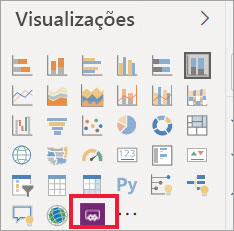

3. No painel **Campos**, selecione **Nome**, **Código do Produto** e **Fase de Venda**. 

    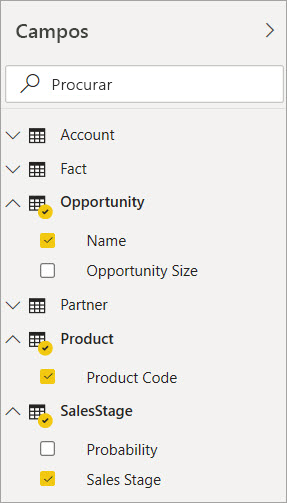

4. No elemento visual do Power Apps, selecione o ambiente do Power Apps onde quer criar a aplicação e, em seguida, selecione **Criar nova**.

    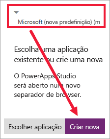

    No Power Apps Studio, verá que é criada uma aplicação básica com uma *galeria* que mostra um dos campos que selecionou no Power BI.

    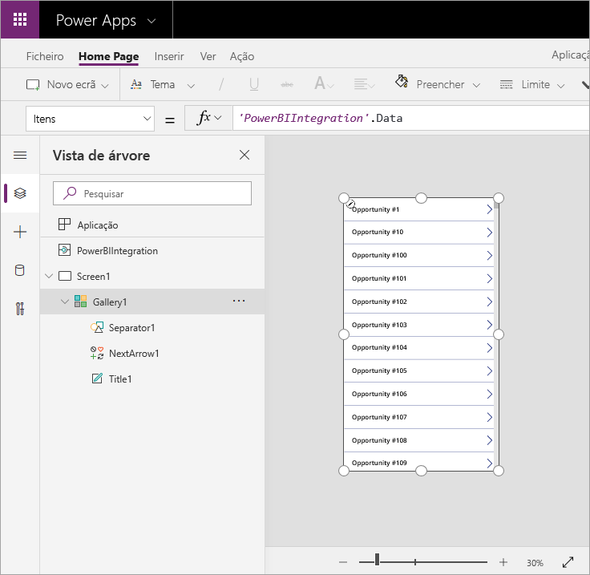

5.  Redimensione a galeria para que ocupe apenas metade do ecrã. 

6. No painel esquerdo, selecione **Screen1** e, em seguida, defina a propriedade **Preenchimento** do ecrã como “"LightBlue” (para que seja mais visível no relatório).

    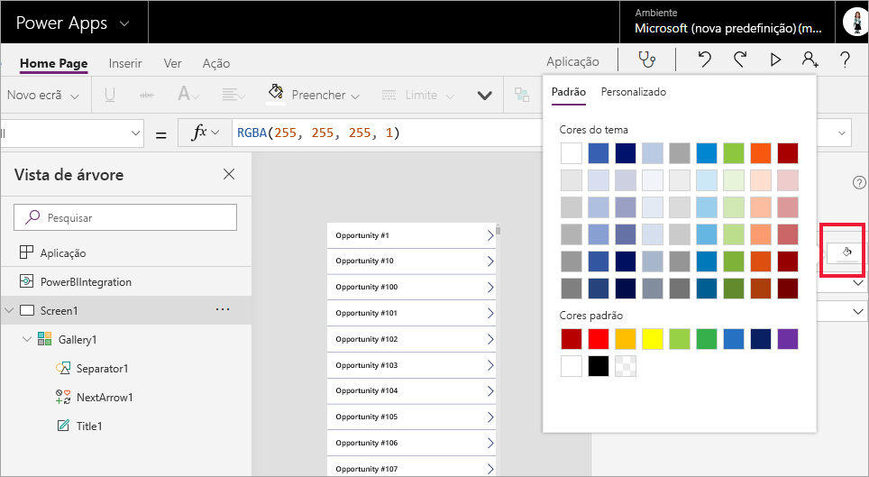

6. Arranje espaço para um controlo de etiquetas. 

    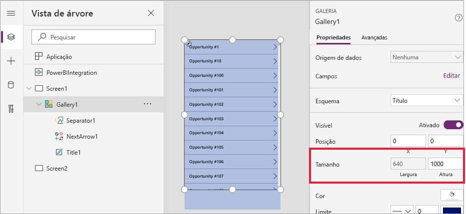

8. Em **galeria**, insira um controlo de etiqueta de texto.

   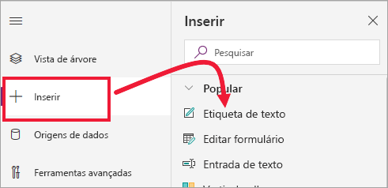

7. Arraste a etiqueta para o fundo do elemento visual. Defina a propriedade de **Texto** como `"Opportunity Count: " & CountRows(Gallery1.AllItems)`. É agora apresentado o número total de oportunidades no conjunto de dados.

    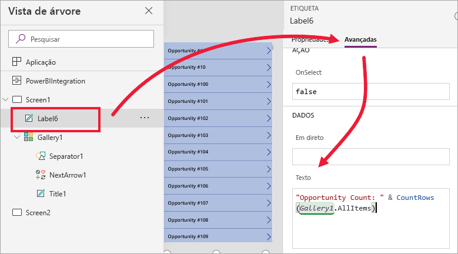

    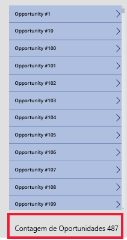

7. Guarde a aplicação com o nome “Aplicação de oportunidades”. 

    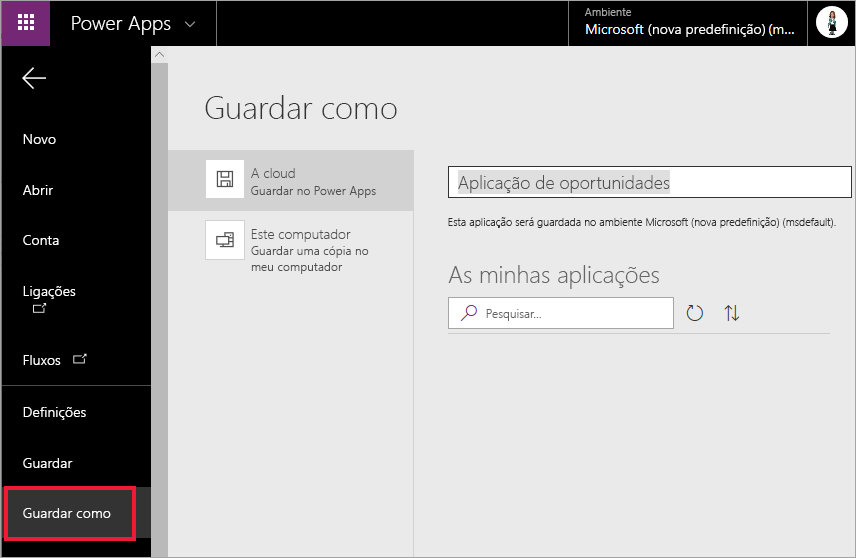

## Ver a aplicação no relatório
A aplicação está agora disponível no relatório do Power BI e interage com outros elementos visuais, porque partilha a mesma origem de dados.

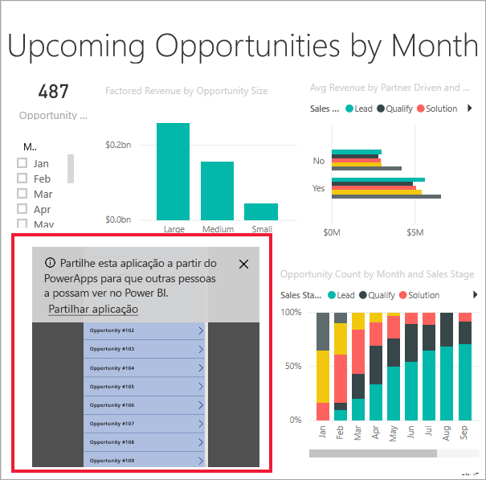

No relatório do Power BI, selecione **Jan** na segmentação de dados que filtra todo o relatório, incluindo os dados na aplicação.

Tenha em atenção que a contagem de oportunidades na aplicação corresponde à contagem no canto superior esquerdo do relatório. Pode selecionar outros itens no relatório e os dados na aplicação serão atualizados.

## Limpar recursos
Se não quiser continuar a utilizar o Exemplo de Análise de Oportunidade, pode eliminar o dashboard, o relatório e o conjunto de dados.

## Próximos passos
[Q&A visual](power-bi-visualization-types-for-reports-and-q-and-a.md)   (Elemento visual Perguntas e Respostas)  
[Tutorial: Incorporar um elemento visual do Power Apps num relatório Power BI](https://docs.microsoft.com/powerapps/maker/canvas-apps/powerapps-custom-visual)