# Introdução às visualizações das Perguntas e Respostas do Power BI

[!INCLUDE[consumer-appliesto-nyyn](../includes/consumer-appliesto-nyyn.md)]    

[!INCLUDE [power-bi-service-new-look-include](../includes/power-bi-service-new-look-include.md)]

## O que são as visualizações das Perguntas e Respostas?

O elemento visual das Perguntas e Respostas permite aos utilizadores colocar perguntas em linguagem natural e obter respostas sob a forma de um elemento visual. 

[!INCLUDE [power-bi-visuals-desktop-banner](../includes/power-bi-visuals-desktop-banner.md)]

O elemento visual das Perguntas e Respostas pode ser utilizado como uma ferramenta que permite aos *consumidores* receber rapidamente respostas aos seus dados, e aos *designers* criar elementos visuais em relatórios, simplesmente ao fazer duplo clique em qualquer local de um relatório e utilizar linguagem natural para começar. Uma vez que o comportamento é idêntico ao de qualquer outro elemento visual, o elemento visual das Perguntas e Respostas pode ter filtragem cruzada/realce cruzado e também suporta marcadores. O elemento visual das Perguntas e Respostas também suporta temas e outras opções de formatação predefinidas disponíveis dentro do Power BI.

O elemento visual das Perguntas e Respostas consiste em quatro componentes essenciais;

- A caixa de perguntas. É aqui que os utilizadores escrevem a sua pergunta e recebem sugestões para ajudar a concluir as perguntas.
- Uma lista pré-preenchida de perguntas sugeridas.
- Ícone para converter o elemento visual das Perguntas e Respostas num elemento visual padrão. 
- Ícone para abrir as ferramentas das Perguntas e Respostas, que permite aos designers configurar o motor de linguagem natural subjacente.

## Pré-requisitos

1. Este tutorial utiliza o [ficheiro PBIX de exemplo de Vendas e Marketing](https://download.microsoft.com/download/9/7/6/9767913A-29DB-40CF-8944-9AC2BC940C53/Sales%20and%20Marketing%20Sample%20PBIX.pbix). 

1. Na secção superior esquerda da barra de menus do Power BI Desktop, selecione **Ficheiro** > **Abrir**
   
2. Localize a sua cópia do **ficheiro PBIX de exemplo de Vendas e Marketing**

1. Abra o ficheiro na vista de relatório .

1. Selecionar  para adicionar uma nova página.

Se for apresentado um erro ao criar um elemento visual das Perguntas e Respostas, veja a secção de [limitações](../natural-language/q-and-a-limitations.md) para saber se a configuração de origens de dados é suportada.    

> [!NOTE]
> Para partilhar o seu relatório com outro utilizador do Power BI, é necessário que ambos tenham licenças individuais do Power BI Pro ou que o relatório seja guardado numa capacidade Premium. Veja [partilhar relatórios](../collaborate-share/service-share-reports.md).

## Criar um elemento visual das Perguntas e Respostas com uma pergunta sugerida
Neste exercício, vamos selecionar uma das perguntas sugeridas para criar o nosso elemento visual das Perguntas e Respostas. 

1. Comece numa página de relatório em branco e selecione o ícone do elemento visual das Perguntas e Respostas no painel Visualizações.

    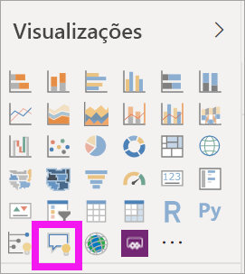

2. Arraste o limite para redimensionar o elemento visual.

    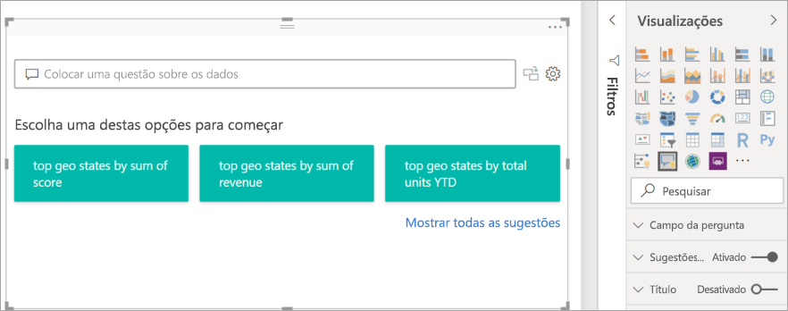

3. Para criar o elemento visual, selecione uma das perguntas sugeridas ou comece a escrever na caixa de perguntas. Neste exemplo, selecionámos **top geo states by sum of revenue** (principais estados geográficos por soma de receita). O Power BI faz o seu melhor para selecionar o tipo de elemento visual a utilizar. Neste caso, é um mapa.

    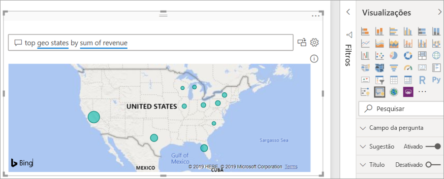

    No entanto, pode indicar ao Power BI qual o tipo de elemento visual a utilizar ao adicioná-lo à sua consulta em linguagem natural. Tenha em conta que nem todos os tipos de elementos visuais funcionarão ou farão sentido com os seus dados. Por exemplo, estes dados não produziriam um gráfico de dispersão coerente. Mas funciona como um mapa de manchas.

    

## Criar um elemento visual das Perguntas e Respostas com uma consulta em linguagem natural
No exemplo anterior, selecionámos uma das perguntas sugeridas para criar o nosso elemento visual das Perguntas e Respostas.  Neste exercício, vamos escrever a nossa própria pergunta. À medida que escrevemos a nossa pergunta, o Power BI ajuda-nos no preenchimento automático, sugestões e feedback.

Se não sabe que tipo de perguntas fazer ou qual a terminologia a utilizar, expanda **Mostrar todas as sugestões** ou percorra o painel Campos, que se encontra no lado direito da tela. Assim, ficará familiarizado com os termos e o conteúdo do conjunto de dados Vendas e Marketing.

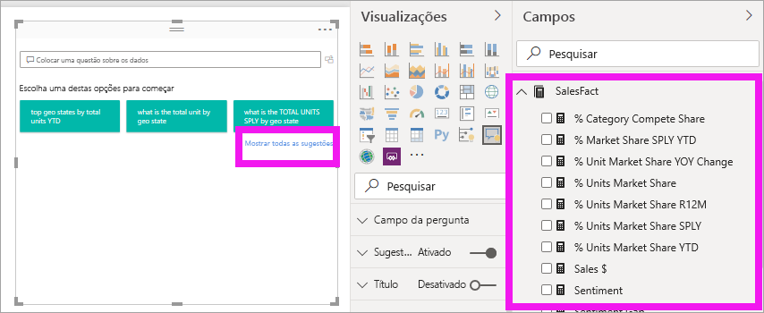

1. Escreva uma pergunta no campo das Perguntas e Respostas. O Power BI adiciona um sublinhado a vermelho às palavras que não reconhece. Sempre que possível, o Power BI ajuda a definir palavras não reconhecidas.  No primeiro exemplo abaixo, selecionar uma ou outra sugestão resulta.  

    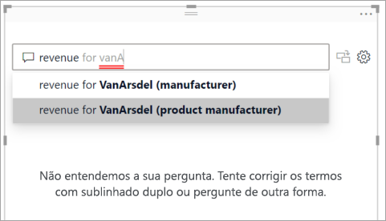

2. À medida que escrevermos a pergunta, o Power BI informa-nos de que não entende a mesma e tenta ajudar. No exemplo a seguir, o Power BI pergunta-nos "Quis dizer..." e sugere outra forma de frasear a nossa pergunta com terminologia do nosso conjunto de dados. 

    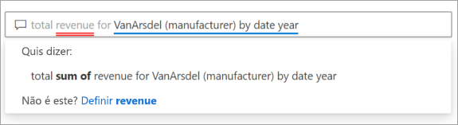

5. Com a ajuda do Power BI, conseguimos fazer uma pergunta com todos os termos reconhecíveis. O Power BI mostra os resultados como um gráfico de linhas. 

    

6. Vamos mudar o elemento visual para um gráfico de colunas. 

    

7.  Adicione mais elementos visuais à página do relatório e veja como o elemento visual de Perguntas e Respostas interage com os restantes elementos visuais na página. Neste exemplo, o elemento visual de Perguntas e Respostas fez uma filtragem cruzada do gráfico de linhas e do mapa, bem como um realce cruzado do gráfico de barras.

    

## Formatar e personalizar o elemento visual das Perguntas e Respostas
O elemento visual das Perguntas e Respostas pode ser personalizado com o painel de formatação e ao aplicar um tema. 

### Aplicar um tema
Quando seleciona um tema, este é aplicado a toda a página do relatório. Há bastantes temas à escolha, por isso, experimente-os até ter o elemento visual pretendido. 

1. Na barra de menus, selecione o separador **Base** e escolha **Mudar tema**. 

    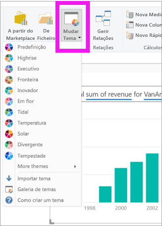

    
    
2. Neste exemplo, selecionámos **Mais temas** > **Seguro para daltónicos**.

    

### Formatar o elemento visual das Perguntas e Respostas
Formate o elemento visual das Perguntas e Respostas, o campo de perguntas e a forma como as sugestões são apresentadas. Pode mudar tudo, do fundo de um título à cor de passagem do rato para palavras não reconhecidas. Aqui, adicionámos um fundo cinzento à caixa de perguntas e mudámos os sublinhados para amarelo e verde. O título encontra-se centrado e tem um fundo amarelo. 

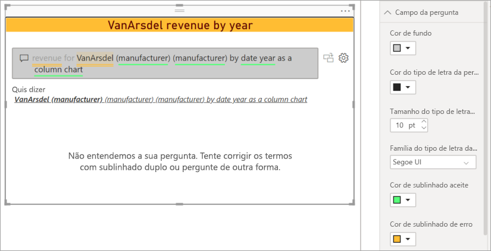

## Converter o seu elemento visual das Perguntas e Respostas num elemento visual padrão
Formatámos um pouco o nosso elemento visual de gráfico de colunas seguro para daltónicos, adicionando um título e um limite. Agora, estamos prontos para o converter num elemento visual padrão no nosso relatório e também para o afixar a um dashboard.

Selecione o ícone  para **Transforme este resultado de Q&A num elemento visual padrão**.

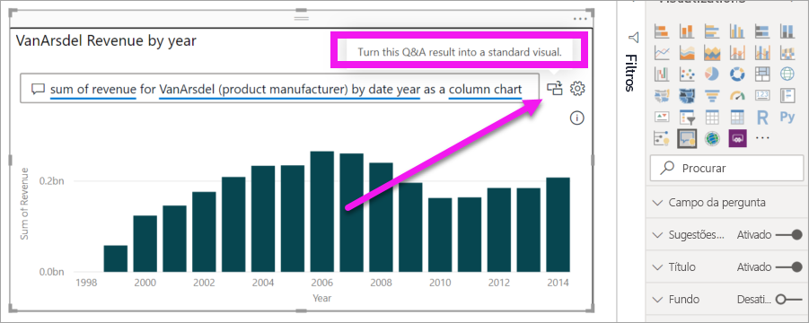

Este elemento visual já não é um elemento visual das Perguntas e Respostas, mas é um gráfico de colunas padrão. Pode ser afixado a um dashboard. No relatório, este elemento visual tem o mesmo comportamento que os outros elementos visuais padrão. Repare que o painel Visualizações mostra um ícone de Gráfico de colunas selecionado em vez do ícone do elemento visual das Perguntas e Respostas.

Se estiver a utilizar o ***Serviço Power BI***, pode agora afixar o elemento visual a um dashboard ao selecionar o ícone de alfinete. 

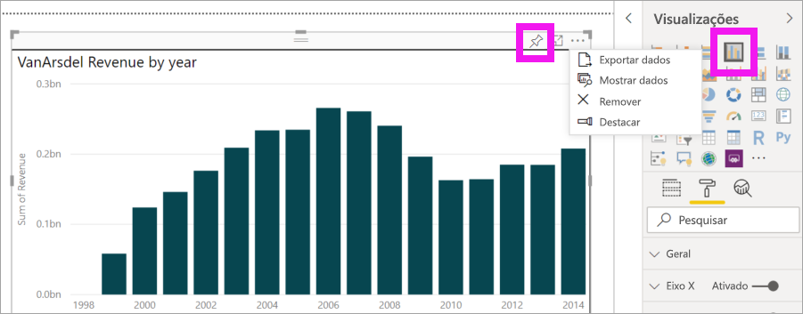

## Funcionalidades avançadas do elemento visual das Perguntas e Respostas
Selecionar o ícone de engrenagem abre o painel Ferramentas do elemento visual das Perguntas e Respostas. 

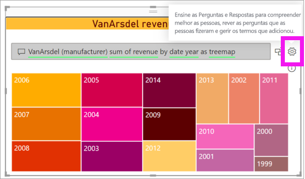

Utilize o painel Ferramentas para ensinar termos que as Perguntas e Respostas não reconhecem, para gerir esses termos e para gerir as perguntas sugeridas deste conjunto de dados e relatório. No painel Ferramentas, pode também rever perguntas que foram colocadas com este elemento visual das Perguntas e Respostas e ver perguntas que foram sinalizadas por utilizadores. Para saber mais, veja [Q&A Tooling intro](../natural-language/q-and-a-tooling-intro.md) (Introdução às Ferramentas das Perguntas e Respostas).

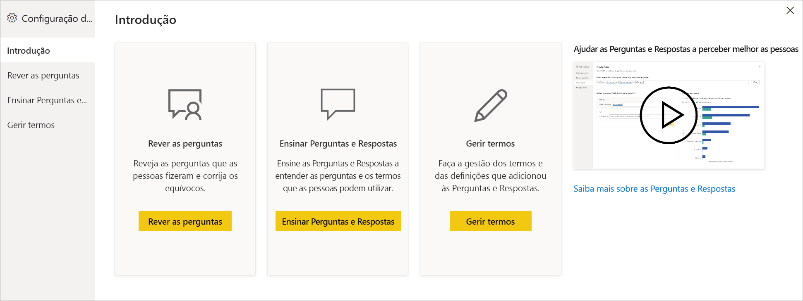

## Considerações e resolução de problemas
O elemento visual das Perguntas e Respostas integra-se no Office e no Bing para tentar fazer corresponder palavras comuns não reconhecidas a campos no seu conjunto de dados.  

## Próximos passos

Existem diversas formas de integrar linguagem natural. Para obter mais informações, veja os seguintes artigos:

* [Ferramentas das Perguntas e Respostas](../natural-language/q-and-a-tooling-intro.md)
* [Q&A Best Practices](../natural-language/q-and-a-best-practices.md) (Melhores Práticas das Perguntas e Respostas)
